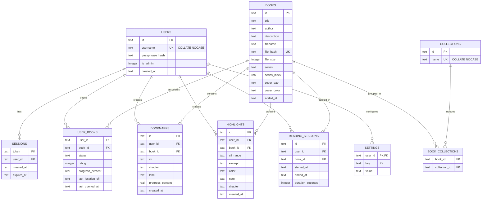

# Endpaper — Complete Architecture & Full Codebase Documentation

> **Project Name:** Endpaper  
> **Workspace Directory:** `C:\Users\AYUSH\Documents\Endpaper`  
> **Application Type:** Self-Hosted Multi-User EPUB Reader & Shared Digital Library  
> **Technology Stack:** Node.js (v20+), Express.js, `better-sqlite3` (WAL Mode), Worker Threads, Multer, Fast-XML-Parser, Sharp, Archiver, Yauzl, Bcrypt, Vanilla HTML5/CSS3/ES6+ JS, `ePub.js` Engine  
> **Deployment Model:** Docker, Docker Compose, Caddy Reverse Proxy (Auto-HTTPS)  

---

## Table of Contents
1. [Part 1: Architecture and Technical Design](#part-1-architecture-and-technical-design)
   - [1. Executive System Overview & Design Principles](#1-executive-system-overview--design-principles)
   - [2. System Architecture & Component Interactions](#2-system-architecture--component-interactions)
   - [3. Database Architecture & Relational Schema](#3-database-architecture--relational-schema)
   - [4. Authentication, Security & Role-Based Access Control](#4-authentication-security--role-based-access-control)
   - [5. Reading Engine Architecture (EPUB.js Integration)](#5-reading-engine-architecture-epubjs-integration)
   - [6. Service Worker, Offline Caching & Synchronization Pipeline](#6-service-worker-offline-caching--synchronization-pipeline)
   - [7. Backup, Export, and Disaster Recovery Subsystem](#7-backup-export-and-disaster-recovery-subsystem)
   - [8. REST API Reference & Endpoint Directory](#8-rest-api-reference--endpoint-directory)
   - [9. Infrastructure & Deployment Topology](#9-infrastructure--deployment-topology)
   - [10. Project Directory & File Hierarchy](#10-project-directory--file-hierarchy)
2. [Part 2: Complete Project Source Code](#part-2-complete-project-source-code)

---

# Part 1: Architecture and Technical Design

## 1. Executive System Overview & Design Principles

**Endpaper** is a modern, lightweight, self-hosted web application tailored for reading and managing EPUB eBooks. It addresses a common challenge in household and private group hosting: **sharing a single curated digital book library while strictly isolating private reading metadata** (reading progress, CFI locations, annotations, bookmarks, reading session statistics, personal star ratings, and visual preferences).

### Core Architectural Principles
1. **Zero-Build Frontend**: The client is built exclusively with standard HTML5, CSS3 Custom Properties, and modern Vanilla ES6+ JavaScript. There is no Webpack, Vite, Babel, or TypeScript compilation step. This guarantees instant startup, transparent browser debugging, and effortless long-term maintainability.
2. **Embedded Relational Persistence**: Built on SQLite via `better-sqlite3` operating in Write-Ahead Logging (`WAL`) mode. This provides ACID compliance, zero configuration overhead, high concurrency for simultaneous readers, and single-file database portability.
3. **PWA and Offline Resilience**: A custom Service Worker uses a **Network-First with Cache Fallback** strategy for the core app shell assets (`/`, `/index.html`, `/app.js`, `/app.css`, `/manifest.json`) with automated reload on controller changes. Dedicated runtime caching caches active EPUB files and cover images. An asynchronous offline mutation queue (`endpaper_offline_queue`) captures reading progress and bookmarks created while disconnected, seamlessly syncing them to the server upon network reconnection.
4. **Single-Process Lightweight Server with Worker Threads**: The backend is an Express.js Node.js server with CPU-intensive tasks (such as EPUB decompression, XML manifest parsing, and streaming SHA-256 calculation) offloaded to Node.js Worker Threads (`worker_threads`) to keep the main event loop responsive.
5. **Streaming & Memory Efficiency**: Large EPUB binary transfers support RFC 7233 HTTP `Range` requests (206 Partial Content) with immutable cache headers. Full library export archives are streamed on-the-fly directly to the response with `archiver` with constant $O(1)$ memory usage.
6. **Production Simplicity**: Deployable in seconds via Docker Compose with Caddy for automatic Let's Encrypt / ZeroSSL TLS termination and HTTP/2 + HTTP/3 support.

---

## 2. System Architecture & Component Interactions

```mermaid
graph TD
    subgraph Client ["Client Layer (Browser / PWA)"]
        UI["Vanilla JS UI Engine (public/app.js)"]
        CSS["Design System & Theme Styles (public/app.css)"]
        DOM["Semantic HTML Shell (public/index.html)"]
        SW["Service Worker (public/sw.js)"]
        Reader["EPUB.js Engine (Viewer & Rendition)"]
        OffQ["Offline Mutation Queue (localStorage)"]
    end

    subgraph Transport ["Transport & Edge Security"]
        Caddy["Caddy Reverse Proxy (HTTPS / Auto-SSL / Compression)"]
    end

    subgraph Server ["Server Layer (Node.js / Express)"]
        Express["Express App (server/src/index.js)"]
        AuthMid["Auth Middleware (server/src/middleware/auth.js)"]
        RateLim["Rate Limiter & Brute-Force Shield"]
        Routes["API Route Handlers (server/src/routes/*.js)"]
        WorkerPool["Worker Threads (server/src/lib/epubWorker.js)"]
    end

    subgraph Storage ["Storage Layer (data/)"]
        DB[(SQLite DB: data/endpaper.db in WAL Mode)]
        EPUBs[("EPUB Store: data/books/")]
        Covers[("Cover Cache: data/covers/")]
        Backups[("Automated Backups: data/backups/")]
    end

    UI --> SW
    UI --> Reader
    UI --> OffQ
    UI -->|HTTP REST Requests (Cookies: session=...)| Caddy
    Caddy --> Express
    Express --> AuthMid
    Express --> RateLim
    RateLim --> Routes
    Routes --> WorkerPool
    Routes --> DB
    Routes --> EPUBs
    Routes --> Covers
    DB --> Backups
```

---

## 3. Database Architecture & Relational Schema

The SQLite schema is initialized in `server/src/db.js` using WAL mode (`PRAGMA journal_mode = WAL;`), foreign key constraints (`PRAGMA foreign_keys = ON;`), and a 5000ms busy timeout (`PRAGMA busy_timeout = 5000;`).



---

## 4. Authentication, Security & Role-Based Access Control

1. **User Roles**:
   - **Admin**: Full library and account administration permissions. Can upload books, remove books from shared library, manage global collections, trigger export/import backups, provision reader accounts, and manage user roles/passphrases.
   - **Reader**: Standard reading access to all books in the shared library. Can upload books, read, track personal progress, set bookmarks, create highlights/notes, rate books, and view personal reading analytics.
2. **Session Security & Credentials**:
   - Authenticated via secure `httpOnly` cookie-based session tokens (`endpaper_session`) with a 90-day expiry (`Max-Age=7776000`, `SameSite=Strict`).
   - Case-insensitive username uniqueness is enforced at both the database level (`username TEXT NOT NULL UNIQUE COLLATE NOCASE` with index `idx_users_username_nocase`) and application level (`WHERE lower(username) = lower(?)`).
   - Passphrases are hashed using `bcrypt` with salt rounds of 10.
   - Background hourly pruning purges expired session tokens without impacting request hot paths.
3. **Brute-Force Protection & Account Management**:
   - IP-based rate limiting on `POST /api/login` prevents brute-force credential stuffing.
   - Admin `PATCH /api/users/:id` endpoint enables role updates and passphrase resets with automatic session revocation and self-demotion prevention.

---

## 5. Reading Engine Architecture (EPUB.js Integration)

- **Rendering Modes**:
  - **Paginated Mode**: Columnar pagination with horizontal keyboard navigation (`ArrowLeft`, `ArrowRight`), touch swipe gestures, and click nav zones.
  - **Scrolled Continuous Mode**: Continuous vertical reading stream (`flow: 'scrolled', manager: 'continuous'`) with smooth scrolling and live passive scroll progress tracking.
- **Dynamic Theming System**:
  - Four distinct reading themes: **Light** (`#F6F1E7`), **Sepia** (`#EBDCC0`), **Dark** (`#22262C`), and **Night** (`#000000`).
  - Themes inject scoped CSS overrides into the EPUB iframe body, paragraphs, and headings while dynamically aligning the app shell background (`--reader-page-bg`) and mobile browser theme color meta tags.
- **Robust Spine Progress Calculation**:
  - Employs a 4-tier location resolution strategy (`getSpineSection`):
    1. Standard EPUB.js `spine.get(cfi)`.
    2. Direct mathematical parsing of EPUB CFI spine components `/6/(\d+)` ($(\frac{N}{2}) - 1$).
    3. Multi-strategy href normalization matching base paths, clean paths, or basename filenames (`chapter04.xhtml`).
    4. TOC navigation fallback matching.
  - Live progress slider updates synchronously during user drags and releases without getting overwritten by background events.
- **Text-to-Speech (TTS) & Highlighting**:
  - Multi-tier text extraction from `rendition.getContents()` document bodies with active toggle state styling.
  - Captures selected text DOM ranges inside the EPUB iframe, serializes them to CFIs, and renders persistent highlight swatches with notes, with one-click Markdown highlight export.

---

## 6. Service Worker, Offline Caching & Synchronization Pipeline

- **Service Worker (`public/sw.js`)**:
  - Shell cache versioned with build timestamps (e.g. `endpaper-shell-v10.1.0-20260829`).
  - Core app shell assets (`/`, `/index.html`, `/app.js`, `/app.css`, `/manifest.json`) use **Network-First with Cache Fallback**. When online, browsers instantly fetch the latest code; when offline, they fall back to the local cache.
  - `controllerchange` event listener in `public/index.html` triggers an automatic single-fire reload when a new service worker takes control, ensuring open tabs immediately execute new code.
  - Dedicated runtime cache (`endpaper-runtime-v10.1.0-20260829`) caches active EPUB files and covers with `SET_CURRENT_BOOK` message synchronization.
- **Offline Mutation Queue (`public/app.js`)**:
  - If a network failure occurs during reading (e.g. saving reading position, setting a bookmark), the mutation payload is appended to `localStorage.getItem('endpaper_offline_queue')`.
  - When the browser fires the `online` event, `flushOfflineQueue()` replays pending requests to the server in FIFO order.

---

## 7. Backup, Export, and Disaster Recovery Subsystem

- **Export (`POST /api/export`)**:
  - Admin-authorized endpoint with pre-flight asset verification across all referenced book and cover files before streaming begins.
  - Streams on-the-fly ZIP archives via `archiver` directly to `res` with constant $O(1)$ memory usage. Missing assets trigger a clean `500` JSON error rather than a truncated archive.
- **Import (`POST /api/import`)**:
  - Streams an uploaded backup archive via `yauzl`, unzips files, and performs an idempotent merge into SQLite, restoring library books and user data without data loss or memory exhaustion.
- **Automated Rolling Backups**:
  - Automatic non-blocking daily backups maintain the last 5 database snapshots in `data/backups/`.
  - Pre-migration backups are automatically created prior to any structural table changes.

---

## 8. REST API Reference & Endpoint Directory

| Method | Endpoint | Auth | Description |
|---|---|---|---|
| `GET` | `/healthz` | Public | Unauthenticated health check for reverse proxies / uptime monitors |
| `POST` | `/api/login` | Public (Rate Limited) | Authenticate username + passphrase, sets 90-day httpOnly session cookie |
| `POST` | `/api/logout` | User | Clear session cookie and delete session record |
| `GET` | `/api/session` | User | Return active user account status, role, and username |
| `GET` | `/api/users` | Admin | List all user accounts in system |
| `POST` | `/api/users` | Admin | Create a new user account (Admin or Reader) |
| `PATCH` | `/api/users/:id` | Admin | Update user role (`is_admin`) or reset `passphrase` |
| `DELETE` | `/api/users/:id` | Admin | Delete a user account and associated reading data |
| `GET` | `/api/books` | User | List all books in shared library (`?sort=series|recent|opened|title|author`) |
| `POST` | `/api/books` | User | Upload new EPUB book (SHA-256 deduplicated, returns `409 Conflict` on duplicate) |
| `GET` | `/api/books/:id` | User | Get detailed book metadata and reading status |
| `PATCH` | `/api/books/:id` | User | Update user reading progress (CFI, %, status, rating) or edit shared metadata (title, author - Admin only) |
| `DELETE` | `/api/books/:id` | Admin | Delete book and associated files from library |
| `GET` | `/api/books/:id/file` | User | Stream EPUB binary with HTTP Range (`206 Partial Content`) and immutable caching |
| `GET` | `/api/books/:id/cover` | User | Serve extracted book cover image |
| `GET` | `/api/books/:id/bookmarks` | User | List user bookmarks for a book |
| `POST` | `/api/books/:id/bookmarks` | User | Create a new bookmark |
| `DELETE` | `/api/bookmarks/:id` | User | Delete a bookmark |
| `GET` | `/api/books/:id/highlights` | User | List user highlights for a book |
| `POST` | `/api/books/:id/highlights` | User | Create a new text highlight and note |
| `PATCH` | `/api/highlights/:id` | User | Update highlight note or color |
| `DELETE` | `/api/highlights/:id` | User | Delete a highlight |
| `GET` | `/api/collections` | User | List all collections |
| `POST` | `/api/collections` | Admin | Create a new collection |
| `PATCH` | `/api/collections/:id` | Admin | Rename a collection |
| `DELETE` | `/api/collections/:id` | Admin | Delete a collection |
| `POST` | `/api/books/:id/collections/:collectionId` | Admin | Add a book to a collection |
| `DELETE` | `/api/books/:id/collections/:collectionId` | Admin | Remove a book from a collection |
| `POST` | `/api/sessions/start` | User | Start reading time tracking session |
| `POST` | `/api/sessions/:id/end` | User | End reading session and record duration |
| `GET` | `/api/stats` | User | Get reading stats (streaks, total time, finished) with `?tz=` support |
| `GET` | `/api/settings` | User | Retrieve personal reader appearance settings |
| `PUT` | `/api/settings` | User | Save personal reader appearance settings |
| `POST` | `/api/export` | Admin | Stream complete library backup ZIP directly to client |
| `POST` | `/api/import` | Admin | Restore / merge library from backup ZIP |

---

## 9. Infrastructure & Deployment Topology

Endpaper is containerized with Docker and fronted by Caddy:

```yaml
services:
  app:
    build: ./server
    volumes:
      - ./data:/app/data
      - ./public:/app/public
    environment:
      - NODE_ENV=production
      - PORT=3000
      - TRUST_PROXY=1
      - TZ=${TZ:-UTC}
    restart: unless-stopped
    expose:
      - "3000"

  caddy:
    image: caddy:2
    ports:
      - "80:80"
      - "443:443"
    volumes:
      - ./Caddyfile:/etc/caddy/Caddyfile
      - caddy_data:/data
    restart: unless-stopped
    depends_on:
      - app

volumes:
  caddy_data:
```

---

## 10. Project Directory & File Hierarchy

```text
Endpaper/
├── .dockerignore
├── .gitignore
├── ARCHITECTURE_AND_SOURCE.md
├── Caddyfile
├── DEPLOY.md
├── docker-compose.yml
├── README.md
├── data/
│   ├── backups/
│   ├── books/
│   ├── covers/
│   └── endpaper.db
├── public/
│   ├── app.css
│   ├── app.js
│   ├── index.html
│   ├── manifest.json
│   └── sw.js
└── server/
    ├── Dockerfile
    ├── package.json
    └── src/
        ├── db.js
        ├── index.js
        ├── lib/
        │   ├── epubMeta.js
        │   ├── epubWorker.js
        │   ├── passphrase.js
        │   └── validation.js
        ├── middleware/
        │   └── auth.js
        └── routes/
            ├── auth.js
            ├── bookmarks.js
            ├── books.js
            ├── collections.js
            ├── highlights.js
            ├── sessions.js
            ├── settings.js
            └── users.js
```

---

---
# Part 2: Complete Project Source Code

The following sections contain the complete, verbatim source code for every file in the Endpaper project repository.

---

## File: `server/package.json`

*Relative Path: `server/package.json` | Size: 0.7 KB | Total Lines: 31*

````json
{
  "name": "endpaper-server",
  "version": "1.0.0",
  "description": "Endpaper — self-hosted EPUB reader backend",
  "main": "src/index.js",
  "engines": {
    "node": ">=20"
  },
  "scripts": {
    "start": "node src/index.js",
    "dev": "node --watch src/index.js",
    "set-passphrase": "node src/lib/passphrase.js --set"
  },
  "dependencies": {
    "adm-zip": "^0.6.0",
    "archiver": "^8.0.0",
    "bcrypt": "^6.0.0",
    "better-sqlite3": "^11.3.0",
    "cookie-parser": "^1.4.6",
    "express": "^4.21.0",
    "express-rate-limit": "^7.4.0",
    "fast-xml-parser": "^5.10.1",
    "multer": "^1.4.5-lts.1",
    "pino": "^10.3.1",
    "pino-http": "^11.0.0",
    "sharp": "^0.35.4",
    "yauzl": "^3.4.0",
    "yauzl-promise": "^4.0.0"
  }
}
````

---

## File: `server/Dockerfile`

*Relative Path: `server/Dockerfile` | Size: 0.5 KB | Total Lines: 22*

````dockerfile
FROM node:20-alpine

# better-sqlite3 requires build tools
RUN apk add --no-cache python3 make g++

WORKDIR /app

ENV NODE_ENV=production \
    PORT=3000

COPY package*.json ./
RUN npm ci --production

COPY src/ ./src/

EXPOSE 3000

HEALTHCHECK --interval=30s --timeout=5s --start-period=10s --retries=3 \
  CMD node -e "fetch('http://127.0.0.1:3000/healthz').then(response => process.exit(response.ok ? 0 : 1)).catch(() => process.exit(1))"

CMD ["node", "src/index.js"]
````

---

## File: `docker-compose.yml`

*Relative Path: `docker-compose.yml` | Size: 0.5 KB | Total Lines: 30*

````yaml
services:
  app:
    build: ./server
    volumes:
      - ./data:/app/data
      - ./public:/app/public
    environment:
      - NODE_ENV=production
      - PORT=3000
      - TRUST_PROXY=1
      - TZ=${TZ:-UTC}
    restart: unless-stopped
    expose:
      - "3000"

  caddy:
    image: caddy:2
    ports:
      - "80:80"
      - "443:443"
    volumes:
      - ./Caddyfile:/etc/caddy/Caddyfile
      - caddy_data:/data
    restart: unless-stopped
    depends_on:
      - app

volumes:
  caddy_data:
````

---

## File: `Caddyfile`

*Relative Path: `Caddyfile` | Size: 0.2 KB | Total Lines: 6*

````caddyfile
# Replace books.yourdomain.com with your actual domain before deploying.
# Caddy will automatically obtain and renew a Let's Encrypt certificate.
books.yourdomain.com {
  reverse_proxy app:3000
}
````

---

## File: `.gitignore`

*Relative Path: `.gitignore` | Size: 0.1 KB | Total Lines: 13*

````gitignore
node_modules/
.env
data/
*.zip

# OS files
.DS_Store
Thumbs.db

# IDE
.vscode/
.idea/
````

---

## File: `.dockerignore`

*Relative Path: `.dockerignore` | Size: 0.1 KB | Total Lines: 11*

````dockerignore
node_modules
data
tmp
output
.git
.gitignore
README.md
DEPLOY.md
audit_report.md
context.md
````

---

## File: `README.md`

*Relative Path: `README.md` | Size: 7.7 KB | Total Lines: 160*

````markdown
# Endpaper

Endpaper is a self-hosted EPUB reader for a trusted household or group of friends. It has one shared library: every signed-in user can browse and read the same books and collections, while each person keeps their own reading progress, ratings, bookmarks, highlights, sessions, statistics, and reader settings.

## Roles

Endpaper has two roles:

- **Reader** - Can browse, read, and contribute new books to the shared library. Their reading activity and annotations are private to their account.
- **Admin** - Has all reader permissions and can manage users, remove shared books, edit shared book metadata, organize collections, and export or import backups.

Use an admin account for yourself and add friends and family as readers from **Admin Settings** after the first sign-in. Grant admin access only to people who should be able to change the library for everyone.

## Features

- **Shared library shelf** - One EPUB catalogue with cover art and shared collections for everyone.
- **Private reading state** - Per-user progress, status, ratings, bookmarks, highlights, reading time, and settings.
- **Full EPUB reader** - Paginated and scrolled layouts, customizable fonts, themes, and spacing.
- **Search, sorting, and filters** - Find books by title or author, browse collections, and sort by progress or recency.
- **Admin tools** - Create reader/admin accounts and maintain the shared catalogue.
- **Backup and restore** - Admin-only backup exports and imports for the shared library and supported personal reading data.
- **Responsive UI** - Works across phones, tablets, and desktop browsers.

## Reliability and security

- EPUB uploads and backup imports are validated, size-limited, and restricted to safe library file paths.
- Only admins can change shared catalogue structure and management: removing books, editing shared book metadata, collections, collection memberships, users, exports, and imports.
- Authentication uses high-entropy session tokens stored by the server in secure HTTP-only cookies. There is no `SESSION_SECRET` environment variable to configure.
- Backups never include password hashes, admin flags, or login sessions. On import, shared books and collections are restored; personal reading data is restored only for existing local users with an exact matching username. Imports never create accounts or change roles, and unmatched personal data is skipped.

## Architecture

```text
server/         Node.js + Express backend
  src/
    index.js    Express app entry point and backup endpoints
    db.js       SQLite connection and schema migrations
    middleware/ Session authentication
    routes/     API routes for auth, users, books, reading data, and collections
public/         Frontend (single-page HTML/CSS/JS reader)
data/           Persistent SQLite database, EPUB files, covers, and backups
```

## Local development and setup

Endpaper requires Node.js 20 or newer.

```bash
cd server
npm install

# Create the first admin account. Replace both values with your own.
npm run set-passphrase -- "a long unique passphrase" admin

# Start the server (port 3001 by default)
npm run start
```

Open `http://localhost:3001`, then sign in with the username and passphrase you chose. The CLI syntax is:

```bash
node src/lib/passphrase.js --set "<passphrase>" [username]
```

The username defaults to `admin`. For a new username, this command creates an admin account; for an existing username, it resets that account's passphrase without changing its role and signs that account out on all devices.

Once signed in as an admin, use **Admin Settings** to create reader accounts for the people sharing the library. `GET /healthz` is an unauthenticated health check for reverse proxies and uptime monitors.

## Backups

Export and import are admin-only. An export includes EPUBs, covers, shared books and collections, and supported personal reading data. It excludes credentials, admin status, and login sessions.

Import is a merge: existing shared books are preserved and missing shared records are added. Local users and their roles are never changed. Personal data from a backup is applied only when its username exactly matches an existing local account; data for other usernames is skipped. Export before importing a backup from another device, and import only archives you trust.

## Going live

### Option 1: Always Free Google Cloud VM + PM2 (Recommended — No Docker Needed)

Because Endpaper is a lightweight Node.js + SQLite application, you do **not** need Docker. Running Endpaper natively with **PM2** on Google Cloud's Always Free Linux VM (`e2-micro` with 30GB disk) gives you maximum performance with minimal RAM usage (~50MB RAM vs Docker overhead).

1. **Create the VM Instance:**
   - Go to Google Cloud Console → **Compute Engine** → **VM instances**.
   - Click **Create Instance** with machine type `e2-micro` in an Always Free region (`us-west1`, `us-central1`, or `us-east1`).
   - Set Boot Disk to **Ubuntu 22.04 / 24.04 LTS** (up to 30GB Standard Persistent Disk).
   - Under Firewall, check **Allow HTTP traffic** and **Allow HTTPS traffic**.
2. **Connect via SSH:**
   - In Google Cloud Console, click the **SSH** button next to your VM instance to open the terminal (or use `gcloud compute ssh <instance-name>`).
3. **Install Node.js & PM2:**
   ```bash
   sudo apt update && sudo apt install -y git curl
   curl -fsSL https://deb.nodesource.com/setup_20.x | sudo -E bash -
   sudo apt install -y nodejs
   sudo npm install -g pm2
   ```
4. **Deploy Endpaper:**
   ```bash
   git clone <your-repo-url> /opt/endpaper
   cd /opt/endpaper/server
   npm install

   # Create your initial admin account
   node src/lib/passphrase.js --set "your-secure-passphrase" admin

   # Start Endpaper with PM2 daemon process manager
   pm2 start src/index.js --name "endpaper"
   pm2 save
   pm2 startup
   ```
5. **Configure HTTPS Reverse Proxy (Caddy):**
   - Point your domain or free dynamic DNS hostname (e.g. from [DuckDNS](https://www.duckdns.org/)) to your VM's External IP address.
   - Install Caddy:
     ```bash
     sudo apt install -y debian-keyring debian-archive-keyring apt-transport-https curl
     curl -1sLf 'https://dl.cloudsmith.io/public/caddy/stable/gpg.key' | sudo gpg --dearmor -o /usr/share/keyrings/caddy-stable-archive-keyring.gpg
     curl -1sLf 'https://dl.cloudsmith.io/public/caddy/stable/debian.deb.txt' | sudo tee /etc/apt/sources.list.d/caddy-stable.list
     sudo apt update && sudo apt install -y caddy
     ```
   - Edit `/etc/caddy/Caddyfile`:
     ```caddyfile
     books.yourdomain.com {
         reverse_proxy 127.0.0.1:3001
     }
     ```
   - Apply configuration:
     ```bash
     sudo systemctl restart caddy
     ```

### Option 2: Docker + Caddy

If you prefer containerized deployment, see the Docker guide in [DEPLOY.md](DEPLOY.md).

### Option 3: Private Mesh Network (Tailscale)

If you prefer running at home on a Raspberry Pi or local server without exposing ports to the public internet:
1. Install [Tailscale](https://tailscale.com/) on the host machine and your mobile devices / laptops.
2. Run Endpaper with `pm2` or `npm run start` on the host.
3. Access Endpaper securely from anywhere via the host's private Tailscale IP (e.g. `http://100.x.y.z:3001`).

---

## Updating an already live instance (through PM2)

To update your live server to the latest version of Endpaper:

```bash
# 1. Navigate to project root and pull latest changes
cd /opt/endpaper
git pull origin main

# 2. Install any dependency updates
cd server
npm install --production

# 3. Restart the application seamlessly
pm2 restart endpaper
```

> **Note:** All your books (`data/books/`), covers (`data/covers/`), and SQLite database (`data/endpaper.db`) remain completely intact in the persistent `data/` directory. Database migrations execute automatically when the server boots.
````

---

## File: `DEPLOY.md`

*Relative Path: `DEPLOY.md` | Size: 5.3 KB | Total Lines: 186*

````markdown
# Deploying Endpaper

This guide deploys Endpaper to a VPS with Docker, Caddy, and automatic HTTPS. Endpaper is a multi-user shared library: every signed-in user sees the same books and collections, while each account has its own private reading state.

## Prerequisites

- A VPS (for example, DigitalOcean, Linode, or Hetzner) with Docker and Docker Compose installed
- A domain name you control (for example, `books.yourdomain.com`)
- SSH access to the VPS

## 1. Point DNS at the VPS

Create an **A record** for your chosen subdomain pointing to the VPS IP address:

```text
books.yourdomain.com.  ->  A  ->  203.0.113.42
```

Allow a few minutes for DNS propagation. You can verify it with:

```bash
dig books.yourdomain.com +short
```

## 2. Copy the project to the VPS

```bash
ssh your-user@your-vps-ip
git clone <your-repo-url> /opt/endpaper
cd /opt/endpaper
```

Alternatively, use `scp` or `rsync` to copy the project files.

## 3. Configure the domain

Edit `Caddyfile` and replace `books.yourdomain.com` with your actual domain:

```bash
nano Caddyfile
```

```caddyfile
books.yourdomain.com {
  reverse_proxy app:3000
}
```

## 4. Start the stack

```bash
docker compose up -d
```

On first boot, the app initializes its SQLite database and creates the `data/` directory structure. Caddy automatically obtains and renews a Let's Encrypt TLS certificate once DNS is correct and ports 80 and 443 are reachable.

Endpaper stores random session tokens in its database; do not add a `SESSION_SECRET` environment variable. It is not used by the application.

## 5. Create the first admin account

Run the account CLI inside the app container, replacing both values:

```bash
docker compose exec app node src/lib/passphrase.js --set "a long unique passphrase" admin
```

The CLI syntax is:

```bash
node src/lib/passphrase.js --set "<passphrase>" [username]
```

The username defaults to `admin`. A new username creates an admin account; an existing username has its passphrase reset without changing its role and is signed out on all devices.

## 6. Verify and add household accounts

Open `https://books.yourdomain.com` and sign in with the username and passphrase from the previous step.

Your first account is an admin. Use **Admin Settings** to add friends and family as readers. Readers can browse, read, and contribute new books to the shared catalogue, while progress, annotations, ratings, sessions, and settings remain private. Only admins can manage users, remove shared books, edit shared metadata, organize collections, or use backup import/export.

## Updating

To update to a new version:

```bash
cd /opt/endpaper
git pull
docker compose build
docker compose up -d
```

Your persistent data remains in the bind-mounted `data/` directory.

## Native Deployment with PM2 (Alternative to Docker)

If you prefer not to use Docker, you can run Endpaper natively on your VPS using Node.js and PM2.

1. **Clone the repository:**
   ```bash
   git clone <your-repo-url> /opt/endpaper
   cd /opt/endpaper/server
   ```

2. **Install dependencies:**
   ```bash
   npm install
   ```

3. **Start the app with PM2:**
   ```bash
   npm install -g pm2
   pm2 start src/index.js --name "endpaper"
   pm2 save
   pm2 startup
   ```

4. **Create the first admin account:**
   Instead of using `docker compose exec`, you can run the script natively:
   ```bash
   node src/lib/passphrase.js --set "a long unique passphrase" admin
   ```

5. **Updating the app:**
   ```bash
   git pull origin main
   npm install
   pm2 restart endpaper
   ```

## Backups

> **Important:** The VPS may hold the only copy of your library. Back up the entire `data/` directory regularly; it contains the SQLite database, EPUBs, and covers.

### Option 1: Manual backup

```bash
tar czf endpaper-backup-$(date +%Y%m%d).tar.gz data/
scp endpaper-backup-*.tar.gz your-local-machine:/backups/
```

### Option 2: Automated backup (cron)

```bash
crontab -e
```

Add a daily backup:

```text
0 3 * * * cd /opt/endpaper && tar czf /backups/endpaper-$(date +\%Y\%m\%d).tar.gz data/
```

### Option 3: In-app export

An admin can use **Export backup** in Endpaper. The archive includes the shared library and supported per-user reading data, but excludes password hashes, admin flags, and login sessions.

On import, shared books and collections are merged. User accounts and roles are never created or changed. Personal data is restored only for an existing local account with an exact matching username, so import only backups you trust and keep a fresh export before importing.

## Resetting an account passphrase

Run the same CLI with the account's username:

```bash
docker compose exec app node src/lib/passphrase.js --set "new passphrase" admin
```

For a reader account, replace `admin` with that reader's username. This command does not change whether the account is an admin or reader.

## Troubleshooting

### Caddy will not start or HTTPS is unavailable

- Ensure ports 80 and 443 are open in the VPS firewall.
- Ensure the DNS A record is correct and has propagated.
- Check Caddy logs: `docker compose logs caddy`.

### The app will not start

- Check app logs: `docker compose logs app`.
- Ensure `data/` exists and is writable by Docker.
- Rebuild if needed: `docker compose build --no-cache`.

### Login fails because no account exists

Create the first admin account with the command in step 5, then sign in using both its username and passphrase.
````

---

## File: `public/manifest.json`

*Relative Path: `public/manifest.json` | Size: 0.9 KB | Total Lines: 20*

````json
{
  "name": "Endpaper",
  "short_name": "Endpaper",
  "description": "A self-hosted EPUB library and reader",
  "start_url": "/",
  "display": "standalone",
  "background_color": "#F6F1E7",
  "theme_color": "#F6F1E7",
  "orientation": "any",
  "icons": [
    {
      "src": "data:image/svg+xml,%3Csvg xmlns='http://www.w3.org/2000/svg' viewBox='0 0 512 512'%3E%3Cdefs%3E%3ClinearGradient id='g' x1='0' y1='0' x2='1' y2='1'%3E%3Cstop offset='0%25' stop-color='%23C9973F'/%3E%3Cstop offset='100%25' stop-color='%23A9803F'/%3E%3C/linearGradient%3E%3C/defs%3E%3Crect width='512' height='512' rx='96' fill='%23F6F1E7'/%3E%3Crect x='176' y='96' width='160' height='320' rx='8' fill='url(%23g)'/%3E%3Crect x='316' y='96' width='24' height='320' rx='4' fill='rgba(0,0,0,0.15)'/%3E%3C/svg%3E",
      "sizes": "512x512",
      "type": "image/svg+xml",
      "purpose": "any"
    }
  ],
  "categories": ["books", "education"]
}
````

---

## File: `public/sw.js`

*Relative Path: `public/sw.js` | Size: 4.1 KB | Total Lines: 126*

````javascript
const BUILD_VERSION = 'v10.11.0-20260922';
const CACHE_NAME = `endpaper-shell-${BUILD_VERSION}`;
const RUNTIME_CACHE_NAME = `endpaper-runtime-${BUILD_VERSION}`;
const STATIC_ASSETS = [
  '/',
  '/index.html',
  '/app.css',
  '/app.js',
  '/epub.min.js',
  '/manifest.json'
];

self.addEventListener('install', (e) => {
  e.waitUntil(
    caches.open(CACHE_NAME).then((cache) => cache.addAll(STATIC_ASSETS)).then(() => self.skipWaiting())
  );
});

self.addEventListener('activate', (e) => {
  e.waitUntil(
    caches.keys().then((keys) => {
      return Promise.all(
        keys
          .filter((key) => key !== CACHE_NAME && key !== RUNTIME_CACHE_NAME)
          .map((key) => caches.delete(key))
      );
    }).then(() => self.clients.claim())
  );
});

// Listen for active book messages to prune runtime cache for non-active books
let activeBookId = null;
self.addEventListener('message', async (e) => {
  if (e.data && e.data.type === 'SET_CURRENT_BOOK') {
    activeBookId = e.data.bookId;
    if (activeBookId) {
      try {
        const cache = await caches.open(RUNTIME_CACHE_NAME);
        const requests = await cache.keys();
        for (const req of requests) {
          const url = req.url;
          if (url.includes('/api/books/') && !url.includes(`/api/books/${activeBookId}/`)) {
            await cache.delete(req);
          }
        }
      } catch (err) {
        console.error('[SW] Error pruning runtime cache:', err);
      }
    }
  } else if (e.data && e.data.type === 'CLEAR_RUNTIME_CACHE') {
    activeBookId = null;
    try {
      await caches.delete(RUNTIME_CACHE_NAME);
    } catch (_) {}
  } else if (e.data && e.data.type === 'SKIP_WAITING') {
    self.skipWaiting();
  }
});

self.addEventListener('fetch', (e) => {
  if (e.request.method !== 'GET') return;
  const url = new URL(e.request.url);

  // Book files and covers: Network first with runtime cache fallback and background cache write
  if (url.pathname.includes('/api/books/') && (url.pathname.includes('/file') || url.pathname.includes('/cover'))) {
    e.respondWith(
      fetch(e.request).then((fetchRes) => {
        if (fetchRes && fetchRes.status === 200) {
          const resClone = fetchRes.clone();
          caches.open(RUNTIME_CACHE_NAME).then((cache) => cache.put(e.request, resClone)).catch(() => {});
        }
        return fetchRes;
      }).catch(() => {
        return caches.open(RUNTIME_CACHE_NAME).then((cache) => cache.match(e.request));
      })
    );
    return;
  }

  // Other API endpoints: Network first, fallback to offline cache if present
  if (url.pathname.startsWith('/api/')) {
    e.respondWith(
      fetch(e.request).catch(() => caches.match(e.request))
    );
    return;
  }

  // External CDNs & Google Fonts: Stale-While-Revalidate with caching
  if (url.origin !== location.origin) {
    e.respondWith(
      caches.match(e.request).then((cachedRes) => {
        const fetchPromise = fetch(e.request).then((fetchRes) => {
          if (fetchRes && fetchRes.status === 200) {
            const resClone = fetchRes.clone();
            caches.open(CACHE_NAME).then((cache) => cache.put(e.request, resClone)).catch(() => {});
          }
          return fetchRes;
        }).catch(() => null);
        return cachedRes || fetchPromise;
      })
    );
    return;
  }

  // Core App Shell (/, /index.html, /app.js, /app.css, /manifest.json):
  // NETWORK-FIRST with CACHE FALLBACK.
  // When online, users instantly receive the latest updates without manual hard refresh or stale cache locks.
  // When offline, seamlessly serves the cached shell assets.
  e.respondWith(
    fetch(e.request).then((fetchRes) => {
      if (fetchRes && fetchRes.status === 200) {
        const resClone = fetchRes.clone();
        caches.open(CACHE_NAME).then((cache) => cache.put(e.request, resClone)).catch(() => {});
      }
      return fetchRes;
    }).catch(() => {
      return caches.match(e.request).then((cachedRes) => {
        if (cachedRes) return cachedRes;
        if (e.request.mode === 'navigate') {
          return caches.match('/index.html').then((r) => r || caches.match('/'));
        }
        return null;
      });
    })
  );
});
````

---

## File: `public/index.html`

*Relative Path: `public/index.html` | Size: 35.5 KB | Total Lines: 541*

````html
<!DOCTYPE html>
<html lang="en">
<head>
<meta charset="UTF-8">
<meta name="viewport" content="width=device-width, initial-scale=1.0, viewport-fit=cover">
<meta name="description" content="Endpaper is a shared, self-hosted EPUB library and reader.">
<meta name="theme-color" content="#F6F1E7">
<meta name="apple-mobile-web-app-capable" content="yes">
<meta name="apple-mobile-web-app-status-bar-style" content="black-translucent">
<meta name="apple-mobile-web-app-title" content="Endpaper">
<link rel="apple-touch-icon" href="data:image/svg+xml,%3Csvg xmlns='http://www.w3.org/2000/svg' viewBox='0 0 512 512'%3E%3Cdefs%3E%3ClinearGradient id='g' x1='0' y1='0' x2='1' y2='1'%3E%3Cstop offset='0%25' stop-color='%23C9973F'/%3E%3Cstop offset='100%25' stop-color='%23A9803F'/%3E%3C/linearGradient%3E%3C/defs%3E%3Crect width='512' height='512' rx='96' fill='%23F6F1E7'/%3E%3Crect x='176' y='96' width='160' height='320' rx='8' fill='url(%23g)'/%3E%3Crect x='316' y='96' width='24' height='320' rx='4' fill='rgba(0,0,0,0.15)'/%3E%3C/svg%3E">
<link rel="manifest" href="/manifest.json">
<title>Endpaper — an EPUB reader</title>
<link rel="preconnect" href="https://fonts.googleapis.com">
<link href="https://fonts.googleapis.com/css2?family=Fraunces:ital,opsz,wght@0,9..144,400;0,9..144,600;0,9..144,700;1,9..144,500&family=Work+Sans:wght@400;500;600&family=Atkinson+Hyperlegible:wght@400;700&display=swap" rel="stylesheet">
<script src="https://cdnjs.cloudflare.com/ajax/libs/jszip/3.10.1/jszip.min.js"></script>
<script src="/epub.min.js"></script><!-- epubjs built from upstream commit eee359d (2026-09-22), includes mobile continuous-scroll jitter fix (171f7ec). Self-hosted for PWA offline support and CDN independence. -->
<link rel="stylesheet" href="app.css">

  <script>
    if ('serviceWorker' in navigator) {
      let refreshing = false;
      navigator.serviceWorker.addEventListener('controllerchange', () => {
        if (refreshing) return;
        refreshing = true;
        window.location.reload();
      });
      window.addEventListener('load', () => {
        navigator.serviceWorker.register('/sw.js').then((reg) => {
          reg.update().catch(() => {});
        }).catch(err => console.error('SW registration failed:', err));
      });
    }
  </script>
</head>
<body>

<!-- Login gate -->
<div id="login-gate" class="hidden" role="dialog" aria-label="Login">
  <div id="login-card">
    <div class="mark"></div>
    <h1>Endpaper</h1>
    <p>Enter your passphrase to access your library.</p>
    <form id="login-form" onsubmit="return handleLogin(event)">
      <input type="text" id="username-input" placeholder="Username" autocomplete="username" autofocus style="margin-bottom: 14px; width:100%; padding:11px 14px; border:1px solid var(--line); border-radius: var(--radius); background: var(--paper); color: var(--ink); font-family: var(--font-ui); font-size:14px; outline:none; text-align:center; letter-spacing:1px;">
      <input type="password" id="passphrase-input" placeholder="Passphrase" autocomplete="current-password">
      <button type="submit" id="login-btn">Unlock</button>
      <div id="login-error"></div>
    </form>
  </div>
</div>

<div id="app">

  <div id="topbar">
    <button id="brand" type="button" onclick="showShelf()" title="Back to shared library" aria-label="Back to shared library">
      <div class="mark"></div>
      <span class="brand-name">Endpaper</span>
      <span id="current-user-context" hidden aria-live="polite">
        <span id="current-user-name" class="account-context-name"></span>
        <span id="current-user-role" class="role-badge"></span>
      </span>
    </button>
    <div id="topbar-actions" role="group" aria-label="Reader and library actions">
      <button class="icon-btn" id="toc-toggle" title="Contents" aria-label="Table of contents" aria-controls="toc-drawer" aria-expanded="false" data-drawer-toggle="toc" style="display:none;" onclick="toggleDrawer('toc')">
        <svg aria-hidden="true" viewBox="0 0 24 24" fill="none" stroke="currentColor" stroke-width="1.8"><line x1="4" y1="6" x2="20" y2="6"/><line x1="4" y1="12" x2="20" y2="12"/><line x1="4" y1="18" x2="14" y2="18"/></svg>
      </button>
      <button class="icon-btn" id="search-toggle" title="Search this book" aria-label="Search this book" aria-controls="search-drawer" aria-expanded="false" data-drawer-toggle="search" style="display:none;" onclick="toggleDrawer('search')">
        <svg aria-hidden="true" viewBox="0 0 24 24" fill="none" stroke="currentColor" stroke-width="1.8"><circle cx="11" cy="11" r="7"/><line x1="21" y1="21" x2="16.65" y2="16.65"/></svg>
      </button>
      <button class="icon-btn" id="settings-toggle" title="Text & theme settings" aria-label="Reading settings" aria-controls="settings-drawer" aria-expanded="false" data-drawer-toggle="settings" style="display:none;" onclick="toggleDrawer('settings')">
        <svg viewBox="0 0 24 24" fill="none" stroke="currentColor" stroke-width="1.8"><circle cx="12" cy="12" r="3"/><path d="M19.4 15a1.7 1.7 0 0 0 .34 1.87l.06.06a2 2 0 1 1-2.83 2.83l-.06-.06a1.7 1.7 0 0 0-1.87-.34 1.7 1.7 0 0 0-1 1.55V21a2 2 0 0 1-4 0v-.09A1.7 1.7 0 0 0 9 19.4a1.7 1.7 0 0 0-1.87.34l-.06.06a2 2 0 1 1-2.83-2.83l.06-.06A1.7 1.7 0 0 0 4.6 15a1.7 1.7 0 0 0-1.55-1H3a2 2 0 0 1 0-4h.09A1.7 1.7 0 0 0 4.6 9a1.7 1.7 0 0 0-.34-1.87l-.06-.06a2 2 0 1 1 2.83-2.83l.06.06A1.7 1.7 0 0 0 9 4.6a1.7 1.7 0 0 0 1-1.55V3a2 2 0 0 1 4 0v.09a1.7 1.7 0 0 0 1 1.55 1.7 1.7 0 0 0 1.87-.34l.06-.06a2 2 0 1 1 2.83 2.83l-.06.06A1.7 1.7 0 0 0 19.4 9a1.7 1.7 0 0 0 1.55 1H21a2 2 0 0 1 0 4h-.09a1.7 1.7 0 0 0-1.51 1z"/></svg>
      </button>
      <button class="icon-btn" id="bookmarks-toggle" title="Bookmarks & highlights" aria-label="Bookmarks and highlights" aria-controls="bookmarks-drawer" aria-expanded="false" data-drawer-toggle="bookmarks" style="display:none;" onclick="toggleDrawer('bookmarks')">
        <svg viewBox="0 0 24 24" fill="none" stroke="currentColor" stroke-width="1.6"><path d="M4.5 3h7a.5.5 0 0 1 .5.5v12l-4-2.5L4 15.5v-12a.5.5 0 0 1 .5-.5z"/><path d="M10.5 6.5H18a.5.5 0 0 1 .5.5v12l-4-2.5-1.5.94" stroke-opacity="0.5"/></svg>
      </button>
      <button class="icon-btn" id="bookmark-toggle" title="Bookmark this page" aria-label="Bookmark this page" style="display:none;" onclick="toggleBookmark()">
        <svg viewBox="0 0 24 24" fill="none" stroke="currentColor" stroke-width="1.8"><path d="M6 3.5h12a.5.5 0 0 1 .5.5v17l-6.5-4-6.5 4V4a.5.5 0 0 1 .5-.5z"/></svg>
      </button>
      <button class="icon-btn" id="tts-btn" title="Read aloud" aria-label="Read aloud" style="display:none;">
        <svg viewBox="0 0 24 24" fill="none" stroke="currentColor" stroke-width="1.8"><polygon points="11 5 6 9 2 9 2 15 6 15 11 19 11 5"/><path d="M19.07 4.93a10 10 0 0 1 0 14.14M15.54 8.46a5 5 0 0 1 0 7.07"/></svg>
      </button>
      <button class="icon-btn" id="fullscreen-btn" title="Fullscreen" aria-label="Toggle fullscreen" style="display:none;" onclick="toggleFullscreen()">
        <svg viewBox="0 0 24 24" fill="none" stroke="currentColor" stroke-width="1.8"><path d="M8 3H4a1 1 0 0 0-1 1v4M16 3h4a1 1 0 0 1 1 1v4M8 21H4a1 1 0 0 1-1-1v-4M16 21h4a1 1 0 0 0 1-1v-4"/></svg>
      </button>
      <button class="icon-btn" id="help-toggle" title="Keyboard shortcuts" aria-label="Keyboard shortcuts" onclick="openShortcutsModal()">
        <svg viewBox="0 0 24 24" fill="none" stroke="currentColor" stroke-width="1.8"><circle cx="12" cy="12" r="9"/><path d="M9.5 9.2a2.5 2.5 0 0 1 4.8 1c0 1.7-2.3 1.7-2.3 3.3"/><line x1="12" y1="17" x2="12" y2="17.1"/></svg>
      </button>
      <button class="icon-btn" id="shell-theme-toggle" title="Use dark app appearance" aria-label="Use dark app appearance" aria-pressed="false" onclick="toggleShellTheme()">
        <svg viewBox="0 0 24 24" fill="none" stroke="currentColor" stroke-width="1.8"><path d="M21 12.79A9 9 0 1 1 11.21 3 7 7 0 0 0 21 12.79z"/></svg>
      </button>
      <button class="icon-btn" id="logout-btn" title="Log out" aria-label="Log out" onclick="logout()">
        <svg viewBox="0 0 24 24" fill="none" stroke="currentColor" stroke-width="1.8"><path d="M10 17l5-5-5-5"/><path d="M15 12H3"/><path d="M21 3v18H10"/></svg>
      </button>
      <button class="icon-btn" id="admin-toggle" title="People and library settings" aria-label="People and library settings" data-admin-only hidden onclick="openAdminModal()">
        <svg viewBox="0 0 24 24" fill="none" stroke="currentColor" stroke-width="1.8" stroke-linecap="round" stroke-linejoin="round">
          <path d="M17 21v-2a4 4 0 0 0-4-4H5a4 4 0 0 0-4 4v2"></path>
          <circle cx="9" cy="7" r="4"></circle>
          <path d="M23 21v-2a4 4 0 0 0-3-3.87"></path>
          <path d="M16 3.13a4 4 0 0 1 0 7.75"></path>
        </svg>
      </button>
      <button id="upload-btn" hidden onclick="document.getElementById('file-input').click()">
        <svg viewBox="0 0 24 24" fill="none" stroke="currentColor" stroke-width="2"><path d="M12 3v12"/><path d="M7 8l5-5 5 5"/><path d="M5 21h14"/></svg>
        Add book
      </button>
      <input type="file" id="file-input" accept=".epub" multiple hidden>
      <input type="file" id="import-input" accept=".zip" style="display:none;" data-admin-only hidden>
    </div>
  </div>

  <!-- Library -->
  <div id="shelf-view">
    <div id="shelf-empty">
      <svg class="glyph" viewBox="0 0 24 24" fill="none" stroke="currentColor" stroke-width="1.3">
        <path d="M4 4.5A2.5 2.5 0 0 1 6.5 2H20v16.5A1.5 1.5 0 0 1 18.5 20H6.5A2.5 2.5 0 0 0 4 22.5"/>
        <path d="M4 4.5A2.5 2.5 0 0 0 6.5 7H20"/>
        <path d="M4 4.5v18"/>
      </svg>
      <h1>The shared shelf is empty</h1>
      <p id="empty-shelf-copy">Loading the shared library…</p>
      <div id="dropzone" hidden>Drag an .epub file here, or use "Add book" above</div>
      <p id="empty-import-row" data-admin-only hidden style="margin-top:18px; font-size:13px;">Already have a backup? <button class="file-link-btn" onclick="document.getElementById('import-input').click()">Import backup</button></p>
    </div>
    <div id="continue-card" style="display:none;"></div>
    <div id="shelf-header" style="display:none;">
      <div class="shelf-title-group">
        <h2>Shared library</h2>
        <span id="shelf-count" class="shelf-badge"></span>
      </div>
      <div class="shelf-controls">
        <input id="shelf-search" class="shelf-select" type="search" placeholder="Search books…" aria-label="Search library" oninput="renderShelf()">
        <select id="shelf-filter" class="shelf-select" onchange="renderShelf()">
          <option value="all">All Books</option>
          <option value="unread">Unread</option>
          <option value="finished">Finished</option>
          <optgroup label="Collections" id="shelf-filter-collections"></optgroup>
        </select>
        <select id="shelf-sort" class="shelf-select" onchange="renderShelf()">
          <option value="recent">Recently Added</option>
          <option value="opened">Recently Read</option>
          <option value="series">Series</option>
          <option value="title">Title</option>
          <option value="author">Author</option>
          <option value="progress">Progress</option>
        </select>
        <button type="button" class="file-link-btn" onclick="openStatsModal()" title="Reading statistics">
          <svg viewBox="0 0 24 24" fill="none" stroke="currentColor" stroke-width="1.8" style="width:13px; height:13px; margin-right:4px;"><path d="M18 20V10"/><path d="M12 20V4"/><path d="M6 20v-6"/></svg>
          Stats
        </button>
        <div class="admin-library-tools dropdown-wrap" data-admin-only hidden role="group" aria-label="Shared library tools">
          <button type="button" class="file-link-btn dropdown-toggle" id="library-tools-btn" aria-haspopup="true" aria-expanded="false" onclick="toggleLibraryToolsMenu(event)">
            <svg viewBox="0 0 24 24" fill="none" stroke="currentColor" stroke-width="1.8" style="width:13px; height:13px; margin-right:4px;"><path d="M12 3v12"/><path d="M7 8l5-5 5 5"/><path d="M5 21h14"/></svg>
            Library tools
            <svg viewBox="0 0 24 24" fill="none" stroke="currentColor" stroke-width="2" style="width:11px; height:11px; margin-left:3px;"><path d="M6 9l6 6 6-6"/></svg>
          </button>
          <div class="dropdown-menu" id="library-tools-menu" role="menu">
            <button type="button" class="dropdown-item" id="collections-manager-btn" role="menuitem" onclick="openCollectionsManager(); closeLibraryToolsMenu();">
              <svg viewBox="0 0 24 24" fill="none" stroke="currentColor" stroke-width="1.8"><path d="M22 19a2 2 0 0 1-2 2H4a2 2 0 0 1-2-2V5a2 2 0 0 1 2-2h5l2 3h9a2 2 0 0 1 2 2z"/></svg>
              Manage collections
            </button>
            <button type="button" class="dropdown-item" role="menuitem" onclick="exportLibrary(); closeLibraryToolsMenu();">
              <svg viewBox="0 0 24 24" fill="none" stroke="currentColor" stroke-width="1.8"><path d="M21 15v4a2 2 0 0 1-2 2H5a2 2 0 0 1-2-2v-4"/><polyline points="7 10 12 15 17 10"/><line x1="12" y1="15" x2="12" y2="3"/></svg>
              Export backup
            </button>
            <button type="button" class="dropdown-item" role="menuitem" onclick="document.getElementById('import-input').click(); closeLibraryToolsMenu();">
              <svg viewBox="0 0 24 24" fill="none" stroke="currentColor" stroke-width="1.8"><path d="M21 15v4a2 2 0 0 1-2 2H5a2 2 0 0 1-2-2v-4"/><polyline points="17 8 12 3 7 8"/><line x1="12" y1="3" x2="12" y2="15"/></svg>
              Import backup
            </button>
          </div>
        </div>
      </div>
    </div>
    <div id="shelf"></div>
  </div>

  <!-- Reader -->
  <div id="reader-view">
    <div id="progress-bar">
      <span id="progress-chapter"></span>
      <div id="progress-track">
        <label class="sr-only" for="progress-slider">Reading progress</label>
        <input type="range" id="progress-slider" min="0" max="100" value="0" aria-describedby="progress-chapter progress-pct">
        <div id="bookmark-ticks"></div>
      </div>
      <span id="progress-pct">0%</span>
    </div>
    <div id="viewer-wrap">
      <div id="viewer"></div>
      <button type="button" class="nav-zone left" title="Previous page" aria-label="Previous page" aria-controls="viewer" onclick="turnPage('prev')">
        <svg aria-hidden="true" viewBox="0 0 24 24" fill="none" stroke="currentColor" stroke-width="2"><path d="M15 18l-6-6 6-6"/></svg>
      </button>
      <button type="button" class="nav-zone right" title="Next page" aria-label="Next page" aria-controls="viewer" onclick="turnPage('next')">
        <svg aria-hidden="true" viewBox="0 0 24 24" fill="none" stroke="currentColor" stroke-width="2"><path d="M9 18l6-6-6-6"/></svg>
      </button>
      <div id="loading-overlay" class="hidden">
        <div class="spinner"></div>
        <p id="loading-text">Opening book…</p>
      </div>
      <div id="chrome-hint">Tap the page to show controls again</div>
      <button type="button" id="fullscreen-exit-control" aria-label="Exit fullscreen reading" title="Exit fullscreen reading" onclick="exitImmersiveReading()">
        <svg aria-hidden="true" viewBox="0 0 24 24" fill="none" stroke="currentColor" stroke-width="2"><path d="M9 3v4a2 2 0 0 1-2 2H3M15 3v4a2 2 0 0 0 2 2h4M9 21v-4a2 2 0 0 0-2-2H3M15 21v-4a2 2 0 0 1 2-2h4"/></svg>
        <span>Exit</span>
      </button>
    </div>

    <!-- Table of contents drawer -->
    <div id="drawer-backdrop" aria-hidden="true" onclick="closeDrawers()"></div>
    <aside class="drawer toc" id="toc-drawer" aria-label="Table of contents" aria-hidden="true" inert>
      <div class="drawer-title">
        Contents
        <button type="button" aria-label="Close table of contents" title="Close" onclick="toggleDrawer('toc')">
          <svg aria-hidden="true" viewBox="0 0 24 24" fill="none" stroke="currentColor" stroke-width="2"><line x1="18" y1="6" x2="6" y2="18"/><line x1="6" y1="6" x2="18" y2="18"/></svg>
        </button>
      </div>
      <div id="toc-list"></div>
    </aside>

    <!-- Search drawer -->
    <aside class="drawer toc" id="search-drawer" aria-label="Search this book" aria-hidden="true" inert>
      <div class="drawer-title">
        Search this book
        <button type="button" aria-label="Close book search" title="Close" onclick="toggleDrawer('search')">
          <svg aria-hidden="true" viewBox="0 0 24 24" fill="none" stroke="currentColor" stroke-width="2"><line x1="18" y1="6" x2="6" y2="18"/><line x1="6" y1="6" x2="18" y2="18"/></svg>
        </button>
      </div>
      <div class="search-input-wrap">
        <label class="sr-only" for="search-input">Search this book</label>
        <input type="text" id="search-input" placeholder="Search for a word or phrase…">
      </div>
      <div id="search-status" role="status" aria-live="polite"></div>
      <div id="search-results"></div>
    </aside>

    <!-- Bookmarks & highlights drawer -->
    <aside class="drawer" id="bookmarks-drawer" aria-label="Bookmarks and highlights" aria-hidden="true" inert>
      <div class="drawer-title">
        Bookmarks & highlights
        <button type="button" aria-label="Close bookmarks and highlights" title="Close" onclick="toggleDrawer('bookmarks')">
          <svg aria-hidden="true" viewBox="0 0 24 24" fill="none" stroke="currentColor" stroke-width="2"><line x1="18" y1="6" x2="6" y2="18"/><line x1="6" y1="6" x2="18" y2="18"/></svg>
        </button>
      </div>
      <div class="marks-tabs" role="tablist" aria-label="Saved reading marks">
        <button type="button" class="marks-tab active" id="bookmarks-tab" role="tab" aria-selected="true" aria-controls="bookmarks-pane" data-tab="bookmarks-pane" onclick="setMarksTab('bookmarks-pane')">Bookmarks</button>
        <button type="button" class="marks-tab" id="highlights-tab" role="tab" aria-selected="false" aria-controls="highlights-pane" data-tab="highlights-pane" onclick="setMarksTab('highlights-pane')">Highlights</button>
      </div>
      <div class="marks-pane active" id="bookmarks-pane" role="tabpanel" aria-labelledby="bookmarks-tab">
        <div id="bookmarks-list" aria-live="polite"></div>
      </div>
      <div class="marks-pane" id="highlights-pane" role="tabpanel" aria-labelledby="highlights-tab" hidden>
        <div style="padding: 6px 16px 12px; display: flex; justify-content: flex-end;">
          <button type="button" id="export-highlights-btn" class="file-link-btn" style="font-size: 12px;">
            <svg viewBox="0 0 24 24" fill="none" stroke="currentColor" stroke-width="1.8" style="width:13px; height:13px; margin-right:4px;"><path d="M21 15v4a2 2 0 0 1-2 2H5a2 2 0 0 1-2-2v-4"/><polyline points="7 10 12 15 17 10"/><line x1="12" y1="15" x2="12" y2="3"/></svg>
            Export Markdown
          </button>
        </div>
        <div id="highlights-list" aria-live="polite"></div>
      </div>
    </aside>

    <!-- Settings drawer -->
    <aside class="drawer" id="settings-drawer" aria-label="Reading settings" aria-hidden="true" inert>
      <div class="drawer-title">
        Reading settings
        <button type="button" aria-label="Close reading settings" title="Close" onclick="toggleDrawer('settings')">
          <svg aria-hidden="true" viewBox="0 0 24 24" fill="none" stroke="currentColor" stroke-width="2"><line x1="18" y1="6" x2="6" y2="18"/><line x1="6" y1="6" x2="18" y2="18"/></svg>
        </button>
      </div>

      <div class="setting-group" role="radiogroup" aria-label="Reading layout">
        <span class="setting-label">Layout</span>
        <div class="layout-options">
          <button type="button" class="layout-option" role="radio" aria-checked="true" data-layout="paginated" onclick="setLayout('paginated')">
            <svg aria-hidden="true" viewBox="0 0 24 24" fill="none" stroke="currentColor" stroke-width="1.6"><rect x="3" y="4" width="8" height="16" rx="1"/><rect x="13" y="4" width="8" height="16" rx="1"/></svg>
            Paginated
          </button>
          <button type="button" class="layout-option" role="radio" aria-checked="false" data-layout="scrolled" onclick="setLayout('scrolled')">
            <svg aria-hidden="true" viewBox="0 0 24 24" fill="none" stroke="currentColor" stroke-width="1.6"><rect x="5" y="3" width="14" height="18" rx="1"/><line x1="8" y1="8" x2="16" y2="8"/><line x1="8" y1="12" x2="16" y2="12"/><line x1="8" y1="16" x2="13" y2="16"/></svg>
            Scrolled
          </button>
        </div>
      </div>

      <div class="setting-group" role="radiogroup" aria-label="Book page theme">
        <span class="setting-label">Page theme</span>
        <div class="theme-swatches">
          <button type="button" class="theme-swatch light" role="radio" aria-checked="true" data-theme="light" onclick="setReadingTheme('light')">Light</button>
          <button type="button" class="theme-swatch sepia" role="radio" aria-checked="false" data-theme="sepia" onclick="setReadingTheme('sepia')">Sepia</button>
          <button type="button" class="theme-swatch dark" role="radio" aria-checked="false" data-theme="dark" onclick="setReadingTheme('dark')">Dark</button>
          <button type="button" class="theme-swatch night" role="radio" aria-checked="false" data-theme="night" onclick="setReadingTheme('night')">Night</button>
        </div>
      </div>

      <div class="setting-group">
        <span class="setting-label">Typeface</span>
        <div class="font-options" id="font-options" role="radiogroup" aria-label="Typeface"></div>
      </div>

      <div class="setting-group">
        <span class="setting-label">Font size</span>
        <div class="stepper">
          <button type="button" aria-label="Decrease font size" onclick="stepFontSize(-1)">A−</button>
          <span class="val" id="font-size-val" aria-live="polite">100%</span>
          <button type="button" aria-label="Increase font size" onclick="stepFontSize(1)">A+</button>
        </div>
      </div>

      <div class="setting-group">
        <label class="setting-label" for="line-height-slider">Line spacing — <span id="line-height-val">1.5</span></label>
        <input type="range" class="mini" id="line-height-slider" min="120" max="220" step="10" value="150" aria-valuetext="1.5 line spacing">
      </div>

      <div class="setting-group">
        <label class="setting-label" for="margin-slider">Page width — <span id="margin-val">Medium</span></label>
        <input type="range" class="mini" id="margin-slider" min="0" max="2" step="1" value="1" aria-valuetext="Medium page width">
      </div>

      <div class="setting-group">
        <label class="setting-label" for="letter-spacing-slider">Letter spacing — <span id="letter-spacing-val">Normal</span></label>
        <input type="range" class="mini" id="letter-spacing-slider" min="0" max="3" step="1" value="0" aria-valuetext="Normal letter spacing">
      </div>
    </aside>
  </div>

</div>

<div id="highlight-popup" role="dialog" aria-modal="false" aria-label="Choose highlight color or action" aria-hidden="true">
  <button type="button" class="swatch-btn" style="background:#F2D94E" aria-label="Highlight in yellow" title="Highlight in yellow" onclick="applyHighlight('#F2D94E')"></button>
  <button type="button" class="swatch-btn" style="background:#8FD19E" aria-label="Highlight in green" title="Highlight in green" onclick="applyHighlight('#8FD19E')"></button>
  <button type="button" class="swatch-btn" style="background:#8FC1E3" aria-label="Highlight in blue" title="Highlight in blue" onclick="applyHighlight('#8FC1E3')"></button>
  <button type="button" class="swatch-btn" style="background:#E8A0BF" aria-label="Highlight in pink" title="Highlight in pink" onclick="applyHighlight('#E8A0BF')"></button>
  <button type="button" id="highlight-listen-btn" class="popup-action-btn" title="Listen from here" aria-label="Listen from here" onclick="readAloudFromSelection()">
    <svg viewBox="0 0 24 24" fill="none" stroke="currentColor" stroke-width="2" aria-hidden="true" style="width:13px; height:13px; margin-right:3px;"><polygon points="11 5 6 9 2 9 2 15 6 15 11 19 11 5"/><path d="M19.07 4.93a10 10 0 0 1 0 14.14M15.54 8.46a5 5 0 0 1 0 7.07"/></svg>
    <span>Listen</span>
  </button>
  <button type="button" id="highlight-remove-btn" style="display:none;" onclick="removeCurrentHighlight()">Remove</button>
</div>

<!-- Floating Read Aloud Player Bar -->
<div id="tts-player-bar" class="hidden" role="region" aria-label="Read Aloud controls">
  <div class="tts-bar-content">
    <div class="tts-info">
      <span class="tts-indicator">
        <span class="tts-pulse"></span>
        <span class="tts-label">Read Aloud</span>
      </span>
      <span id="tts-active-text" class="tts-snippet"></span>
    </div>
    <div class="tts-controls">
      <button type="button" class="tts-ctrl-btn" id="tts-prev-btn" title="Previous sentence" aria-label="Previous sentence" onclick="ttsPrevSentence()">
        <svg viewBox="0 0 24 24" fill="none" stroke="currentColor" stroke-width="2"><polyline points="15 18 9 12 15 6"/><polyline points="19 18 13 12 19 6"/></svg>
      </button>
      <button type="button" class="tts-ctrl-btn main" id="tts-play-btn" title="Pause speech" aria-label="Pause speech" onclick="toggleTtsPause()">
        <svg id="tts-play-icon" viewBox="0 0 24 24" fill="currentColor" stroke="none" style="display:none;"><polygon points="5 3 19 12 5 21 5 3"/></svg>
        <svg id="tts-pause-icon" viewBox="0 0 24 24" fill="currentColor" stroke="none"><rect x="6" y="4" width="4" height="16"/><rect x="14" y="4" width="4" height="16"/></svg>
      </button>
      <button type="button" class="tts-ctrl-btn" id="tts-next-btn" title="Next sentence" aria-label="Next sentence" onclick="ttsNextSentence()">
        <svg viewBox="0 0 24 24" fill="none" stroke="currentColor" stroke-width="2"><polyline points="9 18 15 12 9 6"/><polyline points="5 18 11 12 5 6"/></svg>
      </button>
      <button type="button" class="tts-ctrl-btn rate-btn" id="tts-rate-btn" title="Change speech rate" aria-label="Change speech rate" onclick="cycleTtsRate()">
        <span id="tts-rate-label">1.0×</span>
      </button>
      <button type="button" class="tts-ctrl-btn stop-btn" id="tts-stop-btn" title="Stop reading aloud" aria-label="Stop reading aloud" onclick="stopTts()">
        <svg viewBox="0 0 24 24" fill="none" stroke="currentColor" stroke-width="2"><line x1="18" y1="6" x2="6" y2="18"/><line x1="6" y1="6" x2="18" y2="18"/></svg>
      </button>
    </div>
  </div>
</div>

<div id="stats-modal" class="modal" role="dialog" aria-modal="true" aria-label="Reading statistics" aria-hidden="true" onclick="if(event.target===this) closeStatsModal()">
  <div id="stats-card" class="modal-card">
    <div class="modal-title">
      <h3>Reading stats</h3>
      <button type="button" class="modal-close" aria-label="Close reading statistics" title="Close" onclick="closeStatsModal()">
        <svg viewBox="0 0 24 24" fill="none" stroke="currentColor" stroke-width="2" aria-hidden="true"><line x1="18" y1="6" x2="6" y2="18"/><line x1="6" y1="6" x2="18" y2="18"/></svg>
      </button>
    </div>
    <div class="stats-grid">
      <div class="stat-card">
        <div class="stat-number" id="stat-streak">0</div>
        <div class="stat-label">Day Streak</div>
      </div>
      <div class="stat-card">
        <div class="stat-number" id="stat-finished">0</div>
        <div class="stat-label">Books Finished</div>
      </div>
      <div class="stat-card">
        <div class="stat-number" id="stat-week">0h</div>
        <div class="stat-label">Read This Week</div>
      </div>
      <div class="stat-card">
        <div class="stat-number" id="stat-total">0h</div>
        <div class="stat-label">Total Time Read</div>
      </div>
    </div>
    <div class="close-row" style="text-align:right;"><button type="button" class="new-collection-btn" onclick="closeStatsModal()">Close</button></div>
  </div>
</div>

<div id="collections-modal" class="modal" role="dialog" aria-modal="true" aria-label="Manage collections" aria-hidden="true" onclick="if(event.target===this) closeCollectionsModal()">
  <div id="collections-card" class="modal-card">
    <div class="modal-title">
      <h3 id="collections-title">Organize Collections</h3>
      <button type="button" class="modal-close" aria-label="Close collections" title="Close" onclick="closeCollectionsModal()">
        <svg viewBox="0 0 24 24" fill="none" stroke="currentColor" stroke-width="2" aria-hidden="true"><line x1="18" y1="6" x2="6" y2="18"/><line x1="6" y1="6" x2="18" y2="18"/></svg>
      </button>
    </div>
    <div class="collection-list" id="collection-list"></div>
    <div class="new-collection-row">
      <input type="text" id="new-collection-input" class="new-collection-input" placeholder="New collection..." onkeydown="if(event.key==='Enter') createCollection()">
      <button type="button" class="new-collection-btn" onclick="createCollection()">Create</button>
    </div>
    <div class="close-row" style="text-align:right; margin-top:16px;"><button type="button" class="new-collection-btn" onclick="closeCollectionsModal()">Done</button></div>
  </div>
</div>

<div id="admin-modal" class="modal" role="dialog" aria-modal="true" aria-labelledby="admin-title" aria-describedby="admin-description" aria-hidden="true" onclick="if(event.target===this) closeAdminModal()">
  <div id="admin-card" class="modal-card">
    <div class="admin-modal-header">
      <div>
        <p class="admin-eyebrow">Shared library</p>
        <h3 id="admin-title">People &amp; permissions</h3>
      </div>
      <button type="button" class="modal-close" aria-label="Close people and permissions" title="Close" onclick="closeAdminModal()">
        <svg viewBox="0 0 24 24" fill="none" stroke="currentColor" stroke-width="2" aria-hidden="true"><line x1="18" y1="6" x2="6" y2="18"/><line x1="6" y1="6" x2="18" y2="18"/></svg>
      </button>
    </div>
    <p id="admin-description" class="admin-description">Readers can use every book in the shared library. Admins can add or remove books, manage collections and backups, and manage accounts.</p>

    <section aria-labelledby="people-list-title">
      <h4 id="people-list-title" class="admin-section-title">People</h4>
      <div class="collection-list" id="user-list" role="list" aria-live="polite"></div>
    </section>

    <form id="add-user-form" class="admin-create-form" onsubmit="createUser(event); return false;">
      <h4 class="admin-section-title">Add a person</h4>
      <div class="admin-fields">
        <div class="admin-field">
          <label for="new-user-username">Username</label>
          <input type="text" id="new-user-username" class="new-collection-input" autocomplete="username" required>
        </div>
        <div class="admin-field">
          <label for="new-user-passphrase">Passphrase</label>
          <input type="password" id="new-user-passphrase" class="new-collection-input" autocomplete="new-password" minlength="4" required>
        </div>
        <label class="admin-role-option" for="new-user-isadmin">
          <input type="checkbox" id="new-user-isadmin">
          <span>
            <strong>Make this person an admin</strong>
            <small>Admins can manage everyone’s shared library and accounts.</small>
          </span>
        </label>
      </div>
      <div class="admin-create-actions">
        <button type="submit" class="new-collection-btn">Add account</button>
      </div>
    </form>
  </div>
</div>

<!-- Reusable Confirmation Modal -->
<div id="confirm-modal" class="modal" role="dialog" aria-modal="true" aria-labelledby="confirm-title" aria-describedby="confirm-message" aria-hidden="true">
  <div id="confirm-card" class="modal-card" style="max-width: 440px;">
    <div class="modal-title">
      <h3 id="confirm-title">Confirm Action</h3>
      <button type="button" class="modal-close" aria-label="Close confirmation dialog" title="Close" id="confirm-x-btn">
        <svg viewBox="0 0 24 24" fill="none" stroke="currentColor" stroke-width="2" aria-hidden="true"><line x1="18" y1="6" x2="6" y2="18"/><line x1="6" y1="6" x2="18" y2="18"/></svg>
      </button>
    </div>
    <p id="confirm-message" style="margin: 14px 0 22px; font-size: 13.5px; line-height: 1.5; color: var(--ink);"></p>
    <div class="modal-actions" style="display: flex; justify-content: flex-end; gap: 10px;">
      <button type="button" id="confirm-cancel-btn" class="file-link-btn" style="padding: 8px 14px;">Cancel</button>
      <button type="button" id="confirm-ok-btn" class="new-collection-btn danger-btn" style="padding: 8px 16px;">Confirm</button>
    </div>
  </div>
</div>

<!-- Reset Passphrase Modal -->
<div id="reset-passphrase-modal" class="modal" role="dialog" aria-modal="true" aria-labelledby="reset-passphrase-title" aria-hidden="true">
  <div class="modal-card" style="max-width: 400px;">
    <div class="modal-title">
      <h3 id="reset-passphrase-title">Reset Passphrase</h3>
      <button type="button" class="modal-close" aria-label="Close reset passphrase dialog" title="Close" onclick="closeResetPassphraseModal()">
        <svg viewBox="0 0 24 24" fill="none" stroke="currentColor" stroke-width="2" aria-hidden="true"><line x1="18" y1="6" x2="6" y2="18"/><line x1="6" y1="6" x2="18" y2="18"/></svg>
      </button>
    </div>
    <form id="reset-passphrase-form" onsubmit="handleResetPassphraseSubmit(event); return false;">
      <p id="reset-passphrase-user-label" style="font-size: 13px; color: var(--ink-soft); margin: 8px 0 14px;"></p>
      <div class="admin-field">
        <label for="reset-passphrase-input">New Passphrase</label>
        <input type="password" id="reset-passphrase-input" class="new-collection-input" autocomplete="new-password" minlength="4" required placeholder="Minimum 4 characters">
      </div>
      <div class="admin-create-actions" style="margin-top: 16px; display: flex; justify-content: flex-end; gap: 8px;">
        <button type="button" class="file-link-btn" onclick="closeResetPassphraseModal()" style="padding: 8px 12px;">Cancel</button>
        <button type="submit" class="new-collection-btn" style="padding: 8px 14px;">Save Passphrase</button>
      </div>
    </form>
  </div>
</div>

<div id="toast" role="status" aria-live="polite"></div>

<div id="shortcuts-modal" class="modal" role="dialog" aria-modal="true" aria-label="Keyboard shortcuts" aria-hidden="true" onclick="if(event.target===this) closeShortcutsModal()">
  <div id="shortcuts-card" class="modal-card">
    <div class="modal-title">
      <h3>Keyboard shortcuts</h3>
      <button type="button" class="modal-close" aria-label="Close keyboard shortcuts" title="Close" onclick="closeShortcutsModal()">
        <svg viewBox="0 0 24 24" fill="none" stroke="currentColor" stroke-width="2" aria-hidden="true"><line x1="18" y1="6" x2="6" y2="18"/><line x1="6" y1="6" x2="18" y2="18"/></svg>
      </button>
    </div>
    <table class="shortcuts-table">
      <tbody>
        <tr><td>Previous / next page</td><td><kbd>←</kbd> <kbd>→</kbd></td></tr>
        <tr><td>Scroll a screen (Scrolled mode)</td><td><kbd>Space</kbd></td></tr>
        <tr><td>Bookmark this page</td><td><kbd>B</kbd></td></tr>
        <tr><td>Table of contents</td><td><kbd>T</kbd></td></tr>
        <tr><td>Search</td><td><kbd>/</kbd></td></tr>
        <tr><td>Bookmarks &amp; highlights</td><td><kbd>M</kbd></td></tr>
        <tr><td>Settings</td><td><kbd>S</kbd></td></tr>
        <tr><td>Fullscreen</td><td><kbd>F</kbd></td></tr>
        <tr><td>Back to library</td><td><kbd>H</kbd></td></tr>
        <tr><td>Close panel / exit fullscreen</td><td><kbd>Esc</kbd></td></tr>
      </tbody>
    </table>
    <div class="close-row" style="margin-top:18px; text-align:right;"><button type="button" class="new-collection-btn" onclick="closeShortcutsModal()">Got it</button></div>
  </div>
</div>

<div id="upload-progress">
  <div id="upload-progress-card">
    <div class="spinner"></div>
    <div id="upload-progress-text" role="status" aria-live="polite">Uploading…</div>
  </div>
</div>

<script src="app.js"></script>

  <div id="dict-tooltip" class="hidden"></div>
</body>
</html>
````

---

## File: `public/app.css`

*Relative Path: `public/app.css` | Size: 49.3 KB | Total Lines: 1624*

````css
:root{
  --paper: #F6F1E7;
  --paper-card: #FFFCF6;
  --ink: #201C16;
  --ink-soft: #5C5346;
  --line: #E1D6C1;
  --gold: #A9803F;
  --gold-bright: #C9973F;
  --cloth: #3F5D4C;
  --cloth-deep: #2C4237;
  --shadow: rgba(32,28,22,0.12);
  --radius: 3px;
  --font-display: "Fraunces", serif;
  --font-ui: "Work Sans", sans-serif;
}
html.dark-shell{
  --paper: #12151A;
  --paper-card: #1A1E25;
  --ink: #E9E4D8;
  --ink-soft: #9C9587;
  --line: #2A2F38;
  --gold: #C9973F;
  --gold-bright: #E0B15C;
  --cloth: #527A66;
  --cloth-deep: #3D5E4E;
  --shadow: rgba(0,0,0,0.4);
}
*{box-sizing:border-box;}
html,body{height:100%;margin:0; width:100%; max-width:100vw; overflow-x:hidden;}
body{
  background: var(--paper);
  color: var(--ink);
  font-family: var(--font-ui);
  -webkit-font-smoothing: antialiased;
  transition: background .3s ease, color .3s ease;
  overflow: hidden;
}

/* Eliminate tap highlight on all interactive elements */
a, button, [role="button"], label, select, summary {
  -webkit-tap-highlight-color: transparent;
}

/* Eliminate 300ms delay and prevent double-tap zoom on controls */
button, [role="button"], a, label, input[type="range"] {
  touch-action: manipulation;
}

/* Prevent text selection on UI chrome (not on reading content) */
header,
nav,
#topbar,
#topbar-actions,
#progress-bar,
.spine,
.spine-book,
.layout-option,
.theme-swatch,
.font-option,
.marks-tab,
.drawer-title,
.setting-label,
.modal-card,
#stats-card,
#collections-card,
#shortcuts-card,
#admin-card {
  user-select: none;
  -webkit-user-select: none;
}

#app{
  --reader-page-bg: var(--paper);
  height:100vh; height:100dvh; min-height:0; width:100%; max-width:100vw;
  display:flex; flex-direction:column; overflow:hidden;
  background: var(--paper);
}
body.reader-active,
body.reader-active #app,
body.reader-active #reader-view,
body.reader-active #viewer-wrap,
body.reader-active #viewer{ background:var(--reader-page-bg); }
#app:fullscreen, #app:-webkit-full-screen{
  width:100vw; max-width:none; height:100vh; height:100dvh; min-height:100%;
  background:var(--reader-page-bg);
}

/* ---------- Top bar ---------- */
#topbar{
  display:flex; align-items:center; justify-content:space-between;
  gap:12px; min-width:0; 
  padding: calc(14px + env(safe-area-inset-top)) 22px 14px;
  border-bottom: 1px solid var(--line);
  flex-shrink:0;
  z-index: 20;
  background: var(--paper);
  transition: max-height .25s ease, padding .25s ease, opacity .2s ease, border-color .2s ease;
}
#app.chrome-hidden #topbar{
  flex:0 0 0; height:0; min-height:0; max-height:0;
  padding:0; opacity:0; border-width:0; pointer-events:none;
}
#brand{
  background: none;
  border: none;
  padding: 0;
  color: var(--ink);
  font-family: var(--font-display);
  font-size: 20px; font-weight: 600;
  letter-spacing: -0.2px;
  display:flex; align-items:center; gap:9px;
  cursor:pointer; user-select:none;
}
#brand .mark{
  width:18px; height:24px;
  background: linear-gradient(160deg, var(--gold-bright), var(--gold));
  border-radius: 2px 4px 4px 2px;
  box-shadow: inset -2px 0 0 rgba(0,0,0,0.15);
}
#current-user-context{
  display:inline-flex; align-items:center; gap:6px;
  margin-left:6px; font-family:var(--font-ui);
}
.account-context-name{
  font-size:12.5px; font-weight:500; color:var(--ink-soft);
}
.role-badge{
  font-size:9.5px; font-weight:600; letter-spacing:0.4px;
  text-transform:uppercase; padding:2px 6px; border-radius:var(--radius);
}
.role-badge.admin{
  background:rgba(201,151,63,0.18); color:var(--gold);
  border:1px solid rgba(201,151,63,0.35);
}
.role-badge.reader{
  background:var(--paper-card); color:var(--ink-soft);
  border:1px solid var(--line);
}
#topbar-meta{
  display:none; flex-direction:column; align-items:center; text-align:center;
  overflow:hidden; max-width: 480px; margin: 0 auto;
}
#topbar-meta.visible{ display:flex; }
#topbar-title{
  font-family: var(--font-display);
  font-size: 14.5px; font-weight: 600;
  white-space:nowrap; overflow:hidden; text-overflow:ellipsis; max-width:100%;
}
#topbar-author{
  font-size: 11.5px; color: var(--ink-soft);
  white-space:nowrap; overflow:hidden; text-overflow:ellipsis; max-width:100%;
}
#topbar-actions{
  display:flex; align-items:center; gap:6px; flex-shrink:1; min-width:0;
}
.icon-btn{
  background:none; border: 1px solid transparent;
  color: var(--ink); width: 34px; height: 34px;
  border-radius: var(--radius); cursor:pointer;
  display:flex; align-items:center; justify-content:center;
  transition: background .15s ease, border-color .15s ease;
}
.icon-btn:hover{
  background: var(--paper-card);
  border-color: var(--line);
}
.icon-btn svg{ width:18px; height:18px; }
#bookmark-toggle.active{ color: var(--gold); }
#bookmark-toggle.active svg{ fill: var(--gold); }
#tts-btn[aria-pressed="true"]{ color: var(--gold); border-color: var(--gold); }

:where(button, input, select, [tabindex]):focus-visible{
  outline:3px solid var(--gold-bright); outline-offset:2px;
}
.sr-only{
  position:absolute; width:1px; height:1px; padding:0; margin:-1px;
  overflow:hidden; clip:rect(0,0,0,0); white-space:nowrap; border:0;
}

#upload-btn{
  display:flex; align-items:center; gap:8px;
  background: var(--cloth); color: #FBF8F0;
  border:none; padding: 9px 16px; border-radius: var(--radius);
  font-family: var(--font-ui); font-weight:500; font-size:14px;
  cursor:pointer; transition: background .15s ease;
}
#upload-btn:hover{ background: var(--cloth-deep); }
#upload-btn svg{ width:15px; height:15px; }
#file-input{ display:none; }

/* ---------- Library / shelf ---------- */
#shelf-view{
  flex:1; overflow-y:auto; padding: 48px 8vw calc(80px + env(safe-area-inset-bottom));
}
#shelf-empty{
  max-width: 480px; margin: 8vh auto 0; text-align:center;
}
#shelf-empty .glyph{
  width:64px; height:64px; margin: 0 auto 22px;
  color: var(--gold);
}
#shelf-empty h1{
  font-family: var(--font-display); font-size: 26px; font-weight:600;
  margin: 0 0 10px;
}
#shelf-empty p{
  color: var(--ink-soft); font-size:15px; line-height:1.6; margin:0 0 26px;
}
#dropzone{
  border: 1.5px dashed var(--line); border-radius: var(--radius);
  padding: 22px; font-size: 13.5px; color: var(--ink-soft);
  transition: border-color .15s ease, background .15s ease;
}
#dropzone.drag-over{ border-color: var(--gold); background: var(--paper-card); }

#shelf-header{
  display:flex; align-items:center; justify-content:space-between;
  max-width: 1100px; margin: 0 auto 28px; gap:16px; flex-wrap:wrap;
}
.shelf-title-group{
  display:flex; align-items:center; gap:12px;
}
.shelf-title-group h2{ font-family: var(--font-display); font-weight:600; font-size:22px; margin:0; letter-spacing:-0.2px; }
.shelf-badge{
  font-size:11.5px; font-weight:500; color:var(--ink-soft);
  background:var(--paper-card); border:1px solid var(--line);
  padding:2px 8px; border-radius:999px; white-space:nowrap;
}

#shelf{
  max-width: 1100px; margin: 0 auto;
  display: grid;
  grid-template-columns: repeat(auto-fill, minmax(128px, 1fr));
  gap: 32px 22px;
}
.book-card{
  display:flex; flex-direction:column; cursor:pointer;
  position:relative; transition: transform .18s ease;
}
.book-card:hover{ transform: translateY(-4px); }
.book-card:hover .spine{ box-shadow: 0 14px 28px var(--shadow), 0 2px 6px var(--shadow); }

/* Spine representation */
.spine{
  aspect-ratio: 2 / 3;
  border-radius: 2px 5px 5px 2px;
  position:relative;
  box-shadow: 0 6px 16px var(--shadow);
  transition: box-shadow .18s ease;
  overflow:hidden;
  display:flex; flex-direction:column; justify-content:space-between;
  padding: 14px 12px;
  color: #F8F5EE;
}
.spine::before{
  /* Book crease */
  content:""; position:absolute; top:0; bottom:0; left:0; width:12px;
  background: linear-gradient(to right, rgba(0,0,0,0.3), rgba(0,0,0,0.05) 60%, rgba(255,255,255,0.1) 80%, rgba(0,0,0,0.15));
}
.spine::after{
  /* Gold foil accent bar */
  content:""; position:absolute; top:0; bottom:0; right:0; width:3px;
  background: rgba(0,0,0,0.2);
}
.spine-title{
  font-family: var(--font-display);
  font-size: 13px; font-weight:600; line-height:1.25;
  word-break: break-word;
  display: -webkit-box; -webkit-line-clamp: 4; -webkit-box-orient: vertical; overflow:hidden;
  text-shadow: 0 1px 2px rgba(0,0,0,0.4);
}
.spine-author{
  font-size: 10.5px; opacity:0.85;
  white-space:nowrap; overflow:hidden; text-overflow:ellipsis;
  letter-spacing: 0.3px; text-transform: uppercase;
}
.spine-badge{
  position:absolute; top:8px; right:8px;
  background: var(--gold); color:#201C16;
  font-size:9.5px; font-weight:600; padding:2px 5px; border-radius:2px;
}
.book-meta-under{
  margin-top: 9px;
}
.book-meta-under .title{
  font-size: 12.5px; font-weight:500; line-height:1.3;
  white-space:nowrap; overflow:hidden; text-overflow:ellipsis;
}
.book-meta-under .author{
  font-size: 11px; color: var(--ink-soft); margin-top:2px;
  white-space:nowrap; overflow:hidden; text-overflow:ellipsis;
}
.book-progress-bar{
  height: 2px; background: var(--line); border-radius: 1px;
  margin-top: 6px; overflow:hidden;
}
.book-progress-fill{
  height:100%; background: var(--gold); width: 0%;
}

/* Palette variations for spines */
.spine-c0{ background: linear-gradient(145deg, #2E3E34, #1E2B24); }
.spine-c1{ background: linear-gradient(145deg, #6B3428, #4D231A); }
.spine-c2{ background: linear-gradient(145deg, #2C3E50, #1B2836); }
.spine-c3{ background: linear-gradient(145deg, #5C4A38, #3E3225); }
.spine-c4{ background: linear-gradient(145deg, #4A3B56, #31263A); }
.spine-c5{ background: linear-gradient(145deg, #35505B, #22353D); }

/* ---------- Reader View ---------- */
#reader-view{
  flex:1; display:none; flex-direction:column;
  position:relative; overflow:hidden;
  background: var(--paper);
}
#reader-view.active{ display:flex; }
#viewer-wrap{
  flex:1; position:relative; overflow:hidden; min-height:0;
  background: var(--reader-page-bg, var(--paper));
  padding-bottom: env(safe-area-inset-bottom);
}
#app.chrome-hidden #viewer-wrap{
  padding-top: env(safe-area-inset-top);
  padding-bottom: env(safe-area-inset-bottom);
}
#viewer{
  width:100%; height:100%;
}
#viewer .epub-container,
#epub-scroll-container{
  -webkit-overflow-scrolling: touch;
  overscroll-behavior-y: contain;
}

.nav-zone{
  position:absolute; top:0; bottom:0; width: var(--nav-zone-width, 10%);
  display:flex; align-items:center;
  color: var(--ink-soft); opacity:0;
  cursor:pointer; z-index: 10;
  transition: opacity .15s ease, background .15s ease;
  user-select:none;
  background: transparent;
  border: none;
  padding: 0;
}
.nav-zone:hover{
  opacity: 0.7;
  background: rgba(0,0,0,0.03);
}
.nav-zone.left{ left:0; justify-content: flex-start; padding-left: 16px; }
.nav-zone.right{ right:0; justify-content: flex-end; padding-right: 16px; }
.nav-zone svg{ width:24px; height:24px; }
#reader-view.scrolled .nav-zone{
  display: none !important;
}

#progress-bar{
  flex-shrink:0; padding: 10px 22px;
  display:flex; align-items:center; gap:14px;
  border-bottom: 1px solid var(--line);
  background: var(--paper);
  z-index: 10;
  max-height: 54px; overflow:hidden;
  transition: max-height .25s ease, padding .25s ease, opacity .2s ease, border-color .2s ease;
}
#app.chrome-hidden #progress-bar{
  flex:0 0 0; height:0; min-height:0; max-height:0;
  padding-top:0; padding-bottom:0; opacity:0; border-width:0; pointer-events:none;
}
/* A small tap hint that briefly appears the first time chrome is hidden */
#chrome-hint{
  position:absolute; bottom: calc(18px + env(safe-area-inset-bottom)); left:50%;
  transform: translateX(-50%); background: rgba(20,17,12,0.75); color:#F6F1E7;
  font-size:12px; padding:8px 14px; border-radius:20px; pointer-events:none;
  opacity:0; transition: opacity .3s ease; z-index:15; white-space:nowrap;
}
#chrome-hint.show{ opacity:1; }

#fullscreen-exit-control{
  position:fixed;
  top: calc(8px + env(safe-area-inset-top));
  right: 10px;
  z-index: 45;
  display: none;
  align-items:center;
  justify-content:center;
  width: 34px;
  height: 34px;
  border: 1px solid rgba(225, 214, 193, 0.7);
  border-radius: 999px;
  background: rgba(246, 241, 231, 0.88);
  color: var(--ink);
  box-shadow: 0 4px 12px rgba(32, 28, 22, 0.18);
  backdrop-filter: blur(8px);
  -webkit-backdrop-filter: blur(8px);
  cursor: pointer;
  opacity: 0.86;
  transition: opacity .18s ease, transform .18s ease, background-color .18s ease;
}
#app.chrome-hidden #fullscreen-exit-control{
  display: flex;
}
#fullscreen-exit-control:hover,
#fullscreen-exit-control:focus-visible{
  opacity: 1;
  transform: scale(1.04);
  background: rgba(255, 252, 246, 0.96);
}
#fullscreen-exit-control svg{
  width: 16px;
  height: 16px;
}
html.dark-shell #fullscreen-exit-control{
  border-color: rgba(42, 47, 56, 0.85);
  background: rgba(26, 30, 37, 0.88);
  color: var(--ink);
  box-shadow: 0 4px 14px rgba(0, 0, 0, 0.4);
}
html.dark-shell #fullscreen-exit-control:hover,
html.dark-shell #fullscreen-exit-control:focus-visible{
  background: rgba(35, 41, 51, 0.96);
}

#progress-slider{
  flex:1; -webkit-appearance:none; appearance:none;
  height:3px;
  background: linear-gradient(to right, var(--gold) var(--progress, 0%), var(--line) var(--progress, 0%));
  border-radius:2px; outline:none;
  cursor:pointer;
}
#progress-slider:focus-visible{
  outline: 2px solid var(--gold-bright);
  outline-offset: 4px;
}
#progress-slider::-webkit-slider-thumb{
  -webkit-appearance:none; width:11px; height:11px; border-radius:50%;
  background: var(--gold); cursor:pointer; margin-top:-4px;
  box-shadow: 0 0 0 3px var(--paper);
}
#progress-slider:focus-visible::-webkit-slider-thumb{
  box-shadow: 0 0 0 3px var(--gold-bright), 0 0 0 6px var(--paper);
}
#progress-slider:focus-visible::-moz-range-thumb{
  box-shadow: 0 0 0 3px var(--gold-bright), 0 0 0 6px var(--paper);
}
#progress-pct{ font-size:12px; color: var(--ink-soft); min-width:38px; text-align:right; }
#progress-chapter{ font-size:12.5px; color: var(--ink-soft); font-style:italic; max-width:280px; overflow:hidden; text-overflow:ellipsis; white-space:nowrap; }

#progress-track{ position:relative; flex:1; display:flex; align-items:center; }
#bookmark-ticks{ position:absolute; left:0; right:0; top:50%; height:0; pointer-events:none; }
.bookmark-tick{
  position:absolute; top:-4px; width:7px; height:7px; border-radius:50%;
  background: var(--gold); border: 1.5px solid var(--paper);
  transform: translate(-50%,0); cursor:pointer; pointer-events:auto;
}

.bookmark-empty{ font-size:13px; color: var(--ink-soft); line-height:1.6; padding: 6px 4px; }
.bookmark-item{
  padding: 12px 4px; border-bottom: 1px solid var(--line);
  cursor:pointer; display:flex; flex-direction:column; gap:3px;
}
.bookmark-item:hover .bookmark-chapter{ color: var(--gold); }
.bookmark-chapter{ font-size:13.5px; color: var(--ink); line-height:1.4; transition: color .15s ease; }
.bookmark-meta{ display:flex; justify-content:space-between; align-items:center; }
.bookmark-pct{ font-size:11.5px; color: var(--ink-soft); }
.bookmark-remove{ border:none; background:none; color: var(--ink-soft); font-size:11px; cursor:pointer; text-decoration:underline; }
.bookmark-remove:hover{ color: var(--gold); }

/* ---------- Drawers (TOC + Settings) ---------- */
.drawer{
  position:absolute; top:0; right:0; bottom:0; width: 320px; max-width: 100vw;
  background: var(--paper-card); border-left: 1px solid var(--line);
  transform: translateX(100%); transition: transform .22s ease, visibility .22s ease;
  z-index: 30; overflow-y:auto; padding: 22px 20px calc(40px + env(safe-area-inset-bottom));
  box-shadow: -8px 0 24px var(--shadow);
  pointer-events: none;
  visibility: hidden;
}
.drawer.toc{ left:0; right:auto; transform: translateX(-100%); border-left:none; border-right:1px solid var(--line); box-shadow: 8px 0 24px var(--shadow); }
.drawer.open{ transform: translateX(0); pointer-events: auto; visibility: visible; }
.drawer-title{
  font-family: var(--font-display); font-size:16px; font-weight:600;
  margin: 0 0 18px; display:flex; align-items:center; justify-content:space-between;
}
.drawer-title button{ background:none; border:none; color: var(--ink-soft); cursor:pointer; padding:4px; }
.drawer-title button svg{ width:16px; height:16px; }

.toc-item{
  display:block; padding: 9px 4px; font-size: 13.5px; color: var(--ink);
  border-bottom: 1px solid var(--line); cursor:pointer; text-decoration:none;
  line-height:1.4;
}
.toc-item:hover{ color: var(--gold); }

.setting-group{ margin-bottom: 24px; }
.setting-label{
  font-size: 11.5px; text-transform: uppercase; letter-spacing: 0.7px;
  color: var(--ink-soft); font-weight:600; margin-bottom:10px; display:block;
}
.theme-swatches{ display:flex; gap:8px; }
.theme-swatch{
  flex:1; height:52px; border-radius: var(--radius); cursor:pointer;
  border: 2px solid transparent; position:relative;
  display:flex; align-items:flex-end; justify-content:center; padding-bottom:5px;
  font-family:var(--font-ui); font-size:10px; font-weight:600; letter-spacing:0.3px;
}
.theme-swatch.active{ border-color: var(--gold); }
.theme-swatch.light{ background:#F6F1E7; color:#3a332a; }
.theme-swatch.sepia{ background:#EBDCC0; color:#4a3a22; }
.theme-swatch.dark{ background:#2B2E33; color:#d8d3c8; }
.theme-swatch.night{ background:#000; color:#8a8a8a; }

/* Continue reading */
#continue-card{
  max-width: 1100px; margin: 0 auto 40px; display:flex; gap:20px;
  background: var(--paper-card); border:1px solid var(--line); border-radius: var(--radius);
  padding: 18px; cursor:pointer; align-items:center; transition: border-color .15s ease;
}
#continue-card:hover{ border-color: var(--gold); }
#continue-card .spine-book{ width:64px; height:94px; flex-shrink:0; padding:8px 6px; }
#continue-card .spine-book .spine-title{ font-size:10.5px; }
#continue-info{ flex:1; min-width:0; }
#continue-info .kicker{
  font-size: 10.5px; text-transform:uppercase; letter-spacing:0.8px;
  color: var(--gold); font-weight:600;
}
#continue-info h3{
  font-family: var(--font-display); font-size:17px; font-weight:600;
  margin: 3px 0 2px; white-space:nowrap; overflow:hidden; text-overflow:ellipsis;
}
#continue-info .author{ font-size: 12px; color: var(--ink-soft); }
#continue-info .progress-text{ font-size: 11.5px; color: var(--ink-soft); margin-top:8px; }

.font-options{ display:grid; grid-template-columns:1fr 1fr; gap:8px; }
.font-option{
  padding: 10px; border:1px solid var(--line); border-radius: var(--radius);
  background: var(--paper); color: var(--ink); text-align:center;
  font-size: 13px; cursor:pointer; transition: border-color .15s ease;
}
.font-option.active{ border-color: var(--gold); font-weight:600; }

.size-stepper{
  display:flex; align-items:center; justify-content:space-between;
  border:1px solid var(--line); border-radius: var(--radius); padding:4px;
}
.size-stepper button{
  background:none; border:none; color: var(--ink);
  font-family: var(--font-ui); font-size: 16px; font-weight:600;
  width:36px; height:32px; cursor:pointer; border-radius: 2px;
}
.size-stepper button:hover{ background: var(--paper); }
.size-stepper span{ font-size: 13px; color: var(--ink-soft); }

.layout-options{ display:grid; grid-template-columns:1fr 1fr; gap:8px; }
.layout-option{
  display:flex; align-items:center; justify-content:center; gap:8px;
  padding: 10px; border:1px solid var(--line); border-radius: var(--radius);
  background: var(--paper); color: var(--ink);
  font-size: 12.5px; cursor:pointer; transition: border-color .15s ease;
}
.layout-option svg{ width:15px; height:15px; }
.layout-option.active{ border-color: var(--gold); font-weight:600; }

.slider-control{ display:flex; flex-direction:column; gap:8px; }
.slider-control-header{ display:flex; justify-content:space-between; align-items:baseline; }
.slider-control-header .setting-label{ margin-bottom:0; }
.slider-value{ font-size:12px; color:var(--ink-soft); font-weight:500; }
.setting-slider{
  -webkit-appearance:none; appearance:none; width:100%; height:3px;
  background: var(--line); border-radius:2px; outline:none; cursor:pointer;
}
.setting-slider:focus-visible{
  outline: 2px solid var(--gold-bright);
  outline-offset: 4px;
}
.setting-slider::-webkit-slider-thumb{
  -webkit-appearance:none; width:13px; height:13px; border-radius:50%;
  background: var(--gold); cursor:pointer;
}
.setting-slider:focus-visible::-webkit-slider-thumb{
  box-shadow: 0 0 0 3px var(--gold-bright), 0 0 0 6px var(--paper);
}
.setting-slider:focus-visible::-moz-range-thumb{
  box-shadow: 0 0 0 3px var(--gold-bright), 0 0 0 6px var(--paper);
}

/* Shelf view controls */
.shelf-controls{
  display:flex; gap:8px; align-items:center; flex-wrap:wrap;
}
.shelf-select{
  border:1px solid var(--line); background:var(--paper-card); color:var(--ink);
  padding:6px 12px; border-radius:var(--radius); font-family:var(--font-ui);
  font-size:12.5px; outline:none; height:34px;
  transition:border-color .15s ease;
}
.shelf-select:focus{ border-color:var(--gold); }
input.shelf-select{
  width:160px; transition:width .2s ease, border-color .15s ease;
}
input.shelf-select:focus{ width:220px; }

.file-link-btn{
  background:var(--paper-card); color:var(--ink);
  border:1px solid var(--line); border-radius:var(--radius);
  padding:5px 12px; font-family:var(--font-ui);
  font-size:12.5px; font-weight:500; cursor:pointer; height:34px;
  display:inline-flex; align-items:center; justify-content:center;
  transition:background .15s ease, border-color .15s ease, color .15s ease;
  white-space:nowrap;
}
.file-link-btn:hover{
  background:var(--paper); border-color:var(--gold); color:var(--gold);
}

/* Dropdown Menu System for Library Tools */
.dropdown-wrap{
  position:relative; display:inline-block;
}
.dropdown-menu{
  position:absolute; top:calc(100% + 6px); right:0;
  min-width:185px; background:var(--paper-card);
  border:1px solid var(--line); border-radius:var(--radius);
  box-shadow:0 10px 28px var(--shadow); padding:6px;
  display:none; flex-direction:column; gap:2px; z-index:40;
}
.dropdown-menu.show{
  display:flex; animation:dropdownFadeIn .15s ease;
}
@keyframes dropdownFadeIn{
  from{ opacity:0; transform:translateY(-4px); }
  to{ opacity:1; transform:translateY(0); }
}
.dropdown-item{
  display:flex; align-items:center; gap:9px; width:100%;
  padding:8px 10px; background:none; border:none;
  border-radius:var(--radius); color:var(--ink);
  font-family:var(--font-ui); font-size:12.5px; font-weight:500;
  text-align:left; cursor:pointer;
  transition:background .12s ease, color .12s ease;
}
.dropdown-item svg{
  width:15px; height:15px; color:var(--gold); flex-shrink:0;
}
.dropdown-item:hover{
  background:var(--paper); color:var(--gold-bright);
}

/* Spine hover action overlay */
.spine-actions{
  position:absolute; bottom:8px; left:8px; right:8px;
  display:flex; gap:5px; opacity:0;
  transform:translateY(4px); transition:opacity .18s ease, transform .18s ease;
  z-index:5;
}
.book-card:hover .spine-actions,
.book-card:focus-within .spine-actions{
  opacity:1; transform:translateY(0);
}
.spine-action-btn{
  flex:1; background:rgba(20,17,12,0.85);
  backdrop-filter:blur(4px); -webkit-backdrop-filter:blur(4px);
  color:#F8F5EE; border:1px solid rgba(255,255,255,0.25);
  border-radius:var(--radius); font-family:var(--font-ui);
  font-size:10px; font-weight:500; padding:5px 4px;
  cursor:pointer; text-align:center;
  transition:background .15s ease, border-color .15s ease, color .15s ease;
}
.spine-action-btn:hover{
  background:rgba(0,0,0,0.95); border-color:var(--gold); color:var(--gold-bright);
}

.layout-toggle-btn{
  background:none; border:1px solid var(--line); border-radius: var(--radius);
  width:32px; height:32px; display:flex; align-items:center; justify-content:center;
  cursor:pointer; color:var(--ink-soft);
}
.layout-toggle-btn.active{ color:var(--gold); border-color:var(--gold); }
.layout-toggle-btn svg{ width:16px; height:16px; }

/* Shelf list layout */
#shelf.list-layout{
  display:flex; flex-direction:column; gap:8px;
}
#shelf.list-layout .book-card{
  flex-direction:row; align-items:center; gap:16px;
  padding: 10px 14px; background: var(--paper-card);
  border: 1px solid var(--line); border-radius: var(--radius);
}
#shelf.list-layout .book-card:hover{ transform:none; border-color: var(--gold); }
#shelf.list-layout .spine{ display:none; }
#shelf.list-layout .book-meta-under{ margin:0; flex:1; }
#shelf.list-layout .book-progress-bar{ width: 120px; }

/* Highlights / Annotations */
::selection{ background: rgba(201,151,63,0.3); }
#highlight-popup{
  position:absolute; z-index: 50; display:none;
  background: var(--paper-card); border: 1px solid var(--line);
  border-radius: var(--radius); box-shadow: 0 8px 24px var(--shadow);
  padding: 4px; gap:4px; align-items:center;
}
#highlight-popup.show{ display:flex; }
.hl-color-btn{
  width:22px; height:22px; border-radius:50%; border:2px solid transparent;
  cursor:pointer; transition: transform .1s ease;
}
.hl-color-btn:hover{ transform: scale(1.15); }
.hl-color-btn.active{ border-color: var(--ink); }
.hl-color-btn.yellow{ background: #FFE066; }
.hl-color-btn.green{ background: #A9E34B; }
.hl-color-btn.blue{ background: #74C0FC; }
.hl-color-btn.pink{ background: #FFA8A8; }
.hl-color-btn.delete{ background: none; border:none; color: var(--ink-soft); display:flex; align-items:center; justify-content:center; }
.hl-color-btn.delete svg{ width:14px; height:14px; }

.popup-action-btn{
  display:inline-flex; align-items:center; justify-content:center;
  background: rgba(201,151,63,0.12); color: var(--gold);
  border: 1px solid rgba(201,151,63,0.35); border-radius: var(--radius);
  font-family: var(--font-ui); font-size: 11.5px; font-weight: 600;
  padding: 3px 8px; cursor: pointer; transition: background .15s ease, border-color .15s ease;
  margin-left: 2px;
}
.popup-action-btn:hover{
  background: var(--gold); color: #fff; border-color: var(--gold);
}

/* Floating Read Aloud Player Bar */
#tts-player-bar{
  position: fixed;
  left: 50%;
  bottom: calc(20px + env(safe-area-inset-bottom));
  transform: translateX(-50%);
  z-index: 60;
  max-width: min(560px, calc(100vw - 28px));
  width: auto;
  transition: transform .22s cubic-bezier(0.2, 0.9, 0.3, 1), opacity .2s ease;
  box-shadow: 0 10px 30px var(--shadow), 0 2px 8px rgba(0,0,0,0.15);
  border-radius: 999px;
  background: var(--paper-card);
  border: 1px solid var(--line);
  backdrop-filter: blur(12px);
  -webkit-backdrop-filter: blur(12px);
}
#tts-player-bar.hidden{
  transform: translate(-50%, 60px);
  opacity: 0;
  pointer-events: none;
}
.tts-bar-content{
  display: flex;
  align-items: center;
  gap: 12px;
  padding: 6px 14px 6px 16px;
}
.tts-info{
  display: flex;
  flex-direction: column;
  min-width: 0;
  max-width: 240px;
}
.tts-indicator{
  display: inline-flex;
  align-items: center;
  gap: 6px;
}
.tts-pulse{
  width: 7px;
  height: 7px;
  border-radius: 50%;
  background: var(--gold);
  box-shadow: 0 0 0 0 rgba(201, 151, 63, 0.7);
  animation: tts-pulse 1.8s infinite;
}
@keyframes tts-pulse {
  0% { transform: scale(0.95); box-shadow: 0 0 0 0 rgba(201, 151, 63, 0.7); }
  70% { transform: scale(1); box-shadow: 0 0 0 6px rgba(201, 151, 63, 0); }
  100% { transform: scale(0.95); box-shadow: 0 0 0 0 rgba(201, 151, 63, 0); }
}
.tts-label{
  font-family: var(--font-ui);
  font-size: 11px;
  font-weight: 600;
  letter-spacing: 0.3px;
  color: var(--gold);
  text-transform: uppercase;
}
.tts-snippet{
  font-size: 12px;
  color: var(--ink-soft);
  white-space: nowrap;
  overflow: hidden;
  text-overflow: ellipsis;
  max-width: 100%;
}
.tts-controls{
  display: flex;
  align-items: center;
  gap: 4px;
}
.tts-ctrl-btn{
  background: none;
  border: 1px solid transparent;
  color: var(--ink);
  width: 32px;
  height: 32px;
  border-radius: 50%;
  cursor: pointer;
  display: flex;
  align-items: center;
  justify-content: center;
  transition: background .15s ease, transform .1s ease;
}
.tts-ctrl-btn:hover{
  background: var(--paper);
  border-color: var(--line);
  transform: scale(1.05);
}
.tts-ctrl-btn svg{
  width: 15px;
  height: 15px;
}
.tts-ctrl-btn.main{
  background: var(--gold);
  color: #fff;
  border-color: var(--gold);
}
.tts-ctrl-btn.main:hover{
  background: var(--gold-bright);
}
.tts-ctrl-btn.rate-btn{
  width: auto;
  border-radius: var(--radius);
  padding: 0 6px;
  font-family: var(--font-ui);
  font-size: 11px;
  font-weight: 600;
  color: var(--ink-soft);
  border: 1px solid var(--line);
}
.tts-ctrl-btn.stop-btn{
  color: var(--ink-soft);
}
.tts-ctrl-btn.stop-btn:hover{
  color: #C14B4B;
}

@media (max-width: 600px) {
  #tts-player-bar {
    max-width: calc(100vw - 20px);
  }
  .tts-info {
    max-width: 120px;
  }
  .tts-bar-content {
    gap: 8px;
    padding: 6px 10px 6px 12px;
  }
}

/* Marks drawer (Bookmarks + Highlights) */
.marks-tabs{ display:flex; border-bottom: 1px solid var(--line); margin-bottom:14px; }
.marks-tab{
  flex:1; padding: 8px; text-align:center; font-size:12.5px;
  background:none; border:none; color: var(--ink-soft); cursor:pointer;
  border-bottom: 2px solid transparent; font-family:var(--font-ui);
}
.marks-tab.active{ color: var(--gold); border-bottom-color: var(--gold); font-weight:600; }
.marks-panel{ display:none; }
.marks-panel.active{ display:block; }

.highlight-item{
  padding: 12px 4px; border-bottom: 1px solid var(--line);
  cursor:pointer; display:flex; flex-direction:column; gap:4px;
}
.highlight-item:hover .highlight-text{ color: var(--gold); }
.highlight-text{ font-size:13px; line-height:1.45; font-style:italic; }
.highlight-meta{ display:flex; justify-content:space-between; align-items:center; }
.highlight-color-tag{ width:8px; height:8px; border-radius:50%; display:inline-block; margin-right:4px; }
.highlight-chapter{ font-size:11.5px; color:var(--ink-soft); }
.highlight-delete{ border:none; background:none; color:var(--ink-soft); font-size:11px; cursor:pointer; text-decoration:underline; }
.highlight-delete:hover{ color: #C14B4B; }

/* Search in book */
#search-input{
  width:100%; padding: 8px 12px; border:1px solid var(--line);
  border-radius: var(--radius); background: var(--paper); color: var(--ink);
  font-family: var(--font-ui); font-size: 13px; outline:none; margin-bottom:12px;
}
#search-input:focus{ border-color: var(--gold); }
.search-result-item{
  padding: 10px 4px; border-bottom: 1px solid var(--line);
  cursor:pointer; font-size:12.5px; line-height:1.4;
}
.search-result-item:hover{ color: var(--gold); }
.search-result-excerpt{ color: var(--ink-soft); }
.search-result-excerpt mark{ background: rgba(201,151,63,0.35); color: inherit; padding: 1px 2px; }

/* Drawer backdrop */
#drawer-backdrop{
  position:fixed; inset:0; background: rgba(20,17,12,0.35);
  z-index: 25; display:none; opacity:0; transition: opacity .2s ease;
}
#drawer-backdrop.show{ display:block; opacity:1; }

/* Modals */
.modal{
  position:fixed; inset:0; z-index:100;
  background: rgba(20,17,12,0.45);
  display:none; align-items:center; justify-content:center; padding: 20px;
  height: 100vh; height: 100dvh;
}
.modal.show{ display:flex; }
.modal-card{
  width:100%; max-width:440px; background: var(--paper-card);
  border:1px solid var(--line); border-radius: var(--radius);
  box-shadow: 0 16px 40px var(--shadow); padding: 28px;
  max-height: 85vh; overflow-y:auto;
}
.modal-title{
  font-family: var(--font-display); font-size: 19px; font-weight:600;
  margin: 0 0 18px; display:flex; justify-content:space-between; align-items:center;
}
.modal-close{ background:none; border:none; color: var(--ink-soft); cursor:pointer; padding:4px; }
.modal-close svg{ width:16px; height:16px; }

/* Stats UI */
.stats-grid{ display:grid; grid-template-columns:1fr 1fr; gap:14px; margin-bottom:18px; }
.stat-card{
  padding: 14px; border:1px solid var(--line); border-radius: var(--radius);
  text-align:center; background: var(--paper);
}
.stat-number{
  font-family: var(--font-display); font-size: 26px; font-weight:600;
  color: var(--gold); line-height:1.1; margin-bottom:4px;
}
.stat-label{ font-size: 11.5px; color: var(--ink-soft); }

/* Keyboard shortcuts table */
.shortcuts-table{ width:100%; border-collapse:collapse; font-size:13px; }
.shortcuts-table td{ padding: 8px 4px; border-bottom: 1px solid var(--line); }
.shortcuts-table kbd{
  display:inline-block; padding: 2px 6px; font-size:11px;
  border:1px solid var(--line); border-radius: 3px; background: var(--paper);
  font-family: monospace;
}

/* Edit book modal */
.form-group{ margin-bottom: 14px; }
.form-group label{ display:block; font-size:12px; font-weight:600; color:var(--ink-soft); margin-bottom:4px; }
.form-group input, .form-group select{
  width:100%; padding: 8px 12px; border:1px solid var(--line);
  border-radius: var(--radius); background: var(--paper); color:var(--ink);
  font-family: var(--font-ui); font-size:13px; outline:none;
}
.form-group input:focus, .form-group select:focus{ border-color: var(--gold); }
.modal-actions{ display:flex; justify-content:space-between; align-items:center; margin-top:20px; }
.danger-btn{ background:none; border:none; color: #C14B4B; font-size:13px; cursor:pointer; padding:6px 0; }
.danger-btn:hover{ text-decoration:underline; }
.save-btn{
  background: var(--cloth); color:#FBF8F0; border:none; padding: 8px 18px;
  border-radius: var(--radius); font-family: var(--font-ui); font-weight:500;
  font-size:13px; cursor:pointer;
}
.save-btn:hover{ background: var(--cloth-deep); }

/* Collections manager */
.collections-list{ display:flex; flex-direction:column; gap:6px; margin-bottom:16px; }
.collection-row{
  display:flex; align-items:center; justify-content:space-between;
  padding: 8px 10px; border:1px solid var(--line); border-radius: var(--radius);
}
.collection-name{ font-size:13px; font-weight:500; }
.collection-count{ font-size:11.5px; color:var(--ink-soft); }
.collection-actions{ display:flex; gap:6px; }
.collection-actions button{ background:none; border:none; color:var(--ink-soft); cursor:pointer; font-size:12px; padding:2px 4px; }
.collection-actions button:hover{ color:var(--ink); }
.new-collection-form{ display:flex; gap:8px; }
.new-collection-input{
  flex:1; padding: 7px 10px; border:1px solid var(--line); border-radius: var(--radius);
  background: var(--paper); color:var(--ink); font-family:var(--font-ui); font-size:13px; outline:none;
}
.new-collection-input:focus{ border-color: var(--gold); }
.new-collection-btn{
  background: var(--gold); color: #201C16; border:none; padding: 7px 14px;
  border-radius: var(--radius); font-family: var(--font-ui); font-size:13px; font-weight:500; cursor:pointer;
}

/* Upload progress overlay */
#upload-progress{
  position:fixed; bottom: 20px; right: 20px; z-index: 110;
  background: var(--paper-card); border: 1px solid var(--line);
  border-radius: var(--radius); box-shadow: 0 8px 24px var(--shadow);
  padding: 14px 18px; display:none; align-items:center; gap:12px;
  font-size: 13px; max-width: 320px;
}
#upload-progress.show{ display:flex; }
.upload-spinner{
  width:18px; height:18px; border: 2px solid var(--line);
  border-top-color: var(--gold); border-radius: 50%;
  animation: spin 0.8s linear infinite;
}

/* Loading overlay */
#loading-overlay{
  position:absolute; inset:0; background: var(--paper);
  display:none; flex-direction:column; align-items:center; justify-content:center;
  gap:12px; z-index: 20;
}
#loading-overlay.show{ display:flex; }
.loading-spinner{
  width:28px; height:28px; border: 2.5px solid var(--line);
  border-top-color: var(--gold); border-radius: 50%;
  animation: spin 0.8s linear infinite;
}
@keyframes spin{ to{ transform: rotate(360deg); } }
#loading-overlay p{ font-size:13px; color: var(--ink-soft); font-family: var(--font-ui); }

::-webkit-scrollbar{ width:8px; }
::-webkit-scrollbar-thumb{ background: var(--line); border-radius:4px; }

#login-gate{
  position:fixed; inset:0; z-index:100;
  height: 100vh; height: 100dvh;
  min-height: 100vh; min-height: 100dvh;
  background: var(--paper);
  display:flex; align-items:center; justify-content:center; padding: 20px;
  transition: opacity .3s ease;
}
#login-gate.hidden{ display:none; }
#login-card{
  width: 100%; max-width: 340px; box-sizing: border-box;
  text-align:center; padding:40px 30px;
  background: var(--paper-card); border:1px solid var(--line);
  border-radius: var(--radius); box-shadow: 0 12px 32px var(--shadow);
}
#login-card .mark{
  width:28px; height:36px; margin:0 auto 16px;
  background: linear-gradient(160deg, var(--gold-bright), var(--gold));
  border-radius: 2px 5px 5px 2px;
  box-shadow: inset -3px 0 0 rgba(0,0,0,0.15);
}
#login-card h1{
  font-family: var(--font-display); font-size:22px; font-weight:600;
  margin:0 0 6px;
}
#login-card p{
  color: var(--ink-soft); font-size:13.5px; line-height:1.5; margin:0 0 24px;
}
#passphrase-input{
  width:100%; padding:11px 14px; border:1px solid var(--line); border-radius: var(--radius);
  background: var(--paper); color: var(--ink); font-family: var(--font-ui); font-size:14px;
  outline:none; text-align:center; letter-spacing:1px;
}
#passphrase-input:focus{ border-color: var(--gold); }
#login-btn{
  width:100%; margin-top:14px; padding:11px; border:none; border-radius: var(--radius);
  background: var(--cloth); color:#FBF8F0; font-family: var(--font-ui);
  font-weight:500; font-size:14px; cursor:pointer; transition: background .15s ease;
}
#login-btn:hover{ background: var(--cloth-deep); }
#login-btn:disabled{ opacity:.5; cursor:not-allowed; }
#login-error{
  color: #C14B4B; font-size:12.5px; margin-top:10px; min-height:18px;
}
#toast{
  position:fixed; z-index:120; left:50%; bottom:calc(24px + env(safe-area-inset-bottom));
  transform:translate(-50%, 18px); opacity:0; pointer-events:none;
  background:var(--ink); color:var(--paper-card); border-radius:var(--radius);
  padding:10px 14px; max-width:min(420px, calc(100vw - 32px));
  font-size:13px; line-height:1.4; box-shadow:0 8px 24px var(--shadow);
  transition:opacity .18s ease, transform .18s ease;
}
#toast.show{ opacity:1; transform:translate(-50%, 0); }
@media (max-width: 768px){
  #shelf-header { flex-direction: column; align-items: flex-start; gap: 16px; }
  .shelf-controls { flex-wrap: wrap; justify-content: flex-start; width: 100%; }
  .admin-library-tools{ flex-wrap:wrap; }
  #stats-card { width: 100%; max-width: none; margin: 0 16px; }
  #collections-card { width: 100%; max-width: none; margin: 0 16px; }
  #shortcuts-card { width: 100%; max-width: none; margin: 0 16px; }

  #topbar {
    padding: 8px 12px;
    gap: 8px;
  }
  
  /* In reader mode on mobile, keep brand compact to maximize action ribbon room */
  body.reader-active #brand #current-user-context {
    display: none !important;
  }
  body.reader-active #brand .brand-name {
    display: none;
  }
  body.reader-active #brand {
    padding: 4px;
    border-radius: var(--radius);
    flex-shrink: 0;
  }
  
  #topbar-actions {
    overflow-x: auto;
    overflow-y: hidden;
    -webkit-overflow-scrolling: touch;
    scrollbar-width: none;
    flex-wrap: nowrap;
    max-width: 100%;
    padding: 2px 0;
    gap: 4px;
  }
  #topbar-actions::-webkit-scrollbar {
    display: none;
  }
  
  .icon-btn {
    width: 34px;
    height: 34px;
    min-width: 34px;
    min-height: 34px;
    flex-shrink: 0;
  }
}

html.dark-shell{ color-scheme:dark; }
html.dark-shell #reader-view,
html.dark-shell #viewer-wrap{ background: var(--reader-page-bg, var(--paper)); }
html.dark-shell #progress-bar{ background:var(--paper); }
html.dark-shell .drawer,
html.dark-shell .nav-zone{ box-shadow:0 5px 18px rgba(0,0,0,.34); }

@media (max-width: 640px){
  #shelf{ grid-template-columns: repeat(auto-fill, minmax(100px, 1fr)); gap:20px 14px; }
  .spine-title{ font-size:11.5px; -webkit-line-clamp:3; }
  .spine-author{ font-size:9.5px; }
  #shelf-view{ padding: 20px 16px calc(48px + env(safe-area-inset-bottom)); }
  #topbar{ padding: calc(8px + env(safe-area-inset-top)) 10px 8px; }
  .modal-card{ padding: 20px; }
  #topbar-actions { gap: 3px; }
  .icon-btn { width: 34px; height: 34px; min-width: 34px; min-height: 34px; }
  .icon-btn svg { width: 17px; height: 17px; }
}

/* Dark mode overrides for controls */
html.dark-shell #shelf-search{ background-color: var(--paper-card); color: var(--ink); }
html.dark-shell .shelf-select{ background-color: var(--paper-card); color: var(--ink); border-color: var(--line); }
html.dark-shell .file-link-btn{ background-color: var(--paper-card); color: var(--ink); border-color: var(--line); }
html.dark-shell .file-link-btn:hover{ background-color: var(--paper); border-color: var(--gold); color: var(--gold); }
html.dark-shell .new-collection-input{ background: var(--paper); color: var(--ink); }
html.dark-shell #passphrase-input{ background: var(--paper-card); color: var(--ink); }
html.dark-shell #search-input{ background: var(--paper-card); color: var(--ink); }

/* Page turn animation */
#viewer iframe{ transition: opacity 0.15s ease; }

/* Admin card & roles */
#admin-card {
  max-width: 520px;
  max-height: 88vh;
  padding: 26px 28px 30px;
  box-sizing: border-box;
}

.admin-modal-header {
  display: flex;
  justify-content: space-between;
  align-items: flex-start;
  gap: 16px;
  margin-bottom: 8px;
}
.admin-eyebrow {
  font-size: 11px;
  font-weight: 600;
  letter-spacing: 0.6px;
  text-transform: uppercase;
  color: var(--gold);
  margin: 0 0 4px;
}
#admin-title {
  font-family: var(--font-display);
  font-size: 21px;
  font-weight: 600;
  margin: 0;
  color: var(--ink);
}
.admin-modal-header .modal-close {
  margin-top: -2px;
  margin-right: -4px;
  padding: 6px;
  border-radius: var(--radius);
  color: var(--ink-soft);
  cursor: pointer;
  transition: background .15s ease, color .15s ease;
}
.admin-modal-header .modal-close:hover {
  background: var(--paper);
  color: var(--ink);
}
.admin-description {
  color: var(--ink-soft);
  font-size: 13px;
  line-height: 1.5;
  margin: 0 0 20px;
}

.admin-section-title {
  font-family: var(--font-ui);
  font-size: 12px;
  font-weight: 600;
  text-transform: uppercase;
  letter-spacing: 0.6px;
  color: var(--gold);
  margin: 18px 0 10px;
}

#user-list {
  display: flex;
  flex-direction: column;
  gap: 8px;
  margin-bottom: 22px;
}
.admin-user-item {
  display: flex;
  justify-content: space-between;
  align-items: center;
  flex-wrap: wrap;
  gap: 10px;
  padding: 11px 14px;
  background: var(--paper);
  border: 1px solid var(--line);
  border-radius: var(--radius);
  transition: border-color .15s ease, box-shadow .15s ease;
}
.admin-user-item:hover {
  border-color: rgba(201,151,63,0.4);
}
.admin-user-identity {
  display: flex;
  align-items: center;
  gap: 8px;
  flex-wrap: wrap;
}
.admin-user-name {
  font-weight: 600;
  font-size: 13.5px;
  color: var(--ink);
}
.current-user-badge {
  font-size: 10px;
  font-weight: 600;
  text-transform: uppercase;
  letter-spacing: 0.4px;
  background: rgba(201, 151, 63, 0.18);
  color: var(--gold);
  border: 1px solid rgba(201, 151, 63, 0.35);
  padding: 1px 6px;
  border-radius: 4px;
}
.admin-user-item .collection-actions {
  display: flex;
  align-items: center;
  gap: 6px;
  flex-wrap: wrap;
}
.admin-btn-sm {
  background: var(--paper-card);
  border: 1px solid var(--line);
  color: var(--ink);
  font-family: var(--font-ui);
  font-size: 11.5px;
  font-weight: 500;
  padding: 4px 9px;
  border-radius: var(--radius);
  cursor: pointer;
  transition: all .15s ease;
}
.admin-btn-sm:hover {
  border-color: var(--gold);
  color: var(--gold);
  background: var(--paper);
}
.admin-self-note {
  font-size: 11.5px;
  color: var(--ink-soft);
  font-style: italic;
  padding: 2px 4px;
}
.admin-user-item .collection-delete {
  background: none;
  border: 1px solid transparent;
  color: #C14B4B;
  font-family: var(--font-ui);
  font-size: 11.5px;
  font-weight: 500;
  padding: 4px 8px;
  border-radius: var(--radius);
  cursor: pointer;
  transition: all .15s ease;
}
.admin-user-item .collection-delete:hover {
  background: rgba(193, 75, 75, 0.1);
  border-color: rgba(193, 75, 75, 0.3);
  color: #e04a4a;
}

.admin-create-form {
  padding-top: 6px;
  border-top: 1px solid var(--line);
}
.admin-fields {
  display: flex;
  flex-direction: column;
  gap: 12px;
  margin-bottom: 12px;
}
.admin-field {
  display: flex;
  flex-direction: column;
  gap: 5px;
}
.admin-field label {
  font-size: 12px;
  font-weight: 600;
  color: var(--ink-soft);
}
.admin-field input {
  width: 100%;
  box-sizing: border-box;
  padding: 9px 12px;
  border: 1px solid var(--line);
  border-radius: var(--radius);
  background: var(--paper);
  color: var(--ink);
  font-family: var(--font-ui);
  font-size: 13.5px;
  outline: none;
  transition: border-color .15s ease, box-shadow .15s ease;
}
.admin-field input:focus {
  border-color: var(--gold);
  box-shadow: 0 0 0 2px rgba(201, 151, 63, 0.2);
}

.admin-role-option {
  display: flex;
  align-items: flex-start;
  gap: 10px;
  padding: 12px 14px;
  background: var(--paper);
  border: 1px solid var(--line);
  border-radius: var(--radius);
  margin-top: 2px;
  margin-bottom: 4px;
  cursor: pointer;
  transition: border-color .15s ease, background .15s ease;
}
.admin-role-option:hover {
  border-color: var(--gold);
}
.admin-role-option input {
  margin-top: 3px;
  width: 16px;
  height: 16px;
  accent-color: var(--gold);
  cursor: pointer;
}
.admin-role-option strong {
  display: block;
  font-size: 13px;
  font-weight: 600;
  color: var(--ink);
}
.admin-role-option small {
  display: block;
  color: var(--ink-soft);
  font-size: 11.5px;
  line-height: 1.4;
  margin-top: 2px;
}
.admin-create-actions {
  display: flex;
  justify-content: flex-end;
  margin-top: 16px;
  padding-bottom: 4px;
}
.admin-create-actions .new-collection-btn {
  padding: 9px 18px;
  font-size: 13.5px;
  font-weight: 600;
}

html.dark-shell .admin-user-item,
html.dark-shell .admin-role-option,
html.dark-shell .admin-field input {
  background: var(--paper-card);
  color: var(--ink);
  border-color: var(--line);
}
html.dark-shell .admin-user-item:hover,
html.dark-shell .admin-role-option:hover {
  border-color: var(--gold);
}
html.dark-shell .admin-btn-sm {
  background: var(--paper);
  color: var(--ink);
  border-color: var(--line);
}
html.dark-shell .admin-btn-sm:hover {
  background: var(--paper-card);
  border-color: var(--gold);
  color: var(--gold);
}

/* Touch readers: show compact arrows in paginated mode (R-05/R-06).
   Scrolled mode keeps them hidden via the #reader-view.scrolled .nav-zone rule. */
@media (hover: none) and (pointer: coarse){
  .drawer{ width: min(320px, 86vw); }
  #progress-chapter{ display:none; }
  /* Paginated: visible mid-height arrow buttons */
  #reader-view:not(.scrolled) .nav-zone{
    display: flex;
    opacity: 0.72;
    top: 50%;
    bottom: auto;
    width: 48px;
    height: 64px;
    transform: translateY(-50%);
    border-radius: 8px;
    background: rgba(0,0,0,0.04);
  }
}

@media (pointer: coarse) {
  .icon-btn {
    width: 44px;
    height: 44px;
    min-width: 44px;
    min-height: 44px;
  }
}

/* Danger buttons & confirmation modal */
.danger-btn {
  background: #a8382b !important;
  color: #fff !important;
  border-color: #a8382b !important;
}
.danger-btn:hover {
  background: #8e2f24 !important;
}

/* Star rating widget */
.rating-stars {
  display: inline-flex;
  align-items: center;
  gap: 2px;
  user-select: none;
  touch-action: manipulation;
}
.star-btn {
  background: none;
  border: none;
  position: relative;
  display: inline-flex;
  align-items: center;
  justify-content: center;
  min-width: 28px;
  min-height: 28px;
  padding: 4px;
  font-size: 16px;
  line-height: 1;
  color: var(--line);
  cursor: pointer;
  touch-action: manipulation;
  -webkit-tap-highlight-color: transparent;
  transition: color 0.15s ease, transform 0.1s ease;
}
.star-btn:hover {
  transform: scale(1.15);
}
.star-btn.filled {
  color: var(--gold);
}
.shelf-rating-widget {
  margin-top: 4px;
  margin-left: -4px;
  display: flex;
  align-items: center;
}
.shelf-rating-widget .star-btn {
  font-size: 15px;
  min-width: 26px;
  min-height: 26px;
  padding: 3px 4px;
}
.shelf-rating {
  font-size: 11.5px;
  color: var(--gold);
  margin-top: 3px;
  letter-spacing: 1px;
}

/* Series badge & text */
.series-tag {
  font-size: 11.5px;
  color: var(--gold);
  font-weight: 500;
  margin-bottom: 2px;
  line-height: 1.3;
}
.continue-series {
  font-size: 12.5px;
  color: var(--gold);
  font-weight: 500;
  margin-bottom: 4px;
}

/* Admin user management list controls */
.user-item {
  display: flex;
  align-items: center;
  justify-content: space-between;
  padding: 10px 12px;
  border: 1px solid var(--line);
  border-radius: var(--radius);
  margin-bottom: 8px;
  gap: 10px;
}
.user-item-info {
  display: flex;
  align-items: center;
  gap: 8px;
  flex: 1;
  min-width: 0;
}
.user-item-name {
  font-weight: 500;
  font-size: 13.5px;
  overflow: hidden;
  text-overflow: ellipsis;
  white-space: nowrap;
}
.user-item-actions {
  display: flex;
  align-items: center;
  gap: 6px;
  flex-shrink: 0;
}
.admin-btn-sm {
  background: none;
  border: 1px solid var(--line);
  border-radius: var(--radius);
  padding: 4px 8px;
  font-size: 11.5px;
  color: var(--ink);
  cursor: pointer;
  font-family: var(--font-ui);
  transition: all .15s ease;
}
.admin-btn-sm:hover {
  border-color: var(--gold);
  color: var(--gold);
}

/* Reduced motion preference */
@media (prefers-reduced-motion: reduce) {
  *, *::before, *::after {
    animation-duration: 0.01ms !important;
    animation-iteration-count: 1 !important;
    transition-duration: 0.01ms !important;
    scroll-behavior: auto !important;
  }
}

/* Empty state upload button */
.btn.primary {
  background: var(--accent);
  color: #fff;
  border: none;
  padding: 10px 20px;
  border-radius: 6px;
  cursor: pointer;
  font-weight: 600;
  transition: opacity 0.2s;
}
.btn.primary:hover {
  opacity: 0.9;
}

/* Filter select */
#filter-select {
  background: var(--bg);
  color: var(--fg);
  border: 1px solid var(--border);
  border-radius: 6px;
  padding: 6px;
  margin-left: 8px;
  height: 36px;
}

/* Dictionary Tooltip */
#dict-tooltip {
  position: absolute;
  background: var(--paper-card);
  color: var(--ink);
  border: 1px solid var(--line);
  box-shadow: 0 4px 12px var(--shadow);
  padding: 12px;
  border-radius: var(--radius);
  z-index: 10000;
  max-width: 300px;
  font-size: 14px;
}
#dict-tooltip.hidden {
  display: none;
}
#dict-tooltip h4 {
  margin: 0 0 4px 0;
  color: var(--gold);
}
#dict-tooltip p {
  margin: 0;
  line-height: 1.4;
}
````

---

## File: `public/app.js`

*Relative Path: `public/app.js` | Size: 164.5 KB | Total Lines: 4330*

````javascript
/* ================================================================
   ENDPAPER — Self-hosted EPUB Reader
   Frontend with API-backed persistence
   ================================================================ */


/* ---------------- API Layer ---------------- */
let allCollections = [];

// Keep a small, account-scoped LRU of recently opened EPUBs. This avoids a
// second download when a reader briefly returns to the shelf, without letting
// a very large book pin an unbounded amount of mobile memory.
const EPUB_BUFFER_CACHE_MAX_BYTES = 24 * 1024 * 1024;
const EPUB_BUFFER_CACHE_MAX_ITEM_BYTES = 12 * 1024 * 1024;
const epubBufferCache = new Map();
const epubBufferRequests = new Map();
const epubLocationCache = new Map();
let epubBufferCacheBytes = 0;

function readerAssetCacheKey(bookId, version = accountVersion) {
  return `${version}:${bookId}`;
}

function getCachedEpubBuffer(key) {
  const buffer = epubBufferCache.get(key);
  if (!buffer) return null;
  epubBufferCache.delete(key);
  epubBufferCache.set(key, buffer);
  return buffer;
}

function rememberEpubBuffer(key, buffer) {
  if (!(buffer instanceof ArrayBuffer) || buffer.byteLength > EPUB_BUFFER_CACHE_MAX_ITEM_BYTES) return;
  const previous = epubBufferCache.get(key);
  if (previous) epubBufferCacheBytes -= previous.byteLength;
  epubBufferCache.delete(key);
  epubBufferCache.set(key, buffer);
  epubBufferCacheBytes += buffer.byteLength;
  while (epubBufferCacheBytes > EPUB_BUFFER_CACHE_MAX_BYTES && epubBufferCache.size > 1) {
    const oldestKey = epubBufferCache.keys().next().value;
    const oldest = epubBufferCache.get(oldestKey);
    epubBufferCache.delete(oldestKey);
    epubBufferCacheBytes -= oldest.byteLength;
  }
}

function clearReaderAssetCaches() {
  epubBufferCache.clear();
  epubBufferRequests.clear();
  epubLocationCache.clear();
  epubBufferCacheBytes = 0;
}

const api = {
  async fetch(url, opts = {}) {
    const { expectedAccountVersion, ...requestOptions } = opts;
    // Authenticated calls that do not need a custom guard still inherit the
    // account that started them, so an old 401 cannot log out a newer login.
    const requestAccountVersion = expectedAccountVersion == null ? accountVersion : expectedAccountVersion;
    const headers = new Headers(requestOptions.headers || {});
    if (requestOptions.body && !(requestOptions.body instanceof FormData) && !headers.has('Content-Type')) {
      headers.set('Content-Type', 'application/json');
    }
    const res = await fetch(url, {
      credentials: 'same-origin',
      ...requestOptions,
      headers,
    });
    if (res.status === 401) {
      if (requestAccountVersion === accountVersion) {
        setCurrentUser(null);
        // Session expired — show the gate after synchronously clearing reader state.
        showLoginGate();
      }
      throw new Error('Session expired');
    }
    if (!res.ok) {
      const data = await res.json().catch(() => ({}));
      const err = new Error(data.error || `Request failed (${res.status})`);
      err.status = res.status;
      err.data = data;
      err.book_id = data.book_id;
      err.title = data.title;
      throw err;
    }
    return res;
  },

  async startSession(bookId, opts = {}) {
    const res = await this.fetch('/api/sessions/start', {
      ...opts,
      method: 'POST',
      body: JSON.stringify({ book_id: bookId }),
    });
    return res.json();
  },

  async endSession(sessionId, opts = {}) {
    if (!sessionId) return;
    const res = await this.fetch(`/api/sessions/${sessionId}/end`, { ...opts, method: 'POST' });
    return res.json();
  },

  async getBooks(opts = {}) {
    const res = await this.fetch('/api/books?limit=10000', opts);
    return res.json();
  },

  async uploadBook(file) {
    const formData = new FormData();
    formData.append('file', file);
    const res = await this.fetch('/api/books', {
      method: 'POST',
      body: formData,
    });
    return res.json();
  },

  async getBookFile(id, opts = {}) {
    const requestAccountVersion = opts.expectedAccountVersion == null ? accountVersion : opts.expectedAccountVersion;
    const key = readerAssetCacheKey(id, requestAccountVersion);
    const cached = getCachedEpubBuffer(key);
    if (cached) return cached;
    if (opts.signal && opts.signal.aborted) {
      const error = new Error('The user aborted a request.');
      error.name = 'AbortError';
      throw error;
    }
    if (epubBufferRequests.has(key)) return epubBufferRequests.get(key);

    const pending = this.fetch(`/api/books/${id}/file`, {
      ...opts,
      headers: {},  // no Content-Type for binary
    }).then(res => res.arrayBuffer()).then(buffer => {
      if (requestAccountVersion === accountVersion && currentUser) rememberEpubBuffer(key, buffer);
      return buffer;
    }).finally(() => {
      if (epubBufferRequests.get(key) === pending) epubBufferRequests.delete(key);
    });
    epubBufferRequests.set(key, pending);
    return pending;
  },

  async updateBook(id, data, opts = {}) {
    const res = await this.fetch(`/api/books/${id}`, {
      ...opts,
      method: 'PATCH',
      body: JSON.stringify(data),
    });
    return res.json();
  },

  async deleteBook(id) {
    const res = await this.fetch(`/api/books/${id}`, { method: 'DELETE' });
    return res.json();
  },

  async getStats(opts = {}) {
    const tz = (typeof Intl !== 'undefined' && Intl.DateTimeFormat)
      ? Intl.DateTimeFormat().resolvedOptions().timeZone || 'UTC'
      : 'UTC';
    const res = await this.fetch(`/api/stats?tz=${encodeURIComponent(tz)}`, opts);
    return res.json();
  },

  async getCollections() {
    const res = await this.fetch('/api/collections');
    return res.json();
  },

  async createCollection(name) {
    const res = await this.fetch('/api/collections', {
      method: 'POST',
      body: JSON.stringify({ name }),
    });
    return res.json();
  },

  async deleteCollection(id) {
    const res = await this.fetch(`/api/collections/${id}`, { method: 'DELETE' });
    return res.json();
  },

  async renameCollection(id, name) {
    const res = await this.fetch(`/api/collections/${id}`, {
      method: 'PATCH',
      body: JSON.stringify({ name }),
    });
    return res.json();
  },

  async addBookToCollection(bookId, collectionId) {
    const res = await this.fetch(`/api/books/${bookId}/collections/${collectionId}`, {
      method: 'POST',
    });
    return res.json();
  },

  async removeBookFromCollection(bookId, collectionId) {
    const res = await this.fetch(`/api/books/${bookId}/collections/${collectionId}`, {
      method: 'DELETE',
    });
    return res.json();
  },
  async getBookmarks(bookId, opts = {}) {
    const res = await this.fetch(`/api/books/${bookId}/bookmarks`, opts);
    return res.json();
  },

  async addBookmark(bookId, data, opts = {}) {
    const res = await this.fetch(`/api/books/${bookId}/bookmarks`, {
      ...opts,
      method: 'POST',
      body: JSON.stringify(data),
    });
    return res.json();
  },

  async removeBookmark(id, opts = {}) {
    await this.fetch(`/api/bookmarks/${id}`, { ...opts, method: 'DELETE' });
  },

  async getHighlights(bookId, opts = {}) {
    const res = await this.fetch(`/api/books/${bookId}/highlights`, opts);
    return res.json();
  },

  async addHighlight(bookId, data, opts = {}) {
    const res = await this.fetch(`/api/books/${bookId}/highlights`, {
      ...opts,
      method: 'POST',
      body: JSON.stringify(data),
    });
    return res.json();
  },

  async updateHighlight(id, data, opts = {}) {
    const res = await this.fetch(`/api/highlights/${id}`, {
      ...opts,
      method: 'PATCH',
      body: JSON.stringify(data),
    });
    return res.json();
  },

  async removeHighlight(id, opts = {}) {
    await this.fetch(`/api/highlights/${id}`, { ...opts, method: 'DELETE' });
  },

  async getSettings(opts = {}) {
    const res = await this.fetch('/api/settings', opts);
    return res.json();
  },

  async saveSettings(data, opts = {}) {
    await this.fetch('/api/settings', {
      ...opts,
      method: 'PUT',
      body: JSON.stringify(data),
    });
  },

  async getUsers() {
    const res = await this.fetch('/api/users');
    return res.json();
  },

  async createUser(data) {
    const res = await this.fetch('/api/users', {
      method: 'POST',
      body: JSON.stringify(data),
    });
    return res.json();
  },

  async deleteUser(id) {
    const res = await this.fetch(`/api/users/${id}`, { method: 'DELETE' });
    return res.json();
  },

  async updateUser(id, data) {
    const res = await this.fetch(`/api/users/${id}`, {
      method: 'PATCH',
      body: JSON.stringify(data),
    });
    return res.json();
  },
};

/* ---------------- State ---------------- */
let library = [];          // {id, title, author, series, seriesIndex, rating, coverColor, coverPath, progress, lastLocationCfi, bookmarks, highlights}
let book = null;
let rendition = null;
let currentBookId = null;
let locationsReady = false;
var currentSessionId = null;
let toastTimer = null;
let currentUser = null;
let adminModalReturnFocus = null;
let shortcutsModalReturnFocus = null;
let accountVersion = 0;
let readerRequestVersion = 0;
let readerAbortController = null;
let activeReaderRequest = null;
let isDraggingProgressSlider = false;
let seekLockUntil = 0;

function showToast(message, action = null) {
  const toast = document.getElementById('toast');
  toast.innerHTML = '';
  const textSpan = document.createElement('span');
  textSpan.textContent = message;
  toast.appendChild(textSpan);

  if (action && action.text && action.onClick) {
    const actionBtn = document.createElement('button');
    actionBtn.className = 'toast-action-btn';
    actionBtn.textContent = action.text;
    actionBtn.style.marginLeft = '12px';
    actionBtn.style.padding = '2px 8px';
    actionBtn.style.borderRadius = '4px';
    actionBtn.style.border = '1px solid currentColor';
    actionBtn.style.background = 'transparent';
    actionBtn.style.color = 'inherit';
    actionBtn.style.cursor = 'pointer';
    actionBtn.style.font = 'inherit';
    actionBtn.style.fontWeight = '600';
    actionBtn.onclick = (e) => {
      e.stopPropagation();
      toast.classList.remove('show');
      action.onClick();
    };
    toast.appendChild(actionBtn);
  }

  toast.classList.add('show');
  clearTimeout(toastTimer);
  toastTimer = setTimeout(() => toast.classList.remove('show'), action ? 5000 : 3200);
}

function isCurrentUserAdmin() {
  return Boolean(currentUser && currentUser.isAdmin);
}

function updateRoleAwareControls() {
  const isAdmin = isCurrentUserAdmin();
  document.querySelectorAll('[data-admin-only]').forEach(el => {
    el.hidden = !isAdmin;
    if (el.matches('input')) el.disabled = !isAdmin;
  });

  const accountContext = document.getElementById('current-user-context');
  const accountName = document.getElementById('current-user-name');
  const accountRole = document.getElementById('current-user-role');
  if (accountContext && accountName && accountRole && currentUser && currentUser.username) {
    accountName.textContent = currentUser.username;
    accountRole.textContent = isAdmin ? 'Admin' : 'Reader';
    accountRole.className = `role-badge ${isAdmin ? 'admin' : 'reader'}`;
    accountContext.title = `Signed in as ${currentUser.username} (${isAdmin ? 'Admin' : 'Reader'})`;
    accountContext.hidden = false;
  } else if (accountContext) {
    accountContext.hidden = true;
  }

  const adminModal = document.getElementById('admin-modal');
  if (!isAdmin && adminModal && adminModal.classList.contains('show')) {
    closeAdminModal({ returnFocus: false });
  }

  const uploadButton = document.getElementById('upload-btn');
  const readerActive = document.getElementById('reader-view').classList.contains('active');
  if (uploadButton) uploadButton.style.display = !readerActive ? 'flex' : 'none';

  const dropzoneEl = document.getElementById('dropzone');
  if (dropzoneEl) dropzoneEl.classList.remove('drag-over');

  const emptyCopy = document.getElementById('empty-shelf-copy');
  if (emptyCopy) {
    emptyCopy.textContent = 'Add an EPUB to the shared library. Everyone can read it, while bookmarks, progress, and settings stay personal.';
  }
}

function userIdentity(user) {
  return user && user.username ? `${user.username}\u0000${user.isAdmin ? 'admin' : 'reader'}` : null;
}

function isActiveAccount(version) {
  return Boolean(currentUser) && version === accountVersion;
}

function setCurrentUser(session) {
  const nextUser = session && session.ok !== false
    ? { isAdmin: Boolean(session.is_admin), username: session.username || null }
    : null;
  if (userIdentity(currentUser) !== userIdentity(nextUser)) {
    accountVersion += 1;
    // Never leave one family member's active rendition or private metadata
    // visible while the next account is being opened.
    discardReaderState({ clearLibrary: true, resetPreferences: true });
  }
  currentUser = nextUser;
  updateRoleAwareControls();
}

function requireAdmin(action) {
  if (isCurrentUserAdmin()) return true;
  showToast(`Only an admin can ${action}.`);
  return false;
}

async function refreshCurrentUser() {
  const res = await fetch('/api/session', { credentials: 'same-origin' });
  if (!res.ok) {
    setCurrentUser(null);
    return null;
  }
  const session = await res.json();
  setCurrentUser(session);
  return session;
}

const DEFAULT_READER_SETTINGS = Object.freeze({
  theme: 'light',
  font: 'Serif (Georgia)',
  fontSize: 100,
  lineHeight: 150,
  marginIdx: 1,
  letterSpacingIdx: 0,
  layout: 'paginated',
});

const settings = { ...DEFAULT_READER_SETTINGS };

const FONTS = [
  { name: 'Serif (Georgia)', css: 'Georgia, "Times New Roman", serif' },
  { name: 'Book (Atkinson)', css: '"Atkinson Hyperlegible", sans-serif' },
  { name: 'Sans (Work Sans)', css: '"Work Sans", Helvetica, Arial, sans-serif' },
  { name: 'Classic Serif', css: '"Palatino Linotype", Palatino, serif' },
  { name: 'Monospace', css: '"Courier New", monospace' },
];

const THEMES = {
  light: { body: '#F6F1E7', text: '#201C16', link: '#A9803F' },
  sepia: { body: '#EBDCC0', text: '#4A3A22', link: '#8A6A2F' },
  dark:  { body: '#22262C', text: '#DAD5C8', link: '#C9973F' },
  night: { body: '#000000', text: '#B8B8B8', link: '#E0B15C' },
};

// Many EPUBs hard-code foreground colours on individual text elements. Keep
// the override deliberately text-only so page art and SVG illustrations retain
// their authored fills while Dark and Night pages remain readable.
const EPUB_TEXT_SELECTORS = 'body, body p, body div, body span, body li, body dd, body dt, body blockquote, body figcaption, body caption, body td, body th, body h1, body h2, body h3, body h4, body h5, body h6, body em, body strong, body b, body i, body small, body cite, body q, body code, body pre, body [style*="color"]';

const MARGIN_LABELS = ['Narrow', 'Medium', 'Wide'];
const MARGIN_PADDING = ['4%', '10%', '18%'];
const SPACING_LABELS = ['Normal', 'Relaxed', 'Loose', 'Airy'];
const SPACING_VALUES = ['normal', '0.5px', '1px', '1.6px'];

const spineColors = ['#3F5D4C','#7A3B32','#3B4A6B','#6B4C3B','#5B3F5D','#2C4237','#8A6A2F','#43506B'];

function normalizeSettings() {
  if (!THEMES[settings.theme]) settings.theme = 'light';
  if (!FONTS.some(font => font.name === settings.font)) settings.font = FONTS[0].name;
  settings.fontSize = Number.isFinite(settings.fontSize) ? Math.max(70, Math.min(220, Math.round(settings.fontSize / 10) * 10)) : 100;
  settings.lineHeight = Number.isFinite(settings.lineHeight) ? Math.max(120, Math.min(220, Math.round(settings.lineHeight / 10) * 10)) : 150;
  settings.marginIdx = Number.isInteger(settings.marginIdx) ? Math.max(0, Math.min(MARGIN_LABELS.length - 1, settings.marginIdx)) : 1;
  settings.letterSpacingIdx = Number.isInteger(settings.letterSpacingIdx) ? Math.max(0, Math.min(SPACING_VALUES.length - 1, settings.letterSpacingIdx)) : 0;
  if (!['paginated', 'scrolled'].includes(settings.layout)) settings.layout = 'paginated';
}

/* ---------------- Auth gate ---------------- */
function showLoginGate() {
  document.getElementById('login-gate').classList.remove('hidden');
}

function hideLoginGate() {
  document.getElementById('login-gate').classList.add('hidden');
}

async function handleLogin(e) {
  e.preventDefault();
  const btn = document.getElementById('login-btn');
  const errEl = document.getElementById('login-error');
  const userIn = document.getElementById('username-input');
  const passIn = document.getElementById('passphrase-input');
  const username = userIn.value.trim();
  const passphrase = passIn.value.trim();

  if (!username) { errEl.textContent = 'Please enter a username.'; return false; }
  if (!passphrase) { errEl.textContent = 'Please enter a passphrase.'; return false; }

  btn.disabled = true;
  errEl.textContent = '';

  try {
    const res = await fetch('/api/login', {
      method: 'POST',
      credentials: 'same-origin',
      headers: { 'Content-Type': 'application/json' },
      body: JSON.stringify({ username, passphrase }),
    });

    if (res.ok) {
      userIn.value = '';
      passIn.value = '';
      const session = await refreshCurrentUser();
      if (!session) {
        errEl.textContent = 'Your session could not be started. Please try again.';
      } else {
        hideLoginGate();
        boot();
      }
    } else {
      const data = await res.json().catch(() => ({}));
      errEl.textContent = data.error || 'Incorrect passphrase.';
    }
  } catch (err) {
    errEl.textContent = 'Connection error. Please try again.';
  }

  btn.disabled = false;
  return false;
}

async function logout() {
  if (currentBookId || rendition || currentSessionId) {
    await showShelf();
  }
  if (!currentUser) {
    showLoginGate();
    return;
  }
  try {
    await api.fetch('/api/logout', { method: 'POST' });
  } catch (err) {
    // A stale session is already effectively logged out; show the gate either way.
    console.error('Logout failed:', err);
  }
  if (currentSessionId) {
    currentSessionId = null;
  }
  setCurrentUser(null);
  showLoginGate();
  document.getElementById('username-input').focus();
  showToast('You have been logged out.');
}

/* ---------------- Font options UI ---------------- */
function renderFontOptions(){
  const wrap = document.getElementById('font-options');
  wrap.innerHTML = '';
  FONTS.forEach(f => {
    const selected = settings.font === f.name;
    const el = document.createElement('button');
    el.type = 'button';
    el.className = 'font-option' + (selected ? ' active' : '');
    el.style.fontFamily = f.css;
    el.setAttribute('role', 'radio');
    el.setAttribute('aria-checked', String(selected));
    el.innerHTML = `<span>${f.name}</span><span class="check">✓</span>`;
    el.onclick = () => { settings.font = f.name; renderFontOptions(); applyTheme(); };
    wrap.appendChild(el);
  });
}
renderFontOptions();

/* ---------------- Drag & drop / upload ---------------- */
const dropzone = document.getElementById('dropzone');
['dragover','dragenter'].forEach(evt => document.body.addEventListener(evt, e => {
  e.preventDefault();
  if (dropzone) dropzone.classList.add('drag-over');
}));
['dragleave','drop'].forEach(evt => document.body.addEventListener(evt, e => {
  e.preventDefault();
  if (dropzone) dropzone.classList.remove('drag-over');
}));
document.body.addEventListener('drop', e => {
  e.preventDefault();
  if (e.dataTransfer && e.dataTransfer.files && e.dataTransfer.files.length) {
    handleFiles(e.dataTransfer.files);
  }
});
document.getElementById('file-input').addEventListener('change', e => handleFiles(e.target.files));

async function handleFiles(fileList){
  const files = Array.from(fileList || []);
  if (files.length === 0) return;
  const epubFiles = files.filter(f => f.name.toLowerCase().endsWith('.epub'));
  if (epubFiles.length === 0) return;

  const progressEl = document.getElementById('upload-progress');
  const progressText = document.getElementById('upload-progress-text');
  progressEl.classList.add('show');

  let uploaded = 0;
  let lastAddedBookId = null;
  for (let i = 0; i < epubFiles.length; i++) {
    const file = epubFiles[i];
    progressText.textContent = epubFiles.length > 1
      ? `Uploading ${i + 1} of ${epubFiles.length}…`
      : `Uploading “${file.name}”…`;
    try {
      const bookData = await api.uploadBook(file);
      const entry = {
        id: bookData.id,
        name: bookData.title,
        author: bookData.author,
        series: bookData.series || null,
        seriesIndex: bookData.series_index != null && bookData.series_index !== '' ? bookData.series_index : null,
        rating: bookData.rating != null ? Number(bookData.rating) : null,
        coverColor: bookData.cover_color,
        coverPath: bookData.cover_path,
        progress: bookData.progress_percent || 0,
        status: bookData.status || 'unread',
        lastLocationCfi: bookData.last_location_cfi,
        fileSize: Number(bookData.file_size) || file.size || 0,
        addedAt: bookData.added_at ? new Date(bookData.added_at).getTime() : Date.now(),
        lastOpenedAt: bookData.last_opened_at ? new Date(bookData.last_opened_at).getTime() : null,
        bookmarks: [],
        highlights: [],
      };
      library.push(entry);
      renderShelf();
      lastAddedBookId = entry.id;
      uploaded++;
    } catch(err) {
      console.error('Upload failed:', err);
      if (err.status === 409 || (err.message && err.message.toLowerCase().includes('already in the library'))) {
        const bookId = err.book_id || (err.data && err.data.book_id);
        const bookTitle = (err.data && err.data.title) || file.name;
        showToast(`“${bookTitle}” is already in the library.`, bookId ? {
          text: 'Open',
          onClick: () => openBook(bookId)
        } : null);
      } else {
        showToast(`Could not add “${file.name}”: ${err.message}`);
      }
    }
  }
  progressEl.classList.remove('show');
  if (uploaded === 1) showToast('Book added to your library.');
  else if (uploaded > 1) showToast(`${uploaded} books added to your library.`);
  document.getElementById('file-input').value = '';
  if (epubFiles.length === 1 && uploaded === 1 && lastAddedBookId) openBook(lastAddedBookId);
}

/* ---------------- Shelf rendering ---------------- */
let bookWarmupHandle = null;
let bookWarmupKey = null;

function cancelBookWarmup() {
  if (bookWarmupHandle == null) return;
  if ('cancelIdleCallback' in window) window.cancelIdleCallback(bookWarmupHandle);
  else clearTimeout(bookWarmupHandle);
  bookWarmupHandle = null;
  bookWarmupKey = null;
}

function scheduleBookWarmup(entry) {
  if (!entry || !currentUser || entry.fileSize > EPUB_BUFFER_CACHE_MAX_ITEM_BYTES) return;
  const connection = navigator.connection || navigator.mozConnection || navigator.webkitConnection;
  if (connection && (connection.saveData || /(^|-)2g$/.test(connection.effectiveType || ''))) return;
  const expectedAccountVersion = accountVersion;
  const key = readerAssetCacheKey(entry.id, expectedAccountVersion);
  if (epubBufferCache.has(key) || epubBufferRequests.has(key) || bookWarmupKey === key) return;

  cancelBookWarmup();
  bookWarmupKey = key;
  const warm = () => {
    bookWarmupHandle = null;
    bookWarmupKey = null;
    if (!isActiveAccount(expectedAccountVersion) || currentBookId) return;
    api.getBookFile(entry.id, { expectedAccountVersion }).catch(() => {});
  };
  bookWarmupHandle = 'requestIdleCallback' in window
    ? window.requestIdleCallback(warm, { timeout: 2500 })
    : setTimeout(warm, 800);
}

function formatSeriesText(series, seriesIndex) {
  if (!series) return '';
  if (seriesIndex != null && seriesIndex !== '') {
    return `Book ${seriesIndex} of ${series}`;
  }
  return series;
}

function renderRatingHtml(bookId, currentRating) {
  const r = Number(currentRating) || 0;
  let stars = '';
  for (let i = 1; i <= 5; i++) {
    const filled = i <= r ? ' filled' : '';
    const glyph = i <= r ? '★' : '☆';
    stars += `<button type="button" class="star-btn${filled}" title="Rate ${i} star${i > 1 ? 's' : ''}" onclick="event.stopPropagation(); setBookRating('${bookId}', ${i === r ? 'null' : i})">${glyph}</button>`;
  }
  return `<div class="rating-stars" role="group" aria-label="Book rating">${stars}</div>`;
}

async function setBookRating(bookId, rating) {
  const entry = library.find(b => b.id === bookId);
  if (entry) entry.rating = rating;
  renderShelf();
  if (activeOrganizeBookId === bookId) {
    const ratingContainer = document.querySelector('#collection-list .rating-stars');
    if (ratingContainer) {
      ratingContainer.outerHTML = renderRatingHtml(bookId, rating);
    }
  }
  try {
    await api.updateBook(bookId, { rating });
    showToast(rating ? `Rated ${rating} star${rating > 1 ? 's' : ''}.` : 'Rating cleared.');
  } catch (err) {
    console.error('Rating update failed:', err);
    showToast(`Could not update rating: ${err.message}`);
  }
}

function renderContinueCard(){
  const card = document.getElementById('continue-card');
  const candidates = library.filter(b => b.lastOpenedAt);
  if (candidates.length === 0){ card.style.display = 'none'; return; }
  const b = candidates.sort((x, y) => y.lastOpenedAt - x.lastOpenedAt)[0];
  const coverStyle = b.coverPath
    ? `background-image:url('/api/books/${b.id}/cover'); background-size:cover; background-position:center;`
    : `background:${b.coverColor};`;
  const seriesInfo = b.series ? `<div class="continue-series">${escapeHtml(formatSeriesText(b.series, b.seriesIndex))}</div>` : '';
  const ratingWidget = `<div style="margin-top:6px;">${renderRatingHtml(b.id, b.rating)}</div>`;
  card.innerHTML = `
    <div class="spine spine-book" style="${coverStyle}">${b.coverPath ? '' : `<span class="spine-title">${escapeHtml(b.name)}</span>`}</div>
    <div id="continue-info">
      <div class="kicker">Continue reading</div>
      <h3>${escapeHtml(b.name)}</h3>
      ${seriesInfo}
      <div class="author">${escapeHtml(b.author || 'Unknown author')}</div>
      <div class="progress-text">${b.progress}% through the book</div>
      <div class="book-progress-bar" style="margin-top:8px;"><div class="book-progress-fill" style="width:${b.progress}%"></div></div>
      ${ratingWidget}
    </div>
  `;
  card.style.display = 'flex';
  card.onclick = () => openBook(b.id);
  scheduleBookWarmup(b);
}

function renderShelf(){
  const shelf = document.getElementById('shelf');
  const empty = document.getElementById('shelf-empty');
  const header = document.getElementById('shelf-header');
  shelf.innerHTML = '';
  renderContinueCard();
  if (library.length === 0){
    empty.style.display = 'block';
    header.style.display = 'none';
    document.getElementById('continue-card').style.display = 'none';
    return;
  }
  empty.style.display = 'none';
  header.style.display = 'flex';
  document.getElementById('shelf-count').textContent = library.length + (library.length === 1 ? ' book' : ' books');

  // Search, filtering, and sorting
  const searchQuery = document.getElementById('shelf-search').value.trim().toLocaleLowerCase();
  const filterVal = document.getElementById('shelf-filter').value;
  let filtered = searchQuery
    ? library.filter(b => `${b.name || ''} ${b.author || ''}`.toLocaleLowerCase().includes(searchQuery))
    : library;
  if (filterVal === 'unread') filtered = filtered.filter(b => b.progress === 0);
  else if (filterVal === 'finished') filtered = filtered.filter(b => b.progress >= 95);
  else if (filterVal.startsWith('col_')) {
    const colId = filterVal.substring(4);
    const col = allCollections.find(c => c.id === colId);
    if (col) filtered = filtered.filter(b => col.book_ids.includes(b.id));
  }

  // Sorting
  const sortVal = document.getElementById('shelf-sort').value;
  filtered = [...filtered].sort((a, b) => {
    if (sortVal === 'recent') return (b.addedAt || 0) - (a.addedAt || 0);
    if (sortVal === 'opened') return (b.lastOpenedAt || 0) - (a.lastOpenedAt || 0);
    if (sortVal === 'title') return a.name.localeCompare(b.name);
    if (sortVal === 'author') return (a.author || '').localeCompare(b.author || '');
    if (sortVal === 'series') {
      const aSeries = a.series || '';
      const bSeries = b.series || '';
      if (!aSeries && bSeries) return 1;
      if (aSeries && !bSeries) return -1;
      const sComp = aSeries.localeCompare(bSeries);
      if (sComp !== 0) return sComp;
      const idxComp = (a.seriesIndex || 0) - (b.seriesIndex || 0);
      if (idxComp !== 0) return idxComp;
      return a.name.localeCompare(b.name);
    }
    if (sortVal === 'progress') return b.progress - a.progress;
    return 0;
  });

  filtered.forEach(b => {
    const card = document.createElement('div');
    card.className = 'book-card';
    const coverStyle = b.coverPath
      ? `background-image:url('/api/books/${b.id}/cover'); background-size:cover; background-position:center;`
      : `background:${b.coverColor};`;
    const adminActions = isCurrentUserAdmin() ? `
      <div class="spine-actions">
        <button type="button" class="spine-action-btn" title="Organize shared collections" onclick="event.stopPropagation(); openBookCollectionsModal('${b.id}')">Organize</button>
        <button type="button" class="spine-action-btn" title="Remove from shared library" onclick="event.stopPropagation(); removeBook('${b.id}')">Remove</button>
      </div>
    ` : '';
    const progressBadge = b.progress > 0
      ? `<span class="spine-badge">${b.progress}%</span>`
      : '';
    const seriesBadge = b.series ? `<div class="series-tag">${escapeHtml(formatSeriesText(b.series, b.seriesIndex))}</div>` : '';
    const ratingHtml = `<div class="shelf-rating-widget">${renderRatingHtml(b.id, b.rating)}</div>`;
    card.innerHTML = `
      <div class="spine" style="${coverStyle}">
        ${b.coverPath ? '' : `<span class="spine-title">${escapeHtml(b.name)}</span>`}
        ${b.coverPath ? '' : `<span class="spine-author">${escapeHtml(b.author || '')}</span>`}
        ${progressBadge}
        ${adminActions}
      </div>
      <div class="book-meta-under">
        ${seriesBadge}
        <div class="title" title="${escapeHtml(b.name)}">${escapeHtml(b.name)}</div>
        <div class="author">${escapeHtml(b.author || 'Unknown')}</div>
        ${ratingHtml}
        <div class="book-progress-bar"><div class="book-progress-fill" style="width:${b.progress}%"></div></div>
      </div>
    `;
    card.onclick = () => openBook(b.id);
    shelf.appendChild(card);
  });
}

async function removeBook(id){
  if (!requireAdmin('remove books from the shared library')) return;
  const entry = library.find(b => b.id === id);
  if (!entry) return;
  const confirmed = await showConfirmDialog({
    title: 'Remove Book',
    message: `Remove “${entry.name}” and all of its bookmarks and highlights? This cannot be undone.`,
    confirmText: 'Remove Book',
    danger: true,
  });
  if (!confirmed) return;
  try {
    await api.deleteBook(id);
    library = library.filter(b => b.id !== id);
    renderShelf();
    showToast('Book removed.');
  } catch(e) {
    console.error('Delete failed:', e);
    showToast(`Could not remove the book: ${e.message}`);
  }
}

function escapeHtml(str){
  const d = document.createElement('div');
  d.textContent = str || '';
  return d.innerHTML;
}

async function showShelf(){
  const entry = getCurrentEntry();
  const sessionId = currentSessionId;
  const saveAccountVersion = accountVersion;
  // Tear down first, so a late EPUB/network callback cannot revive this reader.
  discardReaderState();
  renderShelf();
  updateRoleAwareControls();

  if (!isActiveAccount(saveAccountVersion)) return;
  if (entry) {
    const saved = await saveBookMeta(entry, { expectedAccountVersion: saveAccountVersion, allowInactiveReader: true });
    if (!saved || !isActiveAccount(saveAccountVersion)) return;
  }
  if (sessionId && isActiveAccount(saveAccountVersion)) {
    try {
      await api.endSession(sessionId, { expectedAccountVersion: saveAccountVersion });
    } catch (e) {
      if (isActiveAccount(saveAccountVersion)) console.error('Could not end reading session:', e);
    }
  }
}

/* ---------------- Layout (paginated vs scrolled) ---------------- */
function renditionOptions(){
  if (settings.layout === 'scrolled'){
    return {
      width: '100%', height: '100%',
      flow: 'scrolled', manager: 'continuous',
      snap: false,
      sandbox: 'allow-same-origin allow-scripts',
    };
  }
  return { width: '100%', height: '100%', flow: 'paginated', spread: 'auto', sandbox: 'allow-same-origin allow-scripts' };
}

function setLayout(mode){
  if (settings.layout === mode || !book) { settings.layout = mode; updateSettingsUI(); saveSettings(); return; }
  settings.layout = mode;
  const entry = library.find(b => b.id === currentBookId);
  const targetBook = book;
  const request = activeReaderRequest;
  if (!entry || !request) { updateSettingsUI(); saveSettings(); return; }
  const resumeCfi = getSafeCfi() || entry.lastLocationCfi;
  if (resumeCfi) entry.lastLocationCfi = resumeCfi;

  hideHighlightPopup();
  rendition.destroy();
  document.getElementById('viewer').innerHTML = '';
  document.getElementById('reader-view').classList.toggle('scrolled', mode === 'scrolled');

  rendition = book.renderTo('viewer', renditionOptions());
  const targetRendition = rendition;
  registerThemes();
  registerSwipeGestures();
  applyTheme();
  bindRenditionInteractions(entry, targetRendition, request);
  bindRelocated(entry, targetRendition, targetBook, request);
  targetRendition.display(resumeCfi || undefined).then(() => {
    if (!isReaderRequestCurrent(request, targetBook, targetRendition)) return;
    tuneScrollContainer(targetRendition);
    applySavedHighlights(entry, targetRendition);
    updateBookmarkIcon();
  }).catch(err => {
    if (isReaderRequestCurrent(request, targetBook, targetRendition)) console.error('Could not switch reading layout:', err);
  });
  updateSettingsUI();
}

function applyReaderContentStyles(contents) {
  const doc = contents && contents.document;
  if (!doc) return;
  let style = doc.getElementById('endpaper-reader-content-style');
  if (!style) {
    style = doc.createElement('style');
    style.id = 'endpaper-reader-content-style';
    (doc.head || doc.documentElement).appendChild(style);
  }
  const theme = THEMES[settings.theme] || THEMES.light;
  const isScrolled = settings.layout === 'scrolled';
  style.textContent = `
    @media (max-width: 699px) {
      p, li, blockquote { text-align: start !important; hyphens: auto; -webkit-hyphens: auto; }
    }
    html, body {
      background-color: ${theme.body} !important;
      color: ${theme.text} !important;
      box-sizing: border-box !important;
      -webkit-user-select: auto;
      overflow-anchor: none !important;
      touch-action: pan-y !important;
      overscroll-behavior: none !important;
      -webkit-overflow-scrolling: touch;
    }
    body {
      margin: 0 !important;
      ${isScrolled ? 'padding-top: 14px !important; padding-bottom: 80px !important;' : 'padding-top: 0 !important; padding-bottom: 0 !important;'}
    }
    body p, body div, body span, body li, body dd, body dt, body blockquote, body figcaption, body td, body th, body h1, body h2, body h3, body h4, body h5, body h6 {
      color: inherit !important;
      background-color: transparent !important;
    }
    a, a:link, a:visited {
      color: ${theme.link} !important;
    }
    img, svg {
      max-width: 100% !important;
      height: auto !important;
    }
    .endpaper-tts-active {
      background-color: rgba(201, 151, 63, 0.32) !important;
      border-radius: 4px !important;
      box-shadow: 0 0 0 2px rgba(201, 151, 63, 0.45) !important;
      transition: background-color 0.15s ease, box-shadow 0.15s ease !important;
    }
  `;
}

function isInteractiveReaderTarget(target) {
  return Boolean(target && target.closest && target.closest('a, button, input, textarea, select, summary, [contenteditable="true"]'));
}

function handleReaderSwipeOrTap(sx, sy, ex, ey, dt, moved, width, win, isCancel) {
  if (!rendition) return false;
  const dx = ex - sx;
  const dy = ey - sy;

  // If user has an active text selection in the window, do not trigger page turns
  if (win && win.getSelection && !win.getSelection().isCollapsed) return false;

  // 1. Horizontal swipe gesture in paginated mode
  if (settings.layout === 'paginated') {
    const swipeThreshold = 30; // Responsive threshold for mobile swipe
    if (Math.abs(dx) >= swipeThreshold && Math.abs(dx) > Math.abs(dy) * 1.1 && dt < 800) {
      if (dx < 0) turnPage('next');
      else turnPage('prev');
      return true;
    }
  }

  // 2. Clean tap: tap-to-turn zones (left 25% = prev, right 25% = next, center = toggle controls)
  if (!isCancel && !moved && Math.abs(dx) < 12 && Math.abs(dy) < 12 && dt < 450) {
    if (settings.layout === 'paginated') {
      if (ex < width * 0.25) {
        turnPage('prev');
        return true;
      } else if (ex > width * 0.75) {
        turnPage('next');
        return true;
      }
    }
    toggleReaderChrome();
    return true;
  }
  return false;
}

function initViewerWrapGestures() {
  const wrap = document.getElementById('viewer-wrap');
  if (!wrap || wrap.__gestureBound) return;
  wrap.__gestureBound = true;

  let sx = 0, sy = 0, st = 0, moved = false, handled = false;

  wrap.addEventListener('touchstart', (e) => {
    if (e.touches.length !== 1) return;
    sx = e.touches[0].clientX;
    sy = e.touches[0].clientY;
    st = Date.now();
    moved = false;
    handled = false;
  }, { passive: true });

  wrap.addEventListener('touchmove', (e) => {
    if (e.touches.length !== 1) return;
    const dx = e.touches[0].clientX - sx;
    const dy = e.touches[0].clientY - sy;
    if (Math.abs(dx) > 10 || Math.abs(dy) > 10) moved = true;
  }, { passive: true });

  const onEndOrCancel = (e, isCancel) => {
    if (e.target && e.target.tagName === 'IFRAME') return;
    if (handled || !rendition || !e.changedTouches || !e.changedTouches.length) return;
    if (isInteractiveReaderTarget(e.target)) return;

    const t = e.changedTouches[0];
    const width = wrap.clientWidth || window.innerWidth;
    const res = handleReaderSwipeOrTap(sx, sy, t.clientX, t.clientY, Date.now() - st, moved, width, window, isCancel);
    if (res) handled = true;
  };

  wrap.addEventListener('touchend', (e) => onEndOrCancel(e, false), { passive: true });
  wrap.addEventListener('touchcancel', (e) => onEndOrCancel(e, true), { passive: true });
}

function registerSwipeGestures(){
  initViewerWrapGestures();
  if (!rendition || !rendition.hooks) return;
  rendition.hooks.content.register((contents) => {
    const doc = contents.document;
    const win = contents.window || (doc && doc.defaultView);
    applyReaderContentStyles(contents);
    doc.addEventListener('keydown', handleReaderShortcut);

    let sx = 0, sy = 0, st = 0, moved = false, handled = false;

    const onTouchStart = (e) => {
      if (e.touches.length !== 1) return;
      sx = e.touches[0].clientX;
      sy = e.touches[0].clientY;
      st = Date.now();
      moved = false;
      handled = false;
    };

    const onTouchMove = (e) => {
      if (e.touches.length !== 1) return;
      const dx = e.touches[0].clientX - sx;
      const dy = e.touches[0].clientY - sy;
      if (Math.abs(dx) > 10 || Math.abs(dy) > 10) moved = true;
    };

    const onTouchEndOrCancel = (e, isCancel) => {
      if (handled || !rendition || !e.changedTouches || !e.changedTouches.length) return;
      if (isInteractiveReaderTarget(e.target)) return;

      const t = e.changedTouches[0];
      const width = win ? win.innerWidth : (doc.documentElement ? doc.documentElement.clientWidth : window.innerWidth);
      const res = handleReaderSwipeOrTap(sx, sy, t.clientX, t.clientY, Date.now() - st, moved, width, win, isCancel);
      if (res) handled = true;
    };

    doc.addEventListener('touchstart', onTouchStart, { passive: true });
    doc.addEventListener('touchmove', onTouchMove, { passive: true });
    doc.addEventListener('touchend', (e) => onTouchEndOrCancel(e, false), { passive: true });
    doc.addEventListener('touchcancel', (e) => onTouchEndOrCancel(e, true), { passive: true });
  });
}

let chromeHintShown = false;
let chromeResizeTimer = null;
let chromeResizeFrame = null;
let lastReaderViewportSize = { width: 0, height: 0 };

// Page-turn serialization mutex — all rendition.next()/prev() calls route through
// turnPage() to prevent overlapping navigations from swipe, tap, keyboard, and TTS (R-09)
let pageTurnLock = false;
let pageTurnLockTimer = null;

function turnPage(direction) {
  if (!rendition || pageTurnLock) return;
  pageTurnLock = true;
  clearTimeout(pageTurnLockTimer);
  let promise;
  try { promise = direction === 'next' ? rendition.next() : rendition.prev(); } catch (_) {}
  const unlock = () => { pageTurnLock = false; };
  if (promise && typeof promise.then === 'function') {
    pageTurnLockTimer = setTimeout(unlock, 600);
    promise.then(unlock, unlock);
  } else {
    pageTurnLockTimer = setTimeout(unlock, 600);
  }
}

/**
 * Safely read the current CFI without crashing when EPUB.js returns a Promise
 * from currentLocation() (R-12).
 */
function getSafeCfi(targetRendition) {
  try {
    const r = targetRendition || rendition;
    if (!r || !r.currentLocation) return null;
    const loc = r.currentLocation();
    if (!loc || typeof loc.then === 'function') return null;
    return (loc.start && loc.start.cfi) || null;
  } catch (_) { return null; }
}

function isTouchReader(){
  return Boolean(
    document.body.classList.contains('reader-active') &&
    window.matchMedia && window.matchMedia('(hover: none) and (pointer: coarse)').matches
  );
}

function readerFullscreenElement(){
  return document.fullscreenElement || document.webkitFullscreenElement || null;
}

function isImmersiveReading(){
  const app = document.getElementById('app');
  return Boolean(app && app.classList.contains('chrome-hidden'));
}

function resizeReaderViewport(){
  const viewport = document.getElementById('viewer-wrap');
  if (!rendition || !viewport) return;
  const width = Math.round(viewport.clientWidth);
  const height = Math.round(viewport.clientHeight);
  if (width < 1 || height < 1) return;
  // Skip redundant resizes — prevents spurious relayouts during chrome animation (R-01)
  if (lastReaderViewportSize.width === width && lastReaderViewportSize.height === height) return;
  lastReaderViewportSize = { width, height };
  try { rendition.resize(width, height); } catch (e) {}
}

function scheduleReaderResize(){
  if (chromeResizeFrame != null) cancelAnimationFrame(chromeResizeFrame);
  clearTimeout(chromeResizeTimer);
  chromeResizeFrame = requestAnimationFrame(() => {
    chromeResizeFrame = requestAnimationFrame(() => {
      chromeResizeFrame = null;
      resizeReaderViewport();
    });
  });
  // The bars animate for 250ms. A final measured resize after the transition
  // prevents EPUB.js from retaining the smaller, pre-fullscreen page box.
  chromeResizeTimer = setTimeout(resizeReaderViewport, 320);
}

function syncReaderChromeAccessibility(){
  const app = document.getElementById('app');
  const hidden = app.classList.contains('chrome-hidden');
  ['topbar', 'progress-bar'].forEach(id => {
    const element = document.getElementById(id);
    if (!element) return;
    element.setAttribute('aria-hidden', String(hidden));
    element.toggleAttribute('inert', hidden);
  });
}

function updateFullscreenControlUI(){
  const desktopBtn = document.getElementById('fullscreen-btn');
  const app = document.getElementById('app');
  if (!app) return;
  const immersive = isImmersiveReading() || Boolean(readerFullscreenElement());
  if (desktopBtn) {
    desktopBtn.setAttribute('aria-pressed', String(immersive));
    desktopBtn.setAttribute('aria-label', immersive ? 'Exit fullscreen' : 'Fullscreen');
    desktopBtn.title = immersive ? 'Exit fullscreen' : 'Fullscreen';
  }
}

function requestReaderFullscreen(){
  const app = document.getElementById('app');
  if (!app || readerFullscreenElement()) return;
  const request = app.requestFullscreen || app.webkitRequestFullscreen;
  if (!request) return;
  try {
    const result = app.requestFullscreen
      ? request.call(app, { navigationUI: 'hide' })
      : request.call(app);
    if (result && result.then) result.then(scheduleReaderResize).catch(scheduleReaderResize);
  } catch (e) {
    // The chrome-hidden state remains a useful immersive fallback on browsers
    // that do not permit the Fullscreen API for embedded EPUB interactions.
  }
}

function exitReaderFullscreen(){
  const app = document.getElementById('app');
  if (!app || !readerFullscreenElement()) return;
  const exit = document.exitFullscreen || document.webkitExitFullscreen;
  if (!exit) return;
  try {
    const result = exit.call(document);
    if (result && result.catch) result.catch(() => {});
  } catch (e) {}
}

function enterImmersiveReading(){
  const app = document.getElementById('app');
  if (!app || !document.body.classList.contains('reader-active')) return false;
  app.classList.add('chrome-hidden');
  closeDrawers();
  syncReaderChromeAccessibility();
  updateFullscreenControlUI();
  scheduleReaderResize();
  return true;
}

function exitImmersiveReading(){
  const app = document.getElementById('app');
  if (!app) return false;
  app.classList.remove('chrome-hidden');
  exitReaderFullscreen();
  closeDrawers();
  syncReaderChromeAccessibility();
  updateFullscreenControlUI();
  scheduleReaderResize();
  return true;
}

function toggleMobileReadingFullscreen(){
  toggleFullscreen();
}

function toggleReaderChrome(){
  if (isImmersiveReading()) exitImmersiveReading();
  else enterImmersiveReading();
}

function tuneScrollContainer(targetRendition = rendition, entry = getCurrentEntry(), request = activeReaderRequest){
  if (settings.layout !== 'scrolled' || !targetRendition || !targetRendition.manager) {
    return;
  }
  const el = targetRendition.manager.container;
  if (!el) return;
  el.style.scrollBehavior = 'auto';
  el.style.webkitOverflowScrolling = 'touch';
  el.style.overscrollBehavior = 'contain';
  el.style.overflowAnchor = 'none';
  el.id = 'epub-scroll-container';
  el.style.scrollbarWidth = 'thin';
  el.style.scrollbarColor = 'var(--gold) transparent';

  if (!el.__endpaperScrollListenerBound) {
    el.__endpaperScrollListenerBound = true;
    let scrollRaf = null;
    el.addEventListener('scroll', () => {
      if (scrollRaf) return;
      scrollRaf = requestAnimationFrame(() => {
        scrollRaf = null;
        if (!isReaderRequestCurrent(request, book, targetRendition)) return;
        const currentEntry = entry || getCurrentEntry();
        if (!currentEntry) return;
        try {
          const loc = targetRendition.currentLocation && targetRendition.currentLocation();
          if (loc && loc.start) {
            updateReaderLocation(currentEntry, loc, book, targetRendition, request);
          }
        } catch (_) {}
      });
    }, { passive: true });
  }
}

function pageScroll(direction){
  if (settings.layout !== 'scrolled' || !rendition || !rendition.manager) return false;
  const el = rendition.manager.container;
  if (!el) return false;
  let lineHeight = 24;
  try {
    const iframeBody = document.querySelector('#viewer iframe')?.contentDocument?.body;
    if (iframeBody) {
      const lh = parseFloat(window.getComputedStyle(iframeBody).lineHeight);
      if (!isNaN(lh) && lh > 0) lineHeight = lh;
    }
  } catch (_) {}
  const rawScroll = el.clientHeight * 0.85;
  const snappedScroll = Math.round(rawScroll / lineHeight) * lineHeight;
  el.scrollBy({ top: direction * snappedScroll, behavior: 'smooth' });
  return true;
}

function createReaderRequest(bookId) {
  abortReaderRequests();
  readerAbortController = new AbortController();
  const request = {
    version: readerRequestVersion,
    accountVersion,
    bookId,
    controller: readerAbortController,
  };
  activeReaderRequest = request;
  return request;
}

function readerRequestOptions(request) {
  return { signal: request.controller.signal, expectedAccountVersion: request.accountVersion };
}

function isReaderRequestCurrent(request, targetBook = book, targetRendition = rendition) {
  return Boolean(
    request && activeReaderRequest === request && readerRequestVersion === request.version &&
    accountVersion === request.accountVersion && currentBookId === request.bookId &&
    readerAbortController === request.controller && !request.controller.signal.aborted &&
    targetBook === book && targetRendition === rendition
  );
}

function isAbortError(error) {
  return error && (error.name === 'AbortError' || error.message === 'The user aborted a request.');
}

async function recoverFromReaderFailure(request, message, targetBook = null, targetRendition = null){
  const current = isReaderRequestCurrent(request, targetBook, targetRendition);
  if (!current) return;
  await showShelf();
  if (isActiveAccount(request.accountVersion)) showToast(message);
}

function bindRenditionInteractions(entry, targetRendition, request) {
  if (!targetRendition) return;
  const active = () => isReaderRequestCurrent(request, book, targetRendition);
  targetRendition.on('selected', (cfi, contents) => { if (active()) onTextSelected(entry, cfi, contents); });
  targetRendition.on('selected', (cfiRange, contents) => {
    if (!active()) return;
    targetRendition.book.getRange(cfiRange).then((range) => {
      const text = range.toString().trim();
      if (text && !text.includes(' ')) {
        const rect = contents.window.getSelection().getRangeAt(0).getBoundingClientRect();
        lookupDictionary(text, rect.left + 50, rect.bottom + 50);
      } else {
        const tooltip = document.getElementById('dict-tooltip');
        if (tooltip) tooltip.classList.add('hidden');
      }
    });
  });
  targetRendition.on('markClicked', (cfi) => { if (active()) onHighlightClicked(entry, cfi); });
  targetRendition.on('mousedown', () => { if (active()) hideHighlightPopup(); });
  targetRendition.on('touchstart', () => { if (active()) hideHighlightPopup(); });
}

function getLocationsKey(bookId) {
  return `endpaper_locations_${bookId}`;
}

// NOTE (R-20): ensureLocations() was removed — it was dead code never called anywhere.
// The live location cache/generate pipeline lives in openBook() below.

/* ---------------- Opening a book ---------------- */
async function openBook(id){
  const entry = library.find(b => b.id === id);
  if (!entry || !currentUser) return;
  if (currentBookId === id && rendition) return;
  if (currentBookId && (book || rendition || currentSessionId)) {
    await showShelf();
    if (!currentUser) return;
  }

  const request = createReaderRequest(id);
  const requestOptions = readerRequestOptions(request);
  currentBookId = id;
  const initialPct = (entry.progress != null && Number.isFinite(entry.progress))
    ? Math.max(0, Math.min(100, entry.progress))
    : 0;
  const initPctEl = document.getElementById('progress-pct');
  const initSliderEl = document.getElementById('progress-slider');
  if (initPctEl) initPctEl.textContent = initialPct + '%';
  if (initSliderEl) {
    initSliderEl.value = initialPct;
    initSliderEl.style.setProperty('--progress', initialPct + '%');
  }
  entry.lastOpenedAt = Date.now();
  document.getElementById('app').classList.remove('chrome-hidden');
  document.body.classList.add('reader-active');
  syncReaderPalette();
  syncReaderChromeAccessibility();
  updateFullscreenControlUI();

  document.getElementById('shelf-view').style.display = 'none';
  document.getElementById('reader-view').classList.add('active');
  document.getElementById('toc-toggle').style.display = 'flex';
  document.getElementById('search-toggle').style.display = 'flex';
  document.getElementById('settings-toggle').style.display = 'flex';
  document.getElementById('bookmarks-toggle').style.display = 'flex';
  document.getElementById('bookmark-toggle').style.display = 'flex';
  if (document.getElementById('tts-btn')) document.getElementById('tts-btn').style.display = 'flex';
  if (document.getElementById('fullscreen-btn')) document.getElementById('fullscreen-btn').style.display = 'flex';
  document.getElementById('upload-btn').style.display = 'none';

  if ('serviceWorker' in navigator && navigator.serviceWorker.controller) {
    navigator.serviceWorker.controller.postMessage({ type: 'SET_CURRENT_BOOK', bookId: id });
  }
  window.currentBookData = entry;

  const overlay = document.getElementById('loading-overlay');
  overlay.classList.remove('hidden');
  document.getElementById('loading-text').textContent = 'Opening book…';
  document.getElementById('viewer').innerHTML = '';
  document.getElementById('search-input').value = '';
  document.getElementById('search-status').textContent = '';
  document.getElementById('search-results').innerHTML = '';

  // Fetch the EPUB file from the server
  let targetBook;
  try {
    const arrayBuffer = await api.getBookFile(id, requestOptions);
    if (!isReaderRequestCurrent(request, null, null)) return;
    targetBook = ePub(arrayBuffer.slice(0));
  } catch(err) {
    if (isReaderRequestCurrent(request, null, null) && !isAbortError(err)) {
      console.error('Failed to load book file:', err);
      await recoverFromReaderFailure(request, 'This book could not be opened. Please try again.', null, null);
    }
    return;
  }

  if (!isReaderRequestCurrent(request, null, null)) {
    try { targetBook.destroy(); } catch (e) {}
    return;
  }
  book = targetBook;

  try {
    rendition = book.renderTo('viewer', renditionOptions());
  } catch (err) {
    if (!isAbortError(err)) console.error('Failed to prepare EPUB reader:', err);
    await recoverFromReaderFailure(request, 'This EPUB could not be prepared. Please try again.', targetBook, null);
    return;
  }
  const targetRendition = rendition;
  document.getElementById('reader-view').classList.toggle('scrolled', settings.layout === 'scrolled');

  registerThemes();
  registerSwipeGestures();
  applyTheme();
  bindRenditionInteractions(entry, targetRendition, request);
  bindRelocated(entry, targetRendition, targetBook, request);

  // Load bookmarks and highlights from server
  entry.annotationLoadFailed = false;
  try {
    const [bookmarks, highlights] = await Promise.all([
      api.getBookmarks(id, requestOptions),
      api.getHighlights(id, requestOptions),
    ]);
    if (!isReaderRequestCurrent(request, targetBook, targetRendition)) return;
    entry.annotationLoadFailed = false;
    entry.bookmarks = bookmarks.map(bm => ({
      id: bm.id,
      cfi: bm.cfi,
      chapter: bm.chapter || bm.label || 'Untitled section',
      pct: bm.progress_percent || 0,
      addedAt: bm.created_at ? new Date(bm.created_at).getTime() : Date.now(),
    }));
    entry.highlights = highlights.map(hl => ({
      id: hl.id,
      cfi: hl.cfi_range,
      color: hl.color || 'gold',
      excerpt: hl.excerpt || '',
      chapter: hl.chapter || 'Untitled section',
      addedAt: hl.created_at ? new Date(hl.created_at).getTime() : Date.now(),
    }));
    window.currentHighlights = entry.highlights;
  } catch(e) {
    if (isReaderRequestCurrent(request, targetBook, targetRendition) && !isAbortError(e)) {
      console.error('Failed to load bookmarks/highlights:', e);
      entry.annotationLoadFailed = true;
    }
    if (!isReaderRequestCurrent(request, targetBook, targetRendition)) return;
  }

  targetRendition.display(entry.lastLocationCfi || undefined).then(() => {
    if (!isReaderRequestCurrent(request, targetBook, targetRendition)) return;
    overlay.classList.add('hidden');
    tuneScrollContainer(targetRendition);
    updateBookmarkIcon();
    applySavedHighlights(entry, targetRendition);
  }).catch(err => {
    if (isReaderRequestCurrent(request, targetBook, targetRendition) && !isAbortError(err)) {
      console.error('Failed to render book:', err);
      recoverFromReaderFailure(request, 'This EPUB could not be displayed. Please try again.', targetBook, targetRendition);
    }
  });

  renderBookmarks();
  renderBookmarkTicks();
  renderHighlights();

  targetBook.loaded.navigation.then(nav => {
    if (isReaderRequestCurrent(request, targetBook, targetRendition)) renderToc(nav.toc);
  }).catch(() => {});

  // Only admins may change shared book metadata.
  if (isCurrentUserAdmin()) targetBook.loaded.metadata.then(meta => {
    if (isReaderRequestCurrent(request, targetBook, targetRendition) && meta && meta.title && meta.title.trim() && meta.title.trim() !== entry.name){
      entry.name = meta.title.trim();
      api.updateBook(id, { title: entry.name }, requestOptions).catch(() => {});
      renderShelf();
    }
  }).catch(() => {});

  if (!isReaderRequestCurrent(request, targetBook, targetRendition)) return;

  // Generate locations in background for accurate % and progress bar
  targetBook.ready.then(() => {
    if (!isReaderRequestCurrent(request, targetBook, targetRendition)) return;
    const cachedLocations = epubLocationCache.get(readerAssetCacheKey(id));
    if (cachedLocations) {
      targetBook.locations.load(cachedLocations);
      locationsReady = true;
      syncProgressFromCurrentLocation(entry, targetBook, targetRendition, request);
      return;
    }

    const scheduleLocations = window.requestIdleCallback
      ? (cb) => window.requestIdleCallback(cb, { timeout: 4000 })
      : (cb) => setTimeout(cb, 100);

    scheduleLocations(async () => {
      if (!isReaderRequestCurrent(request, targetBook, targetRendition)) return;
      try {
        await targetBook.locations.generate(1024);
        if (!isReaderRequestCurrent(request, targetBook, targetRendition)) return;
        locationsReady = true;
        try {
          epubLocationCache.set(readerAssetCacheKey(id), targetBook.locations.save());
        } catch (_) {}
        syncProgressFromCurrentLocation(entry, targetBook, targetRendition, request);
      } catch(e) {
        if (isReaderRequestCurrent(request, targetBook, targetRendition) && !isAbortError(e)) console.debug('Location generation skipped:', e);
      }
    });
  });

  // Start reading session for analytics
  try {
    const session = await api.startSession(id, requestOptions);
    if (!isReaderRequestCurrent(request, targetBook, targetRendition)) {
      if (session && session.id) {
        api.endSession(session.id, { expectedAccountVersion: request.accountVersion }).catch(() => {});
      }
      return;
    }
    if (session && session.id && isReaderRequestCurrent(request, targetBook, targetRendition)) {
      currentSessionId = session.id;
    } else if (session && session.id) {
      api.endSession(session.id, requestOptions).catch(() => {});
    }
  } catch(e) {
    if (isReaderRequestCurrent(request, targetBook, targetRendition) && !isAbortError(e)) console.error('Failed to start reading session:', e);
  }

  if (!isReaderRequestCurrent(request, targetBook, targetRendition)) return;
  isDraggingProgressSlider = false;
  seekLockUntil = 0;

  const sliderEl = document.getElementById('progress-slider');
  if (sliderEl) {
    const startSliderDrag = () => {
      isDraggingProgressSlider = true;
      seekLockUntil = Date.now() + 5000;
    };

    sliderEl.onpointerdown = startSliderDrag;
    sliderEl.onmousedown = startSliderDrag;
    sliderEl.ontouchstart = startSliderDrag;

    sliderEl.oninput = (e) => {
      isDraggingProgressSlider = true;
      seekLockUntil = Date.now() + 5000;
      const dragPct = Math.max(0, Math.min(100, Math.round(Number(e.target.value))));
      const pctEl = document.getElementById('progress-pct');
      if (pctEl) pctEl.textContent = dragPct + '%';
      sliderEl.style.setProperty('--progress', dragPct + '%');
    };

    sliderEl.onchange = (e) => {
      isDraggingProgressSlider = true;
      seekLockUntil = Date.now() + 2000;
      const dragPct = Math.max(0, Math.min(100, Math.round(Number(e.target.value))));
      sliderEl.value = dragPct;
      sliderEl.style.setProperty('--progress', dragPct + '%');
      const pctEl = document.getElementById('progress-pct');
      if (pctEl) pctEl.textContent = dragPct + '%';
      entry.progress = dragPct;
      scheduleSaveMeta(entry, request);

      const targetFraction = dragPct / 100;
      if (!isReaderRequestCurrent(request, targetBook, targetRendition)) return;

      const unlockSeek = () => {
        setTimeout(() => {
          isDraggingProgressSlider = false;
          seekLockUntil = 0;
        }, 200);
      };

      let displayPromise = null;
      if (locationsReady && targetBook.locations && targetBook.locations.total > 0) {
        try {
          const cfi = targetBook.locations.cfiFromPercentage(targetFraction);
          if (cfi) {
            displayPromise = targetRendition.display(cfi);
          }
        } catch (_) {}
      }

      if (!displayPromise && targetBook.spine) {
        const spineItems = targetBook.spine.spineItems || (Array.isArray(targetBook.spine.items) ? targetBook.spine.items : []);
        const totalSpine = Math.max(1, spineItems.length || targetBook.spine.length || 1);
        const targetIndex = Math.min(totalSpine - 1, Math.max(0, Math.floor(targetFraction * totalSpine)));
        const item = targetBook.spine.get(targetIndex) || spineItems[targetIndex];
        if (item && (item.cfiBase || item.href)) {
          displayPromise = targetRendition.display(item.cfiBase || item.href);
        }
      }

      if (displayPromise && typeof displayPromise.then === 'function') {
        displayPromise.then(unlockSeek).catch(unlockSeek);
      } else {
        unlockSeek();
      }
    };
  }

  window.onkeydown = handleReaderShortcut;
}

let readerLocationRafId = null;
let titleUpdateTimer = null;

function scheduleDocumentTitleUpdate(titleText) {
  if (document.title === titleText) return;
  clearTimeout(titleUpdateTimer);
  titleUpdateTimer = setTimeout(() => {
    if (document.title !== titleText) document.title = titleText;
  }, 400);
}

function getSpineSection(targetBook, location, cfi) {
  if (!targetBook || !targetBook.spine) return null;
  const spineItems = targetBook.spine.spineItems || (Array.isArray(targetBook.spine.items) ? targetBook.spine.items : []);
  const totalItems = spineItems.length;

  // 1. Try EPUB.js built-in spine.get(cfi)
  if (cfi) {
    try {
      const sec = targetBook.spine.get(cfi);
      if (sec && typeof sec.index === 'number' && sec.index >= 0) return sec;
    } catch (_) {}

    // Fallback: Parse standard EPUB CFI spine component /6/(\d+)
    const match = String(cfi).match(/\/6\/(\d+)/);
    if (match && totalItems > 0) {
      const spinePos = (parseInt(match[1], 10) / 2) - 1;
      if (spinePos >= 0 && spinePos < totalItems && spineItems[spinePos]) {
        return spineItems[spinePos];
      }
    }
  }

  // 2. Try location.start href with multi-strategy path normalization
  if (location && location.start && location.start.href) {
    const rawHref = location.start.href;
    try {
      const sec = targetBook.spine.get(rawHref);
      if (sec && typeof sec.index === 'number' && sec.index >= 0) return sec;
    } catch (_) {}

    const cleanHref = rawHref.split('#')[0].split('?')[0];
    const filename = cleanHref.split('/').pop();

    if (totalItems > 0) {
      // Path-based match (safe against basename collisions)
      const matched = spineItems.find(item => {
        if (!item || !item.href) return false;
        const itemClean = item.href.split('#')[0].split('?')[0];
        return itemClean === cleanHref ||
               itemClean.endsWith('/' + cleanHref) ||
               cleanHref.endsWith('/' + itemClean);
      });
      if (matched && typeof matched.index === 'number') return matched;

      // Basename fallback: only safe when the filename is unique across the spine (R-23)
      const basenameMatches = spineItems.filter(item =>
        item && item.href && item.href.split('#')[0].split('?')[0].split('/').pop() === filename
      );
      if (basenameMatches.length === 1 && typeof basenameMatches[0].index === 'number') {
        return basenameMatches[0];
      }
    }
  }

  // 3. Try location.start.cfi
  if (location && location.start && location.start.cfi && location.start.cfi !== cfi) {
    try {
      const sec = targetBook.spine.get(location.start.cfi);
      if (sec && typeof sec.index === 'number' && sec.index >= 0) return sec;
    } catch (_) {}
    const match = String(location.start.cfi).match(/\/6\/(\d+)/);
    if (match && totalItems > 0) {
      const spinePos = (parseInt(match[1], 10) / 2) - 1;
      if (spinePos >= 0 && spinePos < totalItems && spineItems[spinePos]) {
        return spineItems[spinePos];
      }
    }
  }

  // 4. Try location.start.index
  if (location && location.start && location.start.index != null && Number.isInteger(location.start.index)) {
    const idx = location.start.index;
    if (idx >= 0 && idx < totalItems && spineItems[idx]) {
      return spineItems[idx];
    }
  }

  return null;
}

function bindRelocated(entry, targetRendition = rendition, targetBook = book, request = activeReaderRequest){
  if (!targetRendition) return;
  targetRendition.on('relocated', (location) => {
    if (!isReaderRequestCurrent(request, targetBook, targetRendition) || !location || !location.start) return;
    updateReaderLocation(entry, location, targetBook, targetRendition, request);
  });
}

function updateReaderLocation(entry, location, targetBook, targetRendition, request) {
    if (!location || !location.start || !isReaderRequestCurrent(request, targetBook, targetRendition)) return;
    const cfi = location.start.cfi;
    entry.lastLocationCfi = cfi;

    let pct = (entry.progress != null && Number.isFinite(entry.progress)) ? entry.progress : null;
    let calculatedPct = null;

    // 1. If locations are generated, use accurate location percentage
    if (locationsReady && targetBook && targetBook.locations && targetBook.locations.total > 0 && cfi) {
      try {
        const percentage = targetBook.locations.percentageFromCfi(cfi);
        if (typeof percentage === 'number' && Number.isFinite(percentage) && percentage >= 0 && percentage <= 1) {
          calculatedPct = Math.round(percentage * 100);
        }
      } catch (err) {
        console.debug('[Reader] percentageFromCfi failed:', err);
      }
    }

    // 2. Spine-based global progress calculation (accurate across all chapters even if locations.generate hasn't completed)
    if (calculatedPct === null && targetBook && targetBook.spine) {
      const spineItems = targetBook.spine.spineItems || (Array.isArray(targetBook.spine.items) ? targetBook.spine.items : []);
      const totalSections = Math.max(1, spineItems.length || targetBook.spine.length || 1);
      const section = getSpineSection(targetBook, location, cfi);

      if (section && typeof section.index === 'number' && section.index >= 0) {
        let intraFraction = 0;
        if (location.start.percentage != null && Number.isFinite(location.start.percentage) && location.start.percentage >= 0 && location.start.percentage <= 1) {
          intraFraction = location.start.percentage;
        } else if (location.start.displayed && location.start.displayed.total > 0) {
          const curPage = location.start.displayed.page || 1;
          intraFraction = Math.max(0, (curPage - 1) / location.start.displayed.total);
        }
        calculatedPct = Math.round(((section.index + intraFraction) / totalSections) * 100);
      } else {
        console.debug('[Reader] getSpineSection could not resolve section for location:', location.start);
      }
    }

    // 3. Fallback: Navigation TOC position
    if (calculatedPct === null && targetBook && targetBook.navigation && Array.isArray(targetBook.navigation.toc) && targetBook.navigation.toc.length > 0) {
      const toc = targetBook.navigation.toc;
      const href = location.start.href ? location.start.href.split('#')[0].split('?')[0] : '';
      const filename = href.split('/').pop();
      const tocIdx = toc.findIndex(t => {
        if (!t || !t.href) return false;
        const cleanT = t.href.split('#')[0].split('?')[0];
        return cleanT === href || cleanT.endsWith('/' + href) || href.endsWith('/' + cleanT) || cleanT.split('/').pop() === filename;
      });
      if (tocIdx >= 0) {
        // Use tocIdx / (length-1) so that the last entry only reaches 100% when
        // you are actually at its end, preventing premature "finished" marking (R-21)
        calculatedPct = Math.round((tocIdx / Math.max(1, toc.length - 1)) * 100);
      }
    }

    const isSeekingLocked = isDraggingProgressSlider || Date.now() < seekLockUntil;

    if (calculatedPct !== null && !isSeekingLocked) {
      pct = Math.max(0, Math.min(100, calculatedPct));
      entry.progress = pct;
    }

    // Auto-update status
    if (pct != null && pct >= 95 && entry.status !== 'finished') {
      entry.status = 'finished';
    } else if (pct != null && pct > 0 && entry.status === 'unread') {
      entry.status = 'reading';
    }

    const chapter = targetBook.navigation && targetBook.navigation.get(location.start.href);
    const chapterLabel = chapter ? chapter.label.trim() : '';

    // Schedule lightweight, non-blocking DOM updates in requestAnimationFrame
    if (!readerLocationRafId) {
      readerLocationRafId = requestAnimationFrame(() => {
        readerLocationRafId = null;
        if (!isReaderRequestCurrent(request, targetBook, targetRendition)) return;

        const isLockedNow = isDraggingProgressSlider || Date.now() < seekLockUntil;
        const pctEl = document.getElementById('progress-pct');
        const sliderEl = document.getElementById('progress-slider');
        const chapterEl = document.getElementById('progress-chapter');

        const displayPct = pct != null ? pct : null;
        const pctText = displayPct != null ? displayPct + '%' : '—%';
        if (pctEl && !isLockedNow && pctEl.textContent !== pctText) {
          pctEl.textContent = pctText;
        }
        if (sliderEl && !isLockedNow) {
          const sliderVal = displayPct != null ? displayPct : 0;
          if (Number(sliderEl.value) !== sliderVal) sliderEl.value = sliderVal;
          sliderEl.style.setProperty('--progress', (displayPct != null ? displayPct : 0) + '%');
        }

        if (chapterEl && chapterEl.textContent !== chapterLabel) {
          chapterEl.textContent = chapterLabel;
        }

        updateBookmarkIcon(cfi);
      });
    }

    if (!isSeekingLocked) {
      scheduleDocumentTitleUpdate(`${entry.name} — ${pct != null ? pct + '%' : '—%'} | Endpaper`);
      scheduleSaveMeta(entry, request);
    }
}

function syncProgressFromCurrentLocation(entry, targetBook, targetRendition, request) {
  if (!isReaderRequestCurrent(request, targetBook, targetRendition)) return;
  const location = targetRendition.currentLocation && targetRendition.currentLocation();
  if (location) updateReaderLocation(entry, location, targetBook, targetRendition, request);
}

/* ---------------- Bookmarks ---------------- */
function getCurrentEntry(){
  return library.find(b => b.id === currentBookId);
}

function createReaderMutationContext(entry = getCurrentEntry()){
  const request = activeReaderRequest;
  const targetBook = book;
  const targetRendition = rendition;
  if (!entry || !isReaderRequestCurrent(request, targetBook, targetRendition)) return null;
  return {
    entry,
    request,
    targetBook,
    targetRendition,
    requestOptions: readerRequestOptions(request),
  };
}

function isReaderMutationCurrent(context){
  return Boolean(
    context && getCurrentEntry() === context.entry &&
    isReaderRequestCurrent(context.request, context.targetBook, context.targetRendition)
  );
}

async function toggleBookmark(){
  const entry = getCurrentEntry();
  const context = createReaderMutationContext(entry);
  if (!context) return;
  const { targetBook, targetRendition, requestOptions } = context;
  const loc = targetRendition.currentLocation();
  if (!loc || !loc.start) return;
  const cfi = loc.start.cfi;

  const existingIdx = entry.bookmarks.findIndex(bm => bm.cfi === cfi);
  if (existingIdx > -1){
    const removed = entry.bookmarks.splice(existingIdx, 1)[0];
    if (removed.id) {
      api.removeBookmark(removed.id, requestOptions).catch(e => {
        if (isReaderMutationCurrent(context) && !isAbortError(e)) console.error('Remove bookmark failed:', e);
      });
    }
  } else {
    const pending = entry.__pendingBookmarks || (entry.__pendingBookmarks = new Set());
    if (pending.has(cfi)) return;
    pending.add(cfi);
    const chapter = targetBook.navigation && targetBook.navigation.get(loc.start.href);
    let pct = 0;
    if (locationsReady) pct = Math.round(targetBook.locations.percentageFromCfi(cfi) * 100);
    else if (loc.start.percentage != null) pct = Math.round(loc.start.percentage * 100);

    const chapterLabel = chapter ? chapter.label.trim() : 'Untitled section';

    try {
      const saved = await resilientApiPost(`/api/books/${entry.id}/bookmarks`, {
        cfi,
        chapter: chapterLabel,
        label: chapterLabel,
        progress_percent: pct,
      }, false, 'POST', requestOptions);
      if (!isReaderMutationCurrent(context)) return;
      if (!entry.bookmarks.some(bookmark => bookmark.cfi === cfi)) {
        entry.annotationLoadFailed = false;
        entry.bookmarks.push({
          id: (saved && saved.id) || ('temp_' + Date.now()),
          cfi,
          chapter: chapterLabel,
          pct,
          addedAt: Date.now(),
        });
        entry.bookmarks.sort((a, b) => a.pct - b.pct);
      }
    } catch(e) {
      if (isReaderMutationCurrent(context) && !isAbortError(e)) console.error('Add bookmark failed:', e);
    } finally {
      pending.delete(cfi);
    }
  }
  if (!isReaderMutationCurrent(context)) return;
  updateBookmarkIcon();
  renderBookmarks();
  renderBookmarkTicks();
}

function updateBookmarkIcon(knownCfi){
  const btn = document.getElementById('bookmark-toggle');
  const entry = getCurrentEntry();
  if (!entry || !rendition){ if (btn) btn.classList.remove('active'); return; }
  const cfi = knownCfi !== undefined ? knownCfi : (rendition.currentLocation && rendition.currentLocation()?.start?.cfi || null);
  const bookmarked = !!cfi && entry.bookmarks.some(bm => bm.cfi === cfi);
  if (btn && btn.classList.contains('active') !== bookmarked) {
    btn.classList.toggle('active', bookmarked);
    btn.title = bookmarked ? 'Remove bookmark' : 'Bookmark this page';
  }
}

function renderBookmarks(){
  const entry = getCurrentEntry();
  const list = document.getElementById('bookmarks-list');
  list.innerHTML = '';
  if (entry && entry.annotationLoadFailed && (!entry.bookmarks || entry.bookmarks.length === 0)) {
    list.innerHTML = '<div class="bookmark-empty" style="color:#C14B4B;">Could not load bookmarks. Please try reopening the book.</div>';
    return;
  }
  if (!entry || entry.bookmarks.length === 0){
    list.innerHTML = '<div class="bookmark-empty">No bookmarks yet — tap the ribbon icon in the top bar while reading to save your place.</div>';
    return;
  }
  entry.bookmarks.forEach(bm => {
    const item = document.createElement('div');
    item.className = 'bookmark-item';
    item.innerHTML = `
      <div class="bookmark-chapter">${escapeHtml(bm.chapter)}</div>
      <div class="bookmark-meta">
        <span class="bookmark-pct">${bm.pct}% through the book</span>
        <button class="bookmark-remove">Remove</button>
      </div>
    `;
    item.querySelector('.bookmark-chapter').onclick =
      item.querySelector('.bookmark-pct').onclick = () => {
        if (getCurrentEntry() !== entry || !rendition) return;
        rendition.display(bm.cfi);
        toggleDrawer('bookmarks', true);
      };
    item.querySelector('.bookmark-remove').onclick = (e) => {
      e.stopPropagation();
      const context = createReaderMutationContext(entry);
      if (!context) return;
      entry.bookmarks = entry.bookmarks.filter(b => b.cfi !== bm.cfi);
      if (bm.id) {
        api.removeBookmark(bm.id, context.requestOptions).catch(err => {
          if (isReaderMutationCurrent(context) && !isAbortError(err)) console.error('Remove bookmark failed:', err);
        });
      }
      if (!isReaderMutationCurrent(context)) return;
      renderBookmarks();
      renderBookmarkTicks();
      updateBookmarkIcon();
    };
    list.appendChild(item);
  });
}

function renderBookmarkTicks(){
  const entry = getCurrentEntry();
  const wrap = document.getElementById('bookmark-ticks');
  wrap.innerHTML = '';
  if (!entry) return;
  entry.bookmarks.forEach(bm => {
    const dot = document.createElement('div');
    dot.className = 'bookmark-tick';
    dot.style.left = bm.pct + '%';
    dot.title = bm.chapter + ' — ' + bm.pct + '%';
    dot.onclick = () => rendition && rendition.display(bm.cfi);
    wrap.appendChild(dot);
  });
}

function setMarksTab(paneId){
  document.querySelectorAll('.marks-tab').forEach(t => {
    const selected = t.dataset.tab === paneId;
    t.classList.toggle('active', selected);
    t.setAttribute('aria-selected', String(selected));
  });
  document.querySelectorAll('.marks-pane').forEach(p => {
    const selected = p.id === paneId;
    p.classList.toggle('active', selected);
    p.hidden = !selected;
  });
}

function moveRadioOption(event, selector){
  const option = event.target && event.target.closest && event.target.closest(selector);
  if (!option || !['ArrowLeft', 'ArrowUp', 'ArrowRight', 'ArrowDown', 'Home', 'End'].includes(event.key)) return false;
  const options = Array.from(option.closest('[role="radiogroup"]').querySelectorAll(selector));
  const currentIndex = options.indexOf(option);
  if (currentIndex < 0 || options.length === 0) return false;
  let nextIndex = currentIndex;
  if (event.key === 'ArrowLeft' || event.key === 'ArrowUp') nextIndex = (currentIndex - 1 + options.length) % options.length;
  else if (event.key === 'ArrowRight' || event.key === 'ArrowDown') nextIndex = (currentIndex + 1) % options.length;
  else if (event.key === 'Home') nextIndex = 0;
  else if (event.key === 'End') nextIndex = options.length - 1;
  event.preventDefault();
  options[nextIndex].focus();
  options[nextIndex].click();
  return true;
}

function handleReaderSettingsKeydown(event){
  if (moveRadioOption(event, '.layout-option')) return;
  if (moveRadioOption(event, '.theme-swatch')) return;
  if (moveRadioOption(event, '.font-option')) return;
  const tab = event.target && event.target.closest && event.target.closest('.marks-tab');
  if (!tab || !['ArrowLeft', 'ArrowUp', 'ArrowRight', 'ArrowDown', 'Home', 'End'].includes(event.key)) return;
  const tabs = Array.from(tab.closest('[role="tablist"]').querySelectorAll('.marks-tab'));
  const index = tabs.indexOf(tab);
  let nextIndex = index;
  if (event.key === 'ArrowLeft' || event.key === 'ArrowUp') nextIndex = (index - 1 + tabs.length) % tabs.length;
  else if (event.key === 'ArrowRight' || event.key === 'ArrowDown') nextIndex = (index + 1) % tabs.length;
  else if (event.key === 'Home') nextIndex = 0;
  else if (event.key === 'End') nextIndex = tabs.length - 1;
  event.preventDefault();
  tabs[nextIndex].focus();
  tabs[nextIndex].click();
}
document.addEventListener('keydown', handleReaderSettingsKeydown);

/* ---------------- Highlights ---------------- */
let pendingHighlightCfi = null;
let pendingHighlightContext = null;
let highlightReturnFocus = null;

function onTextSelected(entry, cfi, contents){
  if (!contents) return;
  const context = createReaderMutationContext(entry);
  if (!context) return;
  const win = contents.window || (contents.document && contents.document.defaultView);
  if (!win) return;
  const sel = win.getSelection();
  const text = sel ? sel.toString().trim() : '';
  if (!text) return;
  context.cfi = cfi;
  context.excerpt = text.length > 140 ? text.slice(0, 140) + '…' : text;
  context.returnFocus = contents.document.defaultView && contents.document.defaultView.frameElement;
  pendingHighlightContext = context;
  highlightReturnFocus = context.returnFocus;
  pendingHighlightCfi = cfi;

  try {
    const range = sel.getRangeAt(0);
    const rect = range.getBoundingClientRect();
    const iframe = contents.document.defaultView.frameElement;
    const iframeRect = iframe ? iframe.getBoundingClientRect() : { left: 0, top: 0 };
    showHighlightPopup(iframeRect.left + rect.left + rect.width / 2, iframeRect.top + rect.top, false);
  } catch(e){ showHighlightPopup(window.innerWidth / 2, 90, false); }
}

function onHighlightClicked(entry, cfi){
  const context = createReaderMutationContext(entry);
  if (!context) return;
  const hl = entry.highlights.find(h => h.cfi === cfi);
  if (!hl) return;
  context.cfi = cfi;
  context.excerpt = hl.excerpt || '';
  context.returnFocus = document.querySelector('#viewer iframe');
  pendingHighlightContext = context;
  highlightReturnFocus = context.returnFocus;
  pendingHighlightCfi = cfi;
  showHighlightPopup(window.innerWidth / 2, 90, true);
}

function showHighlightPopup(x, y, isExisting){
  const popup = document.getElementById('highlight-popup');
  popup.style.left = Math.max(60, Math.min(window.innerWidth - 60, x)) + 'px';
  popup.style.top = Math.max(70, y - 46) + 'px';
  popup.style.transform = 'translateX(-50%)';
  document.getElementById('highlight-remove-btn').style.display = isExisting ? 'inline' : 'none';
  popup.setAttribute('aria-hidden', 'false');
  popup.classList.add('show');
  const context = pendingHighlightContext;
  requestAnimationFrame(() => {
    if (popup.classList.contains('show') && pendingHighlightContext === context) {
      const target = popup.querySelector('.swatch-btn');
      if (target) target.focus({ preventScroll: true });
    }
  });
}
function hideHighlightPopup({ returnFocus = false } = {}){
  const popup = document.getElementById('highlight-popup');
  const focusTarget = highlightReturnFocus;
  popup.classList.remove('show');
  popup.setAttribute('aria-hidden', 'true');
  pendingHighlightCfi = null;
  pendingHighlightContext = null;
  highlightReturnFocus = null;
  if (returnFocus && focusTarget && focusTarget.isConnected) {
    setTimeout(() => {
      try { focusTarget.focus({ preventScroll: true }); } catch (e) {}
    }, 0);
  }
}

function finishPendingHighlight(context, returnFocus = true){
  if (pendingHighlightContext === context) hideHighlightPopup({ returnFocus });
}

function highlightStyle(color){
  const isDarkPage = settings.theme === 'dark' || settings.theme === 'night';
  return {
    fill: color,
    'fill-opacity': isDarkPage ? '0.62' : '0.4',
    // Multiply makes coloured SVG highlights almost disappear on black pages.
    'mix-blend-mode': isDarkPage ? 'screen' : 'multiply',
  };
}

function refreshHighlightStyles(){
  const entry = getCurrentEntry();
  if (!entry || !rendition || !entry.highlights) return;
  entry.highlights.forEach(highlight => {
    try { rendition.annotations.remove(highlight.cfi, 'highlight'); } catch (e) {}
    try {
      rendition.annotations.add('highlight', highlight.cfi, {}, null, 'epub-highlight', highlightStyle(highlight.color));
    } catch (e) {}
  });
}

async function applyHighlight(color){
  const context = pendingHighlightContext;
  if (!context || !pendingHighlightCfi || !isReaderMutationCurrent(context)) { hideHighlightPopup(); return; }
  if (context.saving) return;
  context.saving = true;
  const { entry, targetBook, targetRendition, requestOptions } = context;
  const cfi = context.cfi;
  const existing = entry.highlights.find(h => h.cfi === cfi);
  if (existing){
    try { targetRendition.annotations.remove(existing.cfi, 'highlight'); } catch(e){}
    existing.color = color;
    if (existing.id) {
      api.updateHighlight(existing.id, { color }, requestOptions).catch(e => {
        if (isReaderMutationCurrent(context) && !isAbortError(e)) console.error('Update highlight failed:', e);
      });
    }
  } else {
    const location = targetRendition.currentLocation && targetRendition.currentLocation();
    const chapter = targetBook.navigation && location && location.start && targetBook.navigation.get(location.start.href);
    const chapterLabel = chapter ? chapter.label.trim() : 'Untitled section';
    const excerpt = context.excerpt || '';

    try {
      const saved = await resilientApiPost(`/api/books/${entry.id}/highlights`, {
        cfi_range: cfi,
        color,
        excerpt,
        chapter: chapterLabel,
      }, false, 'POST', requestOptions);
      if (!isReaderMutationCurrent(context)) return;
      entry.annotationLoadFailed = false;
      entry.highlights.push({
        id: (saved && saved.id) || ('temp_' + Date.now()),
        cfi,
        color,
        excerpt,
        chapter: chapterLabel,
        addedAt: Date.now(),
      });
    } catch(e) {
      if (isReaderMutationCurrent(context) && !isAbortError(e)) console.error('Add highlight failed:', e);
      finishPendingHighlight(context);
      return;
    } finally {
      context.saving = false;
    }
  }
  context.saving = false;
  if (!isReaderMutationCurrent(context)) return;
  targetRendition.annotations.add('highlight', cfi, {}, null, 'epub-highlight', highlightStyle(color));
  try {
    targetRendition.getContents().forEach(c => {
      const win = c.window || (c.document && c.document.defaultView);
      if (win) win.getSelection().removeAllRanges();
    });
  } catch(e){}
  finishPendingHighlight(context);
  renderHighlights();
}

async function removeCurrentHighlight(){
  const context = pendingHighlightContext;
  if (!context || !pendingHighlightCfi || !isReaderMutationCurrent(context)) { hideHighlightPopup(); return; }
  const { entry, targetRendition, requestOptions } = context;
  const cfi = context.cfi;
  try { targetRendition.annotations.remove(cfi, 'highlight'); } catch(e){}
  const removed = entry.highlights.find(h => h.cfi === cfi);
  entry.highlights = entry.highlights.filter(h => h.cfi !== cfi);
  if (removed && removed.id) {
    api.removeHighlight(removed.id, requestOptions).catch(e => {
      if (isReaderMutationCurrent(context) && !isAbortError(e)) console.error('Remove highlight failed:', e);
    });
  }
  if (!isReaderMutationCurrent(context)) return;
  finishPendingHighlight(context);
  renderHighlights();
}

function applySavedHighlights(entry, targetRendition = rendition){
  if (!targetRendition || !entry.highlights) return;
  entry.highlights.forEach(h => {
    try {
      targetRendition.annotations.add('highlight', h.cfi, {}, null, 'epub-highlight', highlightStyle(h.color));
    } catch(e){}
  });
}

function renderHighlights(){
  const entry = getCurrentEntry();
  const list = document.getElementById('highlights-list');
  list.innerHTML = '';
  if (entry && entry.annotationLoadFailed && (!entry.highlights || entry.highlights.length === 0)) {
    list.innerHTML = '<div class="bookmark-empty" style="color:#C14B4B;">Could not load highlights. Please try reopening the book.</div>';
    return;
  }
  if (!entry || entry.highlights.length === 0){
    list.innerHTML = '<div class="bookmark-empty">No highlights yet — select any text while reading to mark it.</div>';
    return;
  }
  entry.highlights.forEach(h => {
    const item = document.createElement('div');
    item.className = 'highlight-item';
    item.innerHTML = `
      <div class="highlight-excerpt"><span class="highlight-swatch" style="background:${h.color}"></span>"${escapeHtml(h.excerpt)}"</div>
    `;
    item.onclick = () => { rendition.display(h.cfi); toggleDrawer('bookmarks', true); };
    list.appendChild(item);
  });
}

/* ---------------- Search ---------------- */
let searchDebounce = null;
let searchRequestVersion = 0;
document.getElementById('search-input').addEventListener('input', (e) => {
  clearTimeout(searchDebounce);
  const requestVersion = ++searchRequestVersion;
  const q = e.target.value.trim();
  if (q.length < 3){
    document.getElementById('search-status').textContent = q.length ? 'Keep typing…' : '';
    document.getElementById('search-results').innerHTML = '';
    return;
  }
  searchDebounce = setTimeout(() => runSearch(q, requestVersion), 300);
});

async function runSearch(query, requestVersion = ++searchRequestVersion){
  const targetBook = book;
  const targetRendition = rendition;
  const isCurrentSearch = () => (
    requestVersion === searchRequestVersion &&
    targetBook === book &&
    targetRendition === rendition &&
    Boolean(currentBookId)
  );
  if (!targetBook || !isCurrentSearch()) return;
  document.getElementById('search-status').textContent = 'Searching…';
  const resultsEl = document.getElementById('search-results');
  resultsEl.innerHTML = '';
  let results = [];
  try {
    const sections = [];
    if (targetBook.spine && typeof targetBook.spine.each === 'function') {
      targetBook.spine.each(s => sections.push(s));
    }
    for (const section of sections){
      try {
        await section.load(targetBook.load.bind(targetBook));
        if (!isCurrentSearch()) return;
        const matches = section.find(query) || [];
        matches.forEach(m => results.push({ cfi: m.cfi, excerpt: m.excerpt, href: section.href }));
      } catch(e){ /* skip unreadable section */ }
      if (results.length > 60) break;
    }
    if (!isCurrentSearch()) return;
    document.getElementById('search-status').textContent =
      results.length === 0 ? 'No matches found.' : results.length + ' match' + (results.length === 1 ? '' : 'es');
    const re = new RegExp('(' + query.replace(/[.*+?^${}()|[\]\\]/g, '\\$&') + ')', 'ig');
    results.forEach(r => {
      const chapter = targetBook.navigation && targetBook.navigation.get(r.href);
      const item = document.createElement('div');
      item.className = 'search-result';
      item.innerHTML = `
        <div class="search-chapter">${chapter ? escapeHtml(chapter.label.trim()) : ''}</div>
        <div class="search-excerpt">${escapeHtml(r.excerpt).replace(re, '<mark>$1</mark>')}</div>
      `;
      item.onclick = () => {
        if (!isCurrentSearch()) return;
        rendition.display(r.cfi);
        toggleDrawer('search', true);
      };
      resultsEl.appendChild(item);
    });
  } catch (err) {
    if (!isCurrentSearch()) return;
    console.error('Search failed:', err);
    document.getElementById('search-status').textContent = 'Search failed — try a shorter query.';
  }
}

/* ---------------- Fullscreen & shortcuts modal ---------------- */
function toggleFullscreen(){
  const app = document.getElementById('app');
  if (!app) return;
  if (isImmersiveReading() || readerFullscreenElement()) {
    exitImmersiveReading();
  } else {
    enterImmersiveReading();
    requestReaderFullscreen();
  }
}

function isEditableShortcutTarget(target){
  const element = target && target.nodeType === Node.ELEMENT_NODE ? target : target && target.parentElement;
  return Boolean(element && (element.matches('input, textarea, select, [contenteditable="true"]') || element.closest('[contenteditable="true"]')));
}

function handleReaderShortcut(e){
  if (e.defaultPrevented || e.ctrlKey || e.metaKey || e.altKey) return;
  if (e.key === 'Escape'){
    e.preventDefault();
    closeDrawers();
    closeShortcutsModal();
    hideHighlightPopup({ returnFocus: true });
    document.getElementById('app').classList.remove('chrome-hidden');
    syncReaderChromeAccessibility();
    exitReaderFullscreen();
    updateFullscreenControlUI();
    scheduleReaderResize();
    return;
  }
  if (isEditableShortcutTarget(e.target)) return;
  // Preserve native text selection/caret movement in the EPUB document.
  if ((e.key === 'ArrowLeft' || e.key === 'ArrowRight') && e.shiftKey) return;
  if (!rendition) return;
  if (e.key === 'ArrowLeft') { e.preventDefault(); turnPage('prev'); }
  else if (e.key === 'ArrowRight') { e.preventDefault(); turnPage('next'); }
  else if (e.key === ' '){ e.preventDefault(); if (!pageScroll(e.shiftKey ? -1 : 1)) turnPage(e.shiftKey ? 'prev' : 'next'); }
  else if (e.key === 'b' || e.key === 'B') { e.preventDefault(); toggleBookmark(); }
  else if (e.key === 't' || e.key === 'T') { e.preventDefault(); toggleDrawer('toc'); }
  else if (e.key === 's' || e.key === 'S') { e.preventDefault(); toggleDrawer('settings'); }
  else if (e.key === 'm' || e.key === 'M') { e.preventDefault(); toggleDrawer('bookmarks'); }
  else if (e.key === 'f' || e.key === 'F') { e.preventDefault(); toggleFullscreen(); }
  else if (e.key === 'h' || e.key === 'H') { e.preventDefault(); showShelf(); }
  else if (e.key === '/'){ e.preventDefault(); toggleDrawer('search'); document.getElementById('search-input').focus(); }
  else if (e.key === '?') { e.preventDefault(); openShortcutsModal(); }
}

function syncReaderFullscreenState(){
  const app = document.getElementById('app');
  if (!readerFullscreenElement() && document.body.classList.contains('reader-active')) {
    app.classList.remove('chrome-hidden');
  }
  syncReaderChromeAccessibility();
  updateFullscreenControlUI();
  scheduleReaderResize();
}
document.addEventListener('fullscreenchange', syncReaderFullscreenState);
document.addEventListener('webkitfullscreenchange', syncReaderFullscreenState);

function getShortcutsFocusableElements(){
  const modal = document.getElementById('shortcuts-modal');
  return Array.from(modal.querySelectorAll('button:not([disabled]), [href], [tabindex]:not([tabindex="-1"])'))
    .filter(element => element.getClientRects().length > 0);
}

function openShortcutsModal(){
  const modal = document.getElementById('shortcuts-modal');
  const active = document.activeElement;
  shortcutsModalReturnFocus = active instanceof HTMLElement ? active : document.getElementById('help-toggle');
  modal.classList.add('show');
  modal.setAttribute('aria-hidden', 'false');
  requestAnimationFrame(() => {
    const first = getShortcutsFocusableElements()[0];
    if (first) first.focus({ preventScroll: true });
  });
}

function closeShortcutsModal({ returnFocus = true } = {}){
  const modal = document.getElementById('shortcuts-modal');
  if (!modal.classList.contains('show')) return;
  modal.classList.remove('show');
  modal.setAttribute('aria-hidden', 'true');
  const target = shortcutsModalReturnFocus;
  shortcutsModalReturnFocus = null;
  if (returnFocus && target && target.isConnected && !target.hidden) {
    target.focus({ preventScroll: true });
  }
}

function handleShortcutsModalKeydown(event){
  const modal = document.getElementById('shortcuts-modal');
  if (!modal.classList.contains('show')) return;
  if (event.key === 'Escape') {
    event.preventDefault();
    event.stopPropagation();
    closeShortcutsModal();
    return;
  }
  if (event.key !== 'Tab') return;
  const focusable = getShortcutsFocusableElements();
  if (focusable.length === 0) return;
  const first = focusable[0];
  const last = focusable[focusable.length - 1];
  if (event.shiftKey && document.activeElement === first) {
    event.preventDefault();
    last.focus();
  } else if (!event.shiftKey && document.activeElement === last) {
    event.preventDefault();
    first.focus();
  }
}
document.addEventListener('keydown', handleShortcutsModalKeydown);
document.addEventListener('mousedown', (e) => {
  const popup = document.getElementById('highlight-popup');
  if (popup.classList.contains('show') && !popup.contains(e.target)) hideHighlightPopup();
});

function renderToc(toc){
  const list = document.getElementById('toc-list');
  list.innerHTML = '';
  function walk(items, depth){
    items.forEach(item => {
      const a = document.createElement('a');
      a.className = 'toc-item';
      a.style.paddingLeft = (4 + depth * 14) + 'px';
      a.textContent = item.label.trim();
      a.href = 'javascript:void(0)';
      a.onclick = () => { rendition.display(item.href); toggleDrawer('toc', true); };
      list.appendChild(a);
      if (item.subitems && item.subitems.length) walk(item.subitems, depth + 1);
    });
  }
  walk(toc, 0);
}

/* ---------------- Theming (reading pane) ---------------- */
function registerThemes(){
  Object.keys(THEMES).forEach(key => {
    const t = THEMES[key];
    rendition.themes.register(key, {
      'body': { 'background': t.body + ' !important', 'color': t.text + ' !important' },
      [EPUB_TEXT_SELECTORS]: { 'color': t.text + ' !important' },
      'a, a:link, a:visited': { 'color': t.link + ' !important' },
      '::selection': { 'background': 'rgba(169,128,63,0.35)' },
    });
  });
}

function syncReaderPalette(){
  const readerTheme = THEMES[settings.theme] || THEMES.light;
  const app = document.getElementById('app');
  if (app) app.style.setProperty('--reader-page-bg', readerTheme.body);
  const viewerWrap = document.getElementById('viewer-wrap');
  if (viewerWrap) viewerWrap.style.backgroundColor = readerTheme.body;
  const readerView = document.getElementById('reader-view');
  if (readerView) readerView.style.backgroundColor = readerTheme.body;

  const isReaderActive = document.body.classList.contains('reader-active');
  const shellColor = getComputedStyle(document.documentElement).getPropertyValue('--paper').trim() || '#F6F1E7';
  const effectiveBg = isReaderActive ? readerTheme.body : shellColor;
  
  document.documentElement.style.backgroundColor = effectiveBg;
  document.body.style.backgroundColor = effectiveBg;

  // Track nav zone width so click zones never overlap rendered text
  const marginRaw = parseInt(MARGIN_PADDING[settings.marginIdx], 10) || 10;
  const isHover = typeof window !== 'undefined' && window.matchMedia && window.matchMedia('(hover: hover)').matches;
  const effectiveMargin = isHover ? Math.max(marginRaw, 8) : marginRaw;
  const navZoneWidth = Math.min(15, effectiveMargin);
  document.documentElement.style.setProperty('--nav-zone-width', `${navZoneWidth}%`);

  // Match Safari/PWA browser chrome to the actual reading page so the safe
  // areas do not appear as contrasting grey bands.
  const themeMeta = document.querySelector('meta[name="theme-color"]');
  if (themeMeta) {
    themeMeta.content = effectiveBg;
  }
}

function applyTheme(){
  syncReaderPalette();
  if (!rendition) { updateSettingsUI(); saveSettings(); return; }
  rendition.themes.select(settings.theme);
  const fontCss = FONTS.find(f => f.name === settings.font).css;
  rendition.themes.font(fontCss);
  rendition.themes.fontSize(settings.fontSize + '%');
  let paddingVal = MARGIN_PADDING[settings.marginIdx];
  if (window.matchMedia && window.matchMedia('(hover: hover)').matches) {
    paddingVal = `max(${paddingVal}, 44px, 8%)`;
  }
  const vPad = settings.layout === 'scrolled' ? '0' : '12px';
  rendition.themes.override('padding', `${vPad} ${paddingVal}`, true);
  rendition.themes.override('line-height', (settings.lineHeight / 100).toString(), true);
  rendition.themes.override('letter-spacing', SPACING_VALUES[settings.letterSpacingIdx], true);
  // Page appearance belongs inside the EPUB iframe; never tint the library shell.
  document.body.style.removeProperty('background');
  if (rendition && typeof rendition.views === 'function') {
    rendition.views().forEach(v => {
      if (v && v.contents) applyReaderContentStyles(v.contents);
    });
  }
  updateSettingsUI();
  saveSettings();
}

function updateSettingsUI(){
  document.querySelectorAll('.layout-option').forEach(el => {
    const selected = el.dataset.layout === settings.layout;
    el.classList.toggle('active', selected);
    el.setAttribute('aria-checked', String(selected));
  });
  document.querySelectorAll('.theme-swatch').forEach(el => {
    const selected = el.dataset.theme === settings.theme;
    el.classList.toggle('active', selected);
    el.setAttribute('aria-checked', String(selected));
  });
  document.getElementById('font-size-val').textContent = settings.fontSize + '%';
  document.getElementById('line-height-val').textContent = (settings.lineHeight/100).toFixed(1);
  document.getElementById('line-height-slider').value = settings.lineHeight;
  document.getElementById('line-height-slider').setAttribute('aria-valuetext', (settings.lineHeight / 100).toFixed(1) + ' line spacing');
  document.getElementById('margin-val').textContent = MARGIN_LABELS[settings.marginIdx];
  document.getElementById('margin-slider').value = settings.marginIdx;
  document.getElementById('margin-slider').setAttribute('aria-valuetext', MARGIN_LABELS[settings.marginIdx] + ' page width');
  document.getElementById('letter-spacing-val').textContent = SPACING_LABELS[settings.letterSpacingIdx];
  document.getElementById('letter-spacing-slider').value = settings.letterSpacingIdx;
  document.getElementById('letter-spacing-slider').setAttribute('aria-valuetext', SPACING_LABELS[settings.letterSpacingIdx] + ' letter spacing');
}

function setReadingTheme(name){
  if (!THEMES[name]) return;
  settings.theme = name;
  applyTheme();
  refreshHighlightStyles();
}
function stepFontSize(dir){
  settings.fontSize = Math.max(70, Math.min(220, settings.fontSize + dir * 10));
  applyTheme();
}
document.getElementById('line-height-slider').addEventListener('input', e => {
  settings.lineHeight = parseInt(e.target.value); applyTheme();
});
document.getElementById('margin-slider').addEventListener('input', e => {
  settings.marginIdx = parseInt(e.target.value); applyTheme();
});
document.getElementById('letter-spacing-slider').addEventListener('input', e => {
  settings.letterSpacingIdx = parseInt(e.target.value); applyTheme();
});

/* ---------------- Drawers ---------------- */
const DRAWER_IDS = ['toc', 'search', 'bookmarks', 'settings'];
let drawerReturnFocus = null;

function toggleDrawer(which, forceClose){
  const el = document.getElementById(which + '-drawer');
  const wasOpen = el.classList.contains('open');
  const willOpen = forceClose ? false : !wasOpen;

  DRAWER_IDS.forEach(id => {
    const d = document.getElementById(id + '-drawer');
    if (d) d.classList.remove('open');
  });

  if (willOpen) {
    const active = document.activeElement;
    drawerReturnFocus = active instanceof HTMLElement ? active : document.querySelector(`[data-drawer-toggle="${which}"]`);
    el.classList.add('open');
    requestAnimationFrame(() => {
      if (which === 'search') {
        const input = document.getElementById('search-input');
        if (input) input.focus();
      } else {
        const focusable = el.querySelectorAll('button, [href], input, select, textarea, [tabindex]:not([tabindex="-1"])');
        if (focusable.length > 0) focusable[0].focus();
      }
    });
  } else {
    el.classList.remove('open');
    if (drawerReturnFocus && drawerReturnFocus.isConnected && !drawerReturnFocus.hidden) {
      drawerReturnFocus.focus({ preventScroll: true });
      drawerReturnFocus = null;
    }
  }
  updateDrawerBackdrop();
}
function closeDrawers({ returnFocus = true } = {}){
  DRAWER_IDS.forEach(id => document.getElementById(id + '-drawer').classList.remove('open'));
  updateDrawerBackdrop();
  if (returnFocus && drawerReturnFocus && drawerReturnFocus.isConnected && !drawerReturnFocus.hidden) {
    drawerReturnFocus.focus({ preventScroll: true });
  }
  drawerReturnFocus = null;
}
function updateDrawerBackdrop(){
  const anyOpen = DRAWER_IDS.some(id => document.getElementById(id + '-drawer').classList.contains('open'));
  document.getElementById('drawer-backdrop').classList.toggle('show', anyOpen);
  DRAWER_IDS.forEach(id => {
    const drawer = document.getElementById(id + '-drawer');
    const open = drawer.classList.contains('open');
    drawer.setAttribute('aria-hidden', String(!open));
    drawer.toggleAttribute('inert', !open);
    document.querySelectorAll(`[data-drawer-toggle="${id}"]`).forEach(toggle => {
      toggle.setAttribute('aria-expanded', String(open));
    });
  });
}

/* ---------------- App shell (chrome) dark mode ---------------- */
function updateShellThemeControl(){
  const control = document.getElementById('shell-theme-toggle');
  if (!control) return;
  const dark = document.documentElement.classList.contains('dark-shell');
  control.setAttribute('aria-pressed', String(dark));
  control.setAttribute('aria-label', dark ? 'Use light app appearance' : 'Use dark app appearance');
  control.title = dark ? 'Use light app appearance' : 'Use dark app appearance';
  syncReaderPalette();
}

function toggleShellTheme(){
  document.documentElement.classList.toggle('dark-shell');
  const theme = document.documentElement.classList.contains('dark-shell') ? 'dark' : 'light';
  updateShellThemeControl();
  const expectedAccountVersion = accountVersion;
  api.saveSettings({ 'shell-theme': theme }, { expectedAccountVersion }).catch(e => console.error('Could not save shell theme', e));
}

/* ---------------- Persistence (API-backed) ---------------- */

const OFFLINE_QUEUE_KEY = 'endpaper_offline_queue';

async function resilientApiPost(url, body, isProgressSave = false, method = 'POST', opts = {}) {
  try {
    const res = await api.fetch(url, {
      ...opts,
      method,
      body: JSON.stringify(body),
    });
    return await res.json().catch(() => ({ ok: true }));
  } catch (networkErr) {
    if (isAbortError(networkErr) || (networkErr && networkErr.message === 'Session expired')) {
      throw networkErr;
    }
    try {
      const queue = JSON.parse(localStorage.getItem(OFFLINE_QUEUE_KEY) || '[]');
      if (isProgressSave) {
        const filtered = queue.filter(item => item.url !== url);
        filtered.push({ url, body, method, ts: Date.now() });
        localStorage.setItem(OFFLINE_QUEUE_KEY, JSON.stringify(filtered));
      } else {
        queue.push({ url, body, method, ts: Date.now() });
        localStorage.setItem(OFFLINE_QUEUE_KEY, JSON.stringify(queue));
      }
    } catch (_) {}
    return { queued: true };
  }
}

async function flushOfflineQueue() {
  try {
    const raw = localStorage.getItem(OFFLINE_QUEUE_KEY);
    if (!raw) return;
    const queue = JSON.parse(raw);
    if (!Array.isArray(queue) || !queue.length) return;

    const failed = [];
    for (const item of queue) {
      try {
        await api.fetch(item.url, {
          method: item.method || 'POST',
          body: JSON.stringify(item.body),
        });
      } catch (e) {
        if (e && e.message !== 'Session expired') {
          failed.push(item);
        }
      }
    }

    if (failed.length) {
      localStorage.setItem(OFFLINE_QUEUE_KEY, JSON.stringify(failed));
    } else {
      localStorage.removeItem(OFFLINE_QUEUE_KEY);
    }
  } catch (_) {}
}

window.addEventListener('online', flushOfflineQueue);

let metaSaveTimer = null;
let metaSaveAbortController = null;
function scheduleSaveMeta(entry, request = activeReaderRequest){
  clearTimeout(metaSaveTimer);
  const expectedAccountVersion = request ? request.accountVersion : accountVersion;
  metaSaveTimer = setTimeout(() => saveBookMeta(entry, { expectedAccountVersion, request }), 1200);
}

async function saveBookMeta(entry, { expectedAccountVersion = accountVersion, request = null, allowInactiveReader = false } = {}){
  if (!entry || !isActiveAccount(expectedAccountVersion)) return false;
  if (!allowInactiveReader && !isReaderRequestCurrent(request)) return false;
  if (metaSaveAbortController) metaSaveAbortController.abort();
  const controller = new AbortController();
  metaSaveAbortController = controller;
  try {
    await resilientApiPost(`/api/books/${entry.id}`, {
      progress_percent: entry.progress,
      last_location_cfi: entry.lastLocationCfi,
      last_opened_at: new Date().toISOString(),
    }, true, 'PATCH', { signal: controller.signal, expectedAccountVersion });
    return true;
  } catch(e){
    if (!isAbortError(e) && isActiveAccount(expectedAccountVersion)) console.error('Could not save book meta', e);
    return false;
  } finally {
    if (metaSaveAbortController === controller) metaSaveAbortController = null;
  }
}

let settingsSaveTimer = null;
let settingsSaveAbortController = null;
async function saveSettings(){
  clearTimeout(settingsSaveTimer);
  const expectedAccountVersion = accountVersion;
  const settingsSnapshot = { ...settings };
  settingsSaveTimer = setTimeout(async () => {
    if (!isActiveAccount(expectedAccountVersion)) return;
    if (settingsSaveAbortController) settingsSaveAbortController.abort();
    const controller = new AbortController();
    settingsSaveAbortController = controller;
    try {
      await api.saveSettings({
        'reader-settings': settingsSnapshot,
      }, { signal: controller.signal, expectedAccountVersion });
    } catch(e){
      if (!isAbortError(e) && isActiveAccount(expectedAccountVersion)) console.error('Could not save settings', e);
    } finally {
      if (settingsSaveAbortController === controller) settingsSaveAbortController = null;
    }
  }, 500);
}

async function loadLibraryFromStorage(expectedAccountVersion = accountVersion){
  if (!isActiveAccount(expectedAccountVersion)) return false;
  const data = await api.getBooks({ expectedAccountVersion });
  if (!isActiveAccount(expectedAccountVersion)) return false;
  const books = Array.isArray(data) ? data : (data.books || []);
  library = books.map(b => ({
    id: b.id,
    name: b.title,
    author: b.author,
    series: b.series || null,
    seriesIndex: b.series_index != null && b.series_index !== '' ? b.series_index : null,
    rating: b.rating != null ? Number(b.rating) : null,
    coverColor: b.cover_color,
    coverPath: b.cover_path,
    progress: b.progress_percent || 0,
    status: b.status || 'unread',
    lastLocationCfi: b.last_location_cfi,
    fileSize: Number(b.file_size) || 0,
    addedAt: b.added_at ? new Date(b.added_at).getTime() : 0,
    lastOpenedAt: b.last_opened_at ? new Date(b.last_opened_at).getTime() : null,
    bookmarks: [],
    highlights: [],
  }));

  try {
    const serverSettings = await api.getSettings({ expectedAccountVersion });
    if (!isActiveAccount(expectedAccountVersion)) return false;
    if (serverSettings['reader-settings'] && typeof serverSettings['reader-settings'] === 'object') {
      Object.assign(settings, serverSettings['reader-settings']);
    }
    normalizeSettings();
    document.documentElement.classList.toggle('dark-shell', serverSettings['shell-theme'] === 'dark');
    updateShellThemeControl();
  } catch(e){ /* defaults are fine */ }
  return isActiveAccount(expectedAccountVersion);
}

/* ---------------- Export / Import ---------------- */
async function exportLibrary(){
  if (!requireAdmin('create a library backup')) return;
  try {
    const res = await api.fetch('/api/export', {
      method: 'POST',
      headers: {},
    });
    const blob = await res.blob();
    const url = URL.createObjectURL(blob);
    const a = document.createElement('a');
    a.href = url;
    a.download = 'endpaper-backup-' + new Date().toISOString().slice(0,10) + '.zip';
    document.body.appendChild(a);
    a.click();
    a.remove();
    URL.revokeObjectURL(url);
  } catch(err) {
    console.error('Export failed:', err);
    showToast('Export failed. Please try again.');
  }
}

document.getElementById('import-input').addEventListener('change', async (e) => {
  const file = e.target.files[0];
  if (!file) return;
  if (!requireAdmin('restore a library backup')) {
    e.target.value = '';
    return;
  }
  const confirmed = await showConfirmDialog({
    title: 'Import Backup',
    message: 'Import this backup into the shared library? Existing books are kept and backup data is merged.',
    confirmText: 'Import Backup',
    danger: false,
  });
  if (!confirmed) {
    e.target.value = '';
    return;
  }
  try {
    const formData = new FormData();
    formData.append('file', file);
    const res = await api.fetch('/api/import', {
      method: 'POST',
      body: formData,
    });
    const result = await res.json();

    // Reload library from server
    await loadLibraryFromStorage();
    renderFontOptions();
    renderShelf();
    updateSettingsUI();
    showToast(result.restored_files ? `Backup imported (${result.restored_files} files restored).` : 'Backup imported.');
  } catch(err){
    console.error('Import failed', err);
    showToast(`Import failed: ${err.message}`);
  }
  e.target.value = '';
});

/* Keep the rendition's page size in sync with Safari's toolbar show/hide,
   keyboard, and rotation.
   R-02/R-14: resize no longer calls display(cfi), so keyboard show/hide on
   iPhone is safe. R-03: orientationchange gets a longer debounce to let layout
   settle before measuring the viewport. */
let viewportResizeDebounce = null;
function handleViewportResize(e){
  clearTimeout(viewportResizeDebounce);
  const delay = (e && e.type === 'orientationchange') ? 400 : 150;
  viewportResizeDebounce = setTimeout(resizeReaderViewport, delay);
}
if (window.visualViewport) window.visualViewport.addEventListener('resize', handleViewportResize);
window.addEventListener('resize', handleViewportResize);
window.addEventListener('orientationchange', handleViewportResize);

// End reading session on page unload
window.addEventListener('beforeunload', () => {
  if (currentSessionId) {
    // Use sendBeacon for reliable delivery
    navigator.sendBeacon(`/api/sessions/${currentSessionId}/end`, '{}');
  }
});

/* ---------------- Init ---------------- */
async function boot(){
  const bootAccountVersion = accountVersion;
  if (!isActiveAccount(bootAccountVersion)) return;
  const emptyP = document.getElementById('empty-shelf-copy');
  const emptyDiv = document.getElementById('shelf-empty');
  const header = document.getElementById('shelf-header');
  const continueCard = document.getElementById('continue-card');
  const dropzone = document.getElementById('dropzone');
  const emptyImportRow = document.getElementById('empty-import-row');

  if (emptyP) emptyP.textContent = 'Loading the shared library…';
  if (emptyDiv) emptyDiv.style.display = 'block';
  if (header) header.style.display = 'none';
  if (continueCard) continueCard.style.display = 'none';
  if (dropzone) dropzone.hidden = true;
  if (emptyImportRow) emptyImportRow.hidden = true;

  try {
    const loaded = await loadLibraryFromStorage(bootAccountVersion);
    if (!loaded || !isActiveAccount(bootAccountVersion)) return;
    if (emptyP) emptyP.textContent = 'The shared shelf is empty';
    if (dropzone && isCurrentUserAdmin()) dropzone.hidden = false;
    if (emptyImportRow && isCurrentUserAdmin()) emptyImportRow.hidden = false;
  } catch (e) {
    if (!isActiveAccount(bootAccountVersion)) return;
    console.error('Boot failed:', e);
    if (emptyDiv) emptyDiv.style.display = 'block';
    if (header) header.style.display = 'none';
    if (continueCard) continueCard.style.display = 'none';
    if (emptyP) {
      emptyP.innerHTML = '<div style="color:var(--ink); font-weight:500; margin-bottom:12px;">Could not load your library.</div><button type="button" class="file-link-btn" onclick="boot()" style="margin: 0 auto; display: inline-flex;">Retry</button>';
    }
    if (dropzone) dropzone.hidden = true;
    if (emptyImportRow) emptyImportRow.hidden = true;
    return;
  }
  renderFontOptions();
  renderShelf();
  updateSettingsUI();
  // Load collections after shelf is ready
  await loadCollections();
  if (!isActiveAccount(bootAccountVersion)) return;
  updateRoleAwareControls();
  flushOfflineQueue();
}

function abortReaderRequests() {
  readerRequestVersion += 1;
  if (readerAbortController) {
    readerAbortController.abort();
    readerAbortController = null;
  }
  activeReaderRequest = null;
}

function resetReaderPreferences() {
  Object.assign(settings, DEFAULT_READER_SETTINGS);
  document.documentElement.classList.remove('dark-shell');
  document.body.style.removeProperty('background');
  updateShellThemeControl();
}

/* Dispose immediately and without API calls. This is deliberately used by
   expiry/account-change paths, where another request could attach stale
   reader data to the wrong person. */
function discardReaderState({ clearLibrary = false, resetPreferences = false } = {}) {
  abortReaderRequests();
  searchRequestVersion += 1;
  clearTimeout(searchDebounce);
  clearTimeout(metaSaveTimer);
  clearTimeout(settingsSaveTimer);
  if (typeof metaSaveAbortController !== 'undefined' && metaSaveAbortController) metaSaveAbortController.abort();
  if (typeof settingsSaveAbortController !== 'undefined' && settingsSaveAbortController) settingsSaveAbortController.abort();
  currentSessionId = null;
  currentBookId = null;
  locationsReady = false;
  lastReaderViewportSize = { width: 0, height: 0 };
  pageTurnLock = false;
  clearTimeout(pageTurnLockTimer);
  pendingHighlightCfi = null;
  pendingHighlightContext = null;
  highlightReturnFocus = null;
  window.onkeydown = null;

  if (typeof scrollFadeObserver !== 'undefined' && scrollFadeObserver) {
    scrollFadeObserver.disconnect();
    scrollFadeObserver = null;
  }
  const oldBook = book;
  book = null;
  rendition = null;
  try { if (oldBook) oldBook.destroy(); } catch (e) { /* already disposed */ }

  document.getElementById('viewer').replaceChildren();
  document.getElementById('loading-overlay').classList.add('hidden');
  hideHighlightPopup();
  closeShortcutsModal({ returnFocus: false });
  closeStatsModal();
  document.getElementById('collections-modal').classList.remove('show');
  closeAdminModal({ returnFocus: false });
  document.getElementById('app').classList.remove('chrome-hidden');
  syncReaderChromeAccessibility();
  exitReaderFullscreen();
  updateFullscreenControlUI();
  document.body.classList.remove('reader-active');
  document.body.style.removeProperty('background');
  syncReaderPalette();
  document.getElementById('reader-view').classList.remove('active', 'scrolled');
  document.getElementById('shelf-view').style.display = 'block';
  ['toc-toggle', 'search-toggle', 'settings-toggle', 'bookmarks-toggle', 'bookmark-toggle', 'tts-btn', 'fullscreen-btn'].forEach(id => {
    const el = document.getElementById(id);
    if (el) el.style.display = 'none';
  });
  stopTts();
  const ttsBtn = document.getElementById('tts-btn');
  if (ttsBtn) ttsBtn.setAttribute('aria-pressed', 'false');
  window.currentBookData = null;
  window.currentHighlights = [];
  const progressSliderEl = document.getElementById('progress-slider');
  if (progressSliderEl) {
    progressSliderEl.onchange = null;
    progressSliderEl.oninput = null;
    progressSliderEl.onpointerdown = null;
    progressSliderEl.onmousedown = null;
    progressSliderEl.ontouchstart = null;
  }
  isDraggingProgressSlider = false;
  seekLockUntil = 0;
  closeDrawers();
  document.title = 'Endpaper — an EPUB reader';

  if (clearLibrary) {
    cancelBookWarmup();
    clearReaderAssetCaches();
    library = [];
    allCollections = [];
    renderShelf();
  }
  if (resetPreferences) {
    resetReaderPreferences();
    renderFontOptions();
    updateSettingsUI();
  }
}

// Check auth before boot
(async function(){
  try {
    const session = await refreshCurrentUser();
    if (session) {
      boot();
    } else {
      showLoginGate();
    }
  } catch(e) {
    setCurrentUser(null);
    showLoginGate();
  }
})();

/* ---------------- Stats UI ---------------- */
let statsModalReturnFocus = null;

async function openStatsModal() {
  const expectedAccountVersion = accountVersion;
  if (!isActiveAccount(expectedAccountVersion)) return;
  const active = document.activeElement;
  statsModalReturnFocus = active instanceof HTMLElement ? active : null;
  try {
    const stats = await api.getStats({ expectedAccountVersion });
    if (!isActiveAccount(expectedAccountVersion)) return;
    document.getElementById('stat-streak').textContent = stats.reading_streak_days;
    document.getElementById('stat-finished').textContent = stats.books_finished;
    
    const weekHours = (stats.time_read_this_week / 3600).toFixed(1);
    document.getElementById('stat-week').textContent = weekHours.replace('.0', '') + 'h';
    
    const totalHours = (stats.time_read_total / 3600).toFixed(1);
    document.getElementById('stat-total').textContent = totalHours.replace('.0', '') + 'h';

    const modal = document.getElementById('stats-modal');
    modal.classList.add('show');
    modal.setAttribute('aria-hidden', 'false');
    requestAnimationFrame(() => {
      const closeBtn = modal.querySelector('.modal-close-btn') || modal.querySelector('button');
      if (closeBtn) closeBtn.focus();
    });
  } catch(e) {
    if (isActiveAccount(expectedAccountVersion) && !isAbortError(e)) console.error('Failed to load stats:', e);
  }
}

function closeStatsModal({ returnFocus = true } = {}) {
  const modal = document.getElementById('stats-modal');
  modal.classList.remove('show');
  modal.setAttribute('aria-hidden', 'true');
  ['stat-streak', 'stat-finished', 'stat-week', 'stat-total'].forEach(id => {
    document.getElementById(id).textContent = '—';
  });
  const target = statsModalReturnFocus;
  statsModalReturnFocus = null;
  if (returnFocus && target && target.isConnected && !target.hidden) {
    target.focus({ preventScroll: true });
  }
}

/* ---------------- Collections UI ---------------- */
let collectionsModalReturnFocus = null;

async function loadCollections() {
  try {
    allCollections = await api.getCollections();
    renderCollectionsFilter();
  } catch(e) {
    console.error('Failed to load collections:', e);
    const group = document.getElementById('shelf-filter-collections');
    if (group) {
      group.innerHTML = '<option disabled>Could not load collections</option>';
    }
  }
}

function renderCollectionsFilter() {
  const group = document.getElementById('shelf-filter-collections');
  if (!group) return;
  group.innerHTML = '';
  allCollections.forEach(c => {
    const opt = document.createElement('option');
    opt.value = 'col_' + c.id;
    opt.textContent = c.name;
    group.appendChild(opt);
  });
}

let activeOrganizeBookId = null;

async function openBookCollectionsModal(bookId) {
  if (!requireAdmin('organize shared collections')) return;
  const active = document.activeElement;
  collectionsModalReturnFocus = active instanceof HTMLElement ? active : null;
  activeOrganizeBookId = bookId;
  const book = library.find(b => b.id === bookId);
  document.getElementById('collections-title').textContent = book ? `Organize “${book.name}”` : 'Organize Collections';
  const list = document.getElementById('collection-list');
  list.innerHTML = '';
  
  if (book) {
    const ratingRow = document.createElement('div');
    ratingRow.style.cssText = 'padding: 8px 4px 12px; margin-bottom: 12px; border-bottom: 1px solid var(--border-soft); display: flex; align-items: center; justify-content: space-between;';
    ratingRow.innerHTML = `
      <span style="font-size:13px; font-weight:600; color:var(--ink);">Your Rating</span>
      ${renderRatingHtml(book.id, book.rating)}
    `;
    list.appendChild(ratingRow);
  }

  if (allCollections.length === 0) {
    const emptyMsg = document.createElement('div');
    emptyMsg.style.cssText = 'color:var(--ink-soft); font-size:13px; font-style:italic; padding: 4px;';
    emptyMsg.textContent = 'No collections yet.';
    list.appendChild(emptyMsg);
  } else {
    allCollections.forEach(c => {
      const isChecked = c.book_ids.includes(bookId);
      const row = document.createElement('label');
      row.className = 'collection-item';
      row.innerHTML = `<input type="checkbox" ${isChecked ? 'checked' : ''} onchange="toggleBookCollection('${c.id}', this.checked)"> <span>${escapeHtml(c.name)}</span>`;
      list.appendChild(row);
    });
  }
  
  const modal = document.getElementById('collections-modal');
  modal.classList.add('show');
  modal.setAttribute('aria-hidden', 'false');
  document.getElementById('new-collection-input').value = '';
  requestAnimationFrame(() => {
    const firstInput = modal.querySelector('input, button');
    if (firstInput) firstInput.focus();
  });
}

async function openCollectionsManager() {
  if (!requireAdmin('manage shared collections')) return;
  const active = document.activeElement;
  collectionsModalReturnFocus = active instanceof HTMLElement ? active : document.getElementById('library-tools-btn');
  activeOrganizeBookId = null;
  document.getElementById('collections-title').textContent = 'Manage Collections';
  const list = document.getElementById('collection-list');
  list.innerHTML = '<div style="color:var(--ink-soft); font-size:13px; padding:6px 0;">Loading collections…</div>';
  const modal = document.getElementById('collections-modal');
  modal.classList.add('show');
  modal.setAttribute('aria-hidden', 'false');
  document.getElementById('new-collection-input').value = '';

  try {
    allCollections = await api.getCollections();
    renderCollectionsFilter();
    list.innerHTML = '';
    if (allCollections.length === 0) {
      list.innerHTML = '<div style="color:var(--ink-soft); font-size:13px; font-style:italic; padding:4px 0;">No collections yet. Create one below.</div>';
    } else {
      allCollections.forEach(collection => {
        const row = document.createElement('div');
        row.className = 'collection-item collection-item-manage';
        const name = document.createElement('span');
        name.textContent = `${collection.name} (${collection.book_ids.length})`;
        const actions = document.createElement('div');
        actions.className = 'collection-actions';
        const rename = document.createElement('button');
        rename.className = 'collection-delete';
        rename.textContent = 'Rename';
        rename.onclick = () => renameCollection(collection.id, collection.name);
        const remove = document.createElement('button');
        remove.className = 'collection-delete';
        remove.textContent = 'Delete';
        remove.onclick = () => deleteCollection(collection.id, collection.name);
        actions.append(rename, remove);
        row.append(name, actions);
        list.appendChild(row);
      });
    }
    requestAnimationFrame(() => {
      const input = document.getElementById('new-collection-input');
      if (input) input.focus();
    });
  } catch (e) {
    console.error('Failed to load collections in manager:', e);
    list.innerHTML = `
      <div style="color:#C14B4B; font-size:13px; margin-bottom:8px;">Could not load collections: ${escapeHtml(e.message)}</div>
      <button type="button" class="file-link-btn" onclick="openCollectionsManager()">Retry</button>
    `;
  }
}

function closeCollectionsModal({ returnFocus = true } = {}) {
  const modal = document.getElementById('collections-modal');
  modal.classList.remove('show');
  modal.setAttribute('aria-hidden', 'true');
  activeOrganizeBookId = null;
  renderShelf();
  const target = collectionsModalReturnFocus;
  collectionsModalReturnFocus = null;
  if (returnFocus && target && target.isConnected && !target.hidden) {
    target.focus({ preventScroll: true });
  }
}

function toggleLibraryToolsMenu(e) {
  if (e) e.stopPropagation();
  const menu = document.getElementById('library-tools-menu');
  const btn = document.getElementById('library-tools-btn');
  if (!menu) return;
  const isShown = menu.classList.contains('show');
  menu.classList.toggle('show', !isShown);
  if (btn) btn.setAttribute('aria-expanded', String(!isShown));
}

function closeLibraryToolsMenu() {
  const menu = document.getElementById('library-tools-menu');
  const btn = document.getElementById('library-tools-btn');
  if (menu) menu.classList.remove('show');
  if (btn) btn.setAttribute('aria-expanded', 'false');
}

document.addEventListener('click', (e) => {
  if (!e.target.closest('.dropdown-wrap')) {
    closeLibraryToolsMenu();
  }
});

async function toggleBookCollection(collectionId, isChecked) {
  if (!requireAdmin('organize shared collections')) return;
  if (!activeOrganizeBookId) return;
  try {
    if (isChecked) {
      await api.addBookToCollection(activeOrganizeBookId, collectionId);
    } else {
      await api.removeBookFromCollection(activeOrganizeBookId, collectionId);
    }
    await loadCollections();
  } catch(e) { console.error('Failed to toggle collection:', e); showToast(`Could not update collection: ${e.message}`); }
}

async function deleteCollection(id, name) {
  if (!requireAdmin('manage shared collections')) return;
  const confirmed = await showConfirmDialog({
    title: 'Delete Collection',
    message: `Delete the “${name}” collection? Its books will remain in your library.`,
    confirmText: 'Delete Collection',
    danger: true,
  });
  if (!confirmed) return;
  try {
    await api.deleteCollection(id);
    await loadCollections();
    openCollectionsManager();
    showToast('Collection deleted.');
  } catch (e) {
    console.error('Failed to delete collection:', e);
    showToast(`Could not delete collection: ${e.message}`);
  }
}

async function renameCollection(id, currentName) {
  if (!requireAdmin('manage shared collections')) return;
  const name = prompt('Collection name', currentName);
  if (name === null || name.trim() === currentName) return;
  try {
    await api.renameCollection(id, name.trim());
    await loadCollections();
    openCollectionsManager();
    showToast('Collection renamed.');
  } catch (e) {
    console.error('Failed to rename collection:', e);
    showToast(`Could not rename collection: ${e.message}`);
  }
}

async function createCollection() {
  if (!requireAdmin('manage shared collections')) return;
  const input = document.getElementById('new-collection-input');
  const name = input.value.trim();
  if (!name) return;
  try {
    const col = await api.createCollection(name);
    await loadCollections();
    if (activeOrganizeBookId) {
      await api.addBookToCollection(activeOrganizeBookId, col.id);
      await loadCollections();
      openBookCollectionsModal(activeOrganizeBookId); // refresh
    } else {
      openCollectionsManager();
    }
  } catch(e) { console.error('Failed to create collection:', e); showToast(`Could not create collection: ${e.message}`); }
}

async function openAdminModal() {
  if (!requireAdmin('manage users')) return;
  const modal = document.getElementById('admin-modal');
  const activeElement = document.activeElement;
  adminModalReturnFocus = activeElement instanceof HTMLElement
    ? activeElement
    : document.getElementById('admin-toggle');
  modal.classList.add('show');
  modal.setAttribute('aria-hidden', 'false');
  await renderAdminUsers();
  if (modal.classList.contains('show')) {
    document.getElementById('new-user-username').focus({ preventScroll: true });
  }
}

function closeAdminModal({ returnFocus = true } = {}) {
  const modal = document.getElementById('admin-modal');
  if (!modal.classList.contains('show')) return;
  modal.classList.remove('show');
  modal.setAttribute('aria-hidden', 'true');
  const returnTarget = adminModalReturnFocus;
  adminModalReturnFocus = null;
  if (returnFocus && returnTarget && returnTarget.isConnected && !returnTarget.hidden) {
    returnTarget.focus({ preventScroll: true });
  }
}

function getAdminModalFocusableElements() {
  const modal = document.getElementById('admin-modal');
  return Array.from(modal.querySelectorAll('button:not([disabled]), input:not([disabled]), select:not([disabled]), textarea:not([disabled]), [href], [tabindex]:not([tabindex="-1"])'))
    .filter(el => el.getClientRects().length > 0 && !el.hasAttribute('hidden'));
}

function handleAdminModalKeydown(event) {
  const modal = document.getElementById('admin-modal');
  if (!modal.classList.contains('show')) return;

  if (event.key === 'Escape') {
    event.preventDefault();
    event.stopPropagation();
    closeAdminModal();
    return;
  }

  if (event.key !== 'Tab') return;
  const focusable = getAdminModalFocusableElements();
  if (focusable.length === 0) return;
  const first = focusable[0];
  const last = focusable[focusable.length - 1];
  if (event.shiftKey && document.activeElement === first) {
    event.preventDefault();
    last.focus();
  } else if (!event.shiftKey && document.activeElement === last) {
    event.preventDefault();
    first.focus();
  }
}

async function renderAdminUsers() {
  if (!requireAdmin('manage users')) return;
  const list = document.getElementById('user-list');
  list.innerHTML = '';
  try {
    const users = await api.getUsers();
    if (!users.length) {
      const empty = document.createElement('p');
      empty.className = 'admin-empty';
      empty.textContent = 'No accounts yet.';
      list.appendChild(empty);
      return;
    }
    users.forEach(u => {
      const row = document.createElement('div');
      row.className = 'collection-item collection-item-manage admin-user-item';
      row.setAttribute('role', 'listitem');

      const identity = document.createElement('div');
      identity.className = 'admin-user-identity';
      const name = document.createElement('span');
      name.className = 'admin-user-name';
      name.textContent = u.username;
      const role = document.createElement('span');
      role.className = `role-badge ${u.is_admin ? 'admin' : 'reader'}`;
      role.textContent = u.is_admin ? 'Admin' : 'Reader';
      identity.append(name, role);

      const isCurrentUser = Boolean(currentUser && currentUser.username === u.username);
      if (isCurrentUser) {
        const current = document.createElement('span');
        current.className = 'current-user-badge';
        current.textContent = 'You';
        identity.appendChild(current);
      }
      row.appendChild(identity);

      const actions = document.createElement('div');
      actions.className = 'collection-actions';

      if (!isCurrentUser) {
        const roleBtn = document.createElement('button');
        roleBtn.type = 'button';
        roleBtn.className = 'admin-btn-sm';
        roleBtn.textContent = u.is_admin ? 'Make Reader' : 'Make Admin';
        roleBtn.setAttribute('aria-label', `Change ${u.username} to ${u.is_admin ? 'Reader' : 'Admin'}`);
        roleBtn.onclick = () => toggleUserRole(u.id, !u.is_admin);
        actions.appendChild(roleBtn);
      }

      const resetBtn = document.createElement('button');
      resetBtn.type = 'button';
      resetBtn.className = 'admin-btn-sm';
      resetBtn.textContent = 'Reset passphrase';
      resetBtn.setAttribute('aria-label', `Reset passphrase for ${u.username}`);
      resetBtn.onclick = () => openResetPassphraseModal(u.id, u.username);
      actions.appendChild(resetBtn);

      if (isCurrentUser) {
        const protectedNote = document.createElement('span');
        protectedNote.className = 'admin-self-note';
        protectedNote.textContent = 'Current account';
        actions.appendChild(protectedNote);
      } else {
        const remove = document.createElement('button');
        remove.type = 'button';
        remove.className = 'collection-delete';
        remove.textContent = 'Remove';
        remove.setAttribute('aria-label', `Remove ${u.username}`);
        remove.onclick = () => deleteUser(u.id, u.username);
        actions.appendChild(remove);
      }
      row.appendChild(actions);
      list.appendChild(row);
    });
  } catch (e) {
    const error = document.createElement('div');
    error.style.cssText = 'color:#C14B4B; font-size:13px; padding:8px 0;';
    error.innerHTML = `Could not load accounts: ${escapeHtml(e.message)} <button type="button" class="file-link-btn" style="margin-left:8px; display:inline-flex; vertical-align:middle;" onclick="renderAdminUsers()">Retry</button>`;
    list.appendChild(error);
  }
}

async function toggleUserRole(userId, newIsAdmin) {
  if (!requireAdmin('manage users')) return;
  const roleName = newIsAdmin ? 'Admin' : 'Reader';
  const confirmed = await showConfirmDialog({
    title: 'Change User Role',
    message: `Are you sure you want to change this account's role to ${roleName}?`,
    confirmText: 'Change Role',
    danger: false,
  });
  if (!confirmed) return;
  try {
    await api.updateUser(userId, { is_admin: newIsAdmin });
    await renderAdminUsers();
    showToast(`Role updated to ${roleName}.`);
  } catch(e) {
    console.error('Role change failed:', e);
    showToast(`Could not change role: ${e.message}`);
  }
}

let resetPassphraseTargetId = null;
let resetPassphraseReturnFocus = null;

function openResetPassphraseModal(userId, username) {
  const active = document.activeElement;
  resetPassphraseReturnFocus = active instanceof HTMLElement ? active : null;
  resetPassphraseTargetId = userId;
  const modal = document.getElementById('reset-passphrase-modal');
  const label = document.getElementById('reset-passphrase-user-label');
  const input = document.getElementById('reset-passphrase-input');
  label.textContent = `Set a new passphrase for “${username}”.`;
  input.value = '';
  modal.classList.add('show');
  modal.setAttribute('aria-hidden', 'false');
  input.focus();
}

function closeResetPassphraseModal({ returnFocus = true } = {}) {
  resetPassphraseTargetId = null;
  const modal = document.getElementById('reset-passphrase-modal');
  if (modal) {
    modal.classList.remove('show');
    modal.setAttribute('aria-hidden', 'true');
  }
  const target = resetPassphraseReturnFocus;
  resetPassphraseReturnFocus = null;
  if (returnFocus && target && target.isConnected && !target.hidden) {
    target.focus({ preventScroll: true });
  }
}

async function handleResetPassphraseSubmit(event) {
  if (event) event.preventDefault();
  if (!resetPassphraseTargetId) return;
  const input = document.getElementById('reset-passphrase-input');
  const passphrase = input.value.trim();
  if (!passphrase || passphrase.length < 4) {
    showToast('Passphrase must be at least 4 characters.');
    input.focus();
    return;
  }
  try {
    await api.updateUser(resetPassphraseTargetId, { passphrase });
    closeResetPassphraseModal();
    showToast('Passphrase updated successfully.');
  } catch (e) {
    console.error('Failed to reset passphrase:', e);
    showToast(`Could not reset passphrase: ${e.message}`);
  }
}

async function createUser(event) {
  if (event) event.preventDefault();
  if (!requireAdmin('manage users')) return;
  const userIn = document.getElementById('new-user-username');
  const passIn = document.getElementById('new-user-passphrase');
  const username = userIn.value.trim();
  const passphrase = passIn.value.trim();
  const isAdmin = document.getElementById('new-user-isadmin').checked;
  if (!username || !passphrase) {
    showToast('Please enter a username and passphrase.');
    (!username ? userIn : passIn).focus();
    return false;
  }
  try {
    await api.createUser({ username, passphrase, is_admin: isAdmin });
    userIn.value = '';
    passIn.value = '';
    document.getElementById('new-user-isadmin').checked = false;
    await renderAdminUsers();
    userIn.focus();
    showToast('User added.');
  } catch(e) {
    console.error('Failed to create user:', e);
    showToast(`Could not create user: ${e.message}`);
  }
  return false;
}

async function deleteUser(id, username) {
  if (!requireAdmin('manage users')) return;
  const accountName = username ? `“${username}”` : 'this account';
  const confirmed = await showConfirmDialog({
    title: 'Remove User',
    message: `Remove ${accountName} from Endpaper? Their reading progress, bookmarks, highlights, and preferences will be permanently deleted. The shared library and everyone else’s data will remain. This cannot be undone.`,
    confirmText: 'Remove User',
    danger: true,
  });
  if (!confirmed) return;
  try {
    await api.deleteUser(id);
    await renderAdminUsers();
    showToast(username ? `${username} was removed.` : 'User removed.');
  } catch(e) {
    console.error('Failed to delete user:', e);
    showToast(`Could not delete user: ${e.message}`);
  }
}

/* ---------------- Reusable Confirmation Modal ---------------- */
let confirmDialogResolver = null;
const confirmQueue = [];
let isConfirmDialogOpen = false;

function showConfirmDialog({ title = 'Confirm Action', message = 'Are you sure?', confirmText = 'Confirm', cancelText = 'Cancel', danger = true } = {}) {
  return new Promise((resolve) => {
    confirmQueue.push({ options: { title, message, confirmText, cancelText, danger }, resolve });
    processConfirmQueue();
  });
}

function processConfirmQueue() {
  if (isConfirmDialogOpen || confirmQueue.length === 0) return;
  isConfirmDialogOpen = true;
  const current = confirmQueue[0];
  const { options, resolve } = current;
  confirmDialogResolver = resolve;

  const modal = document.getElementById('confirm-modal');
  const titleEl = document.getElementById('confirm-title');
  const msgEl = document.getElementById('confirm-message');
  const okBtn = document.getElementById('confirm-ok-btn');
  const cancelBtn = document.getElementById('confirm-cancel-btn');

  if (titleEl) titleEl.textContent = options.title;
  if (msgEl) msgEl.textContent = options.message;
  if (okBtn) {
    okBtn.textContent = options.confirmText;
    okBtn.className = options.danger ? 'new-collection-btn danger-btn' : 'new-collection-btn';
  }
  if (cancelBtn) cancelBtn.textContent = options.cancelText;

  if (modal) {
    modal.classList.add('show');
    modal.setAttribute('aria-hidden', 'false');
  }
  if (okBtn) okBtn.focus();
}

function closeConfirmDialog(result = false) {
  const modal = document.getElementById('confirm-modal');
  if (modal && modal.classList.contains('show')) {
    modal.classList.remove('show');
    modal.setAttribute('aria-hidden', 'true');
  }
  const current = confirmQueue.shift();
  isConfirmDialogOpen = false;
  confirmDialogResolver = null;
  if (current && current.resolve) {
    current.resolve(result);
  }
  if (confirmQueue.length > 0) {
    setTimeout(processConfirmQueue, 50);
  }
}

if (document.getElementById('confirm-ok-btn')) {
  document.getElementById('confirm-ok-btn').addEventListener('click', () => closeConfirmDialog(true));
}
if (document.getElementById('confirm-cancel-btn')) {
  document.getElementById('confirm-cancel-btn').addEventListener('click', () => closeConfirmDialog(false));
}
if (document.getElementById('confirm-x-btn')) {
  document.getElementById('confirm-x-btn').addEventListener('click', () => closeConfirmDialog(false));
}
if (document.getElementById('confirm-modal')) {
  document.getElementById('confirm-modal').addEventListener('click', (e) => {
    if (e.target === e.currentTarget) closeConfirmDialog(false);
  });
}
function trapFocus(event, container) {
  if (event.key !== 'Tab' || !container) return;
  const focusable = Array.from(container.querySelectorAll(
    'a[href], button:not([disabled]), textarea:not([disabled]), input:not([disabled]), select:not([disabled]), [tabindex]:not([tabindex="-1"])'
  )).filter(el => !el.hidden && el.offsetParent !== null);
  if (focusable.length === 0) return;
  const first = focusable[0];
  const last = focusable[focusable.length - 1];
  if (event.shiftKey && document.activeElement === first) {
    event.preventDefault();
    last.focus();
  } else if (!event.shiftKey && document.activeElement === last) {
    event.preventDefault();
    first.focus();
  }
}

document.addEventListener('keydown', (e) => {
  const confirmModal = document.getElementById('confirm-modal');
  if (confirmModal && confirmModal.classList.contains('show')) {
    if (e.key === 'Escape') {
      e.preventDefault();
      closeConfirmDialog(false);
      return;
    } else if (e.key === 'Enter' && e.target && !e.target.matches('button')) {
      e.preventDefault();
      closeConfirmDialog(true);
      return;
    }
    trapFocus(e, confirmModal);
    return;
  }

  const resetModal = document.getElementById('reset-passphrase-modal');
  if (resetModal && resetModal.classList.contains('show')) {
    if (e.key === 'Escape') {
      e.preventDefault();
      closeResetPassphraseModal();
      return;
    }
    trapFocus(e, resetModal);
    return;
  }

  const statsModal = document.getElementById('stats-modal');
  if (statsModal && statsModal.classList.contains('show')) {
    if (e.key === 'Escape') {
      e.preventDefault();
      closeStatsModal();
      return;
    }
    trapFocus(e, statsModal);
    return;
  }

  const collectionsModal = document.getElementById('collections-modal');
  if (collectionsModal && collectionsModal.classList.contains('show')) {
    if (e.key === 'Escape') {
      e.preventDefault();
      closeCollectionsModal();
      return;
    }
    trapFocus(e, collectionsModal);
    return;
  }

  const openDrawerId = DRAWER_IDS.find(id => {
    const el = document.getElementById(id + '-drawer');
    return el && el.classList.contains('open');
  });
  if (openDrawerId) {
    const openDrawer = document.getElementById(openDrawerId + '-drawer');
    if (e.key === 'Escape') {
      e.preventDefault();
      closeDrawers();
      return;
    }
    trapFocus(e, openDrawer);
    return;
  }
});

document.getElementById('admin-modal').addEventListener('mousedown', (event) => {
  if (event.target === event.currentTarget) closeAdminModal();
});
document.addEventListener('keydown', handleAdminModalKeydown);
if (document.getElementById('empty-upload-btn')) {
  document.getElementById('empty-upload-btn').addEventListener('click', () => {
    document.getElementById('upload-btn').click();
  });
}


/* ---------------- Read Aloud / Text-to-Speech (TTS) Engine ---------------- */
let ttsQueue = [];           // Array of { text: string, element: HTMLElement, doc: Document }
let ttsIndex = 0;
let ttsUtterance = null;
let ttsIsPaused = false;
let ttsRate = 1.0;
const TTS_RATES = [0.75, 1.0, 1.25, 1.5, 2.0];

function splitIntoSentences(text) {
  if (!text) return [];
  if (typeof Intl !== 'undefined' && Intl.Segmenter) {
    try {
      const segmenter = new Intl.Segmenter('en', { granularity: 'sentence' });
      const segments = Array.from(segmenter.segment(text));
      return segments.map(s => s.segment.trim()).filter(s => s.length > 0);
    } catch (_) {}
  }
  const raw = text.match(/[^.!?\n\r]+[.!?]+(?:\s+|$)|[^.!?\n\r]+$/g) || [text];
  return raw.map(s => s.trim()).filter(s => s.length > 0);
}

function clearTtsHighlights() {
  try {
    const iframes = document.querySelectorAll('#viewer iframe');
    iframes.forEach(iframe => {
      const doc = iframe.contentDocument || (iframe.contentWindow && iframe.contentWindow.document);
      if (doc) {
        doc.querySelectorAll('.endpaper-tts-active').forEach(el => el.classList.remove('endpaper-tts-active'));
      }
    });
  } catch (_) {}
}

function highlightTtsElement(element, doc) {
  clearTtsHighlights();
  if (!element) return;
  element.classList.add('endpaper-tts-active');
  try {
    const isScrolled = settings.layout === 'scrolled';

    if (isScrolled) {
      // In scrolled layout, smooth auto-scroll to keep active spoken sentence in comfortable view
      const scrollContainer = (rendition && rendition.manager && rendition.manager.container) ||
                              document.getElementById('epub-scroll-container') ||
                              document.querySelector('#viewer > div');
      const iframe = (doc && doc.defaultView && doc.defaultView.frameElement) || document.querySelector('#viewer iframe');

      if (scrollContainer && iframe) {
        const containerRect = scrollContainer.getBoundingClientRect();
        const iframeRect = iframe.getBoundingClientRect();
        const elRect = element.getBoundingClientRect();

        // Calculate the element's position relative to the scroll container viewport
        const elTopInContainer = (iframeRect.top - containerRect.top) + elRect.top;
        const elCenterInContainer = elTopInContainer + (elRect.height / 2);
        const targetLine = containerRect.height * 0.38; // Target ~38% from top for optimal reading position

        const diff = elCenterInContainer - targetLine;
        // If active sentence deviates by more than 35px from the target reading line, scroll smoothly
        if (Math.abs(diff) > 35) {
          scrollContainer.scrollBy({
            top: diff,
            behavior: 'smooth'
          });
        }
      } else {
        element.scrollIntoView({ behavior: 'smooth', block: 'center' });
      }
    } else {
      // In paginated mode, detect whether element is off-screen using viewer coordinates
      const viewer = document.getElementById('viewer');
      const iframe = (doc && doc.defaultView && doc.defaultView.frameElement) || document.querySelector('#viewer iframe');
      if (viewer && iframe) {
        const viewerRect = viewer.getBoundingClientRect();
        const iframeRect = iframe.getBoundingClientRect();
        const elRect = element.getBoundingClientRect();

        const screenLeft = iframeRect.left + elRect.left;
        const screenRight = iframeRect.left + elRect.right;

        // If the element is to the right of the visible screen (next spread)
        if (screenLeft >= viewerRect.right - 20) {
          turnPage('next');
        } else if (screenRight <= viewerRect.left + 20) {
          // If the element is to the left of the visible screen (previous spread)
          turnPage('prev');
        }
      }
    }
  } catch (_) {}
}

function updateTtsPlayerUI() {
  const bar = document.getElementById('tts-player-bar');
  const ttsBtn = document.getElementById('tts-btn');
  const playIcon = document.getElementById('tts-play-icon');
  const pauseIcon = document.getElementById('tts-pause-icon');
  const activeTextEl = document.getElementById('tts-active-text');
  const rateLabel = document.getElementById('tts-rate-label');

  if (!bar) return;

  if (ttsQueue.length > 0 && ttsIndex < ttsQueue.length) {
    bar.classList.remove('hidden');
    if (ttsBtn) ttsBtn.setAttribute('aria-pressed', 'true');
    const current = ttsQueue[ttsIndex];
    if (activeTextEl) activeTextEl.textContent = current ? current.text : '';
    if (playIcon && pauseIcon) {
      playIcon.style.display = ttsIsPaused ? 'block' : 'none';
      pauseIcon.style.display = ttsIsPaused ? 'none' : 'block';
    }
    if (rateLabel) rateLabel.textContent = ttsRate + '×';
  } else {
    bar.classList.add('hidden');
    if (ttsBtn) ttsBtn.setAttribute('aria-pressed', 'false');
    clearTtsHighlights();
  }
}

function speakCurrentTtsItem() {
  if (!('speechSynthesis' in window)) return;
  window.speechSynthesis.cancel();

  if (ttsIndex >= ttsQueue.length || ttsIndex < 0) {
    stopTts();
    return;
  }

  const item = ttsQueue[ttsIndex];
  if (!item || !item.text) {
    ttsIndex++;
    speakCurrentTtsItem();
    return;
  }

  ttsIsPaused = false;
  highlightTtsElement(item.element, item.doc);
  updateTtsPlayerUI();

  ttsUtterance = new SpeechSynthesisUtterance(item.text);
  ttsUtterance.rate = ttsRate;
  ttsUtterance.pitch = 1.0;

  ttsUtterance.onend = () => {
    if (!ttsIsPaused) {
      ttsIndex++;
      if (ttsIndex < ttsQueue.length) {
        speakCurrentTtsItem();
      } else {
        // Reached end of current chapter queue. Advance to the next chapter!
        if (rendition && rendition.next) {
          // Route through page-turn mutex so TTS cannot race with user input (R-09)
          if (pageTurnLock) { stopTts(); showToast('Finished reading aloud'); return; }
          pageTurnLock = true;
          clearTimeout(pageTurnLockTimer);
          let ttsAdvancePromise;
          try { ttsAdvancePromise = rendition.next(); } catch (_) {}
          const unlockTts = () => { pageTurnLock = false; };
          pageTurnLockTimer = setTimeout(unlockTts, 600);
          (ttsAdvancePromise || Promise.resolve()).then(() => {
            unlockTts();
            clearTimeout(pageTurnLockTimer);
            setTimeout(() => {
              // Match active section via currentLocation() rather than blindly
              // taking getContents()[0] which may be a preloaded prior section (R-11)
              let targetDoc = null;
              try {
                const loc = rendition.currentLocation && rendition.currentLocation();
                const activeHref = loc && loc.start && loc.start.href;
                const contents = (rendition.getContents && rendition.getContents()) || [];
                if (activeHref && contents.length > 0) {
                  const activeBase = activeHref.split('#')[0].split('?')[0].split('/').pop();
                  for (const c of contents) {
                    const cHref = c.href || (c.section && c.section.href) || '';
                    if (cHref.split('#')[0].split('?')[0].split('/').pop() === activeBase) {
                      targetDoc = c.document;
                      break;
                    }
                  }
                }
                if (!targetDoc && contents.length > 0) targetDoc = contents[0].document;
              } catch (_) {}
              if (!targetDoc) {
                const iframe = document.querySelector('#viewer iframe');
                if (iframe) targetDoc = iframe.contentDocument || (iframe.contentWindow && iframe.contentWindow.document);
              }
              if (targetDoc) {
                const nextQueue = collectReadableItemsFromNode(null, targetDoc);
                if (nextQueue.length > 0) { startTtsWithQueue(nextQueue, 0); return; }
              }
              stopTts();
              showToast('Finished reading aloud');
            }, 350);
          }).catch(() => {
            unlockTts();
            clearTimeout(pageTurnLockTimer);
            stopTts();
            showToast('Finished reading aloud');
          });
        } else {
          stopTts();
          showToast('Finished reading aloud');
        }
      }
    }
  };

  ttsUtterance.onerror = (e) => {
    if (e.error !== 'interrupted' && e.error !== 'canceled') {
      console.error('TTS error:', e);
      stopTts();
    }
  };

  window.speechSynthesis.speak(ttsUtterance);
}

function startTtsWithQueue(items, startIndex = 0) {
  if (!('speechSynthesis' in window)) {
    showToast('Speech synthesis not supported on this browser', 'error');
    return;
  }
  if (!items || items.length === 0) {
    showToast('No readable text found on current page', 'error');
    return;
  }
  window.speechSynthesis.cancel();
  ttsQueue = items;
  ttsIndex = Math.max(0, Math.min(items.length - 1, startIndex));
  ttsIsPaused = false;
  speakCurrentTtsItem();
}

function stopTts() {
  if ('speechSynthesis' in window) {
    window.speechSynthesis.cancel();
  }
  ttsQueue = [];
  ttsIndex = 0;
  ttsUtterance = null;
  ttsIsPaused = false;
  clearTtsHighlights();
  updateTtsPlayerUI();
}

function toggleTtsPause() {
  if (!('speechSynthesis' in window) || ttsQueue.length === 0) return;
  if (ttsIsPaused) {
    ttsIsPaused = false;
    speakCurrentTtsItem();
  } else {
    ttsIsPaused = true;
    if ('speechSynthesis' in window) {
      window.speechSynthesis.cancel();
    }
  }
  updateTtsPlayerUI();
}

function ttsNextSentence() {
  if (ttsIndex + 1 < ttsQueue.length) {
    ttsIndex++;
    if (!ttsIsPaused) {
      speakCurrentTtsItem();
    } else {
      const item = ttsQueue[ttsIndex];
      if (item) highlightTtsElement(item.element, item.doc);
      updateTtsPlayerUI();
    }
  } else {
    stopTts();
  }
}

function ttsPrevSentence() {
  if (ttsIndex > 0) {
    ttsIndex--;
    if (!ttsIsPaused) {
      speakCurrentTtsItem();
    } else {
      const item = ttsQueue[ttsIndex];
      if (item) highlightTtsElement(item.element, item.doc);
      updateTtsPlayerUI();
    }
  } else {
    if (!ttsIsPaused) {
      speakCurrentTtsItem();
    }
  }
}

function cycleTtsRate() {
  const currentIndex = TTS_RATES.indexOf(ttsRate);
  const nextIndex = (currentIndex + 1) % TTS_RATES.length;
  ttsRate = TTS_RATES[nextIndex];
  const rateLabel = document.getElementById('tts-rate-label');
  if (rateLabel) rateLabel.textContent = ttsRate + '×';
  if (!ttsIsPaused && ttsQueue.length > 0) {
    speakCurrentTtsItem();
  }
}

function collectReadableItemsFromNode(startNode, doc) {
  if (!doc) return [];
  const isScrolled = settings.layout === 'scrolled';
  const allDocs = [];

  if (isScrolled) {
    // In continuous scrolled mode, collect from current iframe document and all subsequent chapter iframes
    const iframes = Array.from(document.querySelectorAll('#viewer iframe'));
    let foundCurrent = false;
    iframes.forEach(iframe => {
      try {
        const d = iframe.contentDocument || (iframe.contentWindow && iframe.contentWindow.document);
        if (d === doc) foundCurrent = true;
        if (foundCurrent && d && !allDocs.includes(d)) allDocs.push(d);
      } catch (_) {}
    });
  }
  if (allDocs.length === 0) allDocs.push(doc);

  const items = [];
  allDocs.forEach((d, docIndex) => {
    const allBlocks = Array.from(d.querySelectorAll('p, h1, h2, h3, h4, h5, h6, blockquote, li, dt, dd'));
    let startIndex = 0;
    if (docIndex === 0 && startNode) {
      const parentBlock = (startNode.closest && startNode.closest('p, h1, h2, h3, h4, h5, h6, blockquote, li, dt, dd')) ||
                          (startNode.parentElement && startNode.parentElement.closest && startNode.parentElement.closest('p, h1, h2, h3, h4, h5, h6, blockquote, li, dt, dd'));
      if (parentBlock) {
        const idx = allBlocks.indexOf(parentBlock);
        if (idx >= 0) startIndex = idx;
      }
    }

    for (let i = startIndex; i < allBlocks.length; i++) {
      const block = allBlocks[i];
      const text = block.innerText || block.textContent || '';
      const cleanText = text.replace(/\s+/g, ' ').trim();
      if (cleanText) {
        const sentences = splitIntoSentences(cleanText);
        sentences.forEach(s => {
          items.push({ text: s, element: block, doc: d });
        });
      }
    }
  });

  return items;
}

function readAloudFromSelection() {
  if (!rendition) return;
  hideHighlightPopup();

  let startNode = null;
  let doc = null;

  const contents = (rendition.getContents && rendition.getContents()) || [];
  for (const content of contents) {
    const win = content.window || (content.document && content.document.defaultView);
    if (win && win.getSelection) {
      const sel = win.getSelection();
      if (sel && sel.rangeCount > 0 && sel.toString().trim()) {
        const range = sel.getRangeAt(0);
        startNode = range.startContainer;
        doc = content.document || win.document;
        break;
      }
    }
  }

  if (!doc && contents.length > 0) {
    doc = contents[0].document;
  }
  if (!doc) {
    const iframe = document.querySelector('#viewer iframe');
    if (iframe) doc = iframe.contentDocument || (iframe.contentWindow && iframe.contentWindow.document);
  }

  if (doc) {
    const queue = collectReadableItemsFromNode(startNode, doc);
    if (queue.length > 0) {
      startTtsWithQueue(queue, 0);
      return;
    }
  }

  startTtsFromVisible();
}

function startTtsFromVisible() {
  if (!('speechSynthesis' in window)) {
    showToast('Speech synthesis not supported on this browser', 'error');
    return;
  }

  if (ttsQueue.length > 0 && !ttsIsPaused) {
    toggleTtsPause();
    return;
  }
  if (ttsQueue.length > 0 && ttsIsPaused) {
    toggleTtsPause();
    return;
  }

  if (!rendition) return;

  const contents = (rendition.getContents && rendition.getContents()) || [];
  let startNode = null;
  let targetDoc = null;

  // 1. Check user text selection first
  for (const content of contents) {
    const win = content.window || (content.document && content.document.defaultView);
    if (win && win.getSelection) {
      const sel = win.getSelection();
      if (sel && sel.rangeCount > 0 && sel.toString().trim()) {
        const range = sel.getRangeAt(0);
        startNode = range.startContainer;
        targetDoc = content.document || win.document;
        break;
      }
    }
  }

  // 2. If no selection, find the topmost visible paragraph in viewport
  if (!startNode) {
    for (const content of contents) {
      const doc = content.document || (content.content && content.content.document);
      const win = content.window || (doc && doc.defaultView);
      if (doc) {
        const blocks = Array.from(doc.querySelectorAll('p, h1, h2, h3, h4, h5, h6, blockquote, li, dt, dd'));
        for (const block of blocks) {
          const rect = block.getBoundingClientRect();
          if (rect.bottom > 20 && rect.top < (win ? win.innerHeight : window.innerHeight) * 0.6) {
            startNode = block;
            targetDoc = doc;
            break;
          }
        }
        if (startNode) break;
      }
    }
  }

  if (!targetDoc && contents.length > 0) {
    targetDoc = contents[0].document;
  }
  if (!targetDoc) {
    const iframe = document.querySelector('#viewer iframe');
    if (iframe) targetDoc = iframe.contentDocument || (iframe.contentWindow && iframe.contentWindow.document);
  }

  if (targetDoc) {
    const queue = collectReadableItemsFromNode(startNode, targetDoc);
    if (queue.length > 0) {
      startTtsWithQueue(queue, 0);
      return;
    }
  }

  showToast('No readable text found on current page', 'error');
}

if (document.getElementById('tts-btn')) {
  document.getElementById('tts-btn').addEventListener('click', () => {
    startTtsFromVisible();
  });
}

function showDictionaryUI(word, data, status, x, y) {
  const tooltip = document.getElementById('dict-tooltip');
  if (!tooltip) return;
  if (status === 'offline') {
    tooltip.innerHTML = '<h4>' + escapeHtml(word) + '</h4><p>No definition available offline.</p>';
  } else if (status === 'not_found') {
    tooltip.innerHTML = '<h4>' + escapeHtml(word) + '</h4><p>No definition found for \'' + escapeHtml(word) + '\'.</p>';
  } else if (status === 'error') {
    tooltip.innerHTML = '<h4>' + escapeHtml(word) + '</h4><p>Definition lookup failed. Try again.</p>';
  } else if (status === 'success' && data) {
    try {
      const meaning = data[0].meanings[0].definitions[0].definition;
      tooltip.innerHTML = '<h4>' + escapeHtml(word) + '</h4><p>' + escapeHtml(meaning) + '</p>';
    } catch (e) {
      tooltip.innerHTML = '<h4>' + escapeHtml(word) + '</h4><p>No definition found for \'' + escapeHtml(word) + '\'.</p>';
    }
  }
  if (x !== undefined && y !== undefined) {
    tooltip.style.left = Math.max(10, x) + 'px';
    tooltip.style.top = Math.max(10, y + 20) + 'px';
  }
  tooltip.classList.remove('hidden');
}

async function lookupDictionary(word, x, y) {
  const tooltip = document.getElementById('dict-tooltip');
  if (!word || word.length < 2) {
    if (tooltip) tooltip.classList.add('hidden');
    return;
  }
  if (!navigator.onLine) {
    showDictionaryUI(word, null, 'offline', x, y);
    return;
  }
  try {
    const res = await fetch('https://api.dictionaryapi.dev/api/v2/entries/en/' + encodeURIComponent(word));
    if (!res.ok) {
      showDictionaryUI(word, null, res.status === 404 ? 'not_found' : 'error', x, y);
      return;
    }
    const data = await res.json();
    showDictionaryUI(word, data, 'success', x, y);
  } catch (_) {
    showDictionaryUI(word, null, 'offline', x, y);
  }
}

document.addEventListener('click', (e) => {
  if (!e.target.closest('#dict-tooltip')) {
    const t = document.getElementById('dict-tooltip');
    if (t) t.classList.add('hidden');
  }
});

if (document.getElementById('export-highlights-btn')) {
  document.getElementById('export-highlights-btn').addEventListener('click', () => {
    if (!window.currentHighlights || window.currentHighlights.length === 0) return;
    let md = '# Highlights for ' + window.currentBookData.title + '\n\n';
    window.currentHighlights.forEach(h => {
      md += '> ' + h.excerpt + '\n\n';
      if (h.note) md += '**Note:** ' + h.note + '\n\n';
      md += '---\n\n';
    });
    const blob = new Blob([md], { type: 'text/markdown' });
    const a = document.createElement('a');
    a.href = URL.createObjectURL(blob);
    a.download = window.currentBookData.title.replace(/[^a-z0-9]/gi, '_').toLowerCase() + '_highlights.md';
    a.click();
    URL.revokeObjectURL(a.href);
  });
}
````

---

## File: `server/src/index.js`

*Relative Path: `server/src/index.js` | Size: 31.2 KB | Total Lines: 789*

````javascript
'use strict';

const express = require('express');
const pino = require('pino');
const pinoHttp = require('pino-http');
const logger = pino({ level: process.env.LOG_LEVEL || 'info' });
const cookieParser = require('cookie-parser');
const path = require('path');
const fs = require('fs');
const { isUuid, isBookFilename, isCoverFilename } = require('./lib/validation');

// Initialize database (runs schema migration on require)
const db = require('./db');

// ---------- Startup: clean stale tmp files ----------
const TMP_DIR = path.resolve(__dirname, '../../data/tmp');
try {
  const ONE_HOUR = 60 * 60 * 1000;
  const now = Date.now();
  for (const file of fs.readdirSync(TMP_DIR)) {
    const filePath = path.join(TMP_DIR, file);
    try {
      const stat = fs.statSync(filePath);
      if (stat.isFile() && now - stat.mtimeMs > ONE_HOUR) {
        fs.unlinkSync(filePath);
      }
    } catch (e) { /* skip */ }
  }
} catch (e) { /* tmp dir may not exist yet */ }

// Middleware
const { authMiddleware } = require('./middleware/auth');
const { requireAdmin } = require('./routes/users');

// Routes
const authRoutes = require('./routes/auth');
const booksRoutes = require('./routes/books');
const bookmarksRoutes = require('./routes/bookmarks');
const highlightsRoutes = require('./routes/highlights');
const sessionsRoutes = require('./routes/sessions');
const collectionsRoutes = require('./routes/collections');
const settingsRoutes = require('./routes/settings');
const usersRoutes = require('./routes/users');

const app = express();
const trustProxyVal = process.env.TRUST_PROXY;
if (trustProxyVal !== undefined) {
  app.set('trust proxy', isNaN(Number(trustProxyVal)) ? (trustProxyVal === 'true' ? true : (trustProxyVal === 'false' ? false : trustProxyVal)) : Number(trustProxyVal));
} else {
  app.set('trust proxy', 1);
}
const PORT = process.env.PORT || 3001;
const DATA_DIR = path.resolve(__dirname, '../../data');
const MAX_IMPORT_BYTES = Math.min(Math.max(Number(process.env.IMPORT_MAX_BYTES) || 500 * 1024 * 1024, 1), 2 * 1024 * 1024 * 1024);
const MAX_IMPORT_ENTRIES = 5000;

app.disable('x-powered-by');

// ---------- Middleware ----------
app.use(express.json({ limit: '10mb' }));
app.use(cookieParser());

// Request logging
app.use(pinoHttp({ 
  logger, 
  autoLogging: { ignore: req => req.url.startsWith('/healthz') } 
}));

// Security headers
app.use((req, res, next) => {
  res.setHeader('X-Content-Type-Options', 'nosniff');
  res.setHeader('Referrer-Policy', 'no-referrer');
  res.setHeader('Permissions-Policy', 'camera=(), microphone=(), geolocation=()');
  res.setHeader('X-Frame-Options', 'SAMEORIGIN');
  if (process.env.NODE_ENV === 'production') {
    res.setHeader('Strict-Transport-Security', 'max-age=31536000; includeSubDomains');
  }
  next();
});

// Useful for container orchestrators and intentionally unauthenticated so a
// reverse proxy can tell a sleeping process from a logged-out user.
app.get('/healthz', (req, res) => res.json({ ok: true }));

// Auth middleware on all /api/* routes (auth route handler skips /api/login internally)
app.use('/api', (req, res, next) => {
  res.setHeader('Cache-Control', 'no-store');
  next();
});
app.use('/api', authMiddleware);

// ---------- API Routes ----------
app.use(authRoutes);
app.use(booksRoutes);
app.use(bookmarksRoutes);
app.use(highlightsRoutes);
app.use(sessionsRoutes);
app.use(collectionsRoutes);
app.use(settingsRoutes);
app.use(usersRoutes);

// ---------- Export / Import endpoints ----------
const archiver = require('archiver');
const createZipArchive = (opts) => typeof archiver === 'function' ? archiver('zip', opts) : new archiver.ZipArchive(opts);

function importError(message) {
  const error = new Error(message);
  error.status = 400;
  return error;
}

function assertArray(value, name) {
  if (value !== undefined && !Array.isArray(value)) throw importError(`${name} must be an array`);
  return value || [];
}

const SETTING_KEY_RE = /^[a-zA-Z0-9][a-zA-Z0-9._-]{0,79}$/;
const SENSITIVE_SETTING_KEYS = new Set(['passphrase_hash', 'session_token']);
const HIGHLIGHT_COLORS = new Set(['gold', '#F2D94E', '#8FD19E', '#8FC1E3', '#E8A0BF']);
const READING_STATUSES = new Set(['unread', 'reading', 'finished']);

function assertObject(value, name) {
  if (!value || typeof value !== 'object' || Array.isArray(value)) {
    throw importError(`Invalid ${name} in backup`);
  }
  return value;
}

function backupText(value, name, { required = false, max = 10000 } = {}) {
  if (value == null && !required) return null;
  if (typeof value !== 'string' || value.length > max) {
    throw importError(`Invalid ${name} in backup`);
  }
  const normalized = value.trim();
  if (required && !normalized) throw importError(`Invalid ${name} in backup`);
  return normalized || null;
}

function backupNumber(value, name, {
  required = false,
  min = -Infinity,
  max = Infinity,
  integer = false,
  fallback = null,
} = {}) {
  if (value == null) {
    if (required) throw importError(`Invalid ${name} in backup`);
    return fallback;
  }
  if (typeof value !== 'number' || !Number.isFinite(value) || value < min || value > max || (integer && !Number.isInteger(value))) {
    throw importError(`Invalid ${name} in backup`);
  }
  return value;
}

function backupTimestamp(value, name, { required = false, fallback = null } = {}) {
  const timestamp = backupText(value, name, { required, max: 64 });
  if (timestamp == null) return fallback;
  if (Number.isNaN(Date.parse(timestamp))) throw importError(`Invalid ${name} in backup`);
  return new Date(timestamp).toISOString();
}

function optionalUserId(value, name) {
  if (value == null) return null;
  if (!isUuid(value)) throw importError(`Invalid ${name} in backup`);
  return value;
}

function assertUnique(values, key, name) {
  const seen = new Set();
  for (const value of values) {
    const item = key(value);
    if (seen.has(item)) throw importError(`Duplicate ${name} in backup`);
    seen.add(item);
  }
}

function normalizeBackupUser(value) {
  assertObject(value, 'user');
  if (!isUuid(value.id)) throw importError('Invalid user in backup');
  return { id: value.id, username: backupText(value.username, 'username', { required: true, max: 255 }) };
}

function normalizeBackupBook(value) {
  assertObject(value, 'book');
  if (!isUuid(value.id) || !isBookFilename(value.filename)) throw importError('Invalid book in backup');
  const fileFormat = backupText(value.file_format, 'book format', { max: 16 }) || 'epub';
  if (fileFormat.toLowerCase() !== 'epub') throw importError('Invalid book format in backup');
  if (value.cover_path != null && !isCoverFilename(value.cover_path)) throw importError('Invalid book cover in backup');

  return {
    id: value.id,
    title: backupText(value.title, 'book title', { required: true, max: 500 }),
    author: backupText(value.author, 'book author', { max: 500 }),
    series: backupText(value.series, 'book series', { max: 500 }),
    series_index: backupNumber(value.series_index, 'book series index', { min: -1_000_000, max: 1_000_000 }),
    filename: value.filename,
    file_format: 'epub',
    file_size: backupNumber(value.file_size, 'book file size', { min: 0, max: MAX_IMPORT_BYTES, integer: true }),
    cover_path: value.cover_path || null,
    cover_color: backupText(value.cover_color, 'book cover color', { max: 32 }),
    added_at: backupTimestamp(value.added_at, 'book added time', { fallback: new Date().toISOString() }),
  };
}

function normalizeUserBook(value) {
  assertObject(value, 'user_book');
  if (!isUuid(value.book_id)) throw importError('Invalid user_book in backup');
  const status = backupText(value.status, 'book status', { max: 16 }) || 'unread';
  if (!READING_STATUSES.has(status)) throw importError('Invalid book status in backup');
  return {
    user_id: optionalUserId(value.user_id, 'user_book user'),
    book_id: value.book_id,
    status,
    rating: backupNumber(value.rating, 'book rating', { min: 1, max: 5, integer: true }),
    progress_percent: backupNumber(value.progress_percent, 'book progress', { min: 0, max: 100, fallback: 0 }),
    last_location_cfi: backupText(value.last_location_cfi, 'book location', { max: 10000 }),
    last_opened_at: backupTimestamp(value.last_opened_at, 'book last-opened time'),
  };
}

function normalizeBookmark(value) {
  assertObject(value, 'bookmark');
  if (!isUuid(value.id) || !isUuid(value.book_id)) throw importError('Invalid bookmark in backup');
  return {
    id: value.id,
    user_id: optionalUserId(value.user_id, 'bookmark user'),
    book_id: value.book_id,
    cfi: backupText(value.cfi, 'bookmark CFI', { required: true, max: 10000 }),
    label: backupText(value.label, 'bookmark label', { max: 500 }),
    chapter: backupText(value.chapter, 'bookmark chapter', { max: 500 }),
    progress_percent: backupNumber(value.progress_percent, 'bookmark progress', { min: 0, max: 100, fallback: 0 }),
    created_at: backupTimestamp(value.created_at, 'bookmark created time', { fallback: new Date().toISOString() }),
  };
}

function normalizeHighlight(value) {
  assertObject(value, 'highlight');
  if (!isUuid(value.id) || !isUuid(value.book_id)) throw importError('Invalid highlight in backup');
  const color = backupText(value.color, 'highlight color', { max: 16 }) || 'gold';
  if (!HIGHLIGHT_COLORS.has(color)) throw importError('Invalid highlight color in backup');
  return {
    id: value.id,
    user_id: optionalUserId(value.user_id, 'highlight user'),
    book_id: value.book_id,
    cfi_range: backupText(value.cfi_range, 'highlight CFI', { required: true, max: 10000 }),
    excerpt: backupText(value.excerpt, 'highlight excerpt', { max: 1000 }),
    note: backupText(value.note, 'highlight note', { max: 2000 }),
    color,
    chapter: backupText(value.chapter, 'highlight chapter', { max: 500 }),
    created_at: backupTimestamp(value.created_at, 'highlight created time', { fallback: new Date().toISOString() }),
  };
}

function normalizeReadingSession(value) {
  assertObject(value, 'reading session');
  if (!isUuid(value.id) || !isUuid(value.book_id)) throw importError('Invalid reading session in backup');
  return {
    id: value.id,
    user_id: optionalUserId(value.user_id, 'reading session user'),
    book_id: value.book_id,
    started_at: backupTimestamp(value.started_at, 'session start time', { required: true }),
    ended_at: backupTimestamp(value.ended_at, 'session end time'),
    duration_seconds: backupNumber(value.duration_seconds, 'session duration', { min: 0, max: 2_147_483_647, integer: true }),
  };
}

function normalizeCollection(value) {
  assertObject(value, 'collection');
  if (!isUuid(value.id)) throw importError('Invalid collection in backup');
  return { id: value.id, name: backupText(value.name, 'collection name', { required: true, max: 80 }) };
}

function normalizeBookCollection(value) {
  assertObject(value, 'collection membership');
  if (!isUuid(value.book_id) || !isUuid(value.collection_id)) {
    throw importError('Invalid collection membership in backup');
  }
  return { book_id: value.book_id, collection_id: value.collection_id };
}

function normalizeSetting(value) {
  assertObject(value, 'setting');
  const key = backupText(value.key, 'setting key', { required: true, max: 80 });
  if (!SETTING_KEY_RE.test(key) || typeof value.value !== 'string' || value.value.length > 100_000) {
    throw importError('Invalid setting in backup');
  }
  return { user_id: optionalUserId(value.user_id, 'setting user'), key, value: value.value };
}

function validateBackupDump(dump) {
  if (!dump || typeof dump !== 'object' || Array.isArray(dump)) throw importError('Backup database is invalid');
  const users = assertArray(dump.users, 'users').map(normalizeBackupUser);
  const userBooks = assertArray(dump.user_books, 'user_books').map(normalizeUserBook);
  const books = assertArray(dump.books, 'books').map(normalizeBackupBook);
  const bookmarks = assertArray(dump.bookmarks, 'bookmarks').map(normalizeBookmark);
  const highlights = assertArray(dump.highlights, 'highlights').map(normalizeHighlight);
  const sessions = assertArray(dump.reading_sessions, 'reading_sessions').map(normalizeReadingSession);
  const collections = assertArray(dump.collections, 'collections').map(normalizeCollection);
  const bookCollections = assertArray(dump.book_collections, 'book_collections').map(normalizeBookCollection);
  const settings = assertArray(dump.settings, 'settings').map(normalizeSetting);

  assertUnique(users, user => user.id, 'user ID');
  assertUnique(users, user => user.username, 'username');
  assertUnique(books, book => book.id, 'book ID');
  assertUnique(books, book => book.filename, 'book filename');
  assertUnique(bookmarks, bookmark => bookmark.id, 'bookmark ID');
  assertUnique(highlights, highlight => highlight.id, 'highlight ID');
  assertUnique(sessions, session => session.id, 'reading session ID');
  assertUnique(collections, collection => collection.id, 'collection ID');
  assertUnique(collections, collection => collection.name.toLowerCase(), 'collection name');
  assertUnique(bookCollections, membership => `${membership.book_id}:${membership.collection_id}`, 'collection membership');
  assertUnique(userBooks, row => `${row.user_id || 'missing'}:${row.book_id}`, 'user book');
  assertUnique(settings, row => `${row.user_id || 'missing'}:${row.key}`, 'setting');

  const bookIds = new Set(books.map(book => book.id));
  const collectionIds = new Set(collections.map(collection => collection.id));
  for (const membership of bookCollections) {
    if (!bookIds.has(membership.book_id) || !collectionIds.has(membership.collection_id)) {
      throw importError('Collection membership references a missing book or collection');
    }
  }

  return { users, userBooks, books, bookmarks, highlights, sessions, collections, bookCollections, settings };
}

function isRegularFile(filePath) {
  try {
    return fs.statSync(filePath).isFile();
  } catch (err) {
    return false;
  }
}

function validateArchiveAssets(files, backup, booksDir, coversDir) {
  const archiveFiles = new Map(files.map(file => [`${file.directory}/${file.filename}`, file]));
  const expectedAssets = new Set();

  for (const book of backup.books) {
    const bookKey = `books/${book.filename}`;
    const archivedBook = archiveFiles.get(bookKey);
    expectedAssets.add(bookKey);
    if (!archivedBook && !isRegularFile(path.join(booksDir, book.filename))) {
      throw importError(`Backup is missing the EPUB for "${book.title}"`);
    }
    if (archivedBook && book.file_size != null && archivedBook.size !== book.file_size) {
      throw importError(`Backup EPUB size does not match metadata for "${book.title}"`);
    }

    if (book.cover_path) {
      const coverKey = `covers/${book.cover_path}`;
      expectedAssets.add(coverKey);
      if (!archiveFiles.has(coverKey) && !isRegularFile(path.join(coversDir, book.cover_path))) {
        throw importError(`Backup is missing the cover for "${book.title}"`);
      }
    }
  }

  for (const file of files) {
    if (!expectedAssets.has(`${file.directory}/${file.filename}`)) {
      throw importError('Backup contains an unreferenced library asset');
    }
  }
}

function addLibraryAsset(archive, assetDir, filename, seenAssets) {
  const assetPath = path.join(DATA_DIR, assetDir, filename);
  if (!isRegularFile(assetPath)) {
    throw new Error(`Cannot export: library asset ${assetDir}/${filename} is missing`);
  }
  const assetKey = `${assetDir}/${filename}`;
  if (!seenAssets.has(assetKey)) {
    archive.file(assetPath, { name: `${assetDir}/${filename}` });
    seenAssets.add(assetKey);
  }
}

function createUserIdMap(backupUsers) {
  // Only match identities that already exist locally. Import never inserts a
  // user or accepts a password hash/admin flag from a backup.
  const localUsers = new Map(
    db.prepare('SELECT id, username FROM users').all().map(user => [user.username, user.id])
  );
  const userIds = new Map();
  let unmatchedUsers = 0;
  for (const user of backupUsers) {
    const localUserId = localUsers.get(user.username);
    if (localUserId) userIds.set(user.id, localUserId);
    else unmatchedUsers++;
  }
  return { userIds, unmatchedUsers };
}

function importBackupData(backup, backupUserIds, unmatchedUsers) {
  const insertBook = db.prepare(`
    INSERT INTO books (id, title, author, series, series_index, filename, file_format,
                       file_size, cover_path, cover_color, added_at)
    VALUES (@id, @title, @author, @series, @series_index, @filename, @file_format,
            @file_size, @cover_path, @cover_color, @added_at)
  `);
  const getBookById = db.prepare('SELECT id, filename FROM books WHERE id = ?');
  const getBookByFilename = db.prepare('SELECT id FROM books WHERE filename = ?');
  const insertCollection = db.prepare('INSERT INTO collections (id, name) VALUES (?, ?)');
  const getCollectionById = db.prepare('SELECT id, name FROM collections WHERE id = ?');
  const getCollectionByName = db.prepare('SELECT id, name FROM collections WHERE lower(name) = lower(?)');
  const insertBookCollection = db.prepare(`
    INSERT OR IGNORE INTO book_collections (book_id, collection_id) VALUES (?, ?)
  `);
  const listBookIds = db.prepare('SELECT id FROM books');
  const insertUserBook = db.prepare(`
    INSERT INTO user_books (user_id, book_id, status, rating, progress_percent, last_location_cfi, last_opened_at)
    VALUES (@user_id, @book_id, @status, @rating, @progress_percent, @last_location_cfi, @last_opened_at)
    ON CONFLICT(user_id, book_id) DO UPDATE SET
      status = excluded.status,
      rating = excluded.rating,
      progress_percent = excluded.progress_percent,
      last_location_cfi = excluded.last_location_cfi,
      last_opened_at = excluded.last_opened_at
    WHERE excluded.last_opened_at > user_books.last_opened_at OR user_books.last_opened_at IS NULL
  `);
  const insertBookmark = db.prepare(`
    INSERT OR IGNORE INTO bookmarks (id, user_id, book_id, cfi, label, chapter, progress_percent, created_at)
    VALUES (@id, @user_id, @book_id, @cfi, @label, @chapter, @progress_percent, @created_at)
  `);
  const insertHighlight = db.prepare(`
    INSERT OR IGNORE INTO highlights (id, user_id, book_id, cfi_range, excerpt, note, color, chapter, created_at)
    VALUES (@id, @user_id, @book_id, @cfi_range, @excerpt, @note, @color, @chapter, @created_at)
  `);
  const insertReadingSession = db.prepare(`
    INSERT OR IGNORE INTO reading_sessions (id, user_id, book_id, started_at, ended_at, duration_seconds)
    VALUES (@id, @user_id, @book_id, @started_at, @ended_at, @duration_seconds)
  `);
  const insertSetting = db.prepare(`
    INSERT OR IGNORE INTO settings (user_id, key, value) VALUES (@user_id, @key, @value)
  `);

  return db.transaction(() => {
    const imported = {
      books: 0,
      collections: 0,
      book_collections: 0,
      user_books: 0,
      bookmarks: 0,
      highlights: 0,
      reading_sessions: 0,
      settings: 0,
    };
    const skipped = {
      users: unmatchedUsers,
      user_books: 0,
      bookmarks: 0,
      highlights: 0,
      reading_sessions: 0,
      settings: 0,
    };

    for (const book of backup.books) {
      const existingById = getBookById.get(book.id);
      const existingByFilename = getBookByFilename.get(book.filename);
      if (existingById && existingById.filename !== book.filename) {
        throw importError('Backup book ID conflicts with an existing library book');
      }
      if (existingByFilename && existingByFilename.id !== book.id) {
        throw importError('Backup book file conflicts with an existing library book');
      }
      if (!existingById) imported.books += insertBook.run(book).changes;
    }

    const collectionIds = new Map();
    for (const collection of backup.collections) {
      const existingById = getCollectionById.get(collection.id);
      const existingByName = getCollectionByName.get(collection.name);
      if (existingById && existingById.name.toLowerCase() !== collection.name.toLowerCase()) {
        throw importError('Backup collection ID conflicts with an existing collection');
      }
      if (existingById && existingByName && existingById.id !== existingByName.id) {
        throw importError('Backup collection conflicts with existing collection identities');
      }
      if (existingById) {
        collectionIds.set(collection.id, existingById.id);
      } else if (existingByName) {
        collectionIds.set(collection.id, existingByName.id);
      } else {
        imported.collections += insertCollection.run(collection.id, collection.name).changes;
        collectionIds.set(collection.id, collection.id);
      }
    }

    for (const membership of backup.bookCollections) {
      imported.book_collections += insertBookCollection.run(
        membership.book_id,
        collectionIds.get(membership.collection_id)
      ).changes;
    }

    const localBookIds = new Set(listBookIds.all().map(book => book.id));
    const mappedPrivateRow = (row, section, requiresBook = true) => {
      const localUserId = row.user_id && backupUserIds.get(row.user_id);
      if (!localUserId || (requiresBook && !localBookIds.has(row.book_id))) {
        skipped[section]++;
        return null;
      }
      return { ...row, user_id: localUserId };
    };

    for (const row of backup.userBooks) {
      const mapped = mappedPrivateRow(row, 'user_books');
      if (mapped) imported.user_books += insertUserBook.run(mapped).changes;
    }
    for (const row of backup.bookmarks) {
      const mapped = mappedPrivateRow(row, 'bookmarks');
      if (mapped) imported.bookmarks += insertBookmark.run(mapped).changes;
    }
    for (const row of backup.highlights) {
      const mapped = mappedPrivateRow(row, 'highlights');
      if (mapped) imported.highlights += insertHighlight.run(mapped).changes;
    }
    for (const row of backup.sessions) {
      const mapped = mappedPrivateRow(row, 'reading_sessions');
      if (mapped) imported.reading_sessions += insertReadingSession.run(mapped).changes;
    }
    for (const row of backup.settings) {
      if (SENSITIVE_SETTING_KEYS.has(row.key)) {
        skipped.settings++;
        continue;
      }
      const mapped = mappedPrivateRow(row, 'settings', false);
      if (mapped) imported.settings += insertSetting.run(mapped).changes;
    }

    return { imported, skipped };
  })();
}

/**
 * POST /api/export
 * Streams a zip of the shared library plus user data. User records intentionally contain
 * identities only, so passphrase hashes, roles, and auth sessions never leave
 * this server.
 */
app.post('/api/export', requireAdmin, (req, res) => {
  try {
    const books = db.prepare('SELECT * FROM books').all();

    // Pre-flight validation: ensure all referenced book and cover files exist before streaming
    for (const book of books) {
      const bookPath = path.join(DATA_DIR, 'books', book.filename);
      if (!isRegularFile(bookPath)) {
        return res.status(500).json({
          error: `Cannot export: book file for "${book.title || book.id}" (${book.filename}) is missing on disk`
        });
      }
      if (book.cover_path) {
        const coverPath = path.join(DATA_DIR, 'covers', book.cover_path);
        if (!isRegularFile(coverPath)) {
          return res.status(500).json({
            error: `Cannot export: cover file for "${book.title || book.id}" (${book.cover_path}) is missing on disk`
          });
        }
      }
    }

    const filename = `endpaper-backup-${new Date().toISOString().slice(0, 10)}.zip`;

    res.setHeader('Content-Type', 'application/zip');
    res.setHeader('Content-Disposition', `attachment; filename="${filename}"`);

    const archive = createZipArchive({ zlib: { level: 9 } });

    archive.on('error', (err) => {
      logger.error('Export archive error:', err);
      if (!res.headersSent) {
        res.status(500).json({ error: 'Export failed' });
      } else {
        res.destroy(err);
      }
    });

    archive.pipe(res);

    const exportedAssets = new Set();
    for (const book of books) {
      addLibraryAsset(archive, 'books', book.filename, exportedAssets);
      if (book.cover_path) addLibraryAsset(archive, 'covers', book.cover_path, exportedAssets);
    }

    const dump = {
      formatVersion: 2,
      exportedAt: new Date().toISOString(),
      // Identity mapping is used on import; never export a hash or role.
      users: db.prepare('SELECT id, username FROM users').all(),
      user_books: db.prepare('SELECT * FROM user_books').all(),
      books,
      bookmarks: db.prepare('SELECT * FROM bookmarks').all(),
      highlights: db.prepare('SELECT * FROM highlights').all(),
      reading_sessions: db.prepare('SELECT * FROM reading_sessions').all(),
      collections: db.prepare('SELECT * FROM collections').all(),
      book_collections: db.prepare('SELECT * FROM book_collections').all(),
      settings: db.prepare(`
        SELECT user_id, key, value
        FROM settings
        WHERE key NOT IN ('passphrase_hash', 'session_token')
      `).all(),
    };
    archive.append(JSON.stringify(dump, null, 2), { name: 'database.json' });
    archive.finalize();
  } catch (err) {
    logger.error('Export error:', err);
    if (!res.headersSent) {
      res.status(500).json({ error: 'Export failed' });
    } else {
      res.destroy(err);
    }
  }
});

/**
 * POST /api/import
 * Accepts a zip file (from /api/export) and restores the shared library. User
 * state is restored only for matching, pre-existing local usernames.
 */
const multer = require('multer');
const yauzl = require('yauzl');
const importUpload = multer({
  dest: path.join(DATA_DIR, 'tmp'),
  limits: { fileSize: MAX_IMPORT_BYTES, files: 1, fields: 5 },
  fileFilter: (req, file, callback) => {
    if (!file.originalname.toLowerCase().endsWith('.zip')) return callback(importError('Only .zip backup files are allowed'));
    callback(null, true);
  },
});

function openZip(zipPath) {
  return new Promise((resolve, reject) => {
    yauzl.open(zipPath, { lazyEntries: false }, (err, zipfile) => {
      if (err) return reject(err);
      const entries = new Map();
      zipfile.on('entry', entry => entries.set(entry.fileName, entry));
      zipfile.on('end', () => resolve({ zipfile, entries }));
      zipfile.on('error', reject);
    });
  });
}

function readEntry(zipfile, entry, maxBytes) {
  return new Promise((resolve, reject) => {
    if (entry.uncompressedSize > maxBytes) return reject(new Error('Entry too large'));
    zipfile.openReadStream(entry, (err, readStream) => {
      if (err) return reject(err);
      const chunks = [];
      readStream.on('data', chunk => chunks.push(chunk));
      readStream.on('error', reject);
      readStream.on('end', () => resolve(Buffer.concat(chunks)));
    });
  });
}

app.post('/api/import', requireAdmin, importUpload.single('file'), async (req, res) => {
  let zipfile = null;
  try {
    if (!req.file) return res.status(400).json({ error: 'No file uploaded' });

    const BOOKS_DIR = path.join(DATA_DIR, 'books');
    const COVERS_DIR = path.join(DATA_DIR, 'covers');
    
    const zipData = await openZip(req.file.path);
    zipfile = zipData.zipfile;
    const entries = zipData.entries;
    
    if (entries.size > MAX_IMPORT_ENTRIES) throw importError('Backup contains too many files');
    
    const dbEntry = entries.get('database.json');
    if (!dbEntry) throw importError('Backup is missing database.json');
    
    const dbData = await readEntry(zipfile, dbEntry, 10 * 1024 * 1024);
    let dump;
    try {
      dump = validateBackupDump(JSON.parse(dbData.toString('utf8')));
    } catch (err) {
      if (err.status) throw err;
      throw importError('Backup database is not valid JSON');
    }

    // Prepare files list
    const files = [];
    let totalSize = 0;
    for (const [name, entry] of entries.entries()) {
      if (entry.fileName === 'database.json' || entry.fileName.endsWith('/')) continue;
      
      const size = entry.uncompressedSize;
      totalSize += size;
      if (totalSize > MAX_IMPORT_BYTES) throw importError('Backup is too large to import');
      
      const bookMatch = /^books\/([0-9a-f-]+\.epub)$/i.exec(entry.fileName);
      const coverMatch = /^covers\/([0-9a-f-]+\.(?:jpe?g|png|gif|webp))$/i.exec(entry.fileName);
      if (bookMatch && isBookFilename(bookMatch[1])) files.push({ entry, directory: 'books', filename: bookMatch[1], size });
      else if (coverMatch && isCoverFilename(coverMatch[1])) files.push({ entry, directory: 'covers', filename: coverMatch[1], size });
      else throw importError('Backup contains an unsupported file');
    }

    validateArchiveAssets(files, dump, BOOKS_DIR, COVERS_DIR);
    const { userIds, unmatchedUsers } = createUserIdMap(dump.users);

    // Restore files
    let restoredFiles = 0;
    for (const file of files) {
      const destination = path.join(file.directory === 'books' ? BOOKS_DIR : COVERS_DIR, file.filename);
      if (fs.existsSync(destination)) {
        if (!isRegularFile(destination)) throw importError('A local library asset is not a regular file');
        continue;
      }
      try {
        const fileData = await readEntry(zipfile, file.entry, MAX_IMPORT_BYTES);
        fs.writeFileSync(destination, fileData, { flag: 'wx' });
        restoredFiles++;
      } catch (err) {
        if (err && err.code === 'EEXIST' && isRegularFile(destination)) continue;
        throw err;
      }
    }

    const results = importBackupData(dump, userIds, unmatchedUsers);
    
    zipfile.close();
    try { fs.unlinkSync(req.file.path); } catch (e) {}

    res.json({ ok: true, restored_files: restoredFiles, ...results });
  } catch (err) {
    if (zipfile) zipfile.close();
    if (req.file && fs.existsSync(req.file.path)) {
      try { fs.unlinkSync(req.file.path); } catch (e) {}
    }
    logger.error('Import error:', err);
    res.status(err.status || 500).json({ error: err.status ? err.message : 'Import failed' });
  }
});

// ---------- Static files (frontend) ----------
const PUBLIC_DIR = path.resolve(__dirname, '../../public');
app.use(express.static(PUBLIC_DIR));

// SPA fallback: serve index.html for any non-API route (Express 4 syntax; change to '/*splat' if upgrading to Express 5)
app.get('*', (req, res) => {
  if (req.path.startsWith('/api/')) {
    return res.status(404).json({ error: 'Not found' });
  }
  res.sendFile(path.join(PUBLIC_DIR, 'index.html'));
});

// Keep errors from middleware (notably Multer) in the same JSON shape as the
// rest of the API instead of returning Express's default HTML error page.
app.use((err, req, res, next) => {
  logger.error('Request error:', err);
  if (res.headersSent) return next(err);
  const isUploadError = err instanceof multer.MulterError;
  const status = err.status || (isUploadError ? 400 : 500);
  const message = err.message === 'File too large'
    ? 'Uploaded file is too large'
    : (status < 500 ? err.message : 'Internal server error');
  res.status(status).json({ error: message });
});

// ---------- Start ----------
const server = app.listen(PORT, '0.0.0.0', () => {
  logger.info(`Endpaper server listening on http://0.0.0.0:${PORT}`);
});

// ---------- Graceful shutdown ----------
function gracefulShutdown(signal) {
  logger.info(`\\n${signal} received — shutting down gracefully…`);
  server.close(() => {
    try {
      db.pragma('wal_checkpoint(TRUNCATE)');
      db.close();
      logger.info('Database closed and WAL checkpointed.');
    } catch (e) {
      logger.error('Error closing database:', e);
    }
    process.exit(0);
  });
  // Force exit after 10s if connections don't drain
  setTimeout(() => {
    logger.error('Forcing shutdown after timeout.');
    process.exit(1);
  }, 10000);
}
process.on('SIGTERM', () => gracefulShutdown('SIGTERM'));
process.on('SIGINT', () => gracefulShutdown('SIGINT'));
````

---

## File: `server/src/db.js`

*Relative Path: `server/src/db.js` | Size: 19.6 KB | Total Lines: 518*

````javascript
'use strict';

const Database = require('better-sqlite3');
const path = require('path');
const fs = require('fs');

const DATA_DIR = path.resolve(__dirname, '../../data');
const DB_PATH = path.join(DATA_DIR, 'endpaper.db');

// Ensure data directories exist
fs.mkdirSync(path.join(DATA_DIR, 'books'), { recursive: true });
fs.mkdirSync(path.join(DATA_DIR, 'covers'), { recursive: true });
fs.mkdirSync(path.join(DATA_DIR, 'backups'), { recursive: true });
fs.mkdirSync(path.join(DATA_DIR, 'tmp'), { recursive: true });

const db = new Database(DB_PATH);

// Enable WAL mode for better concurrent read performance
db.pragma('journal_mode = WAL');
// Enable foreign keys on every connection
db.pragma('foreign_keys = ON');
// Give concurrent readers and writers a chance to finish instead of failing immediately.
db.pragma('busy_timeout = 5000');

// ---------- Schema migration ----------

// Check if we need to run the multi-user migration
const settingsTableExists = db.prepare("SELECT name FROM sqlite_master WHERE type='table' AND name='settings'").get();
let needsMigration = false;
let oldPassphrase = null;
let oldSession = null;

if (settingsTableExists) {
  oldPassphrase = db.prepare("SELECT value FROM settings WHERE key = 'passphrase_hash'").get();
  oldSession = db.prepare("SELECT value FROM settings WHERE key = 'session_token'").get();
  if (oldPassphrase) {
    needsMigration = true;
  }
}

if (needsMigration) {
  console.log("Migrating database to multi-user schema...");
  // 1. Add user_id column to existing tables. Guard each ALTER TABLE with a
  // column-existence check so this step is safe to re-run if the process is
  // killed after this point but before the data migration below commits —
  // otherwise a retry would hit "duplicate column name" and the app would
  // never start again.
  for (const table of ['bookmarks', 'highlights', 'reading_sessions']) {
    const cols = db.pragma(`table_info(${table})`);
    if (!cols.some(c => c.name === 'user_id')) {
      db.exec(`ALTER TABLE ${table} ADD COLUMN user_id TEXT;`);
    }
  }
}

db.exec(`
  CREATE TABLE IF NOT EXISTS users (
    id TEXT PRIMARY KEY,
    username TEXT NOT NULL UNIQUE COLLATE NOCASE,
    passphrase_hash TEXT NOT NULL,
    is_admin INTEGER DEFAULT 0,
    created_at TEXT DEFAULT (datetime('now'))
  );

  CREATE TABLE IF NOT EXISTS sessions (
    token TEXT PRIMARY KEY,
    user_id TEXT NOT NULL REFERENCES users(id) ON DELETE CASCADE,
    created_at TEXT DEFAULT (datetime('now')),
    expires_at TEXT NOT NULL
  );

  CREATE TABLE IF NOT EXISTS books (
    id TEXT PRIMARY KEY,
    title TEXT NOT NULL,
    author TEXT,
    series TEXT,
    series_index REAL,
    filename TEXT NOT NULL,
    file_format TEXT DEFAULT 'epub',
    file_size INTEGER,
    file_hash TEXT,
    cover_path TEXT,
    cover_color TEXT,
    added_at TEXT DEFAULT (datetime('now'))
  );

  CREATE TABLE IF NOT EXISTS user_books (
    user_id TEXT NOT NULL REFERENCES users(id) ON DELETE CASCADE,
    book_id TEXT NOT NULL REFERENCES books(id) ON DELETE CASCADE,
    status TEXT DEFAULT 'unread',
    rating INTEGER,
    progress_percent REAL DEFAULT 0,
    last_location_cfi TEXT,
    last_opened_at TEXT,
    PRIMARY KEY (user_id, book_id)
  );

  CREATE TABLE IF NOT EXISTS bookmarks (
    id TEXT PRIMARY KEY,
    user_id TEXT NOT NULL REFERENCES users(id) ON DELETE CASCADE,
    book_id TEXT NOT NULL REFERENCES books(id) ON DELETE CASCADE,
    cfi TEXT NOT NULL,
    label TEXT,
    chapter TEXT,
    progress_percent REAL DEFAULT 0,
    created_at TEXT DEFAULT (datetime('now'))
  );

  CREATE TABLE IF NOT EXISTS highlights (
    id TEXT PRIMARY KEY,
    user_id TEXT NOT NULL REFERENCES users(id) ON DELETE CASCADE,
    book_id TEXT NOT NULL REFERENCES books(id) ON DELETE CASCADE,
    cfi_range TEXT NOT NULL,
    excerpt TEXT,
    note TEXT,
    color TEXT DEFAULT 'gold',
    chapter TEXT,
    created_at TEXT DEFAULT (datetime('now'))
  );

  CREATE TABLE IF NOT EXISTS reading_sessions (
    id TEXT PRIMARY KEY,
    user_id TEXT NOT NULL REFERENCES users(id) ON DELETE CASCADE,
    book_id TEXT NOT NULL REFERENCES books(id) ON DELETE CASCADE,
    started_at TEXT NOT NULL,
    ended_at TEXT,
    duration_seconds INTEGER
  );

  CREATE TABLE IF NOT EXISTS collections (
    id TEXT PRIMARY KEY,
    name TEXT NOT NULL UNIQUE
  );

  CREATE TABLE IF NOT EXISTS book_collections (
    book_id TEXT REFERENCES books(id) ON DELETE CASCADE,
    collection_id TEXT REFERENCES collections(id) ON DELETE CASCADE,
    PRIMARY KEY (book_id, collection_id)
  );

  CREATE TABLE IF NOT EXISTS settings (
    user_id TEXT NOT NULL REFERENCES users(id) ON DELETE CASCADE,
    key TEXT NOT NULL,
    value TEXT,
    PRIMARY KEY(user_id, key)
  );

  CREATE INDEX IF NOT EXISTS idx_books_added_at ON books(added_at DESC);
  CREATE INDEX IF NOT EXISTS idx_user_books_user ON user_books(user_id);
  CREATE INDEX IF NOT EXISTS idx_user_books_opened ON user_books(user_id, last_opened_at DESC);
  CREATE INDEX IF NOT EXISTS idx_bookmarks_book_progress ON bookmarks(book_id, progress_percent);
  CREATE INDEX IF NOT EXISTS idx_highlights_book_created ON highlights(book_id, created_at);
  CREATE INDEX IF NOT EXISTS idx_sessions_started_at ON reading_sessions(started_at);
  CREATE INDEX IF NOT EXISTS idx_sessions_open ON reading_sessions(ended_at);
`);

// Authentication sessions are server-side records as well as browser cookies.
// Older databases did not record an expiry, so add and backfill the column
// before any route can validate a session. A NULL/invalid expiry is treated as
// expired below rather than leaving an indefinitely valid legacy token behind.
const sessionCols = db.pragma('table_info(sessions)');
if (!sessionCols.some(column => column.name === 'expires_at')) {
  console.log('Migrating sessions table to add server-side expiry...');
  db.exec('ALTER TABLE sessions ADD COLUMN expires_at TEXT;');
}
db.prepare(`
  UPDATE sessions
  SET expires_at = datetime(COALESCE(created_at, CURRENT_TIMESTAMP), '+90 days')
  WHERE expires_at IS NULL OR datetime(expires_at) IS NULL
`).run();
db.prepare(`
  DELETE FROM sessions
  WHERE expires_at IS NULL
     OR datetime(expires_at) IS NULL
     OR datetime(expires_at) <= CURRENT_TIMESTAMP
`).run();
db.exec('CREATE INDEX IF NOT EXISTS idx_auth_sessions_expires_at ON sessions(expires_at);');

if (needsMigration) {
  const crypto = require('crypto');
  db.transaction(() => {
    const defaultUserId = crypto.randomUUID();
    // 1. Create admin user
    db.prepare("INSERT INTO users (id, username, passphrase_hash, is_admin) VALUES (?, 'admin', ?, 1)").run(defaultUserId, oldPassphrase.value);
    
    // 2. Migrate session
    if (oldSession) {
      db.prepare(`
        INSERT OR IGNORE INTO sessions (token, user_id, expires_at)
        VALUES (?, ?, datetime('now', '+90 days'))
      `).run(oldSession.value, defaultUserId);
    }
    
    // 3. Migrate user books. Extract progress etc. from books.
    try {
      db.prepare(`
        INSERT INTO user_books (user_id, book_id, status, rating, progress_percent, last_location_cfi, last_opened_at)
        SELECT ?, id, status, rating, progress_percent, last_location_cfi, last_opened_at FROM books
      `).run(defaultUserId);
    } catch (e) {
      console.error("Migration warning on user_books", e);
    }
    
    // 4. Update other tables
    db.prepare("UPDATE bookmarks SET user_id = ? WHERE user_id IS NULL").run(defaultUserId);
    db.prepare("UPDATE highlights SET user_id = ? WHERE user_id IS NULL").run(defaultUserId);
    db.prepare("UPDATE reading_sessions SET user_id = ? WHERE user_id IS NULL").run(defaultUserId);
    
    // 5. Clean up old settings
    db.prepare("DELETE FROM settings WHERE key IN ('passphrase_hash', 'session_token')").run();
  })();
}

// 2. Settings table migration (add user_id)
const settingsCols = db.pragma('table_info(settings)');
const settingsHasUserId = settingsCols.some(c => c.name === 'user_id');

if (!settingsHasUserId) {
  console.log("Migrating settings table to user-scoped schema...");
  db.transaction(() => {
    // Read existing global settings
    const globalSettings = db.prepare('SELECT key, value FROM settings').all();
    
    // Create new table
    db.exec(`
      CREATE TABLE settings_new (
        user_id TEXT NOT NULL REFERENCES users(id) ON DELETE CASCADE,
        key TEXT NOT NULL,
        value TEXT,
        PRIMARY KEY(user_id, key)
      );
    `);
    
    // Apply global settings to all users
    if (globalSettings.length > 0) {
      const users = db.prepare('SELECT id FROM users').all();
      const insertStmt = db.prepare('INSERT INTO settings_new (user_id, key, value) VALUES (?, ?, ?)');
      for (const user of users) {
        for (const setting of globalSettings) {
          insertStmt.run(user.id, setting.key, setting.value);
        }
      }
    }
    
    db.exec(`
      DROP TABLE settings;
      ALTER TABLE settings_new RENAME TO settings;
    `);
  })();
}

// 3. Collections table migration (remove user_id)
const collectionsCols = db.pragma('table_info(collections)');
const collectionsHasUserId = collectionsCols.some(c => c.name === 'user_id');

if (collectionsHasUserId) {
  console.log("Migrating collections table back to global schema...");
  db.transaction(() => {
    db.exec(`
      CREATE TABLE collections_global (
        id TEXT PRIMARY KEY,
        name TEXT NOT NULL UNIQUE
      );
    `);
    
    db.exec(`
      INSERT OR IGNORE INTO collections_global (id, name)
      SELECT id, name FROM collections;
    `);
    
    db.exec(`
      DROP TABLE collections;
      ALTER TABLE collections_global RENAME TO collections;
    `);
  })();
}

// ---------- 4. Books table migration (add file_hash) ----------
const bookCols = db.pragma('table_info(books)');
if (!bookCols.some(c => c.name === 'file_hash')) {
  console.log('Migrating books table to add file_hash column...');
  db.exec('ALTER TABLE books ADD COLUMN file_hash TEXT;');
  const existingBooks = db.prepare('SELECT id, filename FROM books').all();
  const updateHash = db.prepare('UPDATE books SET file_hash = ? WHERE id = ?');
  const crypto = require('crypto');
  for (const b of existingBooks) {
    const fpath = path.join(DATA_DIR, 'books', b.filename);
    if (fs.existsSync(fpath)) {
      try {
        const hash = crypto.createHash('sha256').update(fs.readFileSync(fpath)).digest('hex');
        updateHash.run(hash, b.id);
      } catch (e) {
        console.error('Could not hash book', b.filename, e);
      }
    }
  }
}
// Function to create a pre-migration backup before any structural data changes
function backupDatabaseBeforeMigration(label) {
  try {
    const BACKUP_DIR = path.join(DATA_DIR, 'backups');
    fs.mkdirSync(BACKUP_DIR, { recursive: true });
    const timestamp = new Date().toISOString().replace(/[:.]/g, '-');
    const backupTarget = path.join(BACKUP_DIR, `endpaper-pre-migration-${label}-${timestamp}.db`);
    if (fs.existsSync(DB_PATH)) {
      fs.copyFileSync(DB_PATH, backupTarget);
      console.log(`[Migration] Safety backup created at ${backupTarget}`);
    }
  } catch (e) {
    console.error(`[Migration] Warning: Pre-migration backup failed:`, e);
  }
}

// Consolidate historical duplicate entries safely before unique index creation
const duplicateHashes = db.prepare(`
  SELECT file_hash FROM books 
  WHERE file_hash IS NOT NULL 
  GROUP BY file_hash 
  HAVING count(*) > 1
`).all();

if (duplicateHashes.length > 0) {
  console.log(`[Migration] Found ${duplicateHashes.length} duplicate book group(s). Consolidating dependent data...`);
  backupDatabaseBeforeMigration('books-deduplication');

  db.transaction(() => {
    for (const dup of duplicateHashes) {
      const booksInGroup = db.prepare(`
        SELECT id, title, filename, cover_path, added_at FROM books 
        WHERE file_hash = ? 
        ORDER BY added_at ASC
      `).all(dup.file_hash);

      const targetBook = booksInGroup[0];
      const duplicateBooks = booksInGroup.slice(1);

      for (const dupBook of duplicateBooks) {
        // 1. Repoint bookmarks to canonical book
        db.prepare('UPDATE bookmarks SET book_id = ? WHERE book_id = ?').run(targetBook.id, dupBook.id);

        // 2. Repoint highlights to canonical book
        db.prepare('UPDATE highlights SET book_id = ? WHERE book_id = ?').run(targetBook.id, dupBook.id);

        // 3. Repoint reading sessions to canonical book
        db.prepare('UPDATE reading_sessions SET book_id = ? WHERE book_id = ?').run(targetBook.id, dupBook.id);

        // 4. Repoint book_collections
        const dupCollections = db.prepare('SELECT collection_id FROM book_collections WHERE book_id = ?').all(dupBook.id);
        for (const col of dupCollections) {
          db.prepare('INSERT OR IGNORE INTO book_collections (book_id, collection_id) VALUES (?, ?)').run(targetBook.id, col.collection_id);
        }
        db.prepare('DELETE FROM book_collections WHERE book_id = ?').run(dupBook.id);

        // 5. Consolidate user_books progress
        const dupUserBooks = db.prepare('SELECT * FROM user_books WHERE book_id = ?').all(dupBook.id);
        for (const dupUb of dupUserBooks) {
          const targetUb = db.prepare('SELECT * FROM user_books WHERE user_id = ? AND book_id = ?').get(dupUb.user_id, targetBook.id);
          if (targetUb) {
            const mergedProgress = Math.max(targetUb.progress_percent || 0, dupUb.progress_percent || 0);
            const mergedStatus = (mergedProgress >= 95) ? 'finished' : (targetUb.status === 'reading' || dupUb.status === 'reading' ? 'reading' : (targetUb.status || dupUb.status || 'unread'));
            const mergedRating = targetUb.rating || dupUb.rating || null;
            const mergedOpened = (targetUb.last_opened_at && dupUb.last_opened_at) 
              ? (new Date(targetUb.last_opened_at) > new Date(dupUb.last_opened_at) ? targetUb.last_opened_at : dupUb.last_opened_at)
              : (targetUb.last_opened_at || dupUb.last_opened_at);
            const dupProgress = dupUb.progress_percent || 0;
            const targetProgress = targetUb.progress_percent || 0;
            let mergedCfi = targetUb.last_location_cfi;
            if (dupProgress > targetProgress && dupUb.last_location_cfi) {
              mergedCfi = dupUb.last_location_cfi;
            } else if (dupProgress === targetProgress) {
              const dupTime = dupUb.last_opened_at ? new Date(dupUb.last_opened_at).getTime() : 0;
              const targetTime = targetUb.last_opened_at ? new Date(targetUb.last_opened_at).getTime() : 0;
              if (dupTime > targetTime && dupUb.last_location_cfi) {
                mergedCfi = dupUb.last_location_cfi;
              }
            }

            db.prepare(`
              UPDATE user_books 
              SET status = ?, rating = ?, progress_percent = ?, last_location_cfi = ?, last_opened_at = ?
              WHERE user_id = ? AND book_id = ?
            `).run(mergedStatus, mergedRating, mergedProgress, mergedCfi, mergedOpened, dupUb.user_id, targetBook.id);

            db.prepare('DELETE FROM user_books WHERE user_id = ? AND book_id = ?').run(dupUb.user_id, dupBook.id);
          } else {
            db.prepare('UPDATE user_books SET book_id = ? WHERE user_id = ? AND book_id = ?').run(targetBook.id, dupUb.user_id, dupBook.id);
          }
        }

        // 6. Safely remove now-orphaned duplicate book row
        db.prepare('DELETE FROM books WHERE id = ?').run(dupBook.id);

        // 7. Clean duplicate disk assets if distinct from canonical
        if (dupBook.filename && dupBook.filename !== targetBook.filename) {
          const f = path.join(DATA_DIR, 'books', dupBook.filename);
          if (fs.existsSync(f)) { try { fs.unlinkSync(f); } catch (e) {} }
        }
        if (dupBook.cover_path && dupBook.cover_path !== targetBook.cover_path) {
          const c = path.join(DATA_DIR, 'covers', dupBook.cover_path);
          if (fs.existsSync(c)) { try { fs.unlinkSync(c); } catch (e) {} }
        }

        console.log(`[Migration] Safely merged duplicate book "${dupBook.title}" (${dupBook.id}) into "${targetBook.title}" (${targetBook.id}) with all annotations preserved.`);
      }
    }
  })();
}

db.exec('CREATE UNIQUE INDEX IF NOT EXISTS idx_books_file_hash ON books(file_hash);');

// ---------- 5. Users table case-insensitive uniqueness migration ----------
const duplicateUsers = db.prepare(`
  SELECT lower(username) as lower_name, count(*) as count 
  FROM users 
  GROUP BY lower(username) 
  HAVING count > 1
`).all();

if (duplicateUsers.length > 0) {
  console.log(`[Migration] Found ${duplicateUsers.length} case-collision user group(s). Backing up and renaming...`);
  backupDatabaseBeforeMigration('users-uniqueness');
}

for (const dup of duplicateUsers) {
  const usersWithCase = db.prepare(`
    SELECT id, username FROM users 
    WHERE lower(username) = ? 
    ORDER BY created_at ASC
  `).all(dup.lower_name);
  for (let i = 1; i < usersWithCase.length; i++) {
    const newName = `${usersWithCase[i].username}_${Date.now()}`;
    db.prepare('UPDATE users SET username = ? WHERE id = ?').run(newName, usersWithCase[i].id);
  }
}

db.exec('CREATE UNIQUE INDEX IF NOT EXISTS idx_users_username_nocase ON users(username COLLATE NOCASE);');

// ---------- 6. Collections table case-insensitive uniqueness migration ----------
const duplicateCollections = db.prepare(`
  SELECT lower(name) as lower_name, count(*) as count 
  FROM collections 
  GROUP BY lower(name) 
  HAVING count > 1
`).all();

if (duplicateCollections.length > 0) {
  console.log(`[Migration] Found ${duplicateCollections.length} case-collision collection group(s). Backing up and renaming...`);
  backupDatabaseBeforeMigration('collections-uniqueness');
}

for (const dup of duplicateCollections) {
  const collectionsWithCase = db.prepare(`
    SELECT id, name FROM collections 
    WHERE lower(name) = ? 
    ORDER BY id ASC
  `).all(dup.lower_name);
  for (let i = 1; i < collectionsWithCase.length; i++) {
    const newName = `${collectionsWithCase[i].name}_${Date.now()}`;
    db.prepare('UPDATE collections SET name = ? WHERE id = ?').run(newName, collectionsWithCase[i].id);
  }
}

db.exec('CREATE UNIQUE INDEX IF NOT EXISTS idx_collections_name_nocase ON collections(name COLLATE NOCASE);');

// ---------- Periodic session pruning ----------
const PRUNE_INTERVAL_MS = 60 * 60 * 1000;
function runSessionPruning() {
  try {
    const result = db.prepare(`
      DELETE FROM sessions
      WHERE expires_at IS NULL
         OR datetime(expires_at) IS NULL
         OR datetime(expires_at) <= CURRENT_TIMESTAMP
    `).run();
    if (result.changes > 0) {
      console.log(`Pruned ${result.changes} expired session(s).`);
    }
  } catch (e) {
    console.error('Session pruning error:', e);
  }
}
runSessionPruning();
setInterval(runSessionPruning, PRUNE_INTERVAL_MS);

// ---------- Automatic daily backup ----------
const BACKUP_DIR = path.join(DATA_DIR, 'backups');
const MAX_BACKUPS = 5;
const BACKUP_INTERVAL_MS = 24 * 60 * 60 * 1000;

function runBackup() {
  try {
    const dateStr = new Date().toISOString().slice(0, 10);
    const backupFile = path.join(BACKUP_DIR, `endpaper-${dateStr}.db`);
    if (fs.existsSync(backupFile)) return; // already backed up today
    db.backup(backupFile)
      .then(() => {
        console.log(`Database backed up to ${backupFile}`);
        // Rotate: keep only the newest MAX_BACKUPS files
        const files = fs.readdirSync(BACKUP_DIR)
          .filter(f => f.startsWith('endpaper-') && f.endsWith('.db'))
          .sort()
          .reverse();
        for (const old of files.slice(MAX_BACKUPS)) {
          try { fs.unlinkSync(path.join(BACKUP_DIR, old)); } catch (e) { /* skip */ }
        }
      })
      .catch(err => console.error('Database backup failed:', err));
  } catch (e) {
    console.error('Database backup error:', e);
  }
}

// Run backup on startup (non-blocking) and schedule daily
runBackup();
setInterval(runBackup, BACKUP_INTERVAL_MS);

module.exports = db;
````

---

## File: `server/src/middleware/auth.js`

*Relative Path: `server/src/middleware/auth.js` | Size: 1.9 KB | Total Lines: 69*

````javascript
'use strict';

const db = require('../db');

const findValidSession = db.prepare(`
  SELECT user_id
  FROM sessions
  WHERE token = ?
    AND expires_at IS NOT NULL
    AND datetime(expires_at) > CURRENT_TIMESTAMP
`);
const deleteSession = db.prepare('DELETE FROM sessions WHERE token = ?');

function clearSessionCookie(res) {
  res.clearCookie('endpaper_session', {
    httpOnly: true,
    secure: process.env.NODE_ENV === 'production',
    sameSite: 'strict',
    path: '/',
  });
}

/**
 * Auth middleware: checks for a valid session cookie on all /api/* routes
 * except /api/login and /api/session. The session token is a high-entropy,
 * server-stored UUID; no additional signing secret is required.
 */
function authMiddleware(req, res, next) {
  // When mounted at /api via app.use('/api', ...), req.path is relative to the mount.
  // Use req.originalUrl for absolute path matching.
  const fullPath = req.originalUrl.split('?')[0]; // strip query string

  // Skip auth for login endpoint
  if (fullPath === '/api/login') return next();

  const token = req.cookies && req.cookies['endpaper_session'];

  if (!token) {
    // For /api/session, return 401 cleanly (used to check auth status)
    if (fullPath === '/api/session') {
      return res.status(401).json({ error: 'Not authenticated' });
    }
    return res.status(401).json({ error: 'Authentication required' });
  }

  let row;
  try {
    row = findValidSession.get(token);
  } catch (err) {
    return next(err);
  }

  if (!row) {
    // Avoid repeatedly sending an unusable token after expiry or logout.
    try { deleteSession.run(token); } catch (err) { return next(err); }
    clearSessionCookie(res);
    if (fullPath === '/api/session') {
      return res.status(401).json({ error: 'Invalid session' });
    }
    return res.status(401).json({ error: 'Invalid or expired session' });
  }

  req.user_id = row.user_id;

  next();
}

module.exports = { authMiddleware };
````

---

## File: `server/src/lib/epubMeta.js`

*Relative Path: `server/src/lib/epubMeta.js` | Size: 5.9 KB | Total Lines: 169*

````javascript
'use strict';

const fs = require('fs');
const path = require('path');
const yauzl = require('yauzl');
const sharp = require('sharp');
const { XMLParser } = require('fast-xml-parser');

const parser = new XMLParser({
  ignoreAttributes: false,
  attributeNamePrefix: '@_',
  textNodeName: '#text',
  isArray: (name) => ['item', 'itemref', 'reference', 'meta', 'dc:creator', 'dc:identifier'].includes(name),
});

const MAX_XML_BYTES = 1 * 1024 * 1024;
const MAX_COVER_BYTES = 20 * 1024 * 1024;

function openZip(epubPath) {
  return new Promise((resolve, reject) => {
    yauzl.open(epubPath, { lazyEntries: false, autoClose: false }, (err, zipfile) => {
      if (err) return reject(err);
      const entries = new Map();
      zipfile.on('entry', entry => entries.set(entry.fileName.toLowerCase(), entry));
      zipfile.on('end', () => resolve({ zipfile, entries }));
      zipfile.on('error', reject);
    });
  });
}

function readEntry(zipfile, entry, maxBytes) {
  return new Promise((resolve, reject) => {
    if (!entry) return reject(new Error('Entry not found'));
    if (entry.uncompressedSize > maxBytes) return reject(new Error('Entry too large'));
    
    zipfile.openReadStream(entry, (err, readStream) => {
      if (err) return reject(err);
      const chunks = [];
      readStream.on('data', chunk => chunks.push(chunk));
      readStream.on('error', reject);
      readStream.on('end', () => resolve(Buffer.concat(chunks)));
    });
  });
}

async function validateEpub(epubPath) {
  const { zipfile, entries } = await openZip(epubPath);
  try {
    const mimetypeEntry = entries.get('mimetype');
    const containerEntry = entries.get('meta-inf/container.xml');
    
    if (!mimetypeEntry || !containerEntry) {
      throw new Error('The uploaded file is not a valid EPUB');
    }
    
    const mimetypeData = await readEntry(zipfile, mimetypeEntry, 128);
    if (mimetypeData.toString('utf8').trim() !== 'application/epub+zip') {
      throw new Error('The uploaded file is not a valid EPUB');
    }
    
    await readEntry(zipfile, containerEntry, MAX_XML_BYTES); // Validate size
  } finally {
    zipfile.close();
  }
}

async function extractMeta(epubPath, coverId, coversDir) {
  const { zipfile, entries } = await openZip(epubPath);
  const result = { title: '', author: '', series: null, seriesIndex: null, coverPath: null };

  try {
    const containerEntry = entries.get('meta-inf/container.xml');
    if (!containerEntry) return result;

    const containerData = await readEntry(zipfile, containerEntry, MAX_XML_BYTES);
    const container = parser.parse(containerData.toString('utf8'));

    let opfPath = '';
    try {
      const rootfile = container.container.rootfiles.rootfile;
      opfPath = Array.isArray(rootfile) ? rootfile[0]['@_full-path'] : rootfile['@_full-path'];
    } catch (e) {
      return result;
    }

    const opfEntry = entries.get(opfPath.toLowerCase());
    if (!opfEntry) return result;

    const opfData = await readEntry(zipfile, opfEntry, MAX_XML_BYTES);
    const opf = parser.parse(opfData.toString('utf8'));
    const pkg = opf['package'] || opf['opf:package'] || {};
    const metadata = pkg.metadata || pkg['opf:metadata'] || {};
    const manifest = pkg.manifest || {};
    const items = Array.isArray(manifest.item) ? manifest.item : (manifest.item ? [manifest.item] : []);

    const opfDir = opfPath.includes('/') ? opfPath.substring(0, opfPath.lastIndexOf('/') + 1) : '';

    const dcTitle = metadata['dc:title'];
    if (dcTitle) {
      result.title = typeof dcTitle === 'string' ? dcTitle : (dcTitle['#text'] || dcTitle.toString());
    }

    const dcCreator = metadata['dc:creator'];
    if (dcCreator) {
      if (Array.isArray(dcCreator)) {
        result.author = dcCreator.map(c => typeof c === 'string' ? c : (c['#text'] || '')).filter(Boolean).join(', ');
      } else {
        result.author = typeof dcCreator === 'string' ? dcCreator : (dcCreator['#text'] || '');
      }
    }

    const metas = Array.isArray(metadata.meta) ? metadata.meta : (metadata.meta ? [metadata.meta] : []);
    for (const m of metas) {
      if (m['@_name'] === 'calibre:series') result.series = m['@_content'] || null;
      if (m['@_name'] === 'calibre:series_index') result.seriesIndex = parseFloat(m['@_content']) || null;
    }

    let coverHref = null;
    const coverMeta = metas.find(m => m['@_name'] === 'cover');
    if (coverMeta) {
      const covItem = items.find(i => i['@_id'] === coverMeta['@_content']);
      if (covItem) coverHref = covItem['@_href'];
    }
    if (!coverHref) {
      const covItem = items.find(i => (i['@_properties'] || '').includes('cover-image'));
      if (covItem) coverHref = covItem['@_href'];
    }
    if (!coverHref) {
      const covItem = items.find(i => {
        const href = (i['@_href'] || '').toLowerCase();
        const mediaType = (i['@_media-type'] || '').toLowerCase();
        return mediaType.startsWith('image/') && (href.includes('cover') || href.includes('frontcover'));
      });
      if (covItem) coverHref = covItem['@_href'];
    }

    if (coverHref) {
      // url decode href in case it has spaces
      coverHref = decodeURI(coverHref);
      const coverZipPath = opfDir + coverHref;
      const coverEntry = entries.get(coverZipPath.toLowerCase());
      if (coverEntry) {
        const coverData = await readEntry(zipfile, coverEntry, MAX_COVER_BYTES);
        
        // Use sharp to process the image to a WebP
        const coverFilename = coverId + '.webp';
        const coverOutPath = path.join(coversDir, coverFilename);
        
        try {
          await sharp(coverData)
            .resize({ width: 400, withoutEnlargement: true })
            .webp({ quality: 80 })
            .toFile(coverOutPath);
            
          result.coverPath = coverFilename;
        } catch (e) {
          console.error('Could not process/save cover image with sharp:', e.message);
        }
      }
    }

  } finally {
    zipfile.close();
  }
  return result;
}

module.exports = { extractMeta, validateEpub };
````

---

## File: `server/src/lib/epubWorker.js`

*Relative Path: `server/src/lib/epubWorker.js` | Size: 1.4 KB | Total Lines: 45*

````javascript
const { parentPort, workerData } = require('worker_threads');
const { extractMeta, validateEpub } = require('./epubMeta');
const fs = require('fs');
const crypto = require('crypto');

(async () => {
  try {
    await validateEpub(workerData.tmpPath);
  } catch (e) {
    parentPort.postMessage({ success: false, validationError: true, error: e.message });
    process.exit(0);
  }

  let fileHash;
  try {
    fileHash = await new Promise((resolve, reject) => {
      const hash = crypto.createHash('sha256');
      const stream = fs.createReadStream(workerData.tmpPath);
      stream.on('data', chunk => hash.update(chunk));
      stream.on('end', () => resolve(hash.digest('hex')));
      stream.on('error', reject);
    });
  } catch (e) {
    parentPort.postMessage({ success: false, validationError: false, error: e.message });
    process.exit(0);
  }

  try {
    fs.renameSync(workerData.tmpPath, workerData.destPath);
  } catch (e) {
    parentPort.postMessage({ success: false, validationError: false, error: e.message });
    process.exit(0);
  }

  let meta;
  try {
    meta = await extractMeta(workerData.destPath, workerData.id, workerData.coversDir);
  } catch (e) {
    meta = { _extractError: e.message, title: '', author: '', series: null, seriesIndex: null, coverPath: null };
  }

  meta.file_hash = fileHash;
  parentPort.postMessage({ success: true, meta });
})();
````

---

## File: `server/src/lib/passphrase.js`

*Relative Path: `server/src/lib/passphrase.js` | Size: 2.2 KB | Total Lines: 70*

````javascript
#!/usr/bin/env node
'use strict';

/**
 * CLI tool to create the first admin account, or reset an existing user's
 * passphrase (e.g. after a lockout), in Endpaper's multi-user schema.
 *
 * Usage:
 *   node src/lib/passphrase.js --set "my secret phrase" [username]
 *
 * If [username] is omitted, defaults to "admin". If that user doesn't exist
 * yet, it is created as an admin. If it already exists, its passphrase is
 * reset in place (its admin status is left untouched).
 */

const bcrypt = require('bcrypt');
const { randomUUID } = require('crypto');
const SALT_ROUNDS = 10;

async function main() {
  const args = process.argv.slice(2);

  if (args[0] !== '--set' || !args[1]) {
    console.error('Usage: node src/lib/passphrase.js --set "<passphrase>" [username]');
    process.exit(1);
  }

  const passphrase = args[1];
  const username = (args[2] || 'admin').trim();

  if (passphrase.length < 4) {
    console.error('Error: Passphrase must be at least 4 characters.');
    process.exit(1);
  }
  if (!username) {
    console.error('Error: Username cannot be blank.');
    process.exit(1);
  }

  // Import db here so it creates the data dir / schema (and runs migrations) if needed
  const db = require('../db');

  const hash = await bcrypt.hash(passphrase, SALT_ROUNDS);
  const existing = db.prepare('SELECT id, is_admin FROM users WHERE username = ?').get(username);

  if (existing) {
    db.transaction(() => {
      db.prepare('UPDATE users SET passphrase_hash = ? WHERE id = ?').run(hash, existing.id);
      // A reset is commonly used to revoke access, so invalidate every
      // browser session for this account rather than leaving it usable until
      // its normal expiry.
      db.prepare('DELETE FROM sessions WHERE user_id = ?').run(existing.id);
    })();
    console.log(`✓ Passphrase reset for existing user "${username}".`);
  } else {
    const id = randomUUID();
    db.prepare('INSERT INTO users (id, username, passphrase_hash, is_admin) VALUES (?, ?, ?, 1)').run(id, username, hash);
    console.log(`✓ Admin user "${username}" created.`);
  }

  console.log('  You can now log in to Endpaper with this username and passphrase.');

  process.exit(0);
}

main().catch(err => {
  console.error('Failed to set passphrase:', err);
  process.exit(1);
});
````

---

## File: `server/src/lib/validation.js`

*Relative Path: `server/src/lib/validation.js` | Size: 1.8 KB | Total Lines: 52*

````javascript
'use strict';

const UUID_RE = /^[0-9a-f]{8}-[0-9a-f]{4}-[1-5][0-9a-f]{3}-[89ab][0-9a-f]{3}-[0-9a-f]{12}$/i;
const COVER_FILE_RE = new RegExp(`^${UUID_RE.source.slice(1, -1)}\\.(?:jpe?g|png|gif|webp)$`, 'i');
const BOOK_FILE_RE = new RegExp(`^${UUID_RE.source.slice(1, -1)}\\.epub$`, 'i');

function isUuid(value) {
  return typeof value === 'string' && UUID_RE.test(value);
}

function isBookFilename(value) {
  return typeof value === 'string' && BOOK_FILE_RE.test(value);
}

function isCoverFilename(value) {
  return typeof value === 'string' && COVER_FILE_RE.test(value);
}

function text(value, { required = false, max = 500, field = 'value' } = {}) {
  if (value == null && !required) return null;
  if (typeof value !== 'string') throw new Error(`${field} must be text`);
  const result = value.trim();
  if (required && !result) throw new Error(`${field} is required`);
  if (result.length > max) throw new Error(`${field} must be at most ${max} characters`);
  return result || null;
}

function number(value, { min = -Infinity, max = Infinity, field = 'value', nullable = false } = {}) {
  if (value === null && nullable) return null;
  if (typeof value !== 'number' || !Number.isFinite(value) || value < min || value > max) {
    throw new Error(`${field} must be a number between ${min} and ${max}`);
  }
  return value;
}

/**
 * Express middleware factory: validates that the named route param is a UUID.
 * Usage: router.get('/api/books/:id', validateUuidParam('id'), handler)
 */
function validateUuidParam(...paramNames) {
  return (req, res, next) => {
    for (const name of paramNames) {
      if (req.params[name] && !isUuid(req.params[name])) {
        return res.status(400).json({ error: `Invalid ${name} format` });
      }
    }
    next();
  };
}

module.exports = { isUuid, isBookFilename, isCoverFilename, text, number, validateUuidParam };
````

---

## File: `server/src/routes/auth.js`

*Relative Path: `server/src/routes/auth.js` | Size: 3.8 KB | Total Lines: 118*

````javascript
'use strict';

const express = require('express');
const bcrypt = require('bcrypt');
const { randomUUID } = require('crypto');
const rateLimit = require('express-rate-limit');
const db = require('../db');

const router = express.Router();
const SESSION_TTL_DAYS = 90;
const SESSION_TTL_MS = SESSION_TTL_DAYS * 24 * 60 * 60 * 1000;

const pruneExpiredSessions = db.prepare(`
  DELETE FROM sessions
  WHERE expires_at IS NULL
     OR datetime(expires_at) IS NULL
     OR datetime(expires_at) <= CURRENT_TIMESTAMP
`);
const createSession = db.prepare(`
  INSERT INTO sessions (token, user_id, expires_at)
  VALUES (?, ?, datetime('now', '+90 days'))
`);
const createSessionAndPrune = db.transaction((token, userId) => {
  pruneExpiredSessions.run();
  createSession.run(token, userId);
});

// Rate limit failed login attempts without blocking a household that shares
// one public IP and signs in successfully from several devices.
const loginLimiter = rateLimit({
  windowMs: 15 * 60 * 1000,
  max: 5,
  message: { error: 'Too many login attempts. Please try again later.' },
  standardHeaders: true,
  legacyHeaders: false,
  skipSuccessfulRequests: true,
  keyGenerator: (req) => req.ip + ':' + (req.body.username || ''),
});

/**
 * POST /api/login
 * Body: { username: "...", passphrase: "..." }
 * On success: sets httpOnly session cookie (90-day expiry)
 */
router.post('/api/login', loginLimiter, async (req, res) => {
  try {
    const { username, passphrase } = req.body || {};
    const trimmedUsername = typeof username === 'string' ? username.trim() : '';
    if (!trimmedUsername || trimmedUsername.length > 255) {
      return res.status(400).json({ error: 'A valid username is required' });
    }
    if (!passphrase || typeof passphrase !== 'string' || passphrase.length > 1024) {
      return res.status(400).json({ error: 'A valid passphrase is required' });
    }

    const user = db.prepare("SELECT id, passphrase_hash FROM users WHERE lower(username) = lower(?)").get(trimmedUsername);

    if (!user) {
      return res.status(401).json({ error: 'Incorrect username or passphrase' });
    }

    const match = await bcrypt.compare(passphrase, user.passphrase_hash);

    if (!match) {
      return res.status(401).json({ error: 'Incorrect username or passphrase' });
    }

    // Generate a token with a matching server-side and browser-side 90-day
    // expiry. Pruning here keeps unused records bounded even on low traffic.
    const token = randomUUID();
    createSessionAndPrune(token, user.id);

    // Set httpOnly, SameSite=Strict cookie with 90-day expiry
    res.cookie('endpaper_session', token, {
      httpOnly: true,
      secure: process.env.NODE_ENV === 'production',
      sameSite: 'strict',
      maxAge: SESSION_TTL_MS,
      path: '/',
    });

    return res.json({ ok: true });
  } catch (err) {
    console.error('Login error:', err);
    return res.status(500).json({ error: 'Internal server error' });
  }
});

/**
 * POST /api/logout
 * Invalidates the current session and removes its cookie.
 */
router.post('/api/logout', (req, res) => {
  const token = req.cookies && req.cookies.endpaper_session;
  if (token) {
    db.prepare("DELETE FROM sessions WHERE token = ?").run(token);
  }
  res.clearCookie('endpaper_session', {
    httpOnly: true,
    secure: process.env.NODE_ENV === 'production',
    sameSite: 'strict',
    path: '/',
  });
  res.json({ ok: true });
});

/**
 * GET /api/session
 * Returns 200 if the session cookie is valid (middleware already checked it).
 * We will return whether the current user is an admin.
 */
router.get('/api/session', (req, res) => {
  const user = db.prepare("SELECT is_admin, username FROM users WHERE id = ?").get(req.user_id);
  res.json({ ok: true, is_admin: !!(user && user.is_admin), username: user ? user.username : null });
});

module.exports = router;
````

---

## File: `server/src/routes/books.js`

*Relative Path: `server/src/routes/books.js` | Size: 19.8 KB | Total Lines: 512*

````javascript
'use strict';

const express = require('express');
const multer = require('multer');
const path = require('path');
const fs = require('fs');
const crypto = require('crypto');
const { randomUUID } = crypto;
const { Worker } = require('worker_threads');
const db = require('../db');
const { extractMeta, validateEpub } = require('../lib/epubMeta');
const { isBookFilename, isCoverFilename, text, number, validateUuidParam } = require('../lib/validation');
const { requireAdmin } = require('./users');

const router = express.Router();

const DATA_DIR = path.resolve(__dirname, '../../../data');
const BOOKS_DIR = path.join(DATA_DIR, 'books');
const COVERS_DIR = path.join(DATA_DIR, 'covers');

// Spine colors for books without covers (matches frontend)
const SPINE_COLORS = ['#3F5D4C','#7A3B32','#3B4A6B','#6B4C3B','#5B3F5D','#2C4237','#8A6A2F','#43506B'];

// Multer config: store uploaded EPUBs temporarily
const upload = multer({
  dest: path.join(DATA_DIR, 'tmp'),
  limits: { fileSize: 100 * 1024 * 1024, files: 1, fields: 10 }, // 100MB max
  fileFilter: (req, file, cb) => {
    if (file.originalname.toLowerCase().endsWith('.epub')) {
      cb(null, true);
    } else {
      cb(new Error('Only .epub files are allowed'));
    }
  },
});

/**
 * GET /api/books
 * Returns the full library listing (metadata only, no file content).
 */
router.get('/api/books', (req, res) => {
  const page = Math.max(1, parseInt(req.query.page) || 1);
  const limit = Math.min(100, Math.max(1, parseInt(req.query.limit) || 20));
  const offset = (page - 1) * limit;

  const sort = req.query.sort || 'recent';
  const filter = req.query.filter || 'all';
  const search = req.query.search ? req.query.search.trim() : '';

  let whereClauses = [];
  let queryParams = [req.user_id]; // for user_books LEFT JOIN
  let whereParams = [];

  // Filter
  if (filter === 'unread') {
    whereClauses.push('IFNULL(ub.progress_percent, 0) = 0');
  } else if (filter === 'finished') {
    whereClauses.push('IFNULL(ub.progress_percent, 0) >= 95');
  } else if (filter.startsWith('col_')) {
    const colId = filter.substring(4);
    whereClauses.push('b.id IN (SELECT book_id FROM book_collections WHERE collection_id = ?)');
    whereParams.push(colId);
  }

  // Search
  if (search) {
    whereClauses.push('(b.title LIKE ? OR b.author LIKE ?)');
    whereParams.push(`%${search}%`);
    whereParams.push(`%${search}%`);
  }

  const whereSql = whereClauses.length > 0 ? `WHERE ${whereClauses.join(' AND ')}` : '';

  // Order
  let orderSql = 'ORDER BY b.added_at DESC';
  if (sort === 'opened') orderSql = 'ORDER BY ub.last_opened_at DESC NULLS LAST';
  else if (sort === 'title') orderSql = 'ORDER BY b.title COLLATE NOCASE ASC';
  else if (sort === 'author') orderSql = 'ORDER BY b.author COLLATE NOCASE ASC';
  else if (sort === 'series') orderSql = 'ORDER BY CASE WHEN b.series IS NULL OR b.series = \'\' THEN 1 ELSE 0 END, b.series COLLATE NOCASE ASC, b.series_index ASC NULLS LAST, b.title COLLATE NOCASE ASC';
  else if (sort === 'progress') orderSql = 'ORDER BY IFNULL(ub.progress_percent, 0) DESC';

  const countSql = `
    SELECT COUNT(b.id) as n
    FROM books b
    LEFT JOIN user_books ub ON b.id = ub.book_id AND ub.user_id = ?
    ${whereSql}
  `;
  const total = db.prepare(countSql).get(...queryParams, ...whereParams).n;

  const dataSql = `
    SELECT b.id, b.title, b.author, b.series, b.series_index, b.cover_path, b.cover_color,
           IFNULL(ub.status, 'unread') as status, ub.rating, IFNULL(ub.progress_percent, 0) as progress_percent, ub.last_location_cfi,
           b.added_at, ub.last_opened_at, b.file_size
     FROM books b
    LEFT JOIN user_books ub ON b.id = ub.book_id AND ub.user_id = ?
    ${whereSql}
    ${orderSql}
    LIMIT ? OFFSET ?
  `;
  
  const books = db.prepare(dataSql).all(...queryParams, ...whereParams, limit, offset);

  // Continue reading book (always fetch latest opened globally for the user)
  let continueBook = null;
  if (page === 1 && !search && filter === 'all') {
    continueBook = db.prepare(`
      SELECT b.id, b.title, b.author, b.series, b.series_index, b.cover_path, b.cover_color,
             IFNULL(ub.status, 'unread') as status, ub.rating, IFNULL(ub.progress_percent, 0) as progress_percent, ub.last_location_cfi,
             b.added_at, ub.last_opened_at, b.file_size
      FROM books b
      JOIN user_books ub ON b.id = ub.book_id AND ub.user_id = ?
      WHERE ub.last_opened_at IS NOT NULL
      ORDER BY ub.last_opened_at DESC
      LIMIT 1
    `).get(req.user_id);
  }

  res.json({
    books,
    total,
    page,
    totalPages: Math.ceil(total / limit),
    continueBook: continueBook || null
  });
});

/**
 * POST /api/books
 * Multipart upload of an EPUB file.
 * Parses metadata + extracts cover, inserts DB row, returns the book object.
 */
// Books are shared by everyone.
router.post('/api/books', upload.single('file'), async (req, res) => {
  let destPath = null;
  let coverPath = null;
  try {
    if (!req.file) {
      return res.status(400).json({ error: 'No file uploaded' });
    }

    const id = randomUUID();
    const ext = '.epub';
    const filename = id + ext;
    destPath = path.join(BOOKS_DIR, filename);

    // Verify, move, hash, and extract metadata in a background worker
    let meta;
    try {
      meta = await new Promise((resolve, reject) => {
        const worker = new Worker(path.join(__dirname, '../lib/epubWorker.js'), {
          workerData: {
            tmpPath: req.file.path,
            destPath: destPath,
            id: id,
            coversDir: COVERS_DIR
          }
        });
        worker.on('message', (msg) => {
          if (msg.success) {
            resolve(msg.meta);
          } else {
            const err = new Error(msg.error);
            err.validationError = msg.validationError;
            reject(err);
          }
        });
        worker.on('error', reject);
        worker.on('exit', (code) => {
          if (code !== 0) reject(new Error(`Worker stopped with exit code ${code}`));
        });
      });
      
      if (meta._extractError) {
        console.error('Metadata extraction error:', meta._extractError);
        delete meta._extractError;
      }
      coverPath = meta.coverPath;
    } catch (e) {
      if (e.validationError) {
        throw e; 
      } else {
        throw e;
      }
    }

    // Check for duplicate uploads via off-thread computed SHA-256 hash
    const fileHash = meta.file_hash;
    if (fileHash) {
      const existingBook = db.prepare('SELECT id, title FROM books WHERE file_hash = ?').get(fileHash);
      if (existingBook) {
        try { if (destPath && fs.existsSync(destPath)) fs.unlinkSync(destPath); } catch (e) {}
        try { if (coverPath && fs.existsSync(path.join(COVERS_DIR, coverPath))) fs.unlinkSync(path.join(COVERS_DIR, coverPath)); } catch (e) {}
        return res.status(409).json({
          error: 'This book is already in the library',
          book_id: existingBook.id,
          title: existingBook.title
        });
      }
    }

    const fileSize = fs.statSync(destPath).size;

    // Fallback title from filename
    const fallbackTitle = req.file.originalname.replace(/\.epub$/i, '').replace(/[_]+/g, ' ').trim();
    const title = text(meta.title || fallbackTitle || 'Untitled book', { required: true, max: 500, field: 'title' });

    // Pick a spine color
    const bookCount = db.prepare('SELECT COUNT(*) as n FROM books').get().n;
    const coverColor = SPINE_COLORS[bookCount % SPINE_COLORS.length];

    const book = {
      id,
      title,
      author: text(meta.author, { max: 500, field: 'author' }),
      series: text(meta.series, { max: 500, field: 'series' }),
      series_index: meta.seriesIndex || null,
      filename,
      file_format: 'epub',
      file_size: fileSize,
      file_hash: fileHash,
      cover_path: meta.coverPath || null,
      cover_color: coverColor,
      status: 'unread',
      rating: null,
      progress_percent: 0,
      last_location_cfi: null,
    };

    db.prepare(`
      INSERT INTO books (id, title, author, series, series_index, filename, file_format,
                         file_size, file_hash, cover_path, cover_color)
      VALUES (@id, @title, @author, @series, @series_index, @filename, @file_format,
              @file_size, @file_hash, @cover_path, @cover_color)
    `).run(book);

    // Initial user_books record
    db.prepare(`
      INSERT INTO user_books (user_id, book_id, status, progress_percent)
      VALUES (?, ?, 'unread', 0)
    `).run(req.user_id, id);

    // Return the full book row
    const inserted = db.prepare(`
      SELECT b.*, ub.status, ub.rating, ub.progress_percent, ub.last_location_cfi, ub.last_opened_at
      FROM books b
      LEFT JOIN user_books ub ON b.id = ub.book_id AND ub.user_id = ?
      WHERE b.id = ?
    `).get(req.user_id, id);
    res.status(201).json(inserted);
  } catch (err) {
    // Clean up whichever stage received the file on error.
    if (req.file && fs.existsSync(req.file.path)) {
      try { fs.unlinkSync(req.file.path); } catch (e) {}
    }
    if (destPath && fs.existsSync(destPath)) {
      try { fs.unlinkSync(destPath); } catch (e) {}
    }
    if (coverPath && isCoverFilename(coverPath)) {
      const createdCoverPath = path.join(COVERS_DIR, coverPath);
      if (fs.existsSync(createdCoverPath)) {
        try { fs.unlinkSync(createdCoverPath); } catch (e) {}
      }
    }
    console.error('Upload error:', err);
    const isClientError = /valid EPUB|must be/.test(err.message);
    res.status(isClientError ? 400 : 500).json({ error: isClientError ? err.message : 'Upload failed' });
  }
});

/**
 * GET /api/books/:id
 * Returns metadata for a single book.
 */
router.get('/api/books/:id', validateUuidParam('id'), (req, res) => {
  const book = db.prepare(`
    SELECT b.*, IFNULL(ub.status, 'unread') as status, ub.rating, IFNULL(ub.progress_percent, 0) as progress_percent, ub.last_location_cfi, ub.last_opened_at
    FROM books b
    LEFT JOIN user_books ub ON b.id = ub.book_id AND ub.user_id = ?
    WHERE b.id = ?
  `).get(req.user_id, req.params.id);
  
  if (!book) return res.status(404).json({ error: 'Book not found' });
  res.json(book);
});

/**
 * GET /api/books/:id/file
 * Streams the EPUB file with Cache-Control, Content-Length, and Range support.
 */
router.get('/api/books/:id/file', validateUuidParam('id'), (req, res) => {
  const book = db.prepare('SELECT filename FROM books WHERE id = ?').get(req.params.id);
  if (!book) return res.status(404).json({ error: 'Book not found' });

  if (!isBookFilename(book.filename)) return res.status(500).json({ error: 'Invalid book file record' });
  const filePath = path.join(BOOKS_DIR, book.filename);
  if (!fs.existsSync(filePath)) return res.status(404).json({ error: 'File not found on disk' });

  let stat;
  try {
    stat = fs.statSync(filePath);
  } catch (_) {
    return res.status(500).json({ error: 'Could not access book file' });
  }

  const totalSize = stat.size;
  res.setHeader('Content-Type', 'application/epub+zip');
  res.setHeader('Content-Disposition', `inline; filename="${book.filename}"`);
  res.setHeader('Cache-Control', 'private, max-age=31536000, immutable');
  res.setHeader('Accept-Ranges', 'bytes');

  const range = req.headers.range;
  if (range) {
    const parts = range.replace(/bytes=/, '').split('-');
    const start = parseInt(parts[0], 10);
    const end = parts[1] ? parseInt(parts[1], 10) : totalSize - 1;

    if (isNaN(start) || isNaN(end) || start < 0 || start > end || start >= totalSize) {
      res.setHeader('Content-Range', `bytes */${totalSize}`);
      return res.status(416).json({ error: 'Requested range not satisfiable' });
    }

    const clampedEnd = Math.min(end, totalSize - 1);
    const chunkSize = (clampedEnd - start) + 1;

    res.status(206);
    res.setHeader('Content-Range', `bytes ${start}-${clampedEnd}/${totalSize}`);
    res.setHeader('Content-Length', chunkSize);

    const stream = fs.createReadStream(filePath, { start, end: clampedEnd });
    stream.on('error', () => {
      if (!res.headersSent) res.status(500).json({ error: 'Could not read book file' });
      else res.destroy();
    });
    stream.pipe(res);
  } else {
    res.setHeader('Content-Length', totalSize);
    const stream = fs.createReadStream(filePath);
    stream.on('error', () => {
      if (!res.headersSent) res.status(500).json({ error: 'Could not read book file' });
      else res.destroy();
    });
    stream.pipe(res);
  }
});

/**
 * GET /api/books/:id/cover
 * Streams the cover image, or returns a 204 if no cover exists.
 */
router.get('/api/books/:id/cover', validateUuidParam('id'), (req, res) => {
  const book = db.prepare('SELECT cover_path FROM books WHERE id = ?').get(req.params.id);
  if (!book) return res.status(404).json({ error: 'Book not found' });
  if (!book.cover_path) return res.status(204).end();
  if (!isCoverFilename(book.cover_path)) return res.status(500).json({ error: 'Invalid cover file record' });

  const coverPath = path.join(COVERS_DIR, book.cover_path);
  if (!fs.existsSync(coverPath)) return res.status(204).end();

  const ext = path.extname(book.cover_path).toLowerCase();
  const mimeTypes = { '.jpg': 'image/jpeg', '.jpeg': 'image/jpeg', '.png': 'image/png', '.gif': 'image/gif', '.webp': 'image/webp' };
  res.setHeader('Content-Type', mimeTypes[ext] || 'image/jpeg');
  res.setHeader('Cache-Control', 'public, max-age=86400');
  const stream = fs.createReadStream(coverPath);
  stream.on('error', () => {
    if (!res.headersSent) res.status(500).json({ error: 'Could not read cover image' });
    else res.destroy();
  });
  stream.pipe(res);
});

/**
 * PATCH /api/books/:id
 * Update mutable fields: progress_percent, last_location_cfi, status, rating, last_opened_at, title, author.
 */
router.patch('/api/books/:id', validateUuidParam('id'), (req, res) => {
  const book = db.prepare(`
    SELECT b.id, IFNULL(ub.status, 'unread') as status, IFNULL(ub.progress_percent, 0) as progress_percent
    FROM books b
    LEFT JOIN user_books ub ON b.id = ub.book_id AND ub.user_id = ?
    WHERE b.id = ?
  `).get(req.user_id, req.params.id);
  if (!book) return res.status(404).json({ error: 'Book not found' });

  const user = db.prepare("SELECT is_admin FROM users WHERE id = ?").get(req.user_id);
  const isAdmin = !!(user && user.is_admin);
  const changesSharedMetadata = req.body.title !== undefined || req.body.author !== undefined;
  if (changesSharedMetadata && !isAdmin) {
    return res.status(403).json({ error: 'Admin privileges required to edit shared book metadata' });
  }

  const bookUpdates = [];
  const bookValues = {};
  const userBookUpdates = [];
  const userBookValues = {};

  try {
    if (req.body.progress_percent !== undefined) {
      userBookValues.progress_percent = number(req.body.progress_percent, { min: 0, max: 100, field: 'progress_percent' });
      userBookUpdates.push('progress_percent = @progress_percent');
    }
    if (req.body.last_location_cfi !== undefined) {
      userBookValues.last_location_cfi = text(req.body.last_location_cfi, { max: 10000, field: 'last_location_cfi' });
      userBookUpdates.push('last_location_cfi = @last_location_cfi');
    }
    if (req.body.status !== undefined) {
      if (!['unread', 'reading', 'finished'].includes(req.body.status)) throw new Error('status is invalid');
      userBookValues.status = req.body.status;
      userBookUpdates.push('status = @status');
    }
    if (req.body.rating !== undefined) {
      userBookValues.rating = number(req.body.rating, { min: 1, max: 5, nullable: true, field: 'rating' });
      userBookUpdates.push('rating = @rating');
    }
    if (req.body.last_opened_at !== undefined) {
      const date = new Date(req.body.last_opened_at);
      if (typeof req.body.last_opened_at !== 'string' || Number.isNaN(date.getTime())) throw new Error('last_opened_at is invalid');
      userBookValues.last_opened_at = date.toISOString();
      userBookUpdates.push('last_opened_at = @last_opened_at');
    }
    if (req.body.title !== undefined) {
      bookValues.title = text(req.body.title, { required: true, max: 500, field: 'title' });
      bookUpdates.push('title = @title');
    }
    if (req.body.author !== undefined) {
      bookValues.author = text(req.body.author, { max: 500, field: 'author' });
      bookUpdates.push('author = @author');
    }
  } catch (err) {
    return res.status(400).json({ error: err.message });
  }

  if (bookUpdates.length === 0 && userBookUpdates.length === 0) {
    return res.status(400).json({ error: 'No valid fields to update' });
  }

  db.transaction(() => {
    if (bookUpdates.length > 0) {
      bookValues.id = req.params.id;
      db.prepare(`UPDATE books SET ${bookUpdates.join(', ')} WHERE id = @id`).run(bookValues);
    }
    
    if (userBookUpdates.length > 0) {
      // Auto-update status based on progress
      const newProgress = userBookValues.progress_percent !== undefined ? userBookValues.progress_percent : book.progress_percent;
      const currentStatus = userBookValues.status || book.status;
      if (newProgress >= 95 && currentStatus !== 'finished') {
        userBookValues.status = 'finished';
        if (!userBookUpdates.includes('status = @status')) userBookUpdates.push('status = @status');
      } else if (newProgress > 0 && currentStatus === 'unread') {
        userBookValues.status = 'reading';
        if (!userBookUpdates.includes('status = @status')) userBookUpdates.push('status = @status');
      }
      
      userBookValues.book_id = req.params.id;
      userBookValues.user_id = req.user_id;

      // Ensure user_books row exists before updating, or use INSERT ON CONFLICT
      // SQLite INSERT ON CONFLICT requires all NOT NULL fields to be provided
      const currentUb = db.prepare('SELECT 1 FROM user_books WHERE user_id = ? AND book_id = ?').get(req.user_id, req.params.id);
      if (currentUb) {
        db.prepare(`UPDATE user_books SET ${userBookUpdates.join(', ')} WHERE user_id = @user_id AND book_id = @book_id`).run(userBookValues);
      } else {
        // Insert a new row. Set default values for omitted fields.
        userBookValues.status = userBookValues.status || 'unread';
        userBookValues.progress_percent = userBookValues.progress_percent || 0;
        
        const cols = Object.keys(userBookValues);
        const placeholders = cols.map(c => '@' + c);
        db.prepare(`INSERT INTO user_books (${cols.join(', ')}) VALUES (${placeholders.join(', ')})`).run(userBookValues);
      }
    }
  })();

  const updated = db.prepare(`
    SELECT b.*, IFNULL(ub.status, 'unread') as status, ub.rating, IFNULL(ub.progress_percent, 0) as progress_percent, ub.last_location_cfi, ub.last_opened_at
    FROM books b
    LEFT JOIN user_books ub ON b.id = ub.book_id AND ub.user_id = ?
    WHERE b.id = ?
  `).get(req.user_id, req.params.id);
  res.json(updated);
});

/**
 * DELETE /api/books/:id
 * Removes the book for EVERYONE (Endpaper has a single shared library — a
 * book isn't "yours" to unsubscribe from, it's a shelf everyone reads from).
 * Deleting a shared resource is destructive for every other user's
 * bookmarks, highlights, and progress on it, so this is admin-only.
 * DB row deletion cascades to user_books/bookmarks/highlights/book_collections
 * via ON DELETE CASCADE, so we only need to also clean up the files on disk.
 */
router.delete('/api/books/:id', validateUuidParam('id'), requireAdmin, (req, res) => {
  const book = db.prepare('SELECT id, filename, cover_path FROM books WHERE id = ?').get(req.params.id);
  if (!book) return res.status(404).json({ error: 'Book not found' });

  db.prepare('DELETE FROM books WHERE id = ?').run(req.params.id);

  if (isBookFilename(book.filename)) {
    const filePath = path.join(BOOKS_DIR, book.filename);
    try { if (fs.existsSync(filePath)) fs.unlinkSync(filePath); } catch(e) { console.error('Error deleting epub:', e); }
  }

  if (book.cover_path && isCoverFilename(book.cover_path)) {
    const coverPath = path.join(COVERS_DIR, book.cover_path);
    try { if (fs.existsSync(coverPath)) fs.unlinkSync(coverPath); } catch(e) { console.error('Error deleting cover:', e); }
  }

  res.json({ ok: true });
});

module.exports = router;
````

---

## File: `server/src/routes/bookmarks.js`

*Relative Path: `server/src/routes/bookmarks.js` | Size: 2.1 KB | Total Lines: 59*

````javascript
'use strict';

const express = require('express');
const { randomUUID } = require('crypto');
const db = require('../db');
const { text, number, validateUuidParam } = require('../lib/validation');

const router = express.Router();

/**
 * GET /api/books/:id/bookmarks
 * Returns all bookmarks for a book, sorted by progress_percent.
 */
router.get('/api/books/:id/bookmarks', validateUuidParam('id'), (req, res) => {
  const bookmarks = db.prepare(
    'SELECT * FROM bookmarks WHERE book_id = ? AND user_id = ? ORDER BY progress_percent ASC'
  ).all(req.params.id, req.user_id);
  res.json(bookmarks);
});

/**
 * POST /api/books/:id/bookmarks
 * Body: { cfi, label, chapter, progress_percent }
 */
router.post('/api/books/:id/bookmarks', validateUuidParam('id'), (req, res) => {
  const book = db.prepare('SELECT id FROM books WHERE id = ?').get(req.params.id);
  if (!book) return res.status(404).json({ error: 'Book not found' });

  let cfi, safeLabel, safeChapter, progress;
  try {
    cfi = text(req.body.cfi, { required: true, max: 10000, field: 'cfi' });
    safeLabel = text(req.body.label, { max: 500, field: 'label' });
    safeChapter = text(req.body.chapter, { max: 500, field: 'chapter' });
    progress = req.body.progress_percent === undefined ? 0 : number(req.body.progress_percent, { min: 0, max: 100, field: 'progress_percent' });
  } catch (err) {
    return res.status(400).json({ error: err.message });
  }

  const id = randomUUID();
  db.prepare(`
    INSERT INTO bookmarks (id, user_id, book_id, cfi, label, chapter, progress_percent)
    VALUES (?, ?, ?, ?, ?, ?, ?)
  `).run(id, req.user_id, req.params.id, cfi, safeLabel, safeChapter, progress);

  const bookmark = db.prepare('SELECT * FROM bookmarks WHERE id = ?').get(id);
  res.status(201).json(bookmark);
});

/**
 * DELETE /api/bookmarks/:id
 */
router.delete('/api/bookmarks/:id', validateUuidParam('id'), (req, res) => {
  const result = db.prepare('DELETE FROM bookmarks WHERE id = ? AND user_id = ?').run(req.params.id, req.user_id);
  if (result.changes === 0) return res.status(404).json({ error: 'Bookmark not found' });
  res.json({ ok: true });
});

module.exports = router;
````

---

## File: `server/src/routes/collections.js`

*Relative Path: `server/src/routes/collections.js` | Size: 4.9 KB | Total Lines: 138*

````javascript
'use strict';

const express = require('express');
const { randomUUID } = require('crypto');
const db = require('../db');
const { text, validateUuidParam } = require('../lib/validation');
const { requireAdmin } = require('./users');

const router = express.Router();

/**
 * GET /api/collections
 * Returns all collections, each with an array of book IDs.
 */
router.get('/api/collections', (req, res) => {
  const collections = db.prepare('SELECT * FROM collections ORDER BY name ASC').all();

  const memberships = db.prepare('SELECT collection_id, book_id FROM book_collections').all();
  const bookIdsByCollection = new Map(collections.map(collection => [collection.id, []]));
  for (const membership of memberships) {
    const bookIds = bookIdsByCollection.get(membership.collection_id);
    if (bookIds) bookIds.push(membership.book_id);
  }
  const result = collections.map(collection => ({
    ...collection,
    book_ids: bookIdsByCollection.get(collection.id),
  }));

  res.json(result);
});

/**
 * POST /api/collections
 * Body: { name }
 */
// Collections and their memberships are global shared-library metadata.
// Only admins may change them; every authenticated user can still browse and
// filter by them.
router.post('/api/collections', requireAdmin, (req, res) => {
  let name;
  try {
    name = text(req.body.name, { required: true, max: 80, field: 'Collection name' });
  } catch (err) {
    return res.status(400).json({ error: err.message });
  }

  const id = randomUUID();
  try {
    const existing = db.prepare('SELECT id FROM collections WHERE lower(name) = lower(?)').get(name);
    if (existing) return res.status(409).json({ error: 'A collection with that name already exists' });
    db.prepare('INSERT INTO collections (id, name) VALUES (?, ?)').run(id, name);
  } catch (err) {
    if (err.message.includes('UNIQUE')) {
      return res.status(409).json({ error: 'A collection with that name already exists' });
    }
    throw err;
  }

  const collection = db.prepare('SELECT * FROM collections WHERE id = ?').get(id);
  res.status(201).json({ ...collection, book_ids: [] });
});

/**
 * PATCH /api/collections/:id
 * Rename a collection without changing its memberships.
 */
router.patch('/api/collections/:id', validateUuidParam('id'), requireAdmin, (req, res) => {
  const collection = db.prepare('SELECT id FROM collections WHERE id = ?').get(req.params.id);
  if (!collection) return res.status(404).json({ error: 'Collection not found' });

  let name;
  try {
    name = text(req.body.name, { required: true, max: 80, field: 'Collection name' });
  } catch (err) {
    return res.status(400).json({ error: err.message });
  }

  const duplicate = db.prepare('SELECT id FROM collections WHERE lower(name) = lower(?) AND id != ?').get(name, req.params.id);
  if (duplicate) return res.status(409).json({ error: 'A collection with that name already exists' });
  try {
    db.prepare('UPDATE collections SET name = ? WHERE id = ?').run(name, req.params.id);
  } catch (err) {
    if (err.message && err.message.includes('UNIQUE')) {
      return res.status(409).json({ error: 'A collection with that name already exists' });
    }
    throw err;
  }
  res.json(db.prepare('SELECT * FROM collections WHERE id = ?').get(req.params.id));
});

/**
 * DELETE /api/collections/:id
 * Deleting a collection only removes its grouping, never the books in it.
 */
router.delete('/api/collections/:id', validateUuidParam('id'), requireAdmin, (req, res) => {
  const result = db.prepare('DELETE FROM collections WHERE id = ?').run(req.params.id);
  if (result.changes === 0) return res.status(404).json({ error: 'Collection not found' });
  res.json({ ok: true });
});

/**
 * POST /api/books/:id/collections/:collectionId
 * Add a book to a collection.
 */
router.post('/api/books/:id/collections/:collectionId', validateUuidParam('id', 'collectionId'), requireAdmin, (req, res) => {
  const book = db.prepare('SELECT id FROM books WHERE id = ?').get(req.params.id);
  if (!book) return res.status(404).json({ error: 'Book not found' });

  const collection = db.prepare('SELECT id FROM collections WHERE id = ?').get(req.params.collectionId);
  if (!collection) return res.status(404).json({ error: 'Collection not found' });

  try {
    db.prepare(
      'INSERT INTO book_collections (book_id, collection_id) VALUES (?, ?)'
    ).run(req.params.id, req.params.collectionId);
  } catch (err) {
    if (err.message.includes('UNIQUE') || err.message.includes('PRIMARY')) {
      return res.json({ ok: true, message: 'Already in collection' });
    }
    throw err;
  }

  res.status(201).json({ ok: true });
});

/**
 * DELETE /api/books/:id/collections/:collectionId
 * Remove a book from a collection.
 */
router.delete('/api/books/:id/collections/:collectionId', validateUuidParam('id', 'collectionId'), requireAdmin, (req, res) => {
  db.prepare(
    'DELETE FROM book_collections WHERE book_id = ? AND collection_id = ?'
  ).run(req.params.id, req.params.collectionId);
  res.json({ ok: true });
});

module.exports = router;
````

---

## File: `server/src/routes/highlights.js`

*Relative Path: `server/src/routes/highlights.js` | Size: 3.5 KB | Total Lines: 104*

````javascript
'use strict';

const express = require('express');
const { randomUUID } = require('crypto');
const db = require('../db');
const { text, validateUuidParam } = require('../lib/validation');

const HIGHLIGHT_COLORS = new Set(['gold', '#F2D94E', '#8FD19E', '#8FC1E3', '#E8A0BF']);

function color(value) {
  const result = value || 'gold';
  if (typeof result !== 'string' || !HIGHLIGHT_COLORS.has(result)) throw new Error('color is invalid');
  return result;
}

const router = express.Router();

/**
 * GET /api/books/:id/highlights
 * Returns all highlights for a book.
 */
router.get('/api/books/:id/highlights', validateUuidParam('id'), (req, res) => {
  const highlights = db.prepare(
    'SELECT * FROM highlights WHERE book_id = ? AND user_id = ? ORDER BY created_at ASC'
  ).all(req.params.id, req.user_id);
  res.json(highlights);
});

/**
 * POST /api/books/:id/highlights
 * Body: { cfi_range, excerpt, note, color, chapter }
 */
router.post('/api/books/:id/highlights', validateUuidParam('id'), (req, res) => {
  const book = db.prepare('SELECT id FROM books WHERE id = ?').get(req.params.id);
  if (!book) return res.status(404).json({ error: 'Book not found' });

  let cfiRange, safeExcerpt, safeNote, safeColor, safeChapter;
  try {
    cfiRange = text(req.body.cfi_range, { required: true, max: 10000, field: 'cfi_range' });
    safeExcerpt = text(req.body.excerpt, { max: 1000, field: 'excerpt' });
    safeNote = text(req.body.note, { max: 2000, field: 'note' });
    safeColor = color(req.body.color);
    safeChapter = text(req.body.chapter, { max: 500, field: 'chapter' });
  } catch (err) {
    return res.status(400).json({ error: err.message });
  }

  const id = randomUUID();
  db.prepare(`
    INSERT INTO highlights (id, user_id, book_id, cfi_range, excerpt, note, color, chapter)
    VALUES (?, ?, ?, ?, ?, ?, ?, ?)
  `).run(id, req.user_id, req.params.id, cfiRange, safeExcerpt, safeNote, safeColor, safeChapter);

  const highlight = db.prepare('SELECT * FROM highlights WHERE id = ?').get(id);
  res.status(201).json(highlight);
});

/**
 * PATCH /api/highlights/:id
 * Body: { color, note }
 */
router.patch('/api/highlights/:id', validateUuidParam('id'), (req, res) => {
  const existing = db.prepare('SELECT id FROM highlights WHERE id = ? AND user_id = ?').get(req.params.id, req.user_id);
  if (!existing) return res.status(404).json({ error: 'Highlight not found' });

  const updates = [];
  const values = {};

  try {
    if (req.body.color !== undefined) {
      values.color = color(req.body.color);
      updates.push('color = @color');
    }
    if (req.body.note !== undefined) {
      values.note = text(req.body.note, { max: 2000, field: 'note' });
      updates.push('note = @note');
    }
  } catch (err) {
    return res.status(400).json({ error: err.message });
  }

  if (updates.length === 0) {
    return res.status(400).json({ error: 'No valid fields to update' });
  }

  values.id = req.params.id;
  values.user_id = req.user_id;
  db.prepare(`UPDATE highlights SET ${updates.join(', ')} WHERE id = @id AND user_id = @user_id`).run(values);

  const updated = db.prepare('SELECT * FROM highlights WHERE id = ?').get(req.params.id);
  res.json(updated);
});

/**
 * DELETE /api/highlights/:id
 */
router.delete('/api/highlights/:id', validateUuidParam('id'), (req, res) => {
  const result = db.prepare('DELETE FROM highlights WHERE id = ? AND user_id = ?').run(req.params.id, req.user_id);
  if (result.changes === 0) return res.status(404).json({ error: 'Highlight not found' });
  res.json({ ok: true });
});

module.exports = router;
````

---

## File: `server/src/routes/sessions.js`

*Relative Path: `server/src/routes/sessions.js` | Size: 5 KB | Total Lines: 153*

````javascript
'use strict';

const express = require('express');
const { randomUUID } = require('crypto');
const db = require('../db');
const { validateUuidParam } = require('../lib/validation');

const router = express.Router();

function closeSession(session, endedAt) {
  if (session.ended_at) return session;
  const duration = Math.max(0, Math.floor((new Date(endedAt).getTime() - new Date(session.started_at).getTime()) / 1000));
  db.prepare(`UPDATE reading_sessions SET ended_at = ?, duration_seconds = ? WHERE id = ?`)
    .run(endedAt, duration, session.id);
  return { ...session, ended_at: endedAt, duration_seconds: duration };
}

/**
 * POST /api/sessions/start
 * Body: { book_id }
 * Creates a new reading session, returns the session object.
 */
router.post('/api/sessions/start', (req, res) => {
  const { book_id } = req.body;
  if (!book_id) return res.status(400).json({ error: 'book_id is required' });

  const book = db.prepare('SELECT id FROM books WHERE id = ?').get(book_id);
  if (!book) return res.status(404).json({ error: 'Book not found' });

  const started_at = new Date().toISOString();
  const id = randomUUID();

  // A browser can be closed mid-read or a user can open a second book. Close
  // any abandoned single-user sessions before starting the new one so stats do
  // not silently lose that reading time.
  db.transaction(() => {
    const openSessions = db.prepare('SELECT * FROM reading_sessions WHERE ended_at IS NULL AND user_id = ?').all(req.user_id);
    for (const session of openSessions) closeSession(session, started_at);
    db.prepare('INSERT INTO reading_sessions (id, user_id, book_id, started_at) VALUES (?, ?, ?, ?)')
      .run(id, req.user_id, book_id, started_at);
  })();

  res.status(201).json({ id, book_id, started_at });
});

/**
 * POST /api/sessions/:id/end
 * Closes a reading session and computes duration.
 */
router.post('/api/sessions/:id/end', validateUuidParam('id'), (req, res) => {
  const session = db.prepare('SELECT * FROM reading_sessions WHERE id = ? AND user_id = ?').get(req.params.id, req.user_id);
  if (!session) return res.status(404).json({ error: 'Session not found' });

  // This endpoint is intentionally idempotent: sendBeacon and a normal close
  // can race during page unload.
  res.json(closeSession(session, new Date().toISOString()));
});

/**
 * GET /api/stats
 * Aggregate reading statistics:
 * - time read this week (seconds)
 * - current streak (days)
 * - total books finished
 * - average reading pace (seconds per book)
 */
router.get('/api/stats', (req, res) => {
  // Time read this week
  const weekAgo = new Date(Date.now() - 7 * 24 * 60 * 60 * 1000).toISOString();
  const weekRow = db.prepare(`
    SELECT COALESCE(SUM(duration_seconds), 0) as total
    FROM reading_sessions WHERE started_at >= ? AND user_id = ?
  `).get(weekAgo, req.user_id);

  // Total time read all-time
  const totalRow = db.prepare(`
    SELECT COALESCE(SUM(duration_seconds), 0) as total FROM reading_sessions WHERE user_id = ?
  `).get(req.user_id);

  // Books finished (progress >= 95%)
  const finishedRow = db.prepare(`
    SELECT COUNT(*) as total FROM user_books WHERE progress_percent >= 95 AND user_id = ?
  `).get(req.user_id);

  // Timezone resolution: validate client timezone
  let timeZone = 'UTC';
  if (typeof req.query.tz === 'string' && req.query.tz.trim()) {
    try {
      Intl.DateTimeFormat(undefined, { timeZone: req.query.tz.trim() });
      timeZone = req.query.tz.trim();
    } catch (_) {
      timeZone = 'UTC';
    }
  }

  // Helper: get local date string YYYY-MM-DD in client timezone
  const getLocalDateKey = (dateObj) => {
    try {
      return new Intl.DateTimeFormat('en-CA', { timeZone, year: 'numeric', month: '2-digit', day: '2-digit' }).format(dateObj);
    } catch (_) {
      return dateObj.toISOString().slice(0, 10);
    }
  };

  // Reading streak: calculate distinct reader local calendar days.
  const cutoff = new Date(Date.now() - 400 * 24 * 60 * 60 * 1000).toISOString();
  const sessionRows = db.prepare(`
    SELECT started_at FROM reading_sessions
    WHERE started_at >= ? AND user_id = ?
    ORDER BY started_at DESC
  `).all(cutoff, req.user_id);

  const daySet = new Set();
  for (const row of sessionRows) {
    if (row.started_at) {
      const d = new Date(row.started_at);
      if (!isNaN(d.getTime())) {
        daySet.add(getLocalDateKey(d));
      }
    }
  }

  let streak = 0;
  const now = new Date();
  const todayKey = getLocalDateKey(now);

  const [y, m, d] = todayKey.split('-').map(Number);
  const baseUtcTime = Date.UTC(y, m - 1, d);

  let expectedDate = daySet.has(todayKey)
    ? baseUtcTime
    : baseUtcTime - 86400000;

  while (true) {
    const key = new Date(expectedDate).toISOString().slice(0, 10);
    if (daySet.has(key)) {
      streak++;
      expectedDate -= 86400000;
    } else {
      break;
    }
  }

  res.json({
    time_read_this_week: weekRow.total,
    time_read_total: totalRow.total,
    books_finished: finishedRow.total,
    reading_streak_days: streak,
  });
});

module.exports = router;
````

---

## File: `server/src/routes/settings.js`

*Relative Path: `server/src/routes/settings.js` | Size: 2 KB | Total Lines: 70*

````javascript
'use strict';

const express = require('express');
const db = require('../db');

const router = express.Router();

// Keys that must never be exposed or overwritten via the API
const SENSITIVE_KEYS = ['passphrase_hash', 'session_token'];
const SETTING_KEY_RE = /^[a-zA-Z0-9][a-zA-Z0-9._-]{0,79}$/;

/**
 * GET /api/settings
 * Returns all non-sensitive settings as a JSON object.
 */
router.get('/api/settings', (req, res) => {
  const rows = db.prepare('SELECT key, value FROM settings WHERE user_id = ?').all(req.user_id);
  const settings = {};
  for (const row of rows) {
    if (!SENSITIVE_KEYS.includes(row.key)) {
      // Try to parse JSON values, fall back to string
      try {
        settings[row.key] = JSON.parse(row.value);
      } catch (e) {
        settings[row.key] = row.value;
      }
    }
  }
  res.json(settings);
});

/**
 * PUT /api/settings
 * Body: { key: value, key2: value2, ... }
 * Upserts each key-value pair into the settings table.
 * Sensitive keys are rejected.
 */
router.put('/api/settings', (req, res) => {
  const body = req.body;

  if (!body || typeof body !== 'object') {
    return res.status(400).json({ error: 'Request body must be a JSON object' });
  }

  const upsert = db.prepare(`
    INSERT INTO settings (user_id, key, value) VALUES (?, ?, ?)
    ON CONFLICT(user_id, key) DO UPDATE SET value = excluded.value
  `);

  const runAll = db.transaction((entries) => {
    for (const [key, value] of entries) {
      if (SENSITIVE_KEYS.includes(key)) continue;
      if (!SETTING_KEY_RE.test(key)) throw new Error(`Invalid setting key: ${key}`);
      const serialized = typeof value === 'string' ? value : JSON.stringify(value);
      if (serialized === undefined || serialized.length > 100_000) throw new Error(`Setting ${key} is too large or unsupported`);
      upsert.run(req.user_id, key, serialized);
    }
  });

  try {
    runAll(Object.entries(body));
  } catch (err) {
    return res.status(400).json({ error: err.message });
  }

  res.json({ ok: true });
});

module.exports = router;
````

---

## File: `server/src/routes/users.js`

*Relative Path: `server/src/routes/users.js` | Size: 4.9 KB | Total Lines: 139*

````javascript
'use strict';

const express = require('express');
const bcrypt = require('bcrypt');
const { randomUUID } = require('crypto');
const db = require('../db');
const { validateUuidParam } = require('../lib/validation');

const router = express.Router();

/**
 * Middleware to ensure the current user is an admin.
 */
function requireAdmin(req, res, next) {
  const user = db.prepare("SELECT is_admin FROM users WHERE id = ?").get(req.user_id);
  if (!user || !user.is_admin) {
    return res.status(403).json({ error: 'Admin privileges required' });
  }
  next();
}

/**
 * GET /api/users
 * Lists all users.
 */
router.get('/api/users', requireAdmin, (req, res) => {
  const users = db.prepare('SELECT id, username, is_admin, created_at FROM users ORDER BY created_at ASC').all();
  res.json(users);
});

/**
 * POST /api/users
 * Creates a new user.
 * Body: { username: "...", passphrase: "...", is_admin: boolean }
 */
router.post('/api/users', requireAdmin, async (req, res) => {
  try {
    const { username, passphrase, is_admin } = req.body;

    if (!username || typeof username !== 'string' || username.trim().length === 0 || username.length > 255) {
      return res.status(400).json({ error: 'A valid username is required' });
    }
    if (!passphrase || typeof passphrase !== 'string' || passphrase.length < 4 || passphrase.length > 1024) {
      return res.status(400).json({ error: 'A valid passphrase (min 4 characters) is required' });
    }

    const existing = db.prepare('SELECT id FROM users WHERE lower(username) = lower(?)').get(username.trim());
    if (existing) {
      return res.status(409).json({ error: 'Username already exists' });
    }

    const hash = await bcrypt.hash(passphrase, 10);
    const id = randomUUID();

    db.prepare('INSERT INTO users (id, username, passphrase_hash, is_admin) VALUES (?, ?, ?, ?)')
      .run(id, username.trim(), hash, is_admin ? 1 : 0);

    res.status(201).json({ id, username: username.trim(), is_admin: is_admin ? 1 : 0 });
  } catch (err) {
    if (err.code === 'SQLITE_CONSTRAINT_UNIQUE' || (err.message && err.message.includes('UNIQUE constraint failed'))) {
      return res.status(409).json({ error: 'Username already exists' });
    }
    console.error('Error creating user:', err);
    res.status(500).json({ error: 'Internal server error' });
  }
});

/**
 * PATCH /api/users/:id
 * Updates a user's role (is_admin) or resets their passphrase.
 * Body: { is_admin?: boolean, passphrase?: string }
 */
router.patch('/api/users/:id', validateUuidParam('id'), requireAdmin, async (req, res) => {
  try {
    const existing = db.prepare('SELECT id, username, is_admin, created_at FROM users WHERE id = ?').get(req.params.id);
    if (!existing) {
      return res.status(404).json({ error: 'User not found' });
    }

    const { is_admin, passphrase } = req.body;
    if (is_admin === undefined && passphrase === undefined) {
      return res.status(400).json({ error: 'At least one field (is_admin or passphrase) must be provided' });
    }

    let newAdmin = existing.is_admin;
    if (is_admin !== undefined) {
      const parsedAdmin = Boolean(is_admin) ? 1 : 0;
      if (req.params.id === req.user_id && parsedAdmin === 0) {
        return res.status(400).json({ error: 'You cannot remove your own admin privileges' });
      }
      newAdmin = parsedAdmin;
    }

    let newHash = null;
    if (passphrase !== undefined) {
      if (typeof passphrase !== 'string' || passphrase.length < 4 || passphrase.length > 1024) {
        return res.status(400).json({ error: 'A valid passphrase (min 4 characters) is required' });
      }
      newHash = await bcrypt.hash(passphrase, 10);
    }

    db.transaction(() => {
      if (newHash !== null) {
        db.prepare('UPDATE users SET is_admin = ?, passphrase_hash = ? WHERE id = ?').run(newAdmin, newHash, req.params.id);
        // Revoke active sessions on passphrase reset
        db.prepare('DELETE FROM sessions WHERE user_id = ?').run(req.params.id);
      } else {
        db.prepare('UPDATE users SET is_admin = ? WHERE id = ?').run(newAdmin, req.params.id);
      }
    })();

    const updated = db.prepare('SELECT id, username, is_admin, created_at FROM users WHERE id = ?').get(req.params.id);
    res.json(updated);
  } catch (err) {
    console.error('Error updating user:', err);
    res.status(500).json({ error: 'Internal server error' });
  }
});

/**
 * DELETE /api/users/:id
 * Deletes a user. Cannot delete yourself.
 */
router.delete('/api/users/:id', validateUuidParam('id'), requireAdmin, (req, res) => {
  if (req.params.id === req.user_id) {
    return res.status(400).json({ error: 'You cannot delete your own account' });
  }
  
  const result = db.prepare('DELETE FROM users WHERE id = ?').run(req.params.id);
  if (result.changes === 0) {
    return res.status(404).json({ error: 'User not found' });
  }
  
  res.json({ ok: true });
});

module.exports = router;
module.exports.requireAdmin = requireAdmin;
````

---
